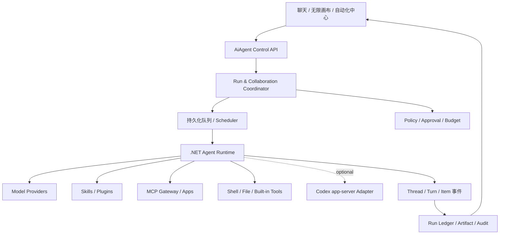

# AiAgent 新一代 Agent 平台架构规划

> 状态：架构提案 / 待评审
> 范围：替换现有耦合式 `AgentLoop`，参考 Codex 在 .NET 中重建 Runtime，并规划 Skill、Plugin、MCP、Automation 与多 Agent 协作控制面。
> 原型：[agent-platform-runtime-prototype.html](./agent-platform-runtime-prototype.html)

## 0. 纠偏后的设计前提

本方案不是在现有 `AgentLoop` 上继续堆叠 Skill、MCP、定时器和多 Agent 分支，也不是把无限画布改造成另一套工作流引擎。目标是：**停止演进并最终删除旧的耦合式 `AgentLoop`，参考 Codex 的架构与协议，在自有 .NET 后端中重建单 Agent 执行内核和多 Agent 编排中枢。** Codex app-server v2 是重要参考实现、首个可插拔 Runtime Adapter 和回归对照，不是唯一执行内核。

因此实现时采用以下归属规则：

| 能力 | 新平台事实来源 | 与 Codex 的关系 |
| --- | --- | --- |
| Thread / Turn / Item、模型工具循环、流式事件 | `.NET Agent Runtime` | 借鉴 Codex 状态语义和事件模型，自有实现并持久化 |
| Shell、文件修改、审批、sandbox | `.NET Tool Runtime + Policy` | 借鉴 Codex 的工具边界和审批模型，按部署环境实现隔离 |
| Skill 发现与结构化注入 | `.NET Capability Runtime` | 兼容 `SKILL.md` 与渐进加载约定，同时支持平台治理 |
| Plugin / marketplace / app / hook | `.NET Plugin Runtime` | 参考 Codex manifest 组合模型，定义稳定的平台契约 |
| MCP 工具发现、OAuth、调用 | `.NET MCP Gateway` | 遵循 MCP 标准，自有连接、授权、调用与审计 |
| 定时、事件触发、重试、熔断 | `.NET Automation Runtime` | 平台原生能力，创建统一 Run |
| 临时子 Agent、长期 Agent、团队与预算 | `.NET Collaboration Runtime` | 参考 Codex 协作原语，但跨 Runtime 统一编排 |
| Codex app-server v2 | `CodexRuntimeAdapter` | 可选执行后端、协议参考与行为对照，不垄断运行链路 |
| 无限画布 | AiAgent Projection/UI | 平台自有，只投影和发起明确动作 |

旧 `AgentLoop` 的问题是职责耦合与不可治理，不是“自研”本身。新实现必须由稳定的内部接口隔离模型 Provider、工具、策略和外部 Runtime；Codex API 若仍是 experimental，则只影响 `CodexRuntimeAdapter`，不能反向污染 `.NET Agent Runtime` 的领域契约。

## 1. 设计结论

AiAgent 不应再维护一个把模型调用、工具循环、权限、上下文、调度和 UI 事件揉在一起的“大循环”。新的平台拆成三层：

- **AiAgent Control Plane（.NET）**：负责身份与租户、能力目录、安装授权、定时任务、运行队列、审计、成本预算和工作画布投影。
- **AiAgent Runtime Plane（.NET）**：负责 Thread/Turn/Item、模型 Provider、工具循环、上下文、Shell/文件工具、审批、sandbox 以及临时和长期多 Agent 协作。
- **Runtime Adapter Plane**：Codex app-server、其他 Agent CLI/服务作为可选后端接入；适配器把外部协议映射为平台统一 Run/Event/Approval，不决定平台领域模型。



关键边界：**画布不是执行引擎，Skill 不是工具，Plugin 不是常驻进程，MCP 不是权限模型，定时表达式也不是一次运行。**

## 2. 参考 Codex 后保留与放弃的内容

### 2.0 源码模块映射

本设计对照的是 Codex 当前 `main` 分支的代码边界，而不仅是产品概念：

| Codex 模块 | 可验证能力 | 对 AiAgent 的含义 |
| --- | --- | --- |
| `codex-rs/app-server` | JSON-RPC 初始化，Thread/Turn/Item 生命周期，skills/plugins/apps/MCP/approval API | 外部适配器参考，不是新运行时唯一接口 |
| `codex-rs/app-server-protocol` | v2 请求、响应、通知的类型定义，可生成 TS/JSON Schema | 生成客户端与契约测试，不手写松散 JSON |
| `codex-rs/core` | 会话执行、工具调用、sandbox、审批和 multi-agent handlers | 作为 .NET Runtime 分层、状态机和安全边界的源码参考 |
| `codex-rs/skills` | `SKILL.md` 发现、加载与样例 | Skill 兼容 Codex 目录约定 |
| `codex-rs/core-plugins` | manifest、marketplace、skill/MCP/app/hook 聚合 | Plugin 采用兼容模型，平台补治理 |
| `codex-rs/mcp-*` | MCP client/server 与 OAuth/状态能力 | 平台管理连接策略，不发明私有工具协议 |
| `multi_agents_spec.rs` | `spawn_agent` 等协作工具定义 | 借鉴原语语义；临时与长期 Agent 均由 .NET Collaboration Runtime 编排 |

App-server schema 仅属于 `CodexRuntimeAdapter`：在绑定版本的构建阶段生成并入库，升级时先跑契约测试。平台内部 `IRuntimeEngine` 与事件协议独立版本化，不能直接暴露 Codex 类型。

### 2.1 直接借鉴

1. 借鉴 app-server 的 `thread/start|resume|fork|read|list` 和 `turn/start|steer|interrupt` 语义，定义 .NET 的强类型命令与事件；Codex 适配器再做一一映射。
2. Skill 采用 `SKILL.md` + 可选 `scripts/`、`references/`、`assets/` 的渐进加载；显式选择 Skill 时使用结构化 turn input。
3. Plugin 作为安装与分发单元，manifest 可组合 skills、MCP servers、apps、hooks 和界面元数据。
4. MCP 保持标准协议边界；平台管理连接、凭据引用、工具授权、健康状态与调用审计。
5. 在 .NET 编排层实现显式的 spawn、message、wait、interrupt、collect 原语；子任务必须有边界、预算、Runtime 选择和结果契约。
6. 项目指令按工作目录发现并保留来源，不把 `AGENTS.md`、Skill 和用户消息揉成不可追踪的字符串。

### 2.2 不照搬

- 不把 Codex 实验性接口视为稳定业务 API；增加版本适配层和兼容测试。
- 不让浏览器直接控制 app-server、MCP 子进程或本地路径。
- 不把 GitHub issue 中尚未进入主线的 Cron 方案作为平台事实；AiAgent 自己实现持久化调度。
- 不允许一个 Agent 仅凭模型判断安装插件、扩权、建立长期自动化或无限生成子 Agent。
- 不复刻 Codex UI；AiAgent 的差异化是企业控制面、知识/项目上下文和无限工作画布。

## 3. 核心领域模型

| 对象 | 含义 | 生命周期 |
| --- | --- | --- |
| `AgentDefinition` | 可复用 Agent 模板：角色、模型策略、默认 Skill、能力需求、预算 | 版本化发布 |
| `AgentInstance` | 某会话/画布中的 Agent 身份和策略快照 | 长期存在 |
| `ThreadBinding` | AiAgent 会话与内部 Thread、具体 Runtime thread 的映射 | 可恢复、可迁移 |
| `TurnRun` | 一次用户、协作或定时触发产生的执行 | 不可变审计主体 |
| `CapabilityGrant` | 对工具、MCP、工作区和外部副作用的授权 | 有范围与有效期 |
| `SkillPackage` | 可按需注入的工作方法和资源 | 版本化、可校验 |
| `PluginInstallation` | 已安装插件及其能力集合 | 租户/用户/项目作用域 |
| `McpConnection` | MCP server 配置、认证引用和健康状态 | 独立启停 |
| `AutomationDefinition` | 触发器、目标、输入模板和运行策略 | 可暂停、版本化 |
| `CollaborationRun` | 一次多 Agent 协作的父级记录 | 聚合子运行 |
| `Artifact` | 摘要、补丁、报告、文件引用等可交付结果 | 有来源和权限 |

数据库新增字段继续显式 nullable；密钥只保存 Secret Provider 的引用，不进入 DTO、日志、事件元数据或插件配置快照。

## 4. .NET Agent Runtime：替换旧 AgentLoop

### 4.1 新运行链路

```text
Trigger accepted
  → 解析 AgentDefinition 与能力快照
  → Policy preflight（用户、项目、sandbox、预算、并发）
  → 创建 TurnRun（queued）
  → Worker 获取运行租约
  → 选择 .NET Native / Codex / 其他 Runtime Engine
  → 创建/恢复统一 Thread，启动 Turn
  → Native Engine 执行模型工具循环，或由 Adapter 驱动外部 Runtime
  → 规范化 Item、工具结果与审批请求
  → 持久化 event + artifact + usage
  → completed / waiting_approval / failed / cancelled
```

`AgentLoop.cs` 退役后建议拆为：

- `IRuntimeEngine`：统一 Thread/Turn/Item、steer/interrupt 与事件流契约。
- `NativeAgentRuntime`：自有 .NET 模型工具循环、上下文推进与停止条件。
- `CodexRuntimeAdapter`：app-server 版本协商、协议映射与能力探测。
- `ToolRuntime`：Shell、文件编辑、内建工具与 MCP 调用的统一执行边界。
- `RunCoordinator`：状态机、幂等、租约、取消和恢复。
- `ContextAssembler`：来源明确的用户消息、项目规则、Skill、投递和附件输入。
- `CapabilityPolicyService`：执行前与工具调用时鉴权。
- `RunEventProjector`：把协议事件投影成前端稳定事件。
- `ApprovalService`：审批请求、超时和一次性授权。
- `ArtifactService`：保存可传递结果，不复制原始隐私上下文。

### 4.2 运行状态

`draft → queued → starting → running → waiting_approval | waiting_input → completed | failed | cancelled | expired`

所有触发来源共用同一状态机：人工聊天、画布协调、定时任务、Webhook 和子 Agent。重试创建新的 `TurnRunAttempt`，不覆盖旧证据。

### 4.3 协议适配原则

- AiAgent 内部使用稳定的 `IRuntimeEngine`；`NativeAgentRuntime` 与 `CodexRuntimeAdapter` 都实现它，Codex JSON-RPC 类型不泄露给 Controller 和前端。
- 保存 `runtime_kind`、`runtime_version`、`protocol_version` 与原始事件摘要，允许升级回放。
- 建立针对 `initialize`、thread、turn、approval、skills/list、apps/list 的契约测试。
- Native Worker 和 app-server 进程都按用户、租户与受信工作区隔离；运行租约到期后回收，不用会话文本拼参数。

## 5. Skill 体系

Skill 是“如何完成一类工作”的上下文包，不直接授予任何权限。

### 5.1 包结构与发现

```text
my-skill/
  SKILL.md
  agents/openai.yaml       # 可选 UI 元数据
  scripts/                 # 可选，可执行但仍需工具授权
  references/              # 按需读取
  assets/                  # 输出模板与静态资源
```

发现层级：平台内置 → 租户 → 用户 → 项目。相同 key 不静默覆盖，解析为确定的 `publisher/name@version`；每次 Run 保存 resolved version 与内容摘要哈希。

### 5.2 Skill Registry 必备能力

- 搜索、安装、升级、禁用、签名/哈希校验、依赖与兼容性检查。
- 展示触发描述、所需能力、文件清单、发布者、风险和验证状态。
- 安装时静态扫描脚本、外部地址和资源体积；运行时仍走 sandbox 与 CapabilityGrant。
- 会话可固定版本，项目管理员可设置允许列表与禁用列表。
- 质量闭环：触发准确率、完成率、工具失败、用户撤销、上下文成本和版本回滚。

### 5.3 首批平台 Skills

`codebase-explore`、`implementation-plan`、`safe-code-change`、`test-and-verify`、`code-review`、`incident-triage`、`knowledge-research`、`document-delivery`、`canvas-coordinator`、`automation-authoring`、`plugin-audit`、`mcp-onboarding`。

其中 `canvas-coordinator` 只能生成协作提案和结构化任务，不天然拥有建联、发送或启动其他 Agent 的权限。

## 6. Plugin 体系

Plugin 是能力的分发容器，不是新的 Agent 类型。建议兼容 Codex `.codex-plugin/plugin.json` 思路，并增加 AiAgent 服务端登记信息。

```json
{
  "name": "github-workflow",
  "version": "1.2.0",
  "skills": "./skills",
  "mcpServers": "./.mcp.json",
  "apps": "./apps",
  "hooks": "./hooks.json",
  "interface": { "displayName": "GitHub Workflow" }
}
```

安装流程：获取包 → 校验来源/签名/哈希 → 解包到不可变版本目录 → 解析 manifest → 生成权限差异 → 管理员确认 → 注册能力 → 健康检查 → 启用。升级采用 side-by-side，已有 Run 继续引用旧版本；失败可回滚。

平台必须区分：

- **Installed**：文件已存在；
- **Enabled**：允许被发现；
- **Connected**：外部认证可用；
- **Granted**：当前 Agent/项目被授予能力；
- **Healthy**：运行依赖通过检查。

Hook 是高风险扩展点。首期仅支持可审计的 `pre_run`、`pre_tool_use`、`post_tool_use`、`post_run`，默认关闭外部命令 Hook，优先 MCP tool Hook；同步 Hook 设置短超时，不能偷偷扩权或修改原请求。

## 7. MCP 与 App

MCP 是工具/资源/提示能力的连接协议；App 是带交互 UI 的 MCP 能力展示。平台提供 MCP Gateway，不把第三方 server 直接暴露给浏览器。

### 7.1 控制面

- 支持 stdio 与 Streamable HTTP；配置与 Secret 引用分离。
- 工具列表定期发现并缓存，保存 schema hash；变化时产生待复核事件。
- 权限粒度到 `server/tool`，并标注 read、write、destructive、external-communication、financial 等风险。
- 调用经过输入校验、超时、限流、输出大小限制、敏感信息过滤和审计。
- 健康状态为 `unconfigured / connecting / healthy / degraded / disabled / revoked`。
- MCP 返回内容一律按不可信外部数据处理，不能覆盖系统、项目规则或 CapabilityGrant。

### 7.2 凭据与多租户

认证由用户/租户通过 OAuth 或 Secret Provider 完成。Agent 只看到连接 ID 和能力元数据；Worker 在调用瞬间解析短期凭据。连接必须有 owner、tenant、project scope，禁止跨用户复用本地 stdio 进程。

## 8. 定时任务与事件自动化

定时任务不是“未来再给会话塞一条文本”，而是持久化的 `AutomationDefinition + AutomationRun`。

### 8.1 触发器

- Cron（带 IANA 时区、DST 策略、misfire 策略）。
- One-shot 指定时间。
- Interval（以上一次计划时间为基准，避免漂移）。
- Webhook / Git / 表单 / MCP 事件。
- 人工立即运行与失败重试。

### 8.2 每个 Automation 必须声明

目标 AgentDefinition、项目/工作区、输入模板、固定 Skill/Plugin 版本、sandbox、CapabilityGrant、最大时长、成本/Token 预算、并发策略、重试、通知、输出去向、有效期和负责人。

并发策略：`forbid`（上一轮未完则跳过）、`queue`、`replace`。默认 `forbid`。调度器只创建 Run；Worker 才执行。使用幂等键 `automation_id + scheduled_at` 防止重复。

高风险副作用不能依赖无人值守的临时审批。创建 Automation 时必须预授权精确动作；超出范围则 Run 进入 `waiting_approval`，不会自动扩大授权。连续失败、长期无人认领、成本异常或连接撤销时自动熔断。

## 9. 多 Agent 协作

### 9.1 两种协作必须分开

1. **临时子 Agent**：由 .NET Collaboration Runtime 在某个 Run 内为有界子任务创建，可选择 Native、Codex 或其他 Runtime，结束后回传结果；适合并行调查、评审和分片处理。
2. **画布独立 Agent**：长期可见、可被人直接聊天的会话；通过协作提案和投递交换 Artifact，不因连线自动成为父子线程。

不能用临时 spawn 替代用户已建立的画布会话，也不能把画布邮路直接解释为自动依赖图。

### 9.2 协作原语

`propose`、`spawn`、`send`、`wait`、`interrupt`、`collect`、`handoff`。这些是平台原语而非 Codex 专属工具。每个子任务包含 goal、scope、inputs、allowed capabilities、runtime policy、output schema、deadline、budget、write ownership；父子 Agent 可使用不同模型或不同 Runtime。

默认限制：最大深度 2、单父 Run 最大活跃子 Agent 数、总 Token/时长预算、同工作区写锁。并行写任务优先使用独立 worktree；无法隔离时只允许一个 writer，其余为只读研究/评审 Agent。

### 9.3 结果收敛

子 Agent 的最终输出先生成 `Artifact`，父 Agent只接收结构化摘要、证据链接、变更集和未决风险。父 Agent 负责冲突检测与最终回答；“多数 Agent 同意”不等于事实或授权。

## 10. 无限工作画布

画布成为 Control Plane 的可视化入口，而不是另一个 orchestration runtime。

### 10.1 节点

- Agent 会话：长期身份、角色、Skills 与运行策略。
- Run：一次正在执行或已结束的轮次，可折叠在会话节点内。
- Automation：带下次运行、健康度与暂停开关的定时节点。
- Plugin/MCP：能力节点，只展示连接与授权关系，不显示密钥。
- Artifact：可投递的结论、报告、补丁或文件引用。
- Collaboration：临时展开的父子 Agent 运行树。

### 10.2 边的严格语义

| 边 | 含义 | 是否触发执行 |
| --- | --- | --- |
| 邮路 | 独立会话间允许投递 Artifact | 否 |
| spawned | 本次 Run 生成临时子 Agent | 已由明确动作触发 |
| uses | Agent/Automation 绑定 Skill、Plugin 或 MCP grant | 否 |
| scheduled_by | Automation 创建 Run | 到点按策略触发 |
| produced | Run 生成 Artifact | 否 |
| proposed | AI 建议的新关系或动作 | 否，等待策略/用户决定 |

画布顶部统一显示运行槽位、队列、等待审批、今日预算和故障连接；右侧检查器展示一次 Run 的完整来源、能力快照、事件、子 Agent、Artifact 和审计。

## 11. API 与服务边界建议

```text
Services/AgentRuntime       IRuntimeEngine, NativeAgentRuntime, CodexRuntimeAdapter, RunCoordinator, ToolRuntime, EventProjector
Services/Capabilities       SkillRegistry, PluginRegistry, Grants, Hooks
Services/Mcp                Connection, Discovery, Gateway, Health
Services/Automation         Definitions, Scheduler, RunDispatcher
Services/Collaboration      Proposals, SpawnPolicy, Mailbox, Artifacts
Services/WorkCanvas         只维护布局与上述对象引用
```

前端对应拆分 `*-api.ts` 与 `*-types.ts`。建议首批接口包括：run 创建/读取/取消/审批，skills/plugins 目录与安装状态，MCP 连接与工具授权，automation CRUD/暂停/立即运行/历史，collaboration 提案与子运行树。

## 12. 迁移路线

### Phase 0：内部契约与 Codex 对照基线

- 定义独立于厂商的 `IRuntimeEngine`、Thread/Turn/Item、ToolCall、Approval 与事件协议。
- 封装现有 Codex app-server，记录实际版本与事件，形成行为对照样本。
- 建立内部契约测试，以及 Codex thread/turn/approval/skill/MCP 的适配器兼容测试。
- 旧 `AgentLoop` 保持不变，新链路仅供内部试运行。

### Phase 1：.NET Native 单 Agent Runtime

- 实现自有模型 Provider、工具循环、停止条件、上下文压缩、Shell/文件工具与 sandbox/approval。
- 新 `TurnRun` 状态机、持久化事件、取消/审批/恢复；Codex Adapter 作为同契约的可选执行器。
- 聊天会话双写或影子运行对照，确认输出、附件、权限和超时。
- 验收后切换普通聊天，保留可回滚 feature flag。

### Phase 2：Skill + MCP 控制面

- Skill Registry、版本固定、结构化注入。
- MCP 连接、细粒度 grant、健康检查与调用审计。
- 暂不开放任意第三方 Plugin 自动安装。

### Phase 3：Plugin + Automation

- 插件不可变安装、风险差异、升级回滚。
- 持久化 scheduler、幂等 Run、熔断和通知。

### Phase 4：多 Agent + 画布

- 临时子 Agent 原语、预算与写隔离。
- 画布显示运行树、Automation、能力绑定和 Artifact 投递。
- 接入既有自主协作提案策略，但不改变“独立会话邮路不自动执行”的边界。

### Phase 5：移除旧的耦合循环

- 停止创建旧格式运行；完成历史读取兼容和迁移统计。
- 删除旧 `AgentLoop` 与旧 ToolProtocol/Dispatch；保留新的模块化 `.NET NativeAgentRuntime` 和各 Runtime Adapter。
- 更新 README、AGENTS.md、运维手册与故障回退说明。

## 13. MVP 验收标准

1. 服务重启后运行可恢复或明确终止，不出现“前端还在跑、后端无记录”。
2. 每次工具/MCP 调用都能回答谁、何时、以哪个授权、对什么资源做了什么。
3. Skill/Plugin 升级不改变已开始 Run 的能力快照。
4. 定时任务重复投递时不会产生重复 Run，超预算与连续失败会熔断。
5. 多 Agent 协作可展示父子关系、成本、写入归属和每个结果来源。
6. 画布删除节点不删除会话、Automation、Plugin 或 Run；只移除投影。
7. 任何跨会话消息、自动启动和外部副作用都能追溯到用户确认或明确的策略授权。

## 14. 当前不做

- 不复制 Codex 的具体 Rust 实现，也不追求逐行兼容；自研的是满足平台多 Agent 编排所需的模块化 .NET Runtime。
- 不允许模型静默安装/升级插件或创建永久凭据。
- 不做无上限递归 Agent、共享可写目录的盲目并行或 Agent 间自由聊天。
- 不承诺跨 Runtime 的 thread 可无损迁移；先通过 Artifact 和摘要完成交接。
- 不把 Plugin 市场评分当作安全信任，仍需来源、权限和运行时隔离。

## 15. 参考依据

- [Codex app-server README](https://github.com/openai/codex/blob/main/codex-rs/app-server/README.md)：thread/turn、Skill、Hook、审批与能力发现接口。
- [Codex MCP Server Interface](https://github.com/openai/codex/blob/main/codex-rs/docs/codex_mcp_interface.md)：v2 thread/turn 与 MCP 控制接口边界。
- [Codex Plugin manifest 实现](https://github.com/openai/codex/blob/main/codex-rs/core-plugins/src/manifest.rs)：Plugin 对 Skill、MCP、App、Hook 和界面元数据的组合方式。
- [Codex multi-agent tool spec](https://github.com/openai/codex/blob/main/codex-rs/core/src/tools/handlers/multi_agents_spec.rs)：spawn 的有界任务、上下文继承与结果回传语义。
- [Codex scheduling feature issue](https://github.com/openai/codex/issues/25466)：仅作为调度需求参考；它是提案而非本设计所依赖的稳定主线能力。
