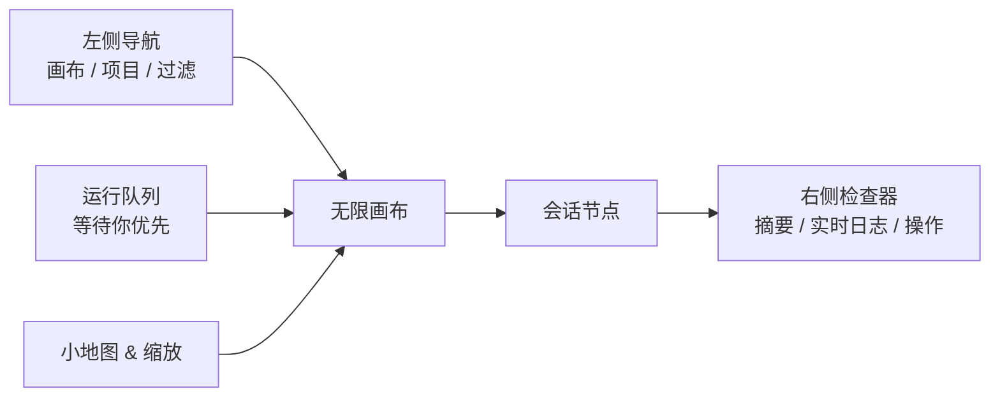
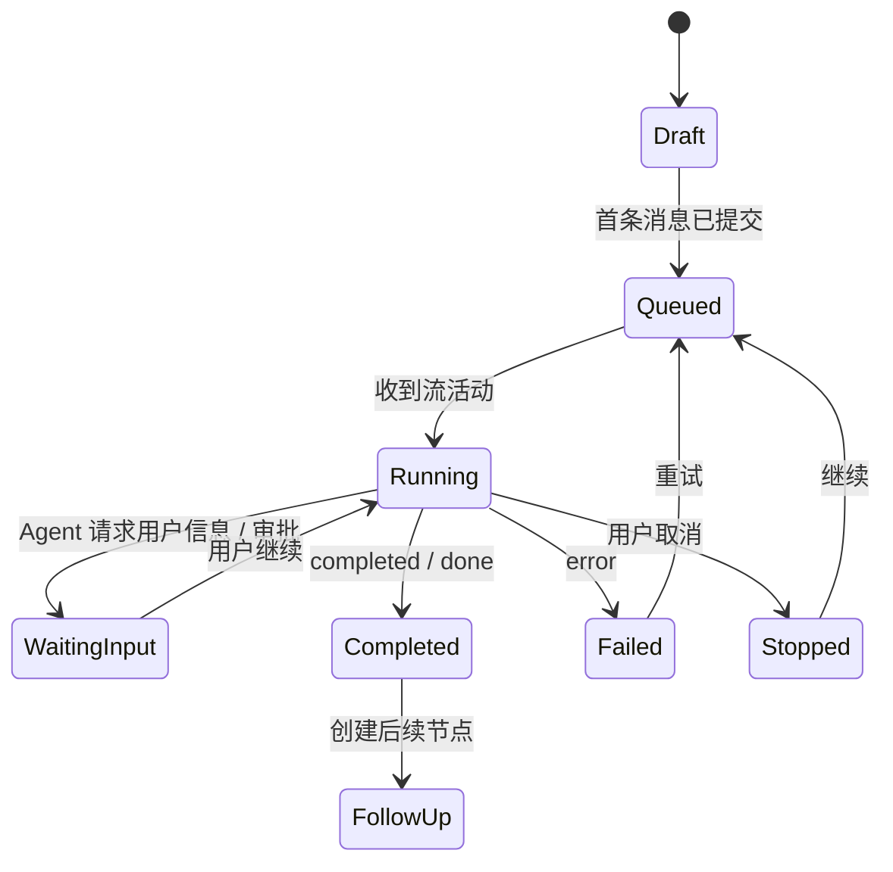

# AiAgent Agent Work Canvas（多会话工作画布）

> 设计状态：提案 / 原型完成  
> 范围：在现有聊天和 Codex CLI 能力之上，增加一个可视化的多会话协调工作台。  
> 原型：[agent-work-canvas.html](./agent-work-canvas.html)

## 1. 要解决什么

AiAgent 已经具备持久化聊天会话、实时流事件、代码项目范围和 Codex 本地运行时。用户可以并行提问，但多个运行中的会话分散在侧边栏和不同页面，难以快速回答四个问题：

1. 现在有哪些任务在运行、等待我、失败或已经完成？
2. 它们分别在哪个项目、使用什么模型和权限等级？
3. 哪些任务依赖另一个会话的结论、文件或人工确认？
4. 我如何不中断其他工作地快速进入、停止、补充或汇总一个任务？

画布将每个既有聊天会话投影为一个**会话节点**，以无限画布组织任务、依赖和交付物；同时提供一个“舰队视图”式的运行摘要。它是会话的协调层和观察层，**不是**新的 Agent 编排引擎，也不会绕开权限、并发上限或服务端 CLI 控制。

## 2. 设计原则

- **会话仍是事实来源**：画布节点引用 `AiChatSession.Id`，消息、标题和流事件仍由现有聊天服务写入。
- **状态先于文本**：运行、等待输入、失败、完成和未读应在缩放后仍可辨认；详细内容在右侧检查器查看。
- **连接必须有语义**：连线只能是“依赖”“交付物引用”“同一目标”的显式关系，不能暗示模型之间已自动共享上下文。
- **人始终在回路中**：需要人决定时置顶为“等待你”；停止和继续都是针对单一会话的明确动作。
- **安全边界不变**：浏览器只调用 AiAgent API；Codex CLI 始终由后端控制。节点展示 sandbox / 项目范围，但不允许通过画布注入本地路径或命令。
- **渐进上线**：第一阶段先做只读投影与跳转；调度和关系维护在数据模型稳定后再上线。

## 3. 与当前项目的对应关系

| 现有能力 | 画布的使用方式 | 不改变的约束 |
| --- | --- | --- |
| `AiChatSession`（用户、标题、代码项目、优先级、置顶、归档） | 节点的会话身份与基础元数据 | 仅能读取当前用户可访问的会话 |
| `ChatStreamProvider`（流状态、事件、取消、未读） | 节点实时状态、活动日志、停止动作 | 当前前端总并发上限仍为 3 |
| `streamCompleteChat` 的 `session_ready` / `tool` / `content` / `completed` / `error` | 画布实时更新节点状态、摘要和脉冲 | 不从浏览器直连 Codex |
| `CodexChatService`（项目工作区、runtime lease、并发限制） | 显示项目、模型、sandbox 与活跃租约 | 后端仍负责租约、路径校验和进程生命周期 |
| 代码项目与项目引用 | 创建节点时选择上下文；连线记录跨会话关系 | 跨项目引用继续经服务端鉴权 |

当前代码中，`ChatStreamProvider` 限制同一用户最多同时运行 3 个聊天流；`CodexChatService` 还在服务端限制每个用户的活动 Codex 会话，并防止同一会话重复运行。因此画布顶部必须显示“运行槽位”，创建或继续动作也必须以服务端返回为准。

## 4. 信息架构与画布布局



### 4.1 顶部工具栏

- 当前画布名称与项目范围。
- 全局搜索、状态筛选、模型/项目筛选。
- 运行计数 `running / limit`，槽位满时禁用“新建并运行”但不禁用草稿节点。
- 主操作“新建任务”：先选择项目、代理与权限模式，再创建一个聊天会话节点；首条消息仍复用聊天发送链路。

### 4.2 无限画布（主区）

- React Flow 的 `Background`、`MiniMap`、`Controls` 和可选 `Panel` 承担平移、缩放、框选、对齐与导航。
- 节点按状态使用稳定色彩：运行蓝、等待琥珀、失败红、完成绿、草稿灰；颜色之外还必须有图标与文字。
- 连线默认由源节点右侧连到目标节点左侧，边上展示关系标签。跨分组或远距离连接应提供小型“跳转”提示。
- 画布位置保存为每位用户、每个画布独立的 viewport；节点位置在拖动结束后防抖保存。

### 4.3 会话节点

节点内容从上至下：状态点、优先级、标题、项目 / 模型、最近事件、运行时长或完成时间、文件变更数与未读标记。节点有三种密度：

| 密度 | 适用缩放 | 内容 |
| --- | --- | --- |
| 紧凑 | < 65% | 状态、标题、项目缩写、未读点 |
| 标准 | 65%–130% | 完整标题、运行摘要、标签、活动进度 |
| 展开 | > 130% 或选中 | 最近事件、操作按钮、交付物与关系锚点 |

双击节点进入现有聊天页面并定位到该会话；单击只打开右侧检查器，避免画布上出现多个滚动聊天窗口。

### 4.4 右侧检查器

检查器是“单个会话的操作台”，包含：

- 会话摘要、项目、代理、模型、sandbox 和运行时长；
- 实时事件时间线（复用规范化 `ChatStreamEvent`）；
- 上下游关系、关联的交付物 / 文件变更摘要；
- 与当前状态匹配的动作：打开会话、停止、补充指令、标记已读、创建后续任务、复制链接。

## 5. 状态机与优先级

画布状态是对会话与流状态的**派生状态**，不替代后端真实状态。



优先级队列按以下顺序展示，而不是按画布坐标：

1. `waiting_input`：阻塞主线、需要用户决策；
2. `failed`：需要处理或重试；
3. `running`：活跃任务；
4. `queued`：已准备、等待并发槽位；
5. `completed / stopped / draft`。

第一期中，`waiting_input` 可以先由用户手动标记或由结构化 `tool_request` 映射。只有在 Codex 协议和服务端能可靠提供“需要输入/审批”的事件后，才自动判定。

## 6. 关系模型

### 6.1 节点类型

| 类型 | 用途 | 首期 |
| --- | --- | --- |
| `session` | 已有聊天会话的可运行节点 | 是 |
| `task` | 尚未发送首条消息的任务草稿 | 是 |
| `note` | 人工便签、决定或验收条件 | 是 |
| `artifact` | 会话产出的文档、变更集、报告摘要 | 第二期 |
| `group` | 项目、迭代或阶段的视觉分组 | 第二期 |

### 6.2 边类型

| 边 | 含义 | 是否自动传递上下文 |
| --- | --- | --- |
| `depends_on` | 目标任务应等待源任务的结论或人工确认 | 否 |
| `produces` | 源会话产出目标交付物 | 否 |
| `informs` | 源会话的摘要可供目标任务引用 | 仅在用户明确“带入摘要”后 |
| `related_to` | 视觉上的相关任务 | 否 |

“带入摘要”应由后端基于可访问的会话消息生成受限摘要，再以显式 `project_references` 或新建的服务器记忆字段进入目标 prompt；不得将全量对话、附件路径或未授权项目数据直接复制到另一个会话。

## 7. 数据与 API 设计（实施提案）

不修改 `AiChatSession` 的既有含义，新增独立的画布域，便于按用户隔离和删除。

```text
AiAgentWorkCanvas
  id, user_id, name, scope_project_id?, viewport_json, created_at, updated_at

AiAgentWorkCanvasNode
  id, canvas_id, node_type, chat_session_id?, position_x, position_y,
  width?, height?, title_override?, data_json?, created_at, updated_at

AiAgentWorkCanvasEdge
  id, canvas_id, source_node_id, target_node_id, relation_type,
  label?, metadata_json?, created_at, updated_at
```

所有新字段遵循项目约定，显式使用 `[SugarColumn(IsNullable = true)]`，并对 `canvas_id`、`user_id`、节点与边归属逐层校验。浏览器传来的 session ID、节点 ID、关系 ID 都必须先在当前用户范围内验证。

建议接口（命名待与现有 Furion Dynamic API 路由确认）：

| 方法 | 路径 | 作用 |
| --- | --- | --- |
| `GET` | `/api/v1/work-canvases` | 获取当前用户画布摘要 |
| `POST` | `/api/v1/work-canvases` | 创建画布 |
| `GET` | `/api/v1/work-canvases/{id}` | 获取画布、节点、边与派生会话状态 |
| `PATCH` | `/api/v1/work-canvases/{id}/layout` | 批量保存节点位置与 viewport |
| `POST` | `/api/v1/work-canvases/{id}/nodes` | 添加会话引用、草稿或便签 |
| `POST` | `/api/v1/work-canvases/{id}/edges` | 创建语义关系 |
| `DELETE` | `/api/v1/work-canvases/{id}/nodes/{nodeId}` | 从画布移除节点，不删除聊天会话 |
| `POST` | `/api/v1/work-canvases/{id}/nodes/{nodeId}/start` | 草稿转为已有聊天发送流程 |

实时更新不需要新建第二条流协议：前端在已有 `ChatStreamProvider` 订阅状态，按 `sessionId` 映射更新节点；重新打开画布时使用查询接口回填。后续若需要多标签页同步，可增加经过授权的 canvas SSE / WebSocket 汇总通道，而不是向前端暴露 Codex 进程。

## 8. 前端落地建议

### 依赖与目录

- 新增 `@xyflow/react`（React Flow 当前的包名）；不直接使用老的 `react-flow-renderer`。
- `front/lib/work-canvas-types.ts`：DTO、节点数据、关系类型和派生状态。
- `front/lib/work-canvas-api.ts`：所有 HTTP 封装。
- `front/components/work-canvas/WorkCanvasPage.tsx`：页面级状态、加载与筛选。
- `front/components/work-canvas/nodes/SessionNode.tsx`：自定义节点。
- `front/components/work-canvas/CanvasInspector.tsx`：右侧检查器。
- `front/components/work-canvas/work-canvas-state.ts`：布局变更防抖、事件到节点状态的映射。

### UI 交互细节

- 按住 Space + 拖动、鼠标中键拖动、触控板平移均可移动画布；滚轮缩放。
- 拖动节点仅更新布局；拖到另一个节点上不会默认创建依赖，关系要从连接锚点拖出并在弹窗选择语义。
- 将会话从左侧列表拖入画布时，创建引用节点；不会新建或移动原会话。
- 新建任务先形成 `task` 草稿卡，编辑 prompt 后点击运行；收到 `session_ready` 后绑定真实 `session_id`。
- 节点选中与 URL 同步：`?canvas=<id>&node=<nodeId>`，便于分享同一工作位置。
- 降级策略：窄屏或无指针设备自动切到“舰队列表”视图，不强迫用户在小屏操作无限画布。

## 9. 运行与安全边界

1. 画布**不能**直接启动 `codex`、拼接命令、提交文件路径或访问工作区；它只能调用既有聊天接口及受控的画布 API。
2. 节点上的 `full-access / workspace-write / read-only` 只是服务端已校验的会话配置展示与新建时的白名单选择；前端不得自行扩展值。
3. 一个会话同时只允许一个活跃流，画布的停止按钮调用 `cancelStream(streamId)` 或后续受控停止 API；不能杀死不属于当前用户的进程。
4. 节点关系只存元数据，不存附件物理路径、原始密钥、完整 prompt 或未过滤工具输出。
5. “批量运行”不是第一期能力。未来即使提供，也必须在服务端排队，遵守全局 / 用户 / 项目并发限制，并让用户确认每个待运行任务的项目与权限。

## 10. 分阶段实施与验收

### Phase 0：设计（本次完成）

- 静态交互原型、信息架构、状态和安全边界。

### Phase 1：只读舰队 + 画布布局

- 新页面可加载当前用户会话，展示状态、搜索、筛选、缩放、拖拽布局、检查器和跳转聊天。
- 可保存画布、节点位置与边；所有节点只引用有权限的会话。
- 验收：已有 3 个并发流时，画布在 1 秒内反映其状态；刷新后布局不丢失。

### Phase 2：创建与协作

- 从画布创建草稿任务、绑定首条消息创建的会话、添加有语义的边、从完成节点创建后续任务。
- 用现有 `session_ready` 事件立即将草稿绑定为真实会话。
- 验收：新任务一发送即出现并开始状态更新；移除节点不影响会话历史。

### Phase 3：交付物与受控汇总

- 由服务端构造可授权的“会话摘要 / 文件变更摘要”交付物；用户显式选择后才能带入后续会话。
- 提供项目级运行队列和受控批量启动。
- 验收：跨项目未授权会话不可见、不可连接、不可带入摘要；并发满时任务明确进入排队而非静默失败。

## 11. 非目标

- 不在浏览器内嵌真实终端或直接暴露 Codex app-server JSONL。
- 不自动让多个会话互相聊天或自行修改同一工作区。
- 不以画布替代现有聊天、代码项目、Git 或看板工作区。
- 不在第一期承诺 DAG 自动调度、成本计费或跨用户协同编辑。

## 12. 待确认的产品选择

1. 默认画布按“个人”还是“代码项目”创建？建议默认个人画布，并用项目过滤和项目分组组织。
2. 是否需要团队共享画布？建议延后到权限模型、审计与协同冲突策略完善后。
3. “等待输入”是否需要由 Codex 工具协议强制提供结构化事件？建议先手动标记，协议稳定后自动化。

---

灵感来源于 Anthropic Agent View 的“集中查看多会话、后台运行、需要用户时优先呈现”的任务管理思路；本设计保留 AiAgent 的服务端控制与会话权限边界。[Anthropic Agent View 说明](https://claude.com/blog/agent-view-in-claude-code)
