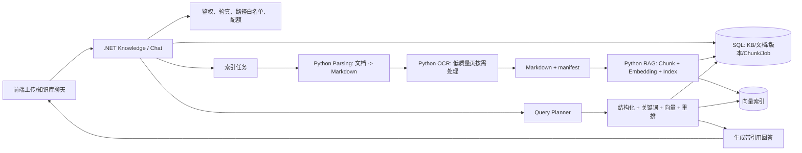

# AiAgent 企业知识库：C# + Python 迭代路线

> 版本：2026-08-25  
> 范围：基于现有 `.NET 9 + Next.js + Python worker + LlamaIndex` 持续演进。

## 结论

不建议将 Python 变成独立后端，也不建议起步即引入 GraphRAG、多 Agent 或新向量数据库。保留 C# 作为唯一的 API、安全、任务和数据编排层；Python 仅处理文档解析、OCR、标准化 Markdown、切块、Embedding 与检索计算。

第一阶段的目标不是“回答得像模型”，而是每一份文档都可被可靠解析、定位、引用、重建和诊断。

| 层 | 技术 | 职责 | 明确边界 |
| --- | --- | --- | --- |
| 产品/API/编排 | .NET 9 | 登录权限、上传、文件隔离、任务、版本、元数据、审计、聊天工具 | 不在 Controller 解析文件或拼 shell |
| 计算 worker | Python | PDF/Office/HTML 解析、OCR、切块、Embedding、向量检索 | 不信任浏览器路径；不直接暴露 HTTP |
| 数据/索引 | SQL + 向量索引 | KB/文档/版本/chunk/job 及向量索引 | 不向前端暴露原始路径 |

## 已有能力与优先缺口

项目已具有：

- `KnowledgeTaskRunner`：异步索引任务、索引版本激活、`chunks.jsonl` 物化导入。
- `KnowledgeIndexMaterializer`：将页码、标题、metadata 写入 `ai_knowledge_chunk`。
- `KnowledgeRetrievalService`：语义检索、页码范围读取、聊天工具引用输出。
- `PythonWorkers`：独立 venv 的 RAG、PDF 解析、OCR worker，使用 stdin JSON / stdout JSON。

优先缺口：

1. PDF parser 能输出 Markdown，但索引 worker 仍会直接读取原文件；需先落成统一中间产物再索引。
2. 缺少文本覆盖率、OCR 使用情况、表格丢失等解析质量状态。
3. 缺少稳定指纹、配置快照和幂等复用策略。
4. 企业检索还需关键词、过滤、页码/章节、权限与重排序，不能只看向量 Top-K。
5. 需有离线评测集和指标，才能确认每次改动确实提升效果。

## 目标架构



安全规则：所有文件路径由 C# 生成和校验，限定在 `PythonWorkers:AllowedRoots`；Python 返回的绝对路径不得进入前端或 prompt。用户只看到安全显示名、`document_id`、页码/章节与引用 ID。

## 先统一 Worker 契约

所有 worker 固定单行 JSON stdin / stdout，C# 负责取消、超时、进程树清理和日志关联。

```json
{
  "request_id": "job_01J...",
  "command": "parse",
  "input": {
    "document_id": 42,
    "source_path": "仅服务端受控目录路径",
    "source_sha256": "...",
    "mime_type": "application/pdf"
  },
  "options": { "ocr_mode": "auto", "language": ["zh", "en"] }
}
```

解析成功后产生 `document.md + manifest.json`。manifest 记录页面/章节/块的 `source_locator`（页码、标题层级、字符区间）、正文哈希与质量标记。RAG worker 只消费这些中间产物，不再自行猜测原始文件结构。

## 迭代路径

### P0：基线与安全（1 周）

- 固化 worker 信封、错误码、取消、超时及 `request_id`。
- C# 增加可空的 `DocumentFingerprint`、`ParseStatus`、`ParseErrorCode`、`ParseArtifactVersion`；新增实体字段均标记 `[SugarColumn(IsNullable = true)]`。
- 保存 SHA-256；相同指纹 + 相同解析/切块/Embedding 配置直接复用结果。
- 建立 10 份脱敏样本文档和 30 条问题的回归集。

验收：任务有 `queued/running/succeeded/failed/cancelled`；失败可见 stage、错误码、request_id；重复任务不制造重复有效索引。

### P1：解析标准化与可引用 chunk（2 周）

- 新建 C# `ParsingOrchestrator`，统一调度 PDF、DOCX、PPTX、XLSX、HTML、Markdown 的 Python adapter。
- 输出统一 `document.md + manifest.json`；PDF 保留页码，Office 保留页/幻灯片/Sheet，HTML 保留标题路径和链接。
- 实现 `ocr_mode=off/auto/force`。先测文本覆盖率，仅低覆盖率页进入 OCR；OCR 文本标注为不可信附件数据。
- 标题感知、尽量不跨章节的切块：500–900 tokens，80–150 overlap。metadata 至少有 `document_id`、`index_version_id`、`page_no`、`section_path`、`chunk_no`、`source_hash`、`parser`、`is_ocr`。

验收：UI 可预览解析 Markdown；普通问答和“第 10–20 页总结”均能给出可点击引用。

### P2：可配置 Embedding 与混合检索（2 周）

- 在 Settings 管理 Embedding provider/model/dimension/endpoint；密钥不进入任务或日志。
- 每个 `IndexVersion` 保存解析器版本、chunk 参数、embedding provider/model/dimension、索引格式快照。
- 向量与关键词/BM25 召回以 RRF 合并，按需加 reranker。
- C# 层先按用户、知识库、文档标签、部门和版本过滤；权限不应由 Python 或 prompt 决定。
- `DocumentOverview`、`TocQuestion`、`PageRangeSummary` 优先查询 chunk/manifest，语义问答才走向量。

验收：评测集的 Recall@5、引用正确率、页码范围正确率均高于 P0 基线；模型切换创建新版本，旧版本可回滚。

### P3：生产可靠性与体验（2–3 周）

- 将长任务从 `Task.Run` 迁移至持久化后台队列，具备并发上限、取消、指数退避、死信与人工重跑。
- 知识库 UI 展示解析质量、索引版本、模型、耗时、chunk 数、错误明细和重建入口。
- 回答展示 Evidence：文件名、页码/章节、片段、分数；证据不足时明确说明。
- 指标与告警：解析成功率、OCR 比例、索引时长、worker 超时率、检索空结果率、P95、token/调用成本。
- 中间产物、旧版本和孤儿文件按保留期清理；不能影响激活索引。

验收：任何回答可追溯到文档；故障可诊断且不会破坏激活版本。

### P4：按业务价值扩展

多模态表格/图片说明、网盘/Wiki/Git 增量同步、权限感知跨库路由、领域 reranker、用户反馈闭环与灰度评测。每一项应在 P3 指标稳定后再引入。

## 推荐目录与职责

```text
backed/
  Services/Knowledge/
    Parsing/ParsingOrchestrator.cs
    Indexing/KnowledgeIndexService.cs
    Retrieval/HybridRetrievalService.cs
    Evaluation/KnowledgeEvaluationService.cs
  PythonWorkers/
    shared/protocol.py
    parsing/document_parser_worker.py
    ocr/paddle_ocr_worker.py
    rag/llamaindex_worker.py
  data/knowledge/                 # 服务端受控，不提交
    uploads/{kb}/{document}/
    artifacts/{document}/{parse-version}/
    indexes/{kb}/{index-version}/
```

`ParsingOrchestrator` 只管流程、安全与状态，格式解析留给 Python；`HybridRetrievalService` 合并结构化、关键词和向量结果，不能将权限规则放进 prompt。

## 最小 API / 数据变更

同步更新后端 DTO、`front/lib/knowledge-api.ts`、`front/lib/knowledge-types.ts`：

| API | 用途 |
| --- | --- |
| `POST /knowledge/documents/{id}/parse` | 重新解析，返回 job |
| `GET /knowledge/documents/{id}/artifact` | 获取受控 Markdown 预览及质量摘要 |
| `POST /knowledge-bases/{id}/indexes` | 以明确配置创建新索引版本 |
| `GET /knowledge-bases/{id}/indexes` | 查看版本、配置快照、状态、回滚能力 |
| `POST /knowledge/evaluations/run` | 管理员运行脱敏评测集 |

保留现有 `AiKnowledgeDocument`、`AiKnowledgeChunk`、`AiKnowledgeIndexVersion`、`AiKnowledgeJob`。向量由向量索引持有；关系库保存可追溯 metadata、配置和必要检索辅助字段，不将 embedding JSON 作为长期主存储。

## 质量门槛

| 指标 | P1 | P3 |
| --- | ---: | ---: |
| 可解析文档成功率 | ≥ 95% | ≥ 98% |
| 引用含文件名和页码/章节 | ≥ 95% | ≥ 99% |
| Recall@5 | 建立基线 | 较基线 +15% |
| 引用正确率（人工抽检） | ≥ 85% | ≥ 92% |
| P95 检索耗时（不含生成） | 记录基线 | ≤ 3 秒 |

## 最近两周的执行顺序

1. 冻结 worker 协议、错误码与 manifest 格式。
2. 实现 `ParsingOrchestrator`，保存解析任务、质量和中间产物。
3. 改造 RAG worker，只消费中间产物，输出稳定 chunk ID 与来源 metadata。
4. 统一物化与检索引用 DTO，补足文档/页码/章节 Evidence。
5. 前端交付解析状态、预览、索引版本、引用。
6. 以脱敏回归集修正解析、切块后，再进入混合检索。

## 暂不做

- 不传递用户本地路径给 Python，不拼 shell。
- OCR 失败不阻断可用文字文档。
- 没有评测集前不频繁切换 embedding 或 chunk 参数。
- 不覆盖激活索引：创建新版本，成功后原子切换。
- 不把 vector Top-K 原样塞给 LLM：保留过滤、引用、上下文预算和无证据兜底。
