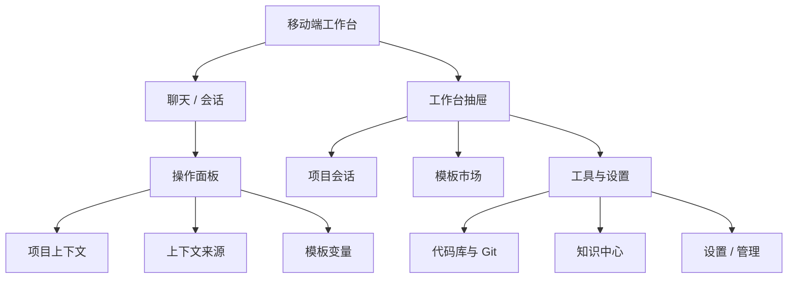

# AiAgent 手机端适配设计稿

> 状态：设计基线（待实施）  
> 范围：现有 Web 工作台的手机体验，不新增业务能力、不改变已有接口  
> 设计基准：375 × 812；兼容 320–767 px 宽度；768 px 以上进入平板/桌面渐进布局。

## 1. 设计结论

手机端不把桌面侧边栏和三栏聊天界面等比缩小。它应成为以“发起、继续、管理一次 AI 协作”为中心的单列工作台：

- **会话输入器始终可达**：新会话、继续会话、带模板发起，都以底部输入器为核心。
- **项目与上下文按需展开**：不在手机上常驻展示代码/知识选择器或右侧文件面板；通过操作面板临时打开。
- **导航收进工作台抽屉**：聊天、模板市场、项目会话、工具与设置统一从左侧抽屉进入。
- **复杂编辑改为全屏步骤**：模板编辑、代码文件查看、管理配置不再使用桌面双栏/三栏弹窗。
- **品牌延续现有 AiAgent**：保留当前蓝色主操作与浅色卡片，不直接复制参考图的 Workbuddy 标识、插画或文案；参考其大留白、圆角输入器、抽屉与底部操作方式。

参考图中“首页大留白 + 底部输入器”“左侧抽屉”“常用能力快捷入口”被保留为交互语言；AiAgent 的项目、会话、模板、代码/知识上下文则是内容骨架。

## 2. 适配范围与信息架构

现有功能与移动端承载方式如下。

| 当前入口/能力 | 手机端位置 | 首要动作 | 桌面差异 |
| --- | --- | --- | --- |
| 聊天与新建会话 | 首页 / 会话页 | 输入、发送、选择项目 | 去除常驻侧栏与右文件栏 |
| 项目会话、置顶、重命名、归档 | 工作台抽屉 | 打开 / 新建 / 更多 | 会话更多操作进入底部操作面板 |
| 模板市场 | 抽屉一级入口 | 搜索、筛选、使用模板 | 卡片单列；详情、编辑全屏化 |
| 代码库、Git 管理、知识中心 | 抽屉「工具与设置」 | 浏览、选择上下文 | 管理列表改为卡片、分步表单 |
| 设置、模型、Agent、用量、管理员配置 | 抽屉「工具与设置」 | 查看、编辑配置 | 仅管理员可见的入口保持后端权限约束 |
| Dashboard 应用工作区 | 独立沉浸页 | 使用应用 | 不显示工作台抽屉；保留返回入口 |



## 3. 断点与布局原则

| 宽度 | 布局模式 | 规则 |
| --- | --- | --- |
| 320–374 px | 紧凑手机 | 页面左右 16 px；顶部按钮仅图标；快捷标签横向滚动；不允许表格横向挤压正文。 |
| 375–767 px | 标准手机 | 页面左右 20 px；抽屉宽度为 min(86vw, 344px)；卡片单列。 |
| 768–1023 px | 平板 | 抽屉仍可覆盖式打开；内容区可 2 列，聊天上下文面板可作为可收起侧栏。 |
| >=1024 px | 现有桌面 | 维持固定侧边栏和现有多栏编辑体验。 |

实现上使用 CSS media/container query 和语义化组件状态，不以 user-agent 判断“是否手机”。横竖屏变化、浏览器缩放和桌面窄窗口都按同一断点规则处理。

## 4. 视觉语言

### 基础令牌

| 项目 | 建议 |
| --- | --- |
| 页面背景 | `#F8FAFC`，聊天空态可使用极浅蓝径向渐变，避免影响可读性。 |
| 表面 | 白色卡片；边框 `#E2E8F0`；常规圆角 16 px，输入器 24 px。 |
| 主操作 | 现有 AiAgent 蓝 `#2563EB`；禁用使用低饱和蓝灰，不能只靠透明度表达状态。 |
| 文本 | 标题 `#0F172A`，正文 `#334155`，辅助 `#64748B`。 |
| 间距 | 页面 20 px；分组 24 px；卡片内 16 px；控件之间 8/12 px。 |
| 点击目标 | 最小 44 × 44 px；图标按钮必须有文字 `aria-label`。 |

顶部不模拟系统状态栏；内容须使用 `env(safe-area-inset-top/bottom)` 为刘海、底部手势条留出空间。

### 首屏插画策略

可在“无项目、无会话”的聊天空态放置 AiAgent 自有抽象助手插画或渐变图形，尺寸 112–144 px；若尚无资产，先使用现有 Sparkles 图标与渐变容器。不得使用参考图中的机器人形象作为生产资产。

## 5. 关键页面设计稿

### 5.1 聊天空态 / 新会话

默认路径为 `/chat` 或 `/chat?project={id}`。用户一进来能立即理解当前项目范围，并可直接发问。

```text
┌─────────────────────────────────────┐
│ safe area                            │
│ [☰]  AiAgent             [项目：未选择⌄] │
│                                     │
│                                     │
│             ✦                       │
│        今天想推进什么？               │
│   选择项目后，AI 可使用已登记代码库。   │
│                                     │
│ [需求评审] [读懂代码] [补测试]  ›      │
│                                     │
│ ┌─────────────────────────────────┐ │
│ │ 输入你的问题…                    │ │
│ │ [＋] [项目/知识]       [发送 ↑]  │ │
│ └─────────────────────────────────┘ │
│          safe-area-bottom            │
└─────────────────────────────────────┘
```

规则：

- 顶栏 56 px，左侧汉堡打开工作台抽屉；中部显示当前页标题；右侧是可点按的项目状态胶囊，未选择时文案为“选择项目”。
- 空态快捷项来源于现有模板市场的高频模板；首期固定展示 3 个：需求评审、读懂代码、补测试，点击后进入“使用模板”操作面板，不直接发送。
- 输入器位于视觉底部而非 `position: fixed` 的硬编码高度；由 `sticky` + 安全区内边距实现。附件/更多、上下文、发送是三个明确操作。
- 输入器获得焦点后，标题与空态可随可视高度收缩；快捷项隐藏，禁止键盘覆盖发送按钮。

### 5.2 已有会话

```text
┌─────────────────────────────────────┐
│ [‹]  登录回调异常排查       [···]      │
│ 项目：AiAgent · 代码库 1 · 知识 2      │
├─────────────────────────────────────┤
│ 你                                  │
│ 为什么保存模板会返回 404？             │
│                          10:32        │
│                                     │
│ AiAgent · 已完成 · 12s               │
│ ┌─────────────────────────────────┐ │
│ │ 根因是路由未绑定根 POST …         │ │
│ └─────────────────────────────────┘ │
│ [复制] [重试] [查看过程]             │
├─────────────────────────────────────┤
│ ┌─────────────────────────────────┐ │
│ │ 继续追问…                         │ │
│ │ [＋] [上下文 3]         [停止/↑] │ │
│ └─────────────────────────────────┘ │
└─────────────────────────────────────┘
```

规则：

- 会话消息最大宽度不超过容器宽度；用户消息最大 86%，AI 消息占满阅读列。
- “查看过程”、引用、代码文件、图片预览都在当前路由内通过全屏页或底部面板呈现；手机端不默认打开右侧文件栏。
- 流式输出期间，顶部保留会话标题，输入器发送键变为“停止”；切换会话需二次确认仅在有未发送草稿时出现。
- 长回答的复制、重试、引用等操作用 44 px 图标按钮，并可通过“更多”收纳；不要把所有按钮平铺在消息下方。

### 5.3 工作台抽屉

抽屉是桌面 `AppSidebar` 的移动替代，不是另一套导航。

```text
┌──────────────────────────────┐░░░░░░
│ safe area                    │░ 背景░
│ AiAgent                 [×]  │░ 变暗░
│ [头像] 张乐                  │░ 可点░
│      当前工作空间             │░ 关闭░
│                              │░░░░░░
│ [聊天]                        │
│ [模板市场]                    │
│ ─ 项目会话 ──────────  [＋]  │
│ ▼ AiAgent                    │
│   • 登录问题排查          [···]│
│   • 模板市场设计          [···]│
│ ▼ 未归属项目                    │
│                              │
│ ─ 工具与设置 ────────────     │
│ 代码库  Git 管理  知识中心     │
│ 设置                         │
│                              │
│ [退出登录]                    │
└──────────────────────────────┘
```

- 左侧滑入，宽度 `min(86vw, 344px)`，背景遮罩 32–40% 黑色；点击遮罩、关闭按钮、右滑均可关闭。
- 打开时锁定页面背景滚动，并把焦点移入抽屉；关闭时还原触发汉堡按钮焦点。
- 会话按现有项目分组、置顶规则和流式/未读状态展示。项目行只保留“展开、创建会话、更多”三项；重命名/归档/排序/置顶均进入操作面板。
- 代码库、Git、知识中心、设置不再以桌面左下角浮层出现，而是抽屉中的明确入口。

### 5.4 项目与上下文操作面板

```text
┌─────────────────────────────────────┐
│（当前会话背景仍可见，已遮罩）          │
│                                     │
│ ┌─────────────────────────────────┐ │
│ │ ━━━                             │ │
│ │ 选择项目                     [×]│ │
│ │ [⌕ 搜索项目]                    │ │
│ │ ● AiAgent                       │ │
│ │   代码库 2 · 会话 8              │ │
│ │ ○ 未绑定项目                     │ │
│ │                                 │ │
│ │                  [确认选择]      │ │
│ └─────────────────────────────────┘ │
└─────────────────────────────────────┘
```

- 项目、代码库、知识库、模板变量、会话更多操作均复用同一个 `ActionSheet` 交互模型：底部圆角面板、拖拽条、标题、关闭、可滚动内容、固定底部主按钮。
- 单选选择即时高亮但由“确认”提交；多选显示已选数量和“清除”。当内容超过 8 项时提供搜索。
- 内嵌下拉菜单在手机端一律替换成操作面板，避免被键盘/底部输入器遮挡。

### 5.5 模板市场与模板使用

```text
┌─────────────────────────────────────┐
│ [☰] 模板市场                     [＋]│
│ [⌕ 搜索模板名称、用途或标签]          │
│ [全部] [需求评审] [方案设计]  →       │
│                                     │
│ ┌─────────────────────────────────┐ │
│ │ 开发实现                          │ │
│ │ 功能调用链与 Mermaid 时序图        │ │
│ │ #代码理解 #Mermaid                │ │
│ │ AiAgent 官方 · 已用 5       [▶]  │ │
│ └─────────────────────────────────┘ │
│ ┌─────────────────────────────────┐ │
│ │ 测试验证                          │ │
│ │ 风险导向测试与日志补强              │ │
│ │                       [♡] [☆] [▶]│ │
│ └─────────────────────────────────┘ │
└─────────────────────────────────────┘
```

- 顶部搜索与阶段筛选保持可见；阶段标签横向滚动，不折成难发现的下拉菜单。
- 卡片单列，点击卡片进“模板详情”全屏页；卡片右下角 `▶` 直接打开“使用模板”操作面板。
- 模板详情采用两个标签：**预览**、**配置**。个人模板有第三个 **编辑** 标签；避免桌面端“预览+编辑+配置”同时三栏展示。
- 填写变量时使用分组表单；底部固定“确认并新开会话”。成功后导航至 `/chat?project={id}` 并将展开后的内容预填到会话输入器，用户可检查后发送。

### 5.6 模板编辑、知识与设置

| 页面 | 手机设计 |
| --- | --- |
| 模板编辑 | 全屏页，顶栏“取消 / 保存草稿”；编辑、预览、配置用 tabs；变量编辑为可折叠卡片。 |
| 知识中心 | 搜索和上传是顶栏主操作；资源与分段/引用详情分两级页；批量操作进入选择模式。 |
| 代码库 / Git | 列表为摘要卡片，详情页分段展示；凭据输入必须有清晰遮罩、保存状态和权限提示。 |
| 设置中心 | 设置卡片单列；状态条按 2 × 2 换行；模型与 Agent 进入二级页。 |
| 管理报表 | 指标 2 列；图表保持横向可滚动但提供摘要；数据表改为“用户卡片 + 详情”而非压缩列。 |

## 6. 核心状态和边界

| 场景 | 设计处理 |
| --- | --- |
| 未登录 | 保持现有登录跳转；登录页为单列，表单距边 20 px。 |
| 无项目 | 可以聊天，但顶栏提示“未绑定项目”；涉及代码/项目模板时在操作面板说明能力范围。 |
| 无会话 | 展示聊天空态和模板快捷项；抽屉会话区域展示空态。 |
| 无模板 / 无搜索结果 | 提供“清除筛选”和“创建模板”主操作，不能只显示空白区域。 |
| 保存/发送中 | 按钮展示明确加载状态、禁用重复提交；抽屉与返回操作可用但需保留草稿。 |
| 网络失败 | 在发起动作邻近位置显示可重试错误；不以页面整屏刷新作为恢复方式。 |
| 键盘打开 | 使用 `visualViewport` 或 CSS 动态视口单位保证输入器、主按钮在键盘上方；底部操作面板随可视区域缩短。 |
| 旋转 / 窄屏 | 维持单列；不因横屏自动恢复桌面固定侧栏。 |

## 7. 设计质询记录（首期默认决策）

| 被质询的问题 | 决策 | 原因 |
| --- | --- | --- |
| 手机端是否做独立 `/m` 路由？ | 否，首期同路由响应式适配。 | 避免登录、会话、模板跳转出现两套状态；现有 Next 页面已使用 Tailwind 断点。 |
| 桌面右侧代码文件面板是否常驻？ | 否，仅按引用/文件点击进入全屏查看。 | 375 px 宽度无法同时保障消息阅读与代码可读性。 |
| 项目选择是否隐藏到设置？ | 否，保留在聊天顶栏与输入器入口。 | 项目上下文直接改变 AI 可用的代码和知识范围，是用户发送前必须看见的状态。 |
| 是否把模板“使用”后自动发送？ | 否，先预填到输入器，由用户确认发送。 | 模板可能包含变量、敏感上下文或需补充的信息。 |
| 是否复刻参考图品牌和插画？ | 否，只借鉴交互结构。 | 保持 AiAgent 的产品辨识与资产权属边界。 |

## 8. 设计验收快照

首期视觉验收至少覆盖以下 viewport：375 × 812、390 × 844、360 × 740、768 × 1024、1280 × 800。

1. 375 px 下访问聊天，无任何横向页面滚动；打开软键盘后输入器与发送按钮仍完整可点。
2. 从任一工作台页面打开抽屉，可进入聊天、模板、工具；关闭抽屉后回到原页面与原滚动位置。
3. 使用模板完成变量填写后，能进入对应项目的新会话并看见预填内容；用户未发送前不产生消息。
4. 在模板详情、知识详情、设置编辑页，返回不会丢失已保存的状态；未保存编辑有可理解的离开提醒。
5. 现有桌面宽度下不改变固定侧栏、多栏模板编辑和聊天右侧面板的体验。

