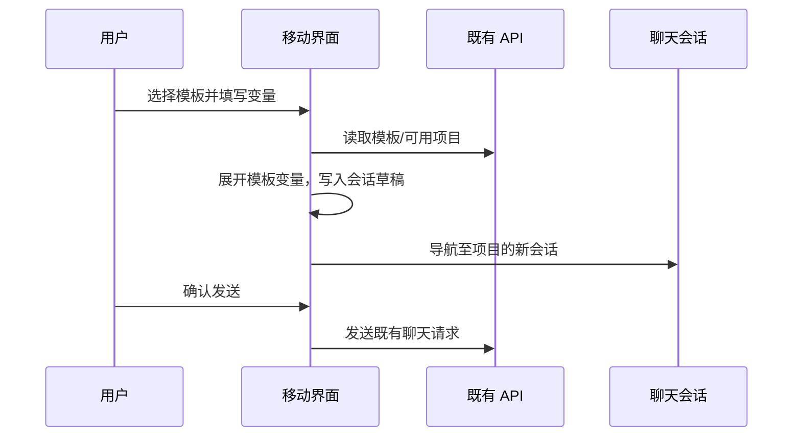

# AiAgent 手机端适配实施规格

> 对应设计稿：[mobile-adaptation-design.md](./mobile-adaptation-design.md)  
> 首期目标：让现有 AiAgent Web 在手机上可完成“找会话 → 选择项目/上下文 → 提问或使用模板 → 查看结果”的闭环。

## 1. 范围、前提与非目标

### 范围

- `/chat`、`/prompt-templates`、`/knowledge`、`/settings/**`、`/dashboard-applications/**` 的响应式布局与移动端交互。
- 全局导航、会话列表、项目选择、上下文选择、模板使用和模板编辑的手机端呈现。
- 触控、软键盘、安全区、加载/失败/空态以及无障碍要求。

### 前提

- 现有认证、项目、会话、模板、代码库、知识库和设置 API 继续复用；首期不新增移动专用 API。
- 权限判断仍由现有后端执行。移动端只决定入口是否展示，绝不以隐藏 UI 代替鉴权。
- 现有桌面页面在 >=1024 px 的布局和行为必须保持兼容。

### 非目标

- 不开发原生 App、PWA 离线缓存、推送、语音输入或“连接电脑”模式。
- 不重构 Agent 执行协议、会话数据结构、模板数据结构与权限模型。
- 不把所有复杂管理功能塞入首期手机首页；低频管理能力可在二级页完成。

## 2. 响应式技术契约

| 规则 | 要求 |
| --- | --- |
| 设备判定 | 使用 CSS breakpoint / container query；禁止依据 UA、`navigator.platform` 或一次性 `innerWidth` 决定功能。 |
| 断点 | `mobile: <768px`，`tablet: 768–1023px`，`desktop: >=1024px`。现有 `sm/md/lg/xl` 可继续使用，但所有移动关键路径必须以默认样式为手机布局。 |
| 容器 | 手机页面最小宽度 320 px；`overflow-x: hidden` 只用于根壳层，不能掩盖内容截断。长文本、代码、表格使用局部横向滚动。 |
| 安全区 | 顶栏使用 `padding-top: env(safe-area-inset-top)`；底部输入器/操作面板使用 `padding-bottom: max(12px, env(safe-area-inset-bottom))`。 |
| 动态视口 | 聊天主体使用 `100dvh`，不能只使用 `100vh`；键盘弹出时监听 `visualViewport`（若需 JS）更新 CSS 变量 `--visual-viewport-height`。 |
| 动效 | 抽屉 220–280 ms，操作面板 180–240 ms；遵从 `prefers-reduced-motion`。 |

建议新增以下仅负责布局的组件，不在页面中复制同类逻辑：

```text
components/mobile/
  MobileWorkspaceShell.tsx   // 顶栏、抽屉开关、主内容安全区
  WorkspaceDrawer.tsx        // 复用项目和会话数据，替代手机侧边栏
  ActionSheet.tsx            // 项目、上下文、变量和更多操作
  MobilePageHeader.tsx       // 返回、标题、右侧主/更多动作
  StickyComposer.tsx         // 会话输入器及键盘安全区
  ResponsiveDataList.tsx     // 桌面表格/列表的手机摘要卡片
```

这些是界面边界，不要求移动端维护一套重复的业务状态：会话、项目、模板、权限继续来自已有 hooks/API 层。

## 3. 全局壳层规格

### 3.1 `AuthGate` / 工作台壳层

当前 `AuthGate` 在认证后固定渲染 `AppSidebar`，并给内容设置 `pl-[72px]` 或 `pl-[240px]`。实施后：

- `<768px`：内容区 `padding-left: 0`；`AppSidebar` 不占位，替换为 `WorkspaceDrawer` 覆盖层；页面页头提供汉堡按钮。
- `>=1024px`：保留当前 `AppSidebar` 和 compact 切换行为。
- `768–1023px`：默认采用覆盖式抽屉，避免 72 px 图标栏挤占主内容；若后续验证平板横屏需要，可在第二期开放 compact rail。
- `/dashboard-applications/{id}` 延续沉浸页例外，但需添加移动端返回工作台入口，不能困住用户。

### 3.2 工作台抽屉状态机

| 状态 | 进入方式 | 退出方式 | 约束 |
| --- | --- | --- | --- |
| closed | 初始、选择导航后 | — | 页面可滚动，汉堡可聚焦。 |
| opening / open | 点击汉堡、左缘右滑 | — | 锁定 body 滚动，焦点困在抽屉内，遮罩可点击。 |
| nested-action | 点击项目更多、会话更多 | 关闭操作面板后回到 open | 操作面板层级高于抽屉；不关闭抽屉中的状态。 |
| closing | 点击遮罩、关闭、右滑、Esc | 过渡结束为 closed | 将焦点还给触发按钮。 |

抽屉导航项：聊天、模板市场、项目会话、工具与设置。工具与设置下含代码库、Git 管理、知识中心、设置；管理员项目仅在已获得管理员状态时显示。

## 4. 页面与组件规格

### 4.1 聊天 `KnowledgeChatHome`

| 区域 | 手机要求 | 验收条件 |
| --- | --- | --- |
| 页头 | 汉堡、会话标题/“新会话”、项目状态胶囊、更多操作。 | 375 px 下不换成两行；标题过长截断，项目状态仍可点击。 |
| 消息区 | 单列、独立 `overflow-y-auto`；顶部和输入器之间有 12 px 留白。 | 100 条消息时仅消息区滚动，页面外层不跳动。 |
| AI 回复 | 默认全文宽阅读列；引用/过程/代码文件折叠。 | 长代码不撑破视口，点击引用可查看文件详情。 |
| 输入器 | `sticky` 底部；附件、上下文、发送；流式时发送变停止。 | 键盘打开和关闭均不遮挡主按钮。 |
| 上下文 | 项目、代码库、知识库选择均打开 `ActionSheet`。 | 多选有数量和清除动作；提交前可取消且不修改会话。 |
| 草稿 | 同一会话保留未发送文本与附件。 | 打开抽屉、切换项目或键盘收起不丢草稿。 |

**建议交互细节**

- 无会话空态显示 3 个模板快捷项；内容来自模板 ID/阶段配置，不应在 JSX 中复制完整 Prompt。
- 顶栏项目胶囊点击后为项目选择面板；选择成功后更新当前会话草稿的项目上下文，不自动发送。
- 代码引用点击：手机打开文件全屏页（文件名、路径、行号、代码、返回），平板/桌面保持已有右侧文件面板。
- `MessageBubble` 的复制、重试、查看过程使用最少一行；空间不足时把次要动作放入 `…`。

### 4.2 模板市场 `PromptTemplateMarket`

| 功能 | 手机规格 |
| --- | --- |
| 顶栏 | 汉堡 + 标题 + 新建按钮；“导入 MD”进入更多菜单或二级页。 |
| 搜索/筛选 | 搜索占满一行；研发阶段 chips 单行横向滚动；“全部/收藏/我创建的”用可访问的 segmented tabs。 |
| 列表 | 1 列卡片，卡片最小高度取消；标签最多两行，余项 `+N`；点赞、收藏、使用都有 44 px 点击热区。 |
| 模板详情 | 独立全屏 sheet/page；Tabs 为预览、配置、编辑（仅创建者）；底部固定主操作。 |
| 模板使用 | 全屏/底部操作面板；变量表单支持软键盘滚动；完成后将模板展开文本写入待发送草稿。 |
| 新建/编辑 | 保存、取消固定页头或页底；离开未保存内容时确认。 |

移动端模板详情不得复用当前桌面 `grid-cols-[minmax(0,2fr)_minmax(330px,1fr)]` 三栏结构。`Modal` 需允许以 `presentation="full-screen"` 或独立路由呈现，避免对同一表单维护两份保存逻辑。

### 4.3 知识、代码库、Git 与设置

| 页面类型 | 手机呈现 | 保持的业务边界 |
| --- | --- | --- |
| 知识中心 | 资源列表卡片、详情二级页、上传/导入操作面板。 | 文档状态、分段、知识权限保持 API 原值。 |
| 代码库/Git | 摘要卡片 + 详情；连接、同步、删除等危险操作有二次确认。 | 认证凭据不可回显；后端控制可见性。 |
| 设置中心 | 卡片单列，状态指标 2 列；每张卡只承载一个进入动作。 | 设置数据与模型配置不复制一份移动缓存。 |
| 管理报表 | KPI 2 列、图表可横向查看、明细转摘要卡片。 | 管理员校验由服务端完成。 |

## 5. `ActionSheet` 组件契约

```ts
type ActionSheetProps = {
  open: boolean;
  title: string;
  description?: string;
  size?: "content" | "half" | "full";
  closeLabel?: string;
  onClose: () => void;
  footer?: ReactNode;
  children: ReactNode;
};
```

要求：

- `role="dialog"`、`aria-modal="true"`、有可读标题；打开后焦点进入第一个可操作元素，关闭后回到触发元素。
- 在手机上最大高度为 `min(84dvh, 720px)`，内容区内部滚动，页脚主按钮不随内容滚走。
- 允许向下拖拽关闭，但拖拽不可替代关闭按钮；禁止背景滚动和点击穿透。
- “选择项目”“选择上下文”“会话更多”“模板变量”复用这一组件。不要在手机继续使用绝对定位的小下拉框。

## 6. 数据、权限与错误处理

### 数据流



- `project_id`、会话 ID、模板 ID 保持现有 query/state 语义；手机端不能修改接口路径来区分端类型。
- 模板使用后的草稿交接继续使用当前会话预填机制；需有一次性消费 ID，避免刷新/重挂载导致重复新建或重复发送。
- 所有 mutation 显示与动作关联的错误文案：如“保存模板失败（HTTP 404）”，不得只显示“操作失败”。
- 对 `401/403`：清除本地加载态，显示权限说明或按既有认证策略跳转；对 `404/5xx`：保留表单草稿并允许重试。

### 权限展示

| 对象 | 移动端规则 |
| --- | --- |
| 项目 | 只显示当前用户已有权限的项目；选择后仍由接口再次校验。 |
| 模板 | 仅展示个人/项目/团队范围内返回的模板；个人模板的编辑、删除动作由 `created_by_me` 与服务端共同决定。 |
| 管理入口 | 获取认证状态后再显示；不能靠隐藏入口保护管理 API。 |
| 代码/知识上下文 | 仅展示对当前项目可用的来源；失效来源显示原因并禁止选中。 |

## 7. 无障碍与质量门槛

- 文字和关键图标符合 WCAG AA 对比度；不能以仅颜色表达“流式中、失败、已选中”。
- 所有图标按钮有中文 `aria-label`；抽屉、操作面板、全屏预览支持 Esc 与焦点管理。
- 触控目标 >=44 px；正文最小 14 px，辅助信息最低 12 px；禁止手机端悬停才可见的唯一功能。
- 性能：首次手机视图不预加载所有会话全文和隐藏面板；长会话使用现有分页/虚拟化策略（如有），抽屉只加载摘要。
- 图像预览需包含关闭、缩放、可滚动查看；不要使用只依赖双击的桌面手势。

## 8. 验收用例

| 编号 | 场景 | 通过标准 |
| --- | --- | --- |
| M-01 | 375 × 812 打开 `/chat` | 无桌面左侧占位，无横向滚动，页头/输入器可见。 |
| M-02 | 打开/关闭工作台抽屉 | 当前位置保留、背景不可滚动、焦点正确返回。 |
| M-03 | 在抽屉中打开项目会话并执行归档 | 操作面板可用，成功后列表更新，不刷新整页。 |
| M-04 | 新会话选择项目、代码库、知识库 | 已选数量正确，取消不提交，确认后在输入器附近可见摘要。 |
| M-05 | 键盘打开输入器 | 发送/停止始终高于键盘，消息区可继续滚动。 |
| M-06 | 搜索并使用模板 | 能填写必填变量，进入正确项目会话，文本预填但未自动发送。 |
| M-07 | 编辑个人模板 | Preview/Edit/Config 不同时挤在页面；保存/失败均有明确反馈且草稿可保留。 |
| M-08 | 访问知识、设置、管理页 | 一列可读，表格信息不被裁切；无权限入口/API 均被拒绝。 |
| M-09 | 768、1024、1280 宽度回归 | 平板是覆盖抽屉；桌面恢复当前侧边栏和多栏工作区。 |
| M-10 | 弱网或接口 404 | 不整页刷新；就地提示状态码/可理解错误，用户输入不丢失。 |

## 9. 实施顺序

1. **壳层与聊天闭环**：移动页头、抽屉、`ActionSheet`、安全区、聊天输入器、项目/上下文选择、键盘回归。
2. **模板闭环**：模板列表单列、模板详情全屏 tabs、变量表单、预填交接与失败反馈。
3. **工具和设置**：知识、代码库、Git、设置及管理员页面的卡片/详情布局。
4. **体验完善**：代码引用全屏查看、图像预览、草稿恢复、动效/无障碍、真实设备回归。

每一期都应在 360、375、390、768、1024、1280 宽度完成视觉回归；先覆盖聊天和模板，不等待低频设置页全部改完才验证核心闭环。

## 10. 实施前需要确认但不阻塞设计的产品项

- 手机首屏是否需要正式的 AiAgent 插画资产；若没有，首期使用现有图标空态。
- 模板快捷项是否允许由管理员配置；首期可按固定 ID/阶段配置，后续再做后台管理。
- Dashboard 应用工作区是否也应显示项目上下文；当前建议保持沉浸式独立体验，避免与聊天工作台混淆。

