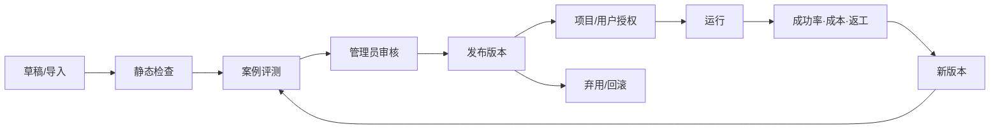

# AiAgent Skill 与领域机会地图

> 版本：2026-08-19 · 性质：产品与架构探索 · 范围：设计文档，不包含生产代码变更

## 1. 结论先行

AiAgent 已经不是一个单纯聊天壳。当前代码拥有会话、Agent Loop、受控工具、代码项目、运行时、知识库、记忆、任务、Git、推送、看板和工作画布。下一阶段最有价值的方向，不是继续增加彼此孤立的页面，而是把这些能力组合成一个可审计的“项目工作操作系统”：

1. **Skill 是可发现、可版本化、可授权、可评测的能力包**，不是另一个 Prompt 模板名称。
2. **Run 是一等资源**，把聊天消息、工具调用、审批、产物和成本串成可恢复时间线。
3. **工作画布是上下文与执行控制面**，节点不只展示会话，还能承载任务、Run、文件、知识证据、变更集和审批。
4. **人机协作靠风险分级而非全开/全关**，只读自动执行，写入预览确认，外发、删除、发布等动作必须显式审批。
5. **项目知识来自闭环沉淀**：Run 产出证据，用户验收，候选记忆审核后成为项目规则，再反哺后续 Skill。

建议优先建设三件事：`Skill Registry + Run Ledger + Approval Inbox`。它们会让现有功能从“能用”跃迁到“可组合、可恢复、可治理”。

## 2. 当前项目能力基线

以下判断来自仓库当前代码，而非概念推测。

| 能力域 | 已有落点 | 可复用资产 | 主要缺口 |
| --- | --- | --- | --- |
| 会话与流式执行 | `Services/Chat`、`ChatStreamProvider` | WebSocket/SSE、停止、重试、附件、Codex 接管 | Run 非独立资源，刷新恢复与事件补拉不足 |
| Agent 工具循环 | `AgentLoop`、`ToolDispatcher` | 代码搜索、符号定位、RAG、看板读写与校验 | 工具注册静态，缺少 Skill 选择、版本、权限和评测 |
| 工作画布 | `Services/WorkCanvas`、`WorkCanvasPage` | 多会话节点、布局、边、内嵌完整聊天、伸缩侧栏 | 节点类型仍以 session 为主，尚未成为执行图与证据图 |
| 项目与代码运行 | `Services/CodeRepository` | 授权目录、运行配置、终端、文件查看、Git | 缺少隔离工作树、变更集和验收门禁 |
| 知识与 RAG | `Services/Knowledge`、`Services/Rag` | 导入、解析、索引、引用、页范围读取 | 缺少知识加工流水线、检索评测和证据质量反馈 |
| 长期记忆 | `Services/Memory` | observation → candidate → 人工审核 → memory | 尚未与 Skill 规则、项目 ADR、失效检测形成闭环 |
| 任务管理 | `Services/Task` | 看板流转、项目关联、外部任务导入 | 任务、会话、Run、提交、验收结果尚未贯通 |
| Prompt 市场 | `Services/PromptTemplate` | 分类、变量、收藏、导入导出 | Prompt 与可执行 Skill 的边界和升级路径不明确 |
| 推送与协作 | `Services/Push` | 钉钉群机器人、Outbox、审计 | 适合升级为审批收件箱与异常通知中心 |
| 用量治理 | `Services/Usage` | 用户/代理/模型/日期统计 | 缺少按 Skill、Run、项目、成功率和返工率归因 |

## 3. GitHub 调研与可借鉴模式

| 项目 | 值得借鉴 | 对 AiAgent 的落点 | 不建议照搬 |
| --- | --- | --- | --- |
| [OpenHands](https://github.com/All-Hands-AI/OpenHands) | Action/Observation 事件流、AgentController、Runtime 分层 | 建立追加式 RunEvent；聊天、终端、工具、审批共享同一时间线 | 不必立即引入完整容器集群；先适配现有 Codex/本机运行时 |
| [LangGraph Agent Inbox](https://github.com/langchain-ai/agent-inbox) | 中断任务集中收件箱；接受、编辑、回复、忽略后恢复 | 将高风险工具调用、测试失败、冲突处理投影到 Approval Inbox | 不把审批状态只保留在前端页面 |
| [Dify](https://github.com/langgenius/dify) | 可视工作流、工具目录、知识流水线、变量检查与协作画布 | Skill 编排图、知识加工 Skill、节点输入输出契约、调试快照 | 避免一开始建设通用低代码平台，优先项目研发场景 |
| [n8n](https://github.com/n8n-io/n8n) | 对指定高风险工具逐项启用 Human-in-the-loop | 权限策略绑定 action，而不是绑定整个 Agent | 不允许模型自行关闭审批或改变风险等级 |
| [Microsoft AutoGen](https://github.com/microsoft/autogen) | 事件驱动 Agent、可组合 Agent-as-tool、Studio 原型 | 把专业 Agent 暴露成受控 Skill；支持并行调研/评审但共享预算 | 不默认采用自由群聊式多 Agent，容易失控且难审计 |
| [Anthropic Skills](https://github.com/anthropics/skills) | `SKILL.md` + references/scripts/assets；按需渐进加载 | 采用兼容目录约定，但在服务端增加 manifest、版本、权限与签名 | 不直接执行未审核仓库里的脚本 |
| [CrewAI](https://github.com/crewAIInc/crewAI) | 角色/任务/工具组合与 Agent-as-tool | 可用于“需求分析—实现—审查—验收”职责模板 | 不把角色提示词当作可靠权限边界 |

这些项目共同指向一个判断：**画布只是交互外壳，真正的产品护城河是可恢复事件、受控执行、能力目录和证据链。**

## 4. Skill 的产品定义

### 4.1 Skill、Prompt、Tool、Workflow 的边界

| 概念 | 负责什么 | 当前项目对应 | 建议关系 |
| --- | --- | --- | --- |
| Prompt Template | 一次任务的文字脚手架 | Prompt 模板市场 | 可被 Skill 引用，但本身不获得执行权限 |
| Tool | 一个最小、结构化、可授权动作 | `IAgentTool` | Skill 声明所需 Tool 与 action scope |
| Skill | 某类任务的标准作业包 | 尚缺一等模型 | 包含触发描述、步骤、输入输出、引用、脚本、策略、测试 |
| Workflow | 多个 Skill/人工步骤的显式编排 | 画布边与任务流可演进 | 负责依赖、分支、并行、重试与审批，不复制 Skill 内容 |
| Agent Profile | 模型、角色和默认能力集合 | Agent Provider / Codex profile | 选择可用 Skill，但不能扩大用户权限 |

### 4.2 建议目录格式

```text
skills/<skill-name>/
├─ SKILL.md                 # 面向模型的渐进式操作说明
├─ skill.json               # 服务端 manifest：版本、输入输出、工具、风险、兼容性
├─ references/              # 按需加载的项目规范或领域资料
├─ scripts/                 # 仅允许已签名、已审核、受运行时白名单约束的脚本
├─ assets/                  # 报告、文档、代码模板
└─ tests/
   ├─ cases.jsonl           # 触发、拒绝、正常与边界案例
   └─ assertions.json       # 结果结构、证据与副作用断言
```

示例 manifest：

```json
{
  "id": "repo-change-review",
  "version": "1.2.0",
  "display_name": "代码变更审查",
  "input_schema": { "type": "object", "required": ["project_id", "change_set_id"] },
  "output_schema": { "type": "object", "required": ["verdict", "findings", "evidence"] },
  "tools": ["code_search", "read_file", "git_diff", "run_tests"],
  "risk": "read_only",
  "approval_policy": "never",
  "compatibility": { "aiagent": ">=0.2", "os": ["windows"] }
}
```

### 4.3 Skill 生命周期



触发必须同时通过四道门：语义匹配、输入是否满足、当前上下文是否有权限、风险策略是否允许。模型“想用”不等于系统“允许用”。

## 5. 候选 Skill 目录

### 5.1 第一组：直接放大现有代码资产

| Skill | 用户价值 | 复用现有能力 | 风险 | 优先级 |
| --- | --- | --- | --- | --- |
| 项目体检 | 一次生成架构、依赖、运行入口、风险与缺失文档 | 代码索引、符号搜索、项目 Markdown | 只读 | P0 |
| 任务开工包 | 从任务生成范围、验收标准、计划与新会话/画布分组 | Task、Chat、WorkCanvas | 创建记录 | P0 |
| 变更影响分析 | 从 diff/符号追踪调用面、配置面和测试面 | Git、代码搜索、知识引用 | 只读 | P0 |
| 测试失败分诊 | 聚类失败、定位首因、给出最小复现与修复候选 | Runtime、终端、文件查看 | 只读/运行 | P0 |
| 交付验收包 | 汇总需求—修改—测试—提交—剩余风险 | Task、Run、Git、Markdown | 只读 | P0 |
| ADR 生成与回链 | 从已确认讨论生成架构决策记录并链接证据 | Chat、Memory、项目 Markdown | 写文件需确认 | P1 |
| 安全变更审查 | 检查路径越权、密钥、命令拼接、权限扩张 | AGENTS.md、diff、规则库 | 只读 | P1 |
| 知识库健康检查 | 检查过期、重复、无引用、召回差的文档 | Knowledge、RAG、Usage | 只读 | P1 |

### 5.2 第二组：形成有趣的跨域闭环

| Skill | 场景 | 独特点 |
| --- | --- | --- |
| 会话接力棒 | 把长会话压缩为目标、已证实事实、改动、命令、阻塞项 | 不是普通摘要；输出可验证的下一会话输入包 |
| 证据冲突侦测 | 比较代码、项目 Markdown、知识库与记忆中的同一事实 | 在画布显示“事实冲突边”，让用户选择权威来源 |
| 返工雷达 | 识别反复修改同一文件/同一任务的 Run | 用返工率驱动 Skill 和文档改进，而非只统计 Token |
| 代码库考古 | 沿提交、文件、会话和任务构建“为什么这样写”时间线 | 将 Git 历史与聊天决策连接起来 |
| 变更集沙盒 | 为任务创建隔离工作树、运行、预览、diff 和丢弃/合并 | 支持多个画布会话并行而不踩同一工作区 |
| 发布守门人 | 检查工作树、测试、文档、敏感文件和审批后才允许发布 | 把 AGENTS.md 规则变成机器可验证门禁 |
| 项目晨报/夜间巡检 | 汇总运行失败、待审批、漂移、知识过期与外部任务状态 | 利用现有 Push Outbox 推送可点击的工作项 |
| Skill 蒸馏器 | 从高质量已验收 Run 提议 Skill 草稿和测试案例 | 只生成候选，必须人工审核后发布 |

## 6. 值得建设的领域能力

### 6.1 Run Ledger：可恢复执行账本（P0）

把一次 Agent 工作从“聊天请求”提升为独立资源：

```text
Run
├─ input snapshot（引用 ID，不复制密钥和真实路径）
├─ ordered events（message/tool/action/observation/approval/artifact）
├─ status（queued/running/waiting/completed/failed/cancelled）
├─ budget（token/time/tool count）
└─ outcome（summary/artifacts/verification/cost）
```

它让断线恢复、跨页面投影、任务追踪、审批和成本归因拥有同一个事实源。建议先旁路记录现有聊天流，再逐步让 UI 从 ledger 补拉，不应直接重写传输层。

### 6.2 Approval Inbox：人工接管中心（P0）

审批项至少支持：批准、编辑参数后批准、拒绝、请求补充证据、转交。审批卡必须展示动作、目标、参数摘要、预期副作用、回滚方式、来源 Run 和过期时间。

风险建议：

| 等级 | 示例 | 默认策略 |
| --- | --- | --- |
| R0 只读 | 搜索、读取、RAG、diff | 自动 |
| R1 可逆写入 | 工作区补丁、新建草稿 | 执行前展示计划；项目可配置自动 |
| R2 外部或共享影响 | push、发群消息、修改共享知识 | 必须审批 |
| R3 破坏性/生产影响 | 删除、发布、生产命令、权限变更 | 双确认或禁用 |

### 6.3 Skill Registry 与评测场（P0）

提供安装、导入、版本、授权、兼容性、签名、案例评测、灰度和回滚。评测不只看回答相似度，还看：是否正确触发、是否越权调用工具、证据覆盖率、结构契约、实际副作用、耗时、成本、用户返工率。

### 6.4 Artifact / Change Set（P1）

文件、Markdown、测试报告、截图、diff、提交都应成为有类型的 Artifact。多个文件修改聚合成 Change Set，具备基线哈希、写入者、验证结果与处置状态（草稿/已确认/已提交/已丢弃）。画布因此能展示“这个会话产出了什么”，而不只是最后一句话。

### 6.5 Project Knowledge Graph（P1）

连接 Task、Session、Run、Artifact、File、Symbol、Commit、KnowledgeDocument、Memory 和 Skill。第一阶段不必引入图数据库，可用关联表 + 查询投影；只有跨多跳查询与规模证明需要时再评估图存储。

### 6.6 Evaluation & Replay Lab（P1）

从脱敏 Run 创建回放案例；固定输入、Skill 版本、模型配置和工具模拟，对候选版本做回归。生产副作用工具必须 mock 或 dry-run，禁止评测环境真实 push、发送消息或删除数据。

### 6.7 Context Compiler（P2）

统一编译 AGENTS.md、项目 Markdown、已审核记忆、任务、Skill references、RAG 证据和当前 diff；记录每段上下文的来源、预算、版本和是否命中，解决“上下文为何被放进 Prompt”不可解释的问题。

### 6.8 Project Pulse（P2）

项目健康面板不只显示调用量，而展示：任务吞吐、首轮通过率、审批等待、失败首因、返工热点、知识命中率、Skill 成功率、每个已验收交付的成本。

## 7. 画布应如何演进

画布不应直接变成任意自动化引擎。建议保留两种明确模式：

- **工作视图**：自由摆放 Session、Task、Run、Artifact、Note、Group，边主要表达上下文和证据关系。
- **流程视图**：只有经过校验的 Skill 节点和控制节点可以执行；边表达 typed input/output，支持并行、条件、等待与审批。

一个有辨识度的交互是“证据透镜”：选中任务时，高亮它关联的会话、Run、变更集、测试证据和提交；选中失败 Run 时，反向显示使用的 Skill 版本、上下文来源和待审批动作。

## 8. 建议领域模型与接口

首批实体均应遵循项目约定：新增字段默认 nullable，权限在 Service 层校验。

| 实体 | 核心字段 |
| --- | --- |
| `AiSkillPackage` | Name、Description、Source、Owner、Status、RiskLevel |
| `AiSkillVersion` | SkillId、Version、ManifestJson、ContentHash、EvaluationStatus |
| `AiSkillGrant` | SkillId/Version、UserId/ProjectId、AllowedActionsJson |
| `AiAgentRun` | UserId、SessionId、TaskId、SkillVersionId、Status、BudgetJson |
| `AiAgentRunEvent` | RunId、Sequence、EventType、PayloadJson、CreatedAt |
| `AiApprovalRequest` | RunId、Action、RiskLevel、PayloadJson、Status、ReviewerId |
| `AiArtifact` | RunId、Kind、OpaqueLocator、Hash、MetadataJson |
| `AiChangeSet` | RunId、ProjectId、BaseRevision、Status、ValidationJson |

建议接口：

```text
GET  /api/v1/skills
POST /api/v1/skills/import
POST /api/v1/skills/{id}/versions/{version}/evaluate
POST /api/v1/runs
GET  /api/v1/runs/{id}
GET  /api/v1/runs/{id}/events?after={sequence}
POST /api/v1/runs/{id}/cancel
GET  /api/v1/approvals?status=pending
POST /api/v1/approvals/{id}/decision
GET  /api/v1/change-sets/{id}
POST /api/v1/change-sets/{id}/apply
```

## 9. 分阶段路线图

### Phase 0：契约与观测（2 周）

- 定义 Skill manifest、Run/Event、Artifact、Risk/Approval 契约。
- 给现有工具补 action scope、risk、idempotency、dry-run 元数据。
- 旁路记录现有 Agent Loop 事件，先不改变聊天协议。
- 选择 20 个真实脱敏任务作为基线案例。

### Phase 1：最小闭环（3–5 周）

- Skill Registry 只支持受控本地目录与管理员发布。
- 上线“项目体检、变更影响分析、测试失败分诊、交付验收包”四个 P0 Skill。
- Run 详情时间线支持刷新补拉。
- Approval Inbox 接入工作区写入、Git push、钉钉外发三类动作。
- 工作画布新增 Run、Task、Artifact 节点投影。

### Phase 2：可组合与可评测（4–6 周）

- Skill 版本评测、灰度、回滚与项目授权。
- Change Set、隔离工作树、测试报告 Artifact。
- 流程视图支持串行、并行、条件、人工等待四类控制。
- Usage 升级为 Skill/Run/项目效果归因。

### Phase 3：组织级知识飞轮

- Context Compiler、Project Knowledge Graph、冲突侦测。
- 从已验收 Run 生成 Skill/记忆候选，始终人工审核。
- 钉钉审批与项目晨报；可选外部任务系统 Adapter。

## 10. 成功指标与否决指标

### 成功指标

- P0 Skill 的正确触发率、任务完成率、首轮验收通过率。
- Run 断线恢复成功率与事件序列完整率。
- 高风险动作审批覆盖率 100%，越权执行为 0。
- 单个交付的返工次数、人工补充上下文次数持续下降。
- Skill 升级有回归证据，失败可定位到版本、工具、上下文或模型。

### 否决指标

- Skill 只是 Prompt 模板换皮，没有结构化输入输出和权限声明。
- 画布连线直接获得执行语义，却没有类型检查、预算和审批。
- 浏览器传入真实服务器路径或任意命令。
- 未审核的远程 Skill 脚本被后端服务账户直接运行。
- 为追求“多 Agent”而引入不可追踪的自由对话和无限循环。

## 11. 近期可直接创建的设计任务

1. `Skill manifest v0.1 与校验器设计`
2. `Tool capability/risk 元数据改造`
3. `Run Ledger 旁路写入与 sequence 不变量`
4. `Approval Inbox 页面与钉钉投影`
5. `项目体检 Skill + 10 个回归案例`
6. `Change Set 与隔离工作树安全设计`
7. `画布 Run/Artifact 节点交互原型`
8. `按 Skill 的质量、成本、返工指标`

## 12. 参考链接

- [OpenHands](https://github.com/All-Hands-AI/OpenHands)
- [LangGraph Agent Inbox](https://github.com/langchain-ai/agent-inbox)
- [Dify](https://github.com/langgenius/dify)
- [n8n](https://github.com/n8n-io/n8n)
- [Microsoft AutoGen](https://github.com/microsoft/autogen)
- [Anthropic Skills](https://github.com/anthropics/skills)
- [CrewAI](https://github.com/crewAIInc/crewAI)

