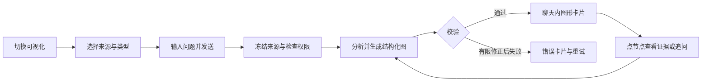

# 项目聊天「可视化」模式：产品与技术设计

> 评审稿 v0.1 · 2026-10-06。仅设计，尚未接入产品。基于本地 ai-agents `bf33aeb` 与 Archify 官方资料。按本次要求放在项目根目录 `doc/`，不调整原有 `docs/`。

配套：[界面与交互说明](chat-visual-mode-ui.md) · [可操作 HTML 设计稿](chat-visual-mode-prototype.html)

## 1. 建议方案

在现有聊天输入框工具栏增加「文字 / 可视化」输出模式。用户选择 Git 历史、当前对话、其他会话中的消息或已有图形，再选择图形类型并提出问题。系统将结果作为可交互图形卡片直接输出到当前聊天消息中；点选节点可以查看依据、追问、生成下一版。

模式与 AGENT、模型、推理等级分开：AGENT 决定执行者，「可视化」决定输出形式。无需离开聊天页；默认文字模式，普通对话行为不变。这里将“其他对话的方式”同时覆盖为“通过自然语言生成图”和“引用其他历史会话生成图”。

典型输入：

- “选这个提交，画出当时的聊天请求链路。”
- “比较这两次提交，标出新增和删除的服务关系。”
- “根据另一个会话里的审批方案，生成泳道流程图。”
- “继续这张图，只保留 API、Agent、工具调用三层。”

## 2. Archify 调研结论与接入边界

官方 README 描述了五种图形、结构化 JSON 输入、校验后生成独立 HTML，以及架构 Before / Delta / After 比较。建议借用其生成与浏览能力，由 AiAgent 提供项目权限、来源选择、版本与消息归档。它不替我们实现 Git 历史选择或会话权限。[官方仓库](https://github.com/tt-a1i/archify)

核对时包版本为 3.0.1，运行要求 Node >=18；接入时固定版本和提交，不跟随 main 自动升级。MIT 允许修改和分发，需保留版权和许可证。[包声明](https://github.com/tt-a1i/archify/blob/main/archify/package.json) · [许可证](https://github.com/tt-a1i/archify/blob/main/LICENSE)

首期建议保留原生 JSON → validate → deliver 的边界，封装后端适配器；不复制整个独立站，不要求每个用户安装技能。采用内网自带的固定运行时，模型只产出 JSON。外部仓库 README 与示例属于参考数据，不作为执行指令。

| 选择 | 用途 | 本方案阶段 |
| --- | --- | --- |
| 架构图 | 项目组件、服务与存储关系 | P1 |
| 流程图 | 审批、工具调用、分支与异常 | P1 |
| 时序图 | 一次请求的参与者和先后顺序 | P1 |
| 数据流图 | 数据来源、转换和去向 | P2 |
| 生命周期图 | 状态、等待、重试和终态 | P2 |
| 架构变更对比 | 两份架构快照的前后差异 | P2，单独入口 |

两次提交的文本 diff 不能直接等同于架构差异。需要分别分析相同范围的两个快照，再对齐稳定节点 ID，最后比较。图上的上下游表示已描述关系，不宣称完整运行时影响或合并安全性。官方源证据示例主要面向固定公开提交；私有仓库证据访问需由 AiAgent 自建鉴权读取接口。[能力与边界](https://github.com/tt-a1i/archify#choose-the-right-diagram)

## 3. 来源选择

### 3.1 Git 历史

1. 选择当前项目绑定且有读取权限的代码库，多仓项目必须明确仓库。
2. 展示已获取到本地的分支与提交，按提交说明、作者、SHA 搜索；使用游标分页。
3. 「单版本」选择一个 commit；「比较版本」明确选择基线 A 和目标 B，展示方向 A → B。
4. 可限定目录与关注主题。确认后输入框上方出现可删除的来源标签。
5. 服务端立即解析为完整 commit OID。之后分支移动不改变本次任务的来源。

默认不拉取网络、不 checkout 当前工作区、不执行选中版本的任何代码或安装脚本。通过只读 Git 对象读取历史文件；必要的临时快照在受控目录生成，拒绝越界、符号链接和子模块穿透。大型仓库按预算挑选文件，并公开分析范围和遗漏。

merge commit 比较需选择父提交，默认第一父提交并明确标记；根提交可以生成单版本图，比较模式需另选基线。非祖先提交允许端点比较，但标注“两个快照比较”；用户要求变更区间时另行解析 merge-base，不暗换比较含义。浅克隆缺失对象时提示补全历史，不静默用 HEAD 替代。

### 3.2 对话与已有图形

- 当前对话：默认只选当前消息及用户指定的上下文，发送前可检查选中范围。
- 其他对话：默认限定同项目、本人可访问会话；搜索标题后勾选具体消息，显示摘要、时间、消息数量。不默认整段导入。
- 已有图形：从可访问会话选择 artifact + revision。可以直接引用查看，也可以“基于此图继续生成”；后者派生新版本，不覆盖来源会话原图。
- 纯自然语言：允许无 Git 来源，标为“方案示意”，不能标为已验证项目架构。

混合来源时区分“代码证据”“用户方案”“模型推断”。对话与代码冲突不能自动融成事实，图中以待核实标记并说明冲突。

## 4. 端到端交互



图形卡片结构：标题与版本 → 来源和可信度 → 可交互图 → 一段结论 → 展开、继续编辑、版本、下载操作。默认卡片高约 420px，复杂图在当前页打开大画布；聊天滚动与画布平移独立。

生成中按真实阶段展示“读取来源 / 分析结构 / 校验图形 / 准备展示”，不模拟百分比。用户停止后取消模型与渲染进程。结构化 JSON 不完整时不渲染；更新失败保留上一张有效图并明确新版本失败。点击节点只聚焦，不自动调用模型；“追问此节点”把节点引用和问题放入输入框，由用户发送。

首期每次生成一个图形卡片。类型选择为“自动推荐”时，服务端返回实际类型和简短理由；明确选择时遵循用户选择，遇到不适用输入给出提示，不悄悄替换。

## 5. 与现有项目的结合点（已核查）

| 当前代码 | 已有能力 | 建议新增 |
| --- | --- | --- |
| `front/components/chat/KnowledgeChatHome.tsx` | 输入框、项目/文档引用、消息 UI，发送时 mode 为 chat | 挂载独立可视化工具栏与消息卡片，避免继续堆积复杂状态 |
| `front/components/chat/MarkdownMessage.tsx`、`MermaidDiagram.tsx` | Markdown 中 Mermaid 展示 | 保留；新 artifact 用明确元数据识别，不解析任意 HTML 代码块 |
| `front/components/chat/ChatStreamProvider.tsx` | 聊天流和自动重试生命周期 | 扩展 artifact 事件与请求快照，确保幂等 |
| `front/lib/chat-api.ts`、`backed/Dtos/Chat/ChatDtos.cs` | 聊天请求契约 | 增加可选 visualization 配置与统一 DTO |
| `backed/Services/Chat/ChatSessionService.cs` | 会话消息和 MetadataJson | 持久化图形版本引用，重开历史可重现 |
| `backed/Services/Chat/ChatSessionAppService.cs` | 会话列表、详情与鉴权入口 | 增加受限消息选择，不能只依赖客户端过滤 |
| `backed/Services/Git/CodeRepositoryGitService.cs` | 仓库 Git 状态、diff、操作 | 新增只读历史与固定 commit 内容读取服务 |

在核查的代码库 Git API 中未发现可直接满足本方案的提交历史分页接口；不能将当前工作区 diff 接口当历史快照接口使用。原型预览已有独立实现，但本方案需要自己的受控交互渲染边界，不复用 Office/PSD 的 sandbox 设置。

建议新增 `front/components/chat/visualization/`，包含模式工具栏、来源选择器、提交选择器、会话消息选择器、图形卡片、查看器；请求封装到 `front/lib/visualization-api.ts`，类型到 `visualization-types.ts`。

后端建议在 `backed/Services/Visualization/` 拆分来源解析、生成任务、Archify 适配器、产物存储。控制器只负责 HTTP；模型适配复用现有 Codex/LLM 路径。不要依赖某个客户端恰好装有 Archify，也不把可视化模式自动映射成更高文件写权限。

## 6. 拟定协议与存储（尚未实现）

保留现有 `mode: chat`，增加独立的 `output_mode: visualization`，避免混淆既有运行时模式。普通旧请求缺省为 text。

```json
{
  "mode": "chat",
  "output_mode": "visualization",
  "message": "画出这个版本的聊天请求链路",
  "visualization": {
    "diagram_type": "architecture",
    "sources": [
      { "kind": "git_snapshot", "repository_id": 12, "commit_oid": "<完整OID>", "paths": ["backed/Services/Chat", "front/components/chat"] },
      { "kind": "conversation", "session_id": "<会话ID>", "message_ids": ["<消息ID>"] }
    ],
    "parent_artifact_id": null,
    "parent_revision": null,
    "idempotency_key": "<本次发送唯一ID>"
  }
}
```

其他 source kind：`git_comparison` 携带 base_oid/head_oid；`artifact` 携带 artifact_id/revision。所有 ID 均重新鉴权，commit_oid 占位符不是真实提交。DTO 需与 TypeScript 同步，JSON 字段显式标注。

| 拟定接口 | 用途 |
| --- | --- |
| `GET /api/v1/visualizations/repositories/{id}/commits` | ref、query、cursor、limit 查询已知历史 |
| `GET /api/v1/visualizations/sources/sessions` | 当前项目可引用会话分页检索 |
| `GET /api/v1/visualizations/sources/sessions/{id}/messages` | 可引用消息分页检索 |
| 现有聊天发送通道 + visualization 配置 | 发起或继续图形生成，不建立第二个聊天入口 |
| `GET /api/v1/visualizations/jobs/{id}` | 重连后的状态恢复 |
| `POST /api/v1/visualizations/jobs/{id}/cancel` | 幂等取消 |
| `GET /api/v1/visualizations/{id}/revisions/{revision}` | 取固定版本元数据与受控资源 |
| `GET /api/v1/visualizations/{id}/revisions/{revision}/evidence/{evidenceId}` | 鉴权读取固定版本依据 |
| `GET /api/v1/visualizations/{id}/revisions/{revision}/download?format=html` | 经验证产物下载；其他格式分阶段开放 |

事件建议为 `visualization.started / progress / ready / failed / cancelled`，携带 job_id、message_id、artifact_id、revision、sequence。ready 只在资源和消息引用提交成功后发送，失败不广播完成。重复事件按 job_id + sequence 去重。

消息元数据只存 artifact ID、revision、标题、类型、状态和来源摘要，不塞入大段 HTML。独立产物记录保存项目/归属、来源快照、结构化 JSON、验证报告、渲染器版本、内容哈希及受控文件定位信息；接口不暴露磁盘路径。新增实体字段遵循项目 nullable 迁移规则。

版本不可变，修改新建 revision；并发修改携带 parent_revision，过期父版本返回冲突或明确派生，不能静默覆盖。保存使用临时文件和原子替换，短事务绑定消息引用；孤立临时产物可回收。源会话删除或权限撤销后，关联产物默认也不可继续查看，不能靠复制图形绕过来源权限；最终保留策略在上线前定稿。

## 7. 生成、重试与证据

1. 验证目标项目、仓库、会话、消息和产物权限，冻结来源内容哈希。
2. 限量读取相关代码/消息；秘密配置、本地数据和依赖产物排除。来源文本一律视为不可信数据。
3. 模型输出与选定图形匹配的 JSON，不允许模型提交脚本或任意 HTML。
4. 校验 schema、节点/边引用、布局、标签、证据文件与行号；最多两轮修正，预算耗尽即失败。
5. 固定 Archify 运行时渲染，产物验证通过后保存，回写消息，再发送 ready。

证据分为：代码位置已核验（文件/行号存在，不等于语义证明）、对话引用（方案描述）、模型推断（待核实）。缺证据的连接不能标成代码事实。节点稳定 ID 基于语义与来源映射，不能只靠显示名称；无法可靠匹配时按新增/删除展示并标注不确定。

复用聊天 20 秒重试机制时，必须携带原幂等键与来源快照；服务端存在进行中或完成任务则恢复，不二次计费生成。手动“重新生成”产生新键。停止后不能自动重试。服务重启中断任务标失败，用户明确重试；断线而任务仍执行时查询恢复。状态采用 queued → reading → generating → validating → rendering → ready，另有 cancelling/cancelled/failed。

建议首期可配置限制：单次 1 个仓库、2 个 commit、20 条外部会话消息、60 个图节点、2 个并发任务/用户；超过范围要求缩小或选择局部图。提示展示实际读取范围，具体 Token 和超时预算接入时按模型配置，不承诺固定生成秒数。

## 8. 内嵌浏览与安全设计

建议使用固定可信 Archify 模板 + 经过验证和转义的 JSON，放入专用 `sandbox="allow-scripts"` iframe，不加 allow-same-origin、弹窗、顶层导航或表单权限。与 Office 无脚本预览、PSD 导出分别处理。需先验证固定模板可在此 sandbox 下运行。

通过响应头/CSP 限制 connect-src 为 none，禁止远程脚本、图片、字体、iframe 和 form；可信脚本使用哈希/nonce 白名单，不允许模型注入脚本。清理富文本、URL、SVG 事件属性及外部资源引用，JSON 嵌入时转义闭合 script 序列。若模板无法满足边界，首期降级静态 SVG + 宿主节点详情，不扩大 sandbox 权限。

iframe 无直接 API 权限。节点证据请求通过小型 postMessage 协议交给宿主；验证 event.source 为当前 iframe、随机通道标识、artifact/revision 和消息 schema，不能仅以 opaque origin 的 null 判断可信。仅允许 focus_node/open_evidence/ask_node 等固定事件，不接受任意 URL、路径或命令。宿主鉴权取证据后用文本展示。

CLI 通过 ArgumentList 调用固定可执行文件和子命令，所有路径服务端生成且校验根目录；设进程超时、输出上限和取消。禁用不需要的更新联网检查，记录版本与耗时而不记录原文/密钥。下载仅输出经过验证的本版本；首期以 HTML 为主，PNG 导出需另验 sandbox/浏览器兼容。

## 9. 分期与验收

P0：确认本设计、验证固定版本 Archify 三种图的 JSON/中文/无网络渲染及 sandbox 可行性。

P1：模式入口、单 commit / 当前及其他会话消息来源、架构/流程/时序图、聊天内浏览、固定版本存档、追问生成新版本、HTML 下载。

P2：双 commit 架构对比、数据流与生命周期、已有图形检索、节点路径探索、PNG 导出。P1 已有图形可从当前聊天卡片继续，不依赖全局图形搜索。

验收重点：

- 选旧 commit 生成结果确实读取旧版本；当前工作区的脏文件和分支保持原状。
- 两个版本和仓库标识显示清楚，比较前后方向不能混淆；缺失历史不回退 HEAD。
- 其他会话只有所选消息进入模型；越权 ID、删除来源、权限撤销均被后端拒绝。
- 刷新页面与重开历史仍显示同一产物版本，旧图不因新回复被覆盖。
- 图形失败保持可解释错误与文字摘要；重试、断线重连、取消不会重复生成。
- 节点能定位到固定 commit 的证据；对话方案与推断标签清晰。
- 恶意消息/JSON 无法执行任意脚本、调用宿主 API、读取 cookie 或加载外部资源。
- 1366px 桌面和 390px 手机不横向撑破聊天；键盘可操作，关闭大画布恢复焦点。
- Git 测试使用临时本地仓库，覆盖 merge、根提交、重命名、浅历史与权限隔离。

## 10. 本轮交付范围

只新增本目录三份评审资料，没有安装 Archify、调用业务模型、改动产品代码、读取用户会话或创建真实图形任务。HTML 使用固定示例数据演示入口、来源选择、图形卡片和节点追问，不代表真实模型能力。评审后再按 P0/P1 实施。
