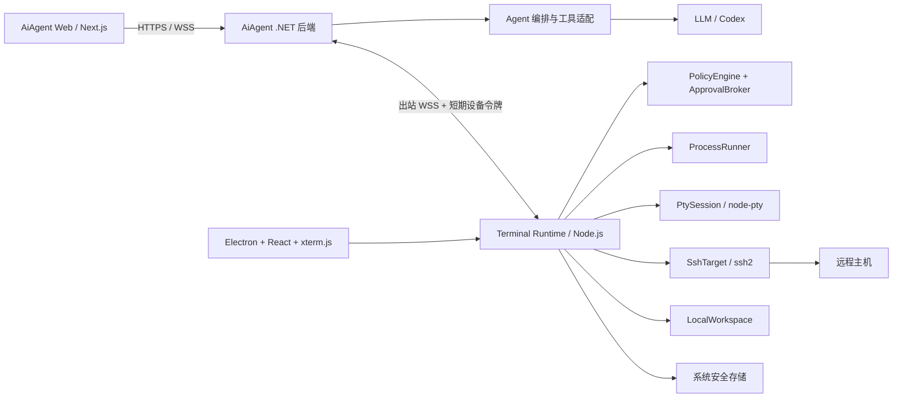

# AiAgent 智能体终端与远程主机访问技术方案

## 1. 技术决策

AiAgent 终端采用“本地执行、服务端编排、用户掌握授权”的架构。用户电脑运行 **AiAgent Terminal Desktop**，负责本地文件、进程、PTY、SSH 凭据和 SSH 连接；AiAgent 后端负责身份、设备会话、Agent 工具编排、策略和审计。模型只产生结构化工具调用，不能直接持有 shell、SSH 密码或用户电脑的绝对路径。

首版技术栈如下：

| 层 | 选型 | 用途 |
| --- | --- | --- |
| 本地核心 | TypeScript + Node.js LTS | 设备连接、策略、文件、进程、SSH、事件流 |
| 桌面壳 | Electron | 系统托盘、窗口、自动更新、系统凭据与本地进程能力 |
| 桌面 UI | React + Vite + xterm.js | 设置、审批、文件浏览、交互式终端 |
| 本地 shell | node-pty | 用户主动打开的交互式 PTY |
| SSH | ssh2 | 主机密钥校验、exec、SFTP 和远程 PTY |
| 凭据 | Electron `safeStorage` + 操作系统安全存储 | 数据库仅保存引用和密文 |
| 本地状态 | SQLite | 非秘密配置、授权根目录、任务与事件游标 |
| 服务端 | 现有 .NET 9 + ASP.NET Core + SqlSugar | 设备、会话、策略、审计和 Agent 工具适配 |
| 设备通道 | HTTPS + WSS、JSON、JSON Schema | 出站长连接、双向请求、事件流、恢复和取消 |
| Web 前端 | 现有 Next.js + TypeScript | 设备管理、目标选择、任务状态和审计视图 |
| 测试 | Vitest + Playwright；xUnit | 本地核心、桌面流程、后端策略与协议测试 |

首版不选 Tauri。Tauri 安装包更小，但会把执行核心拆成 Rust 与 TypeScript 两套实现，降低现有 DeepSeek Harness 插件代码的复用率。协议稳定后，可以让 Tauri、CLI 或服务器守护进程成为同一 `TerminalRuntime` 接口的新 adapter。

## 2. DeepSeek Harness 与 Codex 的设计取舍

### 2.1 借鉴 DeepSeek Harness

工作区中的 DeepSeek Harness 已验证以下设计：

- 会话使用只追加事件表达，重连后可按事件序号恢复。
- shell、PowerShell、远程执行落到统一子进程句柄，句柄负责 stdin、增量输出、退出、取消和进程树终止。
- `read-only`、`workspace-write`、`danger-full-access` 是明确的会话状态，工具在执行点再次校验。
- 批准请求属于运行中的任务，批准结果为一次性允许、拒绝、取消或不可用。
- Web、桌面和 CLI 是不同表层，核心工具与策略不依赖某个 UI。
- 远程环境不假定能访问宿主机原生选择器，能力在启动时探测并在生命周期内保持稳定。

AiAgent 复用这些原则，不复制 Harness 的完整插件容器。

### 2.2 借鉴 Codex

Codex app-server 提供了适合富客户端的交互模型：

- 以 `thread -> turn -> item` 表示会话、一次运行和运行中的命令/文件修改。
- 连接先初始化并声明客户端能力，后续事件携带会话与运行标识。
- 一次运行遵循 `started -> delta -> completed`，最终状态明确为完成、中断或失败。
- 命令和文件修改通过服务端发起的双向批准请求暂停，客户端答复后继续。
- 协议 schema 随运行时生成，双方显式协商版本与能力。
- 传输有背压、超载错误、取消和有界关闭。

AiAgent 不复制 Codex app-server wire protocol。后者还包含模型、账号和 Codex 专属对象。这里采用相同生命周期语义，定义更小的 **Terminal Device Protocol**，再由 `TerminalAgentToolAdapter` 映射到现有 Agent loop。

## 3. 总体架构



设备只主动连接后端，因此用户电脑无需开放入站端口，可处于 NAT 或内网。开发环境允许填写 `IP:端口`，规范化为 `http://IP:端口` 和 `ws://IP:端口`；生产环境默认要求 HTTPS/WSS。

核心 seam：

```ts
interface TerminalRuntime {
  describeCapabilities(): Promise<DeviceCapabilities>
  openSession(spec: SessionSpec): Promise<SessionHandle>
  invoke(request: ToolRequest, signal: AbortSignal): AsyncIterable<ToolEvent>
  closeSession(sessionId: string): Promise<void>
}
```

该接口隐藏本地与 SSH 差异、路径校验、凭据、连接池、进程终止、输出截断和脱敏。后端、桌面 UI 和测试不得绕过它直接调用 `ssh2`、`node-pty` 或文件系统。

## 4. 本地应用模块

在现有 `plugins/aiagent-remote` 的登录与后端地址处理基础上，形成独立工作区：

```text
terminal-client/
  apps/
    desktop/                 # Electron main/preload + React renderer
    cli/                     # 开发、诊断、无界面运行
  packages/
    protocol/                # schema、生成类型、兼容测试
    runtime/                 # TerminalRuntime 编排
    policy/                  # 权限、审批、预算、路径规则
    workspace-local/         # 本地文件 adapter
    process-local/           # 非交互命令 adapter
    pty-local/               # node-pty adapter
    target-ssh/              # ssh2 exec/SFTP/PTY adapter
    credential-store/        # 系统凭据 adapter
    device-link/             # 配对、WSS、重连、游标、心跳
```

主要模块：

- `DeviceLink`：配对、设备密钥、短期令牌、心跳、指数退避重连和消息游标。
- `TargetRegistry`：管理本地工作区和 SSH 目标的不可伪造 ID；不上传真实路径和凭据引用。
- `PolicyEngine`：在执行点计算允许、需批准或拒绝，并返回可审计原因。
- `ApprovalBroker`：把请求发给本机桌面和 Web；首个有效决定关闭请求，超时按拒绝处理。
- `ProcessRunner`：执行 `executable + args[]`，控制 cwd、环境白名单、超时、输出和进程树。
- `PtyManager`：只为用户主动打开的终端创建 PTY；Agent 自动化不通过 PTY。
- `SshConnectionPool`：验证主机指纹，按目标复用连接，提供 exec、SFTP 与人工 PTY adapter。
- `OutputPipeline`：解码、二进制识别、秘密过滤、分块、背压、截断和摘要。

Electron 固定使用 `contextIsolation: true`、`sandbox: true`、`nodeIntegration: false`。renderer 只能通过窄 preload 接口调用核心，不能取得任意 IPC、文件路径或 shell 执行能力。

## 5. 服务端模块

在 `backed/Services/TerminalAgent/` 新增：

| 模块 | 职责 |
| --- | --- |
| `TerminalDeviceAppService` | 配对、设备列表、撤销、能力和在线状态 |
| `TerminalSessionService` | 创建短期会话，绑定用户、设备、目标和权限 |
| `TerminalRelayWebSocketHandler` | 协议、心跳、游标恢复、背压和取消 |
| `TerminalPolicyService` | 服务端权限上限、租户策略、预算和并发限制 |
| `TerminalTaskService` | 状态机、幂等、超时和结果收敛 |
| `TerminalAuditService` | 脱敏审计和保留策略 |
| `TerminalAgentToolAdapter` | 映射到现有 Agent tool loop |

WebSocket handler 只处理传输。状态机、身份校验、策略和审计放在领域模块。数据库保存设备公钥、目标摘要、任务元数据、审批决定和脱敏审计；不保存 SSH 密码、私钥、完整环境变量或默认完整终端输出。

## 6. Terminal Device Protocol

协议使用单个 WSS 连接和版本化 JSON 消息：

```json
{
  "protocolVersion": 1,
  "type": "tool.request",
  "messageId": "msg_01...",
  "sessionId": "ses_01...",
  "taskId": "task_01...",
  "sequence": 18,
  "replyTo": null,
  "sentAt": "2026-09-16T12:00:00Z",
  "payload": {}
}
```

连接流程：

1. `device.hello` 声明版本、平台、能力、消息上限和最后确认游标。
2. `device.welcome` 选择协议版本、心跳和发送窗口。
3. 双方交换请求、响应与事件，按 `messageId` 去重。
4. 输出按 `sequence` 有序，使用 `ack` 推进发送窗口。
5. 断线重连从已确认游标继续；无法恢复时以明确错误结束任务。

JSON Schema 是协议唯一事实来源，由它生成 TypeScript 与 C# 类型，并在 CI 做兼容性测试。新增可选字段保持兼容，删除字段或改变语义提升主版本。

任务状态机：

```text
created -> awaitingApproval -> running -> completed
                            \-> rejected
                  running -> cancelling -> cancelled
                  running -> failed | timedOut | disconnected
```

每个 `taskId` 只能有一个终态。重发同一 `messageId` 不得重复执行；客户端保存短期幂等记录。事件包括 `task.started`、`approval.requested`、`approval.resolved`、`output.delta`、`task.progress` 和任务终态。

## 7. Agent 工具与人工终端分流

| 工具 | 默认策略 | 关键约束 |
| --- | --- | --- |
| `terminal_list` | 自动允许 | 仅授权根内相对路径，限制条数 |
| `terminal_read` | 只读会话允许 | 文本类型、字节和行数限制 |
| `terminal_search` | 自动允许 | 限时、限结果、忽略敏感目录 |
| `terminal_stat` | 自动允许 | 只返回允许的结构化元数据 |
| `terminal_write_patch` | 需要批准 | 补丁输入、写前后哈希、原子替换 |
| `terminal_exec` | 需要批准 | 参数数组、固定 cwd、环境白名单、超时 |
| `terminal_cancel` | 自动允许 | 仅当前用户与会话的任务 |

```json
{
  "tool": "terminal_exec",
  "targetId": "ssh_01...",
  "arguments": {
    "cwd": "app",
    "executable": "git",
    "args": ["status", "--short"],
    "timeoutSeconds": 30
  }
}
```

不得把模型产生的文本交给 `shell -c`、`cmd /c` 或 PowerShell `-Command`。用户主动打开交互式终端时，数据在桌面 UI 与 PTY 之间流动；Agent 只能看到用户明确分享的选中输出或受限摘要。人工 PTY 与 Agent 工具使用不同的会话 ID、权限和审计类型。

## 8. 权限、路径与 SSH 凭据

权限取以下四层的交集，任一层拒绝即终止：

1. 租户或管理员策略；
2. 用户给设备和目标的长期授权；
3. 当前会话的 `read-only` / `workspace-write`；
4. 本地 `PolicyEngine` 在实际执行点的校验。

首版不向 Agent 提供 `danger-full-access`。批准默认只对一次具体操作有效，不提供模糊的“以后全部允许”。审批卡显示设备、主机、真实 cwd、可执行文件、参数、文件范围、预计写入和超时。

路径规则：

- 用户通过系统目录选择器授权根目录，后续请求只传根内相对路径。
- 解析符号链接、junction 和大小写差异后，再确认最终路径仍在根内。
- SSH 路径在远端规范化，并限制在 profile 的远端授权根。
- 默认拒绝 `.env`、私钥、凭据目录、浏览器 profile 和系统敏感目录。
- 修改使用临时文件、fsync 和原子替换，返回写前与写后哈希。

SSH profile 的非秘密字段可存 SQLite：

```json
{
  "id": "ssh_01...",
  "name": "测试服务器",
  "host": "192.168.1.50",
  "port": 22,
  "username": "developer",
  "authType": "password",
  "credentialRef": "vault://ssh/ssh_01...",
  "hostKeyFingerprint": "SHA256:...",
  "allowedRoots": ["/srv/app"]
}
```

密码、私钥口令和私钥内容只进入系统安全存储。首次连接展示并固定主机指纹；指纹变化时硬失败并要求用户重新确认。优先支持 SSH Agent 和加密私钥，其次支持密码。

## 9. 配对和任务流程

设备配对：

1. 用户填写 AiAgent 地址；开发环境允许 `192.168.1.20:5000`。
2. 客户端规范化地址并连接 HTTPS/WSS，或显式启用开发 HTTP/WS。
3. 用户登录，后端返回短期配对码。
4. 客户端生成设备密钥对，只上传公钥和设备信息。
5. 用户在 Web 端确认设备、用途和初始权限。
6. 后端签发短期设备令牌，后续以设备私钥证明身份并轮换令牌。
7. 客户端建立出站 WSS 并协商协议与能力。

一次任务：

1. 用户选择在线设备、目标和权限模式。
2. 后端创建短期 terminal session，并把可用工具交给 Agent loop。
3. 模型产生结构化工具调用。
4. 后端验证身份、策略与预算后发送 `tool.request`。
5. 客户端重新验证目标、路径、权限和参数。
6. 需要批准时进入 `awaitingApproval`，批准后执行。
7. 客户端流式返回有界输出与最终结果；后端只把必要结果送回模型。
8. 会话结束后令牌失效，进程与 SSH 通道按关闭梯度回收。

## 10. 输出、背压、取消与恢复

- 每个任务设置输出字节、单帧、速率和服务端接收窗口上限。
- 客户端收到 `ack` 后推进窗口；缓冲区满时暂停读取或写入有上限的本地临时文件。
- 用户可见终端内容与模型输入分别计算预算；模型默认得到截断摘要和明确选择的片段。
- 取消顺序为停止新输入、温和终止、短暂等待、终止进程树/关闭 SSH channel、发出唯一终态。
- 设备离线后不自动重放有副作用的任务；只有带幂等键的只读任务可以重试。
- 协议不兼容时拒绝新任务，并在宽限期内完成已运行任务。

## 11. 产品界面

Web 端新增设备设置、目标管理、聊天目标栏、工具卡片和审计页。页面显示设备、主机/工作区、权限、批准内容、增量输出、退出码、耗时和截断状态，不泄露其他用户不可见的本地真实路径。

桌面端提供后端地址与登录、本地目录授权、SSH profile 与主机指纹、本机审批中心、xterm.js 人工终端、托盘状态和紧急断开。

前端 HTTP 封装到 `front/lib/terminal-agent-api.ts`，类型放到 `front/lib/terminal-agent-types.ts`；终端使用独立滚动容器。

## 12. 实施路线

### Phase 0：协议原型（约 1 周）

- 建立 schema 与 C#/TypeScript 代码生成。
- 完成 hello、心跳、请求、事件、ack、取消和错误模型。
- 用 CLI fake client 打通 .NET WSS relay。

验收：断线重连不重复事件；未知版本明确拒绝；慢消费者不造成无限缓冲。

### Phase 1：本地只读 MVP（约 2 周）

- Electron 登录、配对、托盘和目录授权。
- 实现 `list/read/search/stat` 与只读策略。
- 完成 Web 设备页、目标选择和只读工具卡。

验收：伪造路径不能越出授权根；设备撤销后连接与任务均失效。

### Phase 2：受控命令和写入（约 2 至 3 周）

- 实现 `ProcessRunner`、补丁写入、一次性批准、输出背压和进程树取消。
- 增加审计、超时、并发和资源预算。

验收：Agent 不经过 PTY；未经批准的命令与写入无法执行；取消后无遗留进程。

### Phase 3：SSH（约 2 至 3 周）

- 实现 `ssh2` exec、SFTP、主机指纹、连接池和认证。
- 本地与 SSH adapter 复用同一工具接口与策略测试套件。

验收：指纹变化硬失败；凭据不经过后端；远端路径不能越过授权根。

### Phase 4：人工终端与产品化（约 2 周）

- xterm.js + node-pty/ssh2 PTY、resize、复制和断线提示。
- 自动更新、崩溃恢复、诊断包和跨平台安装。

验收：人工 PTY 与 Agent 工具完全分流；诊断包通过秘密扫描；升级不破坏 profile。

## 13. 首批开发任务

1. 定义 `terminal-device-protocol.schema.json` 和兼容规则。
2. 在 .NET 后端实现设备实体、配对端点和最小 WSS relay。
3. 从 `plugins/aiagent-remote` 提取地址规范化、登录与令牌逻辑。
4. 建立 Electron 主进程、preload 窄接口和 CLI 调试入口。
5. 实现 `TerminalRuntime`、fake adapter 与协议集成测试。
6. 完成本地只读工作区，再接入 Agent tool loop。
7. 只读链路稳定后实现批准、命令、补丁和 SSH。

协议恢复、路径约束和一次性批准是首个版本的基础。它们稳定后，xterm.js 只是人工 PTY 的一个表层。

## 14. 验收清单

- 数据库、日志和 WebSocket 抓包中没有 SSH 密码、私钥或本地设备私钥。
- 本地与远端文件请求均在执行点完成规范化路径检查。
- 模型不能构造整串 shell 命令，也不能直接连接 PTY。
- 批准精确绑定 `taskId`、目标、cwd、可执行文件、参数和内容哈希。
- 重复、乱序、断线和客户端崩溃不会产生重复副作用。
- 慢消费者、二进制流和无穷输出不会拖垮客户端或后端。
- 取消能回收本地进程树、SSH channel 和临时文件。
- 本地与 SSH adapter 通过同一套接口契约测试。
- Electron renderer 被攻陷时也不能直接获得 Node、凭据或任意文件能力。
- 用户可以从本机紧急断开，也可以从 Web 撤销设备和活动会话。

## 15. 参考实现

- 工作区 DeepSeek Harness：`deepseek-harness/`，重点参考 session、subprocess、sandbox、approval、terminal、web 与 desktop 模块。
- [Codex app-server 协议](https://github.com/openai/codex/blob/main/codex-rs/app-server/README.md)
- [Codex protocol 类型模块](https://github.com/openai/codex/blob/main/codex-rs/protocol/README.md)

