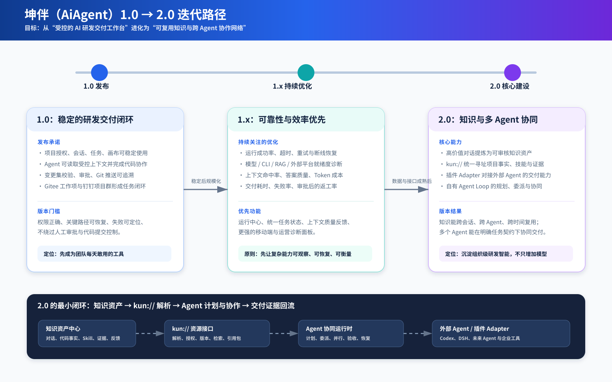

# 坤伴（AiAgent）1.0 → 2.0 迭代规划

> 规划日期：2026-09-10  
> 产品定位：从“受控的 AI 研发交付工作台”升级为“可复用知识与跨 Agent 协作网络”。



## 1. 版本定位

| 版本 | 产品承诺 | 不应被稀释的原则 |
| --- | --- | --- |
| 1.0 | 团队能把任务、会话、代码、审批、Git 与通知串成稳定的研发交付闭环。 | 项目授权、受控文件操作、变更集审批与交付指纹校验必须可靠。 |
| 1.x | 让 1.0 的复杂能力可观察、可恢复、可衡量，降低使用成本与运维风险。 | 先提升成功率、诊断能力、性能和移动端体验，再扩大自动化范围。 |
| 2.0 | 将高价值知识变为跨会话、跨 Agent、跨时间可解析和可复用的资产，并让多个 Agent 在明确契约下协同交付。 | 任何自动联想、外部 Agent 调用和知识写入都必须保留来源、权限、版本、证据和人工控制点。 |

## 2. 1.0 发布范围

1. **研发工作台**：项目授权、会话、知识/附件上下文、提示模板、工作画布与任务入口可持续使用。
2. **Agent 执行**：内置 Agent、Codex 本地代理与 DeepSeek Harness 的能力边界明确；流式过程、取消、失败原因可见。
3. **代码操作**：已登记仓库的状态、差异、拉取、运行、打包和受控改码可用；目录与文件访问严格限制在项目范围。
4. **交付治理**：Change Set 校验、具备 `CanCommitCode` 权限的人工审批、SHA-256 再校验、Git 提交推送和任务回写形成闭环。
5. **协作连接**：Gitee 工作项/Issue 与 CSV 工作项可进入项目会话；钉钉能接收项目 Git 推送消息，并保留推送审计。

### 1.0 的发布门槛

- 关键路径有明确成功、失败、超时和取消状态，前端不能只显示笼统的 HTTP 500。
- 授权、项目范围、文件路径与提交权限在后端统一复核，浏览器参数不能绕过。
- 变更集批准后文件发生变化，必须阻止直接交付并要求重新审批。
- 外部依赖不可用时提供可操作诊断：模型、Codex/DSH CLI、Python/RAG、Git、Gitee、钉钉和数据库。
- 数据、日志、附件和密钥不混入代码仓库；升级与回滚策略经过至少一次演练。

## 3. 1.x：持续关注与优化清单

### P0：可靠性与可观测性

- 建立统一“运行中心”：将聊天、代码打包、仓库养护、知识索引、钉钉出站/入站等后台过程统一为可查询运行记录。
- 每个运行记录至少包含 `run_id`、发起人、项目、执行器、阶段、开始/结束时间、可安全展示的错误码、重试次数与关联交付物。
- 对超时和网络中断区分“执行未开始、执行中但客户端离开、执行已完成但响应丢失”，避免用户误点重试产生重复副作用。
- 为 CLI、模型、RAG Worker、Gitee、钉钉和数据库提供无密钥健康检查与部署前就绪度报告。

### P0：交付质量与安全

- 持续强化变更集：展示 diff 摘要、检查结果、审批人、基线 commit、最终 commit 与回滚信息。
- 为自动拉取、推送、后台维护增加幂等键、审计事件和更准确的失败提示。
- 收敛 Agent 可执行工具的资源授予：每次运行只获得所选项目、仓库、文件、操作类型和有效期，而非长期宽泛权限。
- 增加附件、OCR 文本、外部 Issue 内容的“不可信输入”标记，防止它们改变工具权限或系统指令。

### P1：上下文与成本效果

- 记录每轮回答使用了哪些知识、项目文档、代码片段、记忆和模板，并显示命中来源。
- 评估“检索命中率、引用采纳率、回答修订率、每成功任务 Token 成本”，而不是只观察总 Token。
- 形成轻量评测集：典型代码问答、任务交接、Git 交付、画布协作四类场景分别验证。

### P1：体验与协作效率

- 工作画布保留用户上次阅读位置、面板状态、节点运行状态和来源关系；任务批量转会话不自动发送。
- 移动端以工作台抽屉和操作面板为主，确保聊天输入器、任务处理和审批不会被长内容撑破。
- 给管理员提供模型/项目/用户用量趋势、失败聚类和成本阈值提醒；给普通用户提供“为什么失败、下一步怎么做”的准确说明。

## 4. 2.0 核心：知识资产中心

2.0 的重点不是再接入更多模型，而是建立一个足够深的**知识资产模块**：调用方只需表达“我需要某项目的可靠代码事实/某用户的技能/某任务的经验”，模块内部完成检索、权限、版本选择、证据拼装、时效判断和引用记录。

### 4.1 高价值对话的提炼流程

1. 对话完成后，根据任务是否完成、是否产生代码变更、用户反馈、引用来源和重复使用价值生成“知识候选”。
2. 候选不是直接写入长期记忆，而是带上摘要、适用范围、事实/建议区分、来源消息、关联代码版本、置信度与过期策略。
3. 用户或项目维护者审核候选；通过后形成版本化知识资产，可被索引与引用。
4. 当仓库版本、接口、依赖或任务状态变化时，相关资产标记为“需复核”，而不是继续以旧事实参与自动联想。

建议最先沉淀四类资产：

- **代码事实**：模块职责、入口、数据流、约束、测试或构建命令，必须关联仓库、路径与 Git revision。
- **技能（Skill）**：可复用的处理方法、输入条件、步骤、风险、验收方式与适用项目范围。
- **交付经验**：特定问题的排查路径、最终补丁、验证结果与回滚经验。
- **业务知识**：词汇表、流程规则、接口契约与常见异常；区分“事实”与“推断”。

### 4.2 自动联想的安全做法

自动联想应是“提出可解释的建议”，而不是静默修改上下文或记忆：

- 在用户提问、任务导入、会话创建或 Agent 计划阶段，先按项目、路径、语言、任务类型、角色和时间范围检索候选资产。
- 返回推荐原因、来源、版本、置信度和权限结果；由用户或 Agent 计划显式选择加入。
- 当候选来自附件、外部 Issue 或低置信度总结时，标记为不可信/待验证，不能直接成为代码修改依据。
- 每次使用都记录“哪个会话、哪个 Agent、哪个资源版本、为何被选中”，以便纠错、评测与淘汰陈旧知识。

## 5. `kun://` 资源接口

用户提出的 `kun:/{project}/{code}`、`kun:/{user}/{skill}` 可演进为统一且可扩展的资源寻址接口。建议采用 `kun://` 作为规范写法，避免与普通文本或相对路径混淆；UI 可兼容输入简写 `kun:/...` 并规范化。

### 5.1 建议的 URI 语法

```text
kun://projects/{project-key}/code/{repository-key}/{path}?rev={git-revision}
kun://projects/{project-key}/knowledge/{asset-id}@{version}
kun://users/{user-id}/skills/{skill-key}@{version}
kun://tasks/{task-id}
kun://runs/{run-id}/evidence/{evidence-id}
```

示例：

```text
kun://projects/oms/code/oms-api/Services/OrderService.cs?rev=main
kun://users/zhang/skills/repository-release-check@3
kun://projects/oms/knowledge/order-status-contract@5
```

### 5.2 资源模块的接口契约

调用 Agent 或插件时，不应让其自行拼接文件路径、数据库查询或 Git 命令，而应调用少量稳定操作：

| 操作 | 返回内容 | 必须保证 |
| --- | --- | --- |
| `resolve(uri, actor)` | 资源元数据、类型、版本、权限结论、内容摘要或受控句柄 | URI 规范化、项目/用户授权、版本可复现。 |
| `search(scope, query)` | 候选资源及排序理由 | 只返回调用方可读的资源；结果带来源与置信度。 |
| `compose(refs, purpose)` | 适合模型使用的上下文包 | 预算裁剪、引用去重、不可信内容隔离、可追溯。 |
| `cite(ref)` | 人可读来源、版本、创建/失效状态 | 不能伪造来源；能定位到事实或原始证据。 |

`kun://` 是一个模块的**接口**，而不是向外暴露真实磁盘路径的协议。其内部实现可以先接现有项目、代码库、Markdown、知识库、记忆和任务实体，后续再接向量检索、图关系或外部知识源；调用方不必随实现变化而修改。

## 6. 插件与外部 Agent 交付

为避免每接一个 Agent 都把条件散落在聊天编排器中，2.0 应定义 `AgentConnector` Adapter 接缝。每个 Adapter 提供能力清单与统一事件投影：

| 能力字段 | 用途 |
| --- | --- |
| `supports_streaming` / `supports_cancel` | 决定前端和编排器如何处理过程与取消。 |
| `supports_images` / `supports_files` | 决定附件是否可传递，或是否需要经过 OCR/文本提取。 |
| `supports_tool_calls` / `supports_workspace_write` | 决定能否参与代码、交付或仅做分析。 |
| `accepted_kun_resource_types` | 声明可消费代码、Skill、知识、任务或证据中的哪些资源。 |
| `output_contract` | 要求返回结论、引用、修改摘要、验证结果、变更候选和失败原因。 |

最小交付要求：外部 Agent 只能收到通过 `kun://` 解析后的受控上下文包，输出必须被归一化为运行事件、证据和候选变更；真正的 Git 提交仍由坤伴的交付模块按既有审批规则执行。

## 7. 自有 Agent Loop 的多 Agent 协同

多 Agent 不是把同一问题同时发给多个模型，而是由一个协作运行时分配职责、约束资源和验证产物。

建议的最小角色集：

1. **Planner**：拆解目标、选择 `kun://` 资源、建立交付标准与预算。
2. **Researcher / Reader**：检索知识、读取代码事实，输出带引用的发现，不改文件。
3. **Implementer**：在被授予的仓库/文件范围内提出或执行补丁，并报告验证命令与结果。
4. **Reviewer / Verifier**：独立检查范围、差异、测试、风险和证据，不复用 Implementer 的结论作为唯一依据。
5. **Synthesizer**：汇总可交付结果，决定进入变更集、等待人工确认或回退给 Planner。

每个子任务必须是一份明确的任务契约：`目标、输入资源、允许操作、期望产物、验收标准、预算、超时、幂等键、父运行 ID`。多个 Agent 可并行读取或分析，但写工作区、创建交付物、调用外部副作用工具时需要独占声明或显式审批。

## 8. 推荐分期

| 阶段 | 交付物 | 验收重点 |
| --- | --- | --- |
| 2.0 Alpha | 知识候选、人工审核、代码事实资产；`kun://` 只读解析；资源引用展示 | 权限、版本、来源和失效策略正确，不自动污染长期记忆。 |
| 2.0 Beta | `AgentConnector` 能力清单；一个外部 Agent 经 Adapter 消费 `kun://` 上下文；统一运行/证据事件 | 外部 Agent 不可越权；断线、失败、取消和重试可追溯。 |
| 2.0 GA | Planner + Reader + Implementer + Verifier 的任务契约与协同；交付证据回流知识候选 | 多 Agent 结果可复现、冲突可解释、交付仍受现有审批和指纹校验约束。 |

## 9. 核心指标

- 知识：候选审核通过率、复用率、陈旧资产比例、引用覆盖率、错误关联反馈率。
- Agent：计划完成率、每类角色的成功率、并行节省时长、重复工具调用率、人工接管率。
- 交付：任务到变更集时长、验证通过率、审批后返工率、交付失败恢复时长。
- 成本：每个成功交付的 Token/CLI 时长、检索上下文长度、无效上下文占比。
- 安全：越权资源访问拦截数、未验证外部内容拦截数、审批/指纹阻断数。
