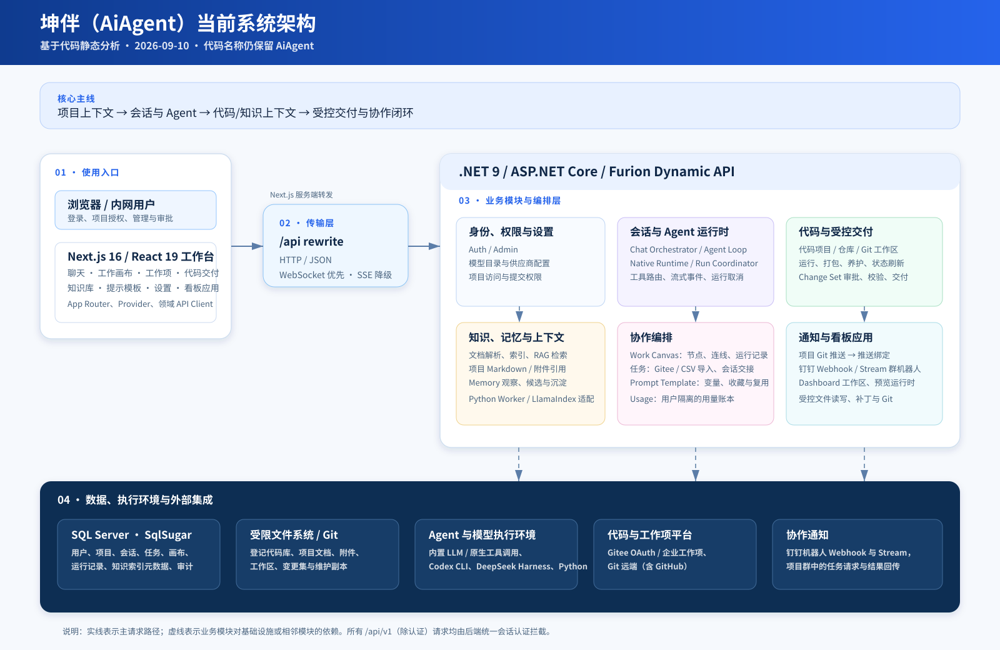
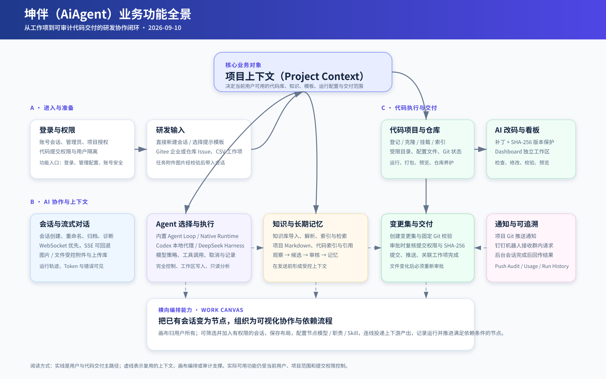

# 坤伴（AiAgent）架构与业务功能分析

> 分析日期：2026-09-10  
> 分析方式：基于当前 `front/`、`backed/`、`Entities/`、`Services/`、API 路由与现有项目说明的静态代码梳理。  
> 产品名称：界面对外使用“坤伴”；代码目录、命名空间和部分配置仍沿用 `AiAgent`。

## 1. 结论摘要

坤伴不是单纯的 AI 聊天页面，而是一个以**项目上下文**为中心的研发协作工作台：用户在授权项目范围内创建或承接会话，组合代码库、知识库、项目文档、附件和模型能力；AI 完成分析或改码后，通过变更集审批、Git 推送、工作项回写和钉钉通知形成可追溯闭环。

当前实现已经具备四条可独立使用、又能互相衔接的主链路：

1. **会话与 Agent 链路**：普通内置 Agent、Codex 本地代理、DeepSeek Harness 都由聊天编排入口接入，并以 WebSocket 为主、SSE 为回退输出过程事件。
2. **代码到交付链路**：项目可管理多个受限代码仓库，支持运行、打包、Git 状态与推送；正式代码交付通过“变更集 → 校验 → 有权限人员审批 → 再校验指纹 → 提交推送”执行。
3. **任务到会话链路**：本地任务、Gitee 企业工作项 / 仓库 Issue、CSV 导入均可关联 AiAgent 项目，再创建带文字与图片附件的草稿会话。
4. **协作编排链路**：工作画布只引用当前用户有权访问的会话，利用节点、连线、投递、运行记录和依赖推进，把多个会话组织成可观察的流程。

## 2. 系统边界与总体架构

### 2.1 分层视图

| 层次 | 当前实现 | 职责与边界 |
| --- | --- | --- |
| 浏览器工作台 | `front/`，Next.js 16、React 19、TypeScript、Tailwind | 提供聊天、工作画布、任务、知识库、代码管理、交付、设置等界面；复杂状态集中在 Provider 或领域组件。 |
| 同源访问层 | `front/next.config.js` 的 `/api/:path*` rewrite | 浏览器始终请求前端同源 `/api/*`，Next.js 服务端将请求转发给 `NEXT_PUBLIC_AIAGENT_API_BASE_URL` 指定的后端。 |
| 应用与协议层 | `backed/`，ASP.NET Core、Furion Dynamic API | `*AppService.cs` 承接 HTTP 协议；统一登录拦截、Swagger、CORS、WebSocket 映射与依赖注入。 |
| 领域与编排层 | `backed/Services/` | 承担权限校验、项目边界、Agent 编排、受控文件/进程/Git 操作、任务、画布、知识、消息推送等业务。 |
| 数据与执行层 | SQL Server / SqlSugar、受限文件系统、Git、CLI、Python Worker | 保存业务元数据；在服务端允许根目录内操作项目文件与 Git；调用模型、CLI、RAG/解析工具。 |
| 外部协作平台 | Gitee、Git 远端（含 GitHub）、钉钉、模型供应商 | Gitee OAuth 与工作项读取、Git 远端交付、群消息通知与回调、模型/嵌入能力。 |

### 2.2 架构图阅读说明

- 实线是浏览器到后端，以及任务到交付的主请求流。
- 虚线表示领域模块对数据库、文件系统、CLI 或外部平台的依赖。
- 所有 `/api/v1/*`（认证路由除外）均经过后端的当前用户校验；项目相关操作再通过 `IProjectAccessService` 限制到用户被授权的项目。
- 代码库路径、附件和工作区不是由浏览器自由传入的本地路径，而是由后端在允许根目录与已登记对象内解析。

### 2.3 后端启动与基础设施

`backed/Program.cs` 只承担组合职责：注册服务与 Hosted Service、配置 SQL Server `SqlSugarScope`、执行 CodeFirst 初始化、确保首个管理员存在、启用 Swagger/CORS/认证中间件，并映射以下实时通道：

- `/api/v1/chat/ws`：聊天流式事件；
- `/api/v1/knowledge/ws`：知识库索引进度；
- `/api/v1/code-repositories/clone/ws`：克隆过程；
- `/api/v1/code-repositories/package/ws`：打包过程。

这使长耗时任务不必由普通 HTTP 请求一直占用等待，也给前端提供了过程日志与终态结果的区分。

## 3. 核心领域模块

| 模块 | 后端主要位置 | 前端入口 / 客户端 | 核心职责 |
| --- | --- | --- | --- |
| 身份、账户与授权 | `Services/Auth`、`Services/Admin` | `/login`、设置管理页；`auth-api.ts`、`admin-api.ts` | 登录会话、初始管理员、用户启停、密码重置、项目授权、代码提交权限、审计查询。 |
| 模型与 Agent 配置 | `Services/Settings`、`Services/Chat/AgentProviderAppService.cs` | 设置页；`agent-provider-api.ts` | 管理模型供应商、Profile、模型目录和运行策略。 |
| 聊天与会话 | `Services/Chat` | `/chat`、`ChatStreamProvider.tsx`；`chat-api.ts`、`session-api.ts` | 会话生命周期、普通/流式回答、附件上传与引用、运行诊断、实时事件显示。 |
| Agent 运行时 | `Services/AgentRuntime`、`Services/Chat/Agentic` | 聊天工具栏、运行轨迹、画布节点 | 内置 Agent Loop 的兼容桥接、原生运行时、工具声明/执行、运行存储、取消和事件投影。 |
| 项目与代码库 | `Services/CodeRepository`、`Services/Git` | 设置中的代码项目；聊天运行工具栏；`code-repository-*.ts`、`code-runtime-*.ts` | 项目、仓库、运行配置、允许编辑文件、克隆、索引、运行、打包、Git 状态/拉取/推送。 |
| 代码交付 | `Services/CodeDelivery` | `/deliveries`；`code-delivery-api.ts` | 将当前工作区修改固化为变更集，校验、审批、交付并回写关联任务。 |
| 知识、RAG 与记忆 | `Services/Knowledge`、`Services/Rag`、`Services/Parsing`、`Services/Memory` | `/knowledge`；`knowledge-api.ts` | 文档上传/解析/索引/检索，项目 Markdown 上下文，记忆观察、候选、审核与提示词拼装。 |
| 工作项 | `Services/Task` | `/tasks`；`project-task-api.ts` | 本地任务 CRUD、CSV 导入、Gitee 企业/仓库 Issue 浏览与关联、附件安全下载、批量创建草稿会话。 |
| 工作画布 | `Services/WorkCanvas` | `/work-canvas`；`work-canvas-api.ts` | 多画布、会话节点、布局、投递连线、流程连线、运行记录、依赖完成推进。 |
| 推送与群机器人 | `Services/Push` | 管理设置；`push-api.ts` | 项目与推送渠道绑定、Git 推送通知、钉钉 Webhook、Stream 群消息接收及会话结果回传。 |
| 看板应用 | `Services/DashboardApp` | `/dashboard-applications`；`dashboard-application-api.ts` | 从模板/仓库创建独立工作区，受控读写文件、补丁、校验、预览运行和 Git。 |
| 提示模板与用量 | `Services/PromptTemplate`、`Services/Usage` | `/prompt-templates`、设置统计 | 模板变量、点赞收藏与复用；按用户/代理/模型/日期的 Token 账本与趋势。 |

## 4. Agent 会话与运行时

### 4.1 统一入口，分流执行

`ChatOrchestrator` 是聊天请求的主要接缝：它把请求转为 Agent 上下文并根据 `agent` 选择执行路径。

| 选择 | 当前执行路径 | 适用说明 |
| --- | --- | --- |
| 未指定外部 Agent | `AgentLoop`，或在启用 `AgentRuntime:NativeEnabled` 时经 `RunCoordinator → NativeAgentRuntime` | 内置模型、检索、工具调用和运行事件的默认路径。 |
| `codex` | `CodexChatService` | 服务端启动/复用本机 Codex app-server；图片以受控附件转换为 `localImage`，权限模式由后端白名单映射。 |
| `deepseek-harness` | `DshChatService` | 对接 DeepSeek Harness JSON-RPC CLI。 |
| `codebuddy` | 当前明确拒绝执行 | CLI 被识别，但 app-server 协议尚未完成适配，避免假成功。 |

内部运行时采用 `RuntimeRequestFactory` 将会话、模型、知识库、代码仓库、看板文件、记忆、项目 Markdown 和附件拼为一次 `RuntimeTurnRequest`。`RunCoordinator` 提供运行快照与取消；`RuntimeEventProjector` 将运行时事件投影回前端可显示的聊天流事件。

### 4.2 上下文与安全边界

- 项目上下文决定候选代码库、知识库、模板和可操作范围，不只是一个前端筛选条件。
- 图片/文件先上传为不透明附件 ID，后端校验签名、大小、数量、用户归属后才引用；不接受浏览器提交任意本机路径。
- Codex 的执行模式只允许 `full-access`、`workspace-write`、`read-only` 三种服务端值；完全控制才映射到 `--dangerously-bypass-approvals-and-sandbox`。
- 所有任务、会话、画布和交付操作都应先确认当前用户和项目访问权；画布引用会话而不复制会话消息，也不扩大并发配额。

## 5. 业务功能全景与闭环

### 5.1 从工作项到会话

1. 用户在任务面板创建本地任务、导入 CSV，或从 Gitee 企业工作项/仓库 Issue 中选择条目。
2. 工作项必须关联到用户有权限的 AiAgent 项目；任务正文与可下载的 Gitee 图片被整理为会话输入。
3. 后端对图片来源、HTTPS 地址、大小及类型进行控制下载，形成受控聊天附件。
4. 单个任务可创建交接会话；批量任务可创建多个**默认不触发**的草稿会话，供用户先检查模型、项目和输入后再发送。

### 5.2 从会话到代码变更

1. 用户选择项目、上下文来源、模型/Agent 与权限模式，开始会话。
2. Agent 可检索知识、读取已授权代码库或 Markdown、使用受控工具，并将过程事件回传到界面。
3. 对代码修改，系统要求以 SHA-256 保护的补丁或受控文件编辑写入真实工作区；看板应用则写入独立 Dashboard 工作区。
4. 用户可在项目级别查看 Git 状态、差异、运行和打包结果。仓库养护会在独立副本内分析/优化/验证，再形成维护分支上的候选变更。

### 5.3 从变更到远端交付

代码交付是独立于聊天的深模块，其外部接口是“创建、校验、审批、交付”，将复杂的 Git 状态、权限与指纹校验隐藏在 `CodeDelivery` 内部：

1. 根据项目（可关联任务）创建 `AiCodeChangeSet`。
2. 执行固定 Git 校验并生成摘要。
3. 只有 `CanCommitCode = true` 的人员才能审批；审批时保存验证快照。
4. 交付前再次比较工作区 SHA-256 指纹，若文件已改变则要求重新创建和审批变更集。
5. 校验通过后提交并推送 Git，关联工作项可回写完成状态。

### 5.4 工作画布的协作价值

工作画布不是另一个聊天记录页，而是面向多会话协作的可视化编排层：

- 一个画布属于一个用户，列表和快照均按用户隔离；
- 节点指向已有会话，可保存坐标、模型预设、Agent 职责与手工 Skill；
- **投递关系**将上游最近产出作为下游的有边界输入；
- **流程关系**维护上游依赖、运行批次和节点完成状态，根节点完成后可推进依赖已满足的下游节点；
- 前端将节点、实时运行状态和会话检查器组合在同一页面，支持双击打开会话、布局保存与最近阅读位置恢复。

### 5.5 钉钉推送与群内请求

推送域由推送渠道、项目绑定、Outbox 消息和审计实体组成，分为两个方向：

- **出站通知**：项目 Git 推送成功后，按项目绑定找到对应钉钉渠道并发送消息；结果记录在 Push Audit 中。
- **入站群助手**：钉钉 Stream 接收群内机器人消息，定位项目绑定并在后台创建/使用会话执行请求，最终通过群 Webhook 回传结果。

## 6. 关键数据对象与关系

| 业务对象 | 对应实体 | 主要关联 |
| --- | --- | --- |
| 用户与授权 | `AiUser`、`AiUserSession`、`AiUserCodeProject` | 用户与会话、项目访问权、提交权限。 |
| 项目与代码 | `AiCodeProject`、`AiCodeRepository`、`AiCodeRepositoryFile`、`AiCodeRepositoryRunProfile` | 一个项目可登记多个代码仓库、可编辑文件和运行配置。 |
| 会话与运行 | `AiChatSession`、`AiChatMessage`、`AiAgentRun`、`AiAgentRunEvent`、`AiAgentToolClaim` | 会话保留消息；一次运行保留事件、工具领取与终态。 |
| 知识与记忆 | `AiKnowledgeBase`、`AiKnowledgeDocument`、`AiKnowledgeChunk`、`AiMemoryItem` 等 | 文档与索引版本、检索内容和用户/项目记忆。 |
| 任务与交付 | `AiProjectTask`、`AiCodeChangeSet` | 工作项可关联项目与交付变更集。 |
| 工作画布 | `AiWorkCanvas`、`AiWorkCanvasNode`、`AiWorkCanvasEdge`、`AiWorkCanvasRun`、`AiCanvasDelivery` | 画布布局、会话节点、投递/流程边和执行历史。 |
| 推送 | `AiPushChannel`、`AiProjectPushBinding`、`AiPushOutboxMessage`、`AiPushAuditLog`、`AiDingTalkGroupAgentSession` | 项目通知绑定、可靠投递、群内会话映射与审计。 |

## 7. 当前模块接缝与演进建议

以下建议基于现有模块接缝提出，不改变当前功能结论。

| 方向 | 现状观察 | 建议的下一步 |
| --- | --- | --- |
| Agent 执行内核 | `ChatOrchestrator` 已隔离内置、Codex 与 DSH；Native Runtime 仍保留对 Legacy `AgentLoop` 的桥接。 | 继续以 `IRuntimeEngine` / `RuntimeTurnRequest` 为稳定接口，把具体工具循环逐步下沉到原生运行时；保持外部聊天契约不变。 |
| 异步任务可观测性 | 聊天、知识库、克隆、打包已有 WebSocket 过程事件；推送、维护和后台任务分别有 Hosted Service。 | 统一后台任务的运行 ID、终态、重试原因与前端状态展示，便于从画布和管理页一处追踪。 |
| 交付闭环 | 变更集已经通过权限与 SHA-256 再校验防止“审批后内容变化”。 | 将任务、会话、Agent Run、Change Set、Git commit 和推送审计串为可点击的同一条交付时间线。 |
| 画布与任务协作 | 已能把批量任务转为草稿会话，并把会话加入画布。 | 增加“任务 → 草稿会话 → 画布节点 → 变更集”的可视化来源关系，避免用户在多入口间丢失上下文。 |
| 外部 Agent 适配 | Codex 和 DSH 已有专用实现，CodeBuddy 明确处于未兼容状态。 | 为每个外部 Agent 设立能力描述（流式、图片、工具、取消、沙箱）与健康检查，前端据此隐藏不支持的选项。 |
| 部署配置 | 前端 rewrite、后端 CORS、CLI/Python 与外部平台均由部署配置决定。 | 将健康检查输出为不含密钥的“就绪度报告”，分别显示数据库、CLI、RAG Worker、Gitee、钉钉和模型可用性。 |

## 8. 代码证据索引

| 主题 | 关键文件 |
| --- | --- |
| 应用启动、认证、WebSocket、数据库注册 | `backed/Program.cs` |
| 前端 API 代理 | `front/next.config.js` |
| 会话到 Agent 的分流编排 | `backed/Services/Chat/ChatOrchestrator.cs` |
| 原生运行时与事件投影 | `backed/Services/AgentRuntime/NativeAgentRuntime.cs`、`RunCoordinator.cs`、`RuntimeContracts.cs` |
| 工作画布 API 与领域实现 | `backed/Services/WorkCanvas/WorkCanvasAppService.cs`、`WorkCanvasService.cs`、`front/components/work-canvas/WorkCanvasPage.tsx` |
| 任务、Gitee 工作项与会话交接 | `backed/Services/Task/ProjectTaskAppService.cs`、`front/components/tasks/TaskBoardPageV2.tsx` |
| 代码仓库与 Git | `backed/Services/CodeRepository/*`、`backed/Services/Git/CodeRepositoryGitService.cs` |
| 变更集交付 | `backed/Services/CodeDelivery/CodeDeliveryAppService.cs` |
| 知识/RAG/记忆 | `backed/Services/Knowledge/*`、`Services/Rag/*`、`Services/Memory/*` |
| 钉钉与项目推送 | `backed/Services/Push/DingTalkStreamGroupAgentService.cs`、`ProjectPushService.cs` |

## 9. 维护说明

- 图中的技术与能力仅描述仓库当前已存在的实现；外部平台是否可用仍取决于部署环境中的账户、网络、CLI 和密钥配置。
- 任何新增实体字段继续遵循 `AGENTS.md`：默认显式标记 `[SugarColumn(IsNullable = true)]`，在完成迁移与回填验收前不引入新的非空数据库列。
- 文档不包含真实地址、用户、令牌、连接串或本地目录。部署参数请使用示例配置、环境变量或受控密钥存储。
