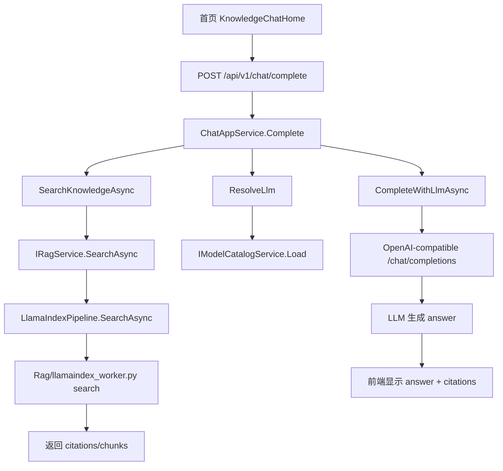

# 首页聊天服务与知识库问答流程

## 这次为什么要改

之前首页直接调用知识库 `search` 接口，把召回的 chunk 拼成 `answer` 展示。这个只能说明“检索到了哪些片段”，不能真正回答“这本书主要讲了什么”这类需要归纳的问题。

现在改成独立 Chat 服务：

1. 前端只调用聊天接口。
2. 聊天接口先按需检索知识库。
3. 检索片段作为上下文交给当前配置好的 LLM。
4. LLM 生成自然回答。
5. 前端展示回答，并把引用片段作为证据显示在下方。

## 参考 DeepTutor loop.py 的设计点

`DeepTutor/deeptutor/core/agentic/loop.py` 的核心思想是“编排器”和“能力实现”分离：

- `run_agentic_loop` 负责一轮或多轮调度。
- `LoopHost` 负责具体能力，比如工具调用、最终输出、上下文修剪。
- LLM 不是直接返回工具结果，而是根据协议、工具结果和上下文生成最终文本。

AiAgent 当前先落一个简化版：

- `ChatAppService` 是聊天编排器。
- `IRagService` 是知识库工具。
- 模型 catalog 是 LLM 配置来源。
- 后续可以继续扩展成 tool calling、streaming、memory、附件解析和可视化工具。

## 当前调用链

## 后端文件

- `AiAgent/backed/Dtos/Chat/ChatDtos.cs`
  - `ChatCompleteRequest`：用户消息、知识库名称、模型 Id、top_k、mode。
  - `ChatCompleteResponse`：LLM 回答、模型信息、知识库名称、引用片段。

- `AiAgent/backed/Services/Chat/ChatAppService.cs`
  - `Complete`：聊天入口。
  - `SearchKnowledgeAsync`：读取知识库激活版本，并调用 RAG 检索。
  - `ResolveLlm`：读取当前激活的 LLM profile/model。
  - `CompleteWithLlmAsync`：调用当前配置的 `/chat/completions`。
  - `BuildSystemPrompt` / `BuildUserPrompt`：把检索片段组织成模型可理解的上下文。

## 前端文件

- `AiAgent/front/lib/chat-api.ts`
  - 封装 `completeChat`，请求 `/api/v1/chat/complete`。

- `AiAgent/front/components/chat/KnowledgeChatHome.tsx`
  - 首页聊天窗。
  - 左侧：聊天模式选择、附件按钮。
  - 右侧：知识库选择、模型选择、语音按钮、发送按钮。
  - 提交时调用 Chat 服务，不再直接调用知识库 search。

- `AiAgent/front/i18n/dictionaries.ts`
  - 增加聊天输入框、模式、附件、语音、模型选择等中英文文案。

## 当前边界

已完成：

- 独立 Chat API。
- 知识库检索 + LLM 生成。
- 前端模型切换入口。
- DeepTutor 风格输入框工具栏。
- 引用片段保留为证据，不再直接当答案。

预留：

- Memory：后续可在 `ChatAppService.Complete` 前后注入长期记忆。
- 附件：前端入口已留，后续可先上传附件再作为临时上下文。
- 语音输入：按钮已留，后续接 STT 服务。
- 可视化：mode 已传到后端，后续可扩展图谱、表格、思维导图工具。
- 流式输出：当前是普通 HTTP 响应，后续可接 SSE/WebSocket。
