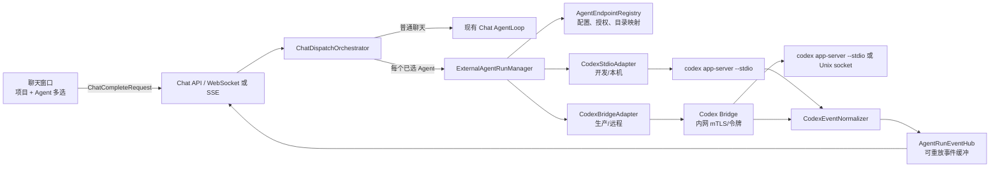

# Codex 第三方 Agent 联动规格

> 状态：第一阶段已实施（本机 `stdio` 接管）；远程 Bridge、多端点配置、审批与事件持久化待后续实施。  
> 范围：AiAgent 聊天窗口可选择一个或多个外部 Agent；首个实现为 Codex。用户选择代码项目后，系统将问题和受控工作目录交给 Agent，并把进度、回答、改动与完成结果实时回传到当前聊天窗口。

## 1. 目标、边界与术语

### 1.1 目标

在 `AiAgent` 的聊天输入区增加“代理 Agent”多选能力。发送问题时，系统基于当前选择的代码项目确定工作目录，将用户问题派发给已选择的 Agent。第一期交付以下能力：

1. 在项目聊天中选择 `Codex` 代理，且只能选择已启用、对当前项目有授权的代理。
2. 开发环境可由后端本机启动 `codex app-server --stdio`；生产环境可调用部署在 Codex 所在主机的受控 Bridge。
3. 将 Codex 的文本增量、计划、工具/命令进度、文件变更、审批请求、错误和最终状态实时转为现有聊天流事件。
4. 在聊天消息中明确显示“是否完成”“是否修改成功”“哪些文件已修改/未修改”，不以模型自然语言中的“已完成”作为唯一判定。
5. 配置模型对其他第三方 Agent 通用；Codex 只是第一种 `provider_kind` 适配器。

### 1.2 非目标

- 本期不把 AiAgent 的现有 RAG `AgentLoop` 与 Codex 的内部 Agent Loop 合并；两者是独立执行器。
- 本期不允许浏览器直接连接 Codex、直接传递服务器绝对路径，或直接持有 Agent 密钥。
- 本期不实现多 Agent 之间自动辩论、自动合并补丁或跨 Agent 写同一工作区。
- 不依赖 Codex `--listen ws://...` 作为生产公网协议：该传输在当前 Codex 文档中仍是 experimental/unsupported。

### 1.3 术语

| 术语 | 含义 |
| --- | --- |
| 代码项目 | 现有 `AiCodeProject`，聊天选择的工作范围；包含一个或多个已登记代码库。 |
| 工作区映射 | 某个 Agent 节点能访问的、与代码项目对应的绝对目录。 |
| Agent 端点 | 可配置的第三方 Agent 实例，例如本机 Codex 或远程 Codex Bridge。 |
| Agent 运行（Run） | 一次用户消息向某个 Agent 发起的一次独立执行。 |
| Codex 线程 / 轮次 | Codex app-server 的 `thread` / `turn`；一个 AiAgent 会话可按端点关联一个 Codex 线程。 |
| Bridge | 部署在 Codex 主机上的小型受控服务：只向 AiAgent 后端暴露稳定的认证 API，内部通过 stdio 或 Unix socket 对接本机 Codex app-server。 |

## 2. 现有基础与设计依据

| 现有能力 | 复用方式 |
| --- | --- |
| `front/components/chat/KnowledgeChatHome.tsx` | 已有项目选择器和单条助手消息的流式就地更新；在同一输入上下文加入 Agent 多选和运行状态。 |
| `front/lib/chat-api.ts` | 已实现 WebSocket 优先、SSE 降级及统一 `ChatStreamEvent` reducer；扩展事件类型，不新增浏览器到 Agent 的连接。 |
| `ChatWebSocketHandler` / `ChatAppService` | 保持 AiAgent 浏览器通道不变，负责把后端 Agent 运行事件扇出给浏览器。 |
| `AiCodeProject` 与 `CodeProject.repositories` | 当前 `code_project_id` 已定义项目范围；Agent 目录必须由它解析，不接受客户端传入的裸路径。 |
| `CodeRepositoryPackageWebSocketHandler` / `CodeRuntimeManager` | 借鉴受控进程启动、UTF-8 输出泵送、状态机与 WebSocket 事件实现。 |
| `RegisteredRepositoryFileWorkspace` | 复用“相对路径 + 根目录包含关系”安全校验原则。 |

Codex 使用 `app-server` 作为富客户端接口：连接先 `initialize`，再 `thread/start` 或 `thread/resume`、`turn/start`；随后读取 `item/*` 通知，最终以 `turn/completed` 给出 `completed`、`interrupted` 或 `failed`。文件变更应以 `item/completed` 的 `fileChange.status` 和 `turn/diff/updated` 为准，而不是只解析最终回答文本。协议 schema 必须由部署节点上同版本的 `codex app-server generate-json-schema` 生成并在适配器契约测试中校验。

## 3. 总体架构



### 3.1 调度规则

1. 客户端提交现有聊天请求，并新增 `selected_agent_endpoint_ids`；`code_project_id` 是外部 Agent 的必填条件。
2. 后端先校验会话所属用户、项目存在性、所选端点已启用、端点对该项目有授权，以及该端点上存在工作区映射。
3. 若没有选择外部 Agent，保持现有 `ChatOrchestrator` 行为不变。
4. 若选择一个或多个外部 Agent，为每个端点创建独立 `AgentRun`。同一代码项目同一端点同一时间只允许一个写入型 Run；只读 Run 可并行。
5. 第一阶段的 UI 可以同时显示“AiAgent”和“Codex”两条助手消息；不得把来自不同 Agent 的增量拼接进同一个 `content` 字段。
6. 一个 Run 失败、超时或被取消不应中断其他 Agent；聊天总请求仅在所有子运行到达终态后发送聚合 `done`。

### 3.2 工作区与目录映射

`AiCodeProject` 的 `root_path` 仅代表 AiAgent 后端可见路径，远程 Codex 主机未必使用相同盘符或目录。新增显式映射，禁止以字符串替换猜测路径：

| 端点类型 | `workspace_path` 含义 | 例子 |
| --- | --- | --- |
| `codex_stdio` | AiAgent 后端本机的绝对目录，必须位于已登记代码库根目录内 | `E:\\项目\\know-why\\AiAgent` |
| `codex_bridge` | Codex Bridge 所在主机的绝对目录，由 Bridge 启动检查 | `/srv/workspaces/aiagent` |

发送时仅传递后端解析出的 `workspace_path` 给适配器；浏览器只得到项目显示名、端点显示名、相对文件路径和脱敏状态。

## 4. 配置与持久化模型

### 4.1 实体

新增下列 SqlSugar 实体和 CodeFirst / SQL Server 初始化脚本。密钥不落入普通 JSON 字段、日志、聊天消息或 API 响应。

| 实体 | 关键字段 | 说明 |
| --- | --- | --- |
| `AiAgentEndpoint` | `Id`, `Name`, `ProviderKind`, `TransportKind`, `BaseUrl`, `Enabled`, `DefaultExecutionMode`, `ConfigJson`, `SecretRef`, `MaxConcurrentRuns` | Agent 实例。`ProviderKind` 首值 `codex_app_server`；`TransportKind` 为 `local_stdio` 或 `bridge_https`。 |
| `AiAgentProjectBinding` | `Id`, `AgentEndpointId`, `CodeProjectId`, `WorkspacePath`, `Enabled`, `AllowRead`, `AllowWrite`, `DefaultApprovalMode` | 端点对项目的授权及工作区映射。`WorkspacePath` 是端点可见路径。 |
| `AiExternalAgentRun` | `Id`, `SessionId`, `UserId`, `AgentEndpointId`, `CodeProjectId`, `Mode`, `Status`, `ExternalThreadId`, `ExternalTurnId`, `StartedAt`, `CompletedAt`, `FinalSummary`, `ErrorCode` | 每次外部 Agent 执行的主记录。 |
| `AiExternalAgentRunEvent` | `Id`, `RunId`, `Sequence`, `Type`, `PayloadJson`, `CreatedAt` | 可重放的规范化流事件；默认仅保留 7 天，清理任务可配置。 |
| `AiExternalAgentFileChange` | `Id`, `RunId`, `RelativePath`, `ChangeType`, `Status`, `UnifiedDiff`, `AppliedAt` | 从 Codex `fileChange` / `turn/diff/updated` 提取的变更审计。 |
| `AiExternalAgentApproval` | `Id`, `RunId`, `ExternalRequestId`, `Kind`, `PayloadJson`, `Status`, `RequestedAt`, `ResolvedAt` | 命令、文件变更等需要用户确认时的待办。 |

`ConfigJson` 仅保存非敏感字段，例如 `codex_command`、模型、超时、最大输出、Bridge TLS 公钥 ID；认证令牌、客户端私钥、Codex 登录态只通过 `SecretRef` 引用受保护的密钥存储。设置 API 对读取结果只返回 `has_secret`，不返回原文。

### 4.2 推荐初始配置

```json
{
  "name": "本机 Codex（开发）",
  "provider_kind": "codex_app_server",
  "transport_kind": "local_stdio",
  "enabled": true,
  "default_execution_mode": "read_only",
  "config": {
    "codex_command": "codex",
    "model": null,
    "reasoning_effort": "medium",
    "run_timeout_seconds": 1800,
    "idle_timeout_seconds": 120,
    "max_event_bytes": 262144
  }
}
```

生产端点使用 `bridge_https`；Bridge URL 只能是 HTTPS 内网域名或允许名单地址，要求 mTLS 或短期服务令牌。不要将 Codex app-server 的实验性 `ws://IP:PORT` 监听端口暴露给浏览器、DMZ 或公网。

## 5. 前端交互规格

### 5.1 输入区与选择器

在现有“知识库 / 项目 / 模型”上下文选择器旁新增“代理 Agent”多选菜单：

- 条目显示端点名称、提供商（Codex）、连接状态、允许模式（只读/可改）和不可用原因。
- 未选项目时，所有需要工作区的 Agent 禁用，并显示“请先选择项目”。
- 已选项目但无工作区映射时，端点禁用并显示“该 Agent 未配置此项目目录”。
- 切换项目时，自动移除对新项目无授权的端点；不静默保留。
- 首期可选择多个端点，但同一端点只能选一次；前端将选择顺序作为展示顺序，后端不以顺序表达权限优先级。
- 发送按钮在至少有“普通聊天”或一个有效 Agent 时可用；有无效选择时给出可操作错误。

### 5.2 消息与状态呈现

每个外部 Run 渲染为一张独立的助手消息卡，头部显示 `Codex · 端点名 · 项目名`。正文可实时追加最终文本；下方使用可折叠追踪区显示计划、执行命令摘要、文件变更和错误。

| Run 状态 | UI 文案 | 终态判据 |
| --- | --- | --- |
| `queued` | 等待派发 | 创建了 Run，尚未开始调用端点。 |
| `starting` / `running` | Codex 正在分析/执行 | 收到 `turn/started` 或任一 Item 事件。 |
| `waiting_approval` | 等待你确认文件或命令操作 | 收到 Codex approval request，未决。 |
| `completed_no_change` | 已完成，未检测到文件修改 | `turn.status=completed` 且无 `fileChange.status=completed`。 |
| `completed_changed` | 已完成，已修改 N 个文件 | `turn.status=completed` 且至少一个完成的文件变更。 |
| `partial_failed` | 已结束，部分操作失败 | `turn.status=completed` 但存在失败/拒绝的文件或命令 Item。 |
| `failed` / `cancelled` / `timed_out` | 失败 / 已取消 / 超时 | 对应终态，不得显示为“修改完成”。 |

“修改完成”徽章只在 `completed_changed` 时显示。`completed_no_change` 只能显示“任务完成，未改文件”；自然语言回答中的任何结论仅作说明。

### 5.3 审批与取消

- `read_only` 模式：后端一律拒绝写文件、执行高风险命令和越界权限请求，并将拒绝原因回传到追踪区。
- `ask_before_write` 模式：收到 `item/fileChange/requestApproval` 时在当前 Run 卡片显示 diff 摘要、相对路径以及“允许本次 / 拒绝”；不自动接受。
- `workspace_write` 模式：只允许预先绑定的工作区路径。命令仍遵循端点审批策略，网络/额外目录等扩权需要单独确认。
- 用户点击停止时调用 Run 取消接口；适配器向 Codex 发 `turn/interrupt`，直到收到 `turn/completed(status=interrupted)` 后才显示“已取消”。

## 6. AiAgent API 与统一事件协议

### 6.1 请求扩展

在现有 `ChatCompleteRequest`、`front/lib/chat-api.ts` 与会话偏好序列化中同步增加：

```json
{
  "code_project_id": 12,
  "selected_agent_endpoint_ids": [3],
  "agent_execution_mode": "ask_before_write"
}
```

`agent_execution_mode` 只能收紧、不能突破 `AiAgentProjectBinding` 的允许范围。后端忽略客户端提交的路径、命令、sandbox、approval policy 等高权限字段。

### 6.2 新增 REST API

| 方法 | 路径 | 用途 |
| --- | --- | --- |
| `GET` | `/api/v1/agent-endpoints/available?project_id={id}` | 获取当前用户、当前项目可选的脱敏端点。 |
| `GET` | `/api/v1/agent-endpoints` | 设置页端点列表。 |
| `POST` | `/api/v1/agent-endpoints` | 新建端点。 |
| `PUT` | `/api/v1/agent-endpoints/{id}` | 更新端点及非敏感配置。 |
| `POST` | `/api/v1/agent-endpoints/{id}/diagnose` | 测试连接、初始化和版本/schema 兼容性；不启动 Agent 轮次。 |
| `PUT` | `/api/v1/agent-endpoints/{id}/project-bindings/{projectId}` | 保存项目目录映射与权限。 |
| `GET` | `/api/v1/agent-runs/{runId}` | 获取 Run 状态、摘要、文件改动及审批状态。 |
| `GET` | `/api/v1/agent-runs/{runId}/events?after={sequence}` | WebSocket 断线后的事件补拉。 |
| `POST` | `/api/v1/agent-runs/{runId}/cancel` | 请求中断执行。 |
| `POST` | `/api/v1/agent-runs/{runId}/approvals/{approvalId}` | 提交 `accept`、`decline` 或 `cancel`。 |

### 6.3 统一流事件扩展

保留现有 `content`、`thinking`、`tool`、`tool_result`、`done`、`error`。为避免与内部 `AgentLoop` 混淆，外部事件增加 `run_id`、`agent_endpoint_id` 与 `origin: "external_agent"`。

```json
{
  "type": "agent_file_change",
  "origin": "external_agent",
  "run_id": "ar_...",
  "agent_endpoint_id": 3,
  "sequence": 27,
  "content": "更新 Services/Chat/ChatAppService.cs",
  "metadata": {
    "path": "Services/Chat/ChatAppService.cs",
    "change_type": "update",
    "status": "completed"
  }
}
```

新增类型：`agent_run_started`、`agent_text_delta`、`agent_plan`、`agent_item_started`、`agent_command_output`、`agent_file_change`、`agent_diff_updated`、`agent_approval_required`、`agent_approval_resolved`、`agent_run_completed`、`agent_run_error`。前端 reducer 按 `run_id` 更新对应消息；事件按 `sequence` 去重，网络重连后调用补拉接口恢复。

## 7. Codex 适配器规格

### 7.1 抽象接口

新增 `backed/Services/ExternalAgents`，核心接口保持供应商无关：

```csharp
public interface IExternalAgentAdapter
{
    string ProviderKind { get; }
    Task<AgentEndpointDiagnostic> DiagnoseAsync(AgentEndpoint endpoint, CancellationToken cancellationToken);
    Task<ExternalAgentRunStart> StartAsync(ExternalAgentRunContext context, IProgress<ExternalAgentEvent> events, CancellationToken cancellationToken);
    Task ResolveApprovalAsync(ExternalAgentApprovalDecision decision, CancellationToken cancellationToken);
    Task CancelAsync(ExternalAgentRunHandle handle, CancellationToken cancellationToken);
}
```

实现 `CodexAppServerAdapter`，内部按 `TransportKind` 使用 `CodexStdioClient` 或 `CodexBridgeClient`。`ExternalAgentRunManager` 负责状态机、并发锁、落库、事件序列号、超时和用户鉴权；Controller/Dynamic API 不直接启动进程或解析 JSON-RPC。

### 7.2 本地调试：stdio

对 `local_stdio`：

1. 使用 `ProcessStartInfo` 固定可执行文件和参数 `app-server --stdio`，`UseShellExecute=false`，重定向标准输入、输出、错误；绝不拼接 shell 命令。
2. 将 `WorkingDirectory` 设置为已校验的绑定 `WorkspacePath`，并通过 `Path.GetFullPath`、已登记代码库根目录和端点允许根目录三重校验。
3. stdin/stdout 使用 JSONL；stderr 只写受限调试日志，脱敏后关联 `run_id`，不混入协议解析流。
4. 连接生命周期发送一次 `initialize`，随后 `initialized`；首次 Run 使用 `thread/start`，后续同一 AiAgent 会话 + 项目 + 端点可 `thread/resume`，线程 ID 保存到 `AiExternalAgentRun` 与会话偏好元数据。
5. 发送 `turn/start(threadId, input, cwd, permissions/sandbox, approvalPolicy)`；参数必须由后端配置产生。若当前 Codex 版本不支持所选 `permissions` 字段，诊断失败或在受控兼容层降级，不能静默放宽权限。

### 7.3 远程生产：Codex Bridge

Bridge 与 Codex 安装在同一受控主机，内部优先使用 stdio（每 Run 进程或受控进程池），可选 Unix socket；对 AiAgent 后端提供版本化 HTTPS + SSE/WebSocket 协议：

- `POST /v1/runs`：创建 Run，服务端返回 Bridge Run ID 和事件流地址。
- `GET /v1/runs/{id}/events`：带 `Last-Event-ID` 的 SSE 事件重放与持续订阅。
- `POST /v1/runs/{id}/interrupt`：转发 `turn/interrupt`。
- `POST /v1/runs/{id}/approvals/{id}`：转发 Codex server request 的决策。
- `GET /readyz`：节点健康检查；诊断还应校验 Codex 版本和生成 schema 版本。

Bridge 只能接受登记的 `project_binding_id` 或服务器预置 workspace alias，不能接受任意绝对 `cwd`；它在本机再次执行路径包含校验。AiAgent 后端与 Bridge 必须有 mTLS 或短期签名服务令牌、请求时间戳、nonce 与审计 ID；Bridge 不向浏览器开放。

### 7.4 Codex JSON-RPC 映射

| Codex app-server 通知/请求 | AiAgent 规范化事件或动作 |
| --- | --- |
| `turn/started` | `agent_run_started`，Run 进入 `running`。 |
| `item/agentMessage/delta` | `agent_text_delta`，按 item ID 与 sequence 追加正文。 |
| `turn/plan/updated` / `item plan` | `agent_plan`，显示为可折叠执行计划。 |
| `item/started` | `agent_item_started`，显示工具或命令的开始状态。 |
| `item/commandExecution/outputDelta` | `agent_command_output`，限长显示输出。 |
| `item/completed`（`commandExecution`） | `tool_result`；`failed` / `declined` 计入部分失败。 |
| `item/fileChange/patchUpdated` | `agent_file_change`（预览，非已写入结论）。 |
| `item/fileChange/requestApproval` | 创建 `AiExternalAgentApproval`，发 `agent_approval_required`。 |
| `item/completed`（`fileChange`） | 更新文件审计；只有 `status=completed` 计入已修改。 |
| `turn/diff/updated` | `agent_diff_updated`，保存最新聚合 diff（受大小限制）。 |
| `turn/completed` | 写入最终 `status`、token 用量、错误；计算 `completed_changed` 等用户状态，发 `agent_run_completed`。 |
| JSON-RPC error / 进程退出 / Bridge 断链 | `agent_run_error`；Run 进入 `failed`，可按策略重连或标记可重试。 |

未知事件保存在低优先级追踪记录中但不改变完成判据；适配器版本升级时必须通过 schema 契约测试后才允许启用端点。

## 8. 安全、可靠性与审计

1. **最小权限默认值**：新绑定默认为 `read_only`；写入必须由管理员/项目设置显式开启，且聊天本轮不能越权提升。
2. **路径安全**：在 AiAgent 后端与 Bridge/Codex 主机各校验一次；拒绝 `..`、符号链接逃逸、生成目录、Git 元数据目录以及工作区外路径。
3. **一写多读**：以 `endpoint_id + project_id` 为粒度使用异步锁，写入型 Run 互斥；锁在 `turn/completed`、硬超时或进程死亡后释放。
4. **审批不可伪造**：审批决策绑定 `run_id + approval_id + 当前用户`，只允许发起该聊天会话的授权用户处理；审批超时默认拒绝。
5. **不泄密**：聊天事件、数据库 `PayloadJson` 和诊断日志过滤令牌、Authorization、绝对家目录以及环境变量值；前端只展示相对路径和已脱敏错误。
6. **超时与背压**：配置连接、空闲与总运行超时；事件队列有上限，文本和命令输出采用分片/截断，关键终态、审批和文件变更不得丢失。Codex 返回过载错误时按抖动指数退避，且只对尚未创建 turn 的请求重试。
7. **断线恢复**：AgentRunEvent 按单调 sequence 持久化；浏览器断线重连以 `after` 补拉。Bridge 断线可在同一外部 thread 上有限重连；若无法确认 turn 状态，标记 `unknown` 并执行查询/人工诊断，不能猜测成功。
8. **完成判定**：写入成功 = `turn.completed` 且至少一个 `fileChange.completed`；测试成功需存在对应 `commandExecution.completed` 且 exit code 为 0；二者分别显示，不能互相推断。

## 9. 后端与前端改动清单

### 9.1 后端

- 新增 DTO：`Dtos/ExternalAgents/ExternalAgentDtos.cs`；扩展 `Dtos/Chat/ChatDtos.cs`。
- 新增实体与建表脚本：`Entities/ExternalAgents/*`、`Database/SqlServer/00x_create_external_agent_tables.sql`。
- 新增服务：`Services/ExternalAgents/AgentEndpointRegistry.cs`、`ExternalAgentRunManager.cs`、`AgentRunEventHub.cs`、`CodexAppServerAdapter.cs`、`CodexStdioClient.cs`、`CodexBridgeClient.cs`、`CodexEventNormalizer.cs`。
- 新增 Dynamic API：`ExternalAgentEndpointAppService.cs`、`ExternalAgentRunAppService.cs`；在 `Program.cs` 注册 DI 与 WebSocket 路由（若事件复用当前聊天 WebSocket，则无需第二条浏览器通道）。
- 修改：`ChatAppService.cs`、`ChatWebSocketHandler.cs`、`ChatOrchestrator.cs`、`ChatSessionService.cs`，以记录端点选择、创建 Run 并将运行事件写回现有流。
- 为端点配置、映射、事件映射、审批、取消、目录越界、并发写锁和断线恢复添加单元/集成测试。

### 9.2 前端

- 修改 `front/lib/chat-api.ts`：请求 DTO、外部事件 union、按 `run_id` 的重连与事件去重。
- 修改 `front/components/chat/KnowledgeChatHome.tsx`：加载可用端点、上下文多选、按 Agent 拆分的流式助手消息、取消与审批回调。
- 新增 `front/components/chat/AgentSelector.tsx`、`ExternalAgentRunCard.tsx`、`AgentApprovalDialog.tsx`、`AgentRunTrace.tsx`。
- 新增 `front/lib/external-agent-api.ts` 与 `front/lib/external-agent-types.ts`；组件不得直接 `fetch`。
- 在设置中心新增“Agent 端点”页面，用于端点、密钥引用、项目映射、权限、诊断和启停管理；聊天窗口只选择，不编辑连接配置。

## 10. 分阶段实施与验收

### Phase 0：协议验证（Spike）

1. 在开发机运行 `codex app-server --stdio`，完成 `initialize → thread/start → turn/start → turn/completed` 的最小 C# JSONL 客户端。
2. 用该 Codex 版本生成 JSON Schema/TypeScript schema，并记录支持的事件、审批和权限字段。
3. 验证路径约束、读/写模式、文件变更终态和中断行为；未通过前不接入聊天主流程。

### Phase 1：本机只读 Codex

1. 实现端点、项目映射、诊断和 `local_stdio` 适配器。
2. 聊天选择项目 + Codex 后能实时显示文本、工具进度和 `completed/failed/cancelled`。
3. 不开放写入；验收重点是事件映射、断线补拉和无项目/无映射时的阻断。

### Phase 2：文件变更与审批

1. 实现 `ask_before_write`、文件 diff、审批卡片、取消及审计表。
2. 接入 `fileChange` 和 `turn/diff/updated`，实现 `completed_changed`、`completed_no_change`、`partial_failed` 判定。
3. 使用临时测试工作区验证写入不会越界，拒绝审批后文件不变。

### Phase 3：生产 Codex Bridge

1. 实现并部署 Bridge 的认证、项目 alias、事件重放、健康检查和版本/schema 诊断。
2. 完成 AiAgent 后端到 Bridge 的 mTLS/短令牌接入，监控端点可用性、Run 时长、失败率与事件积压。
3. 模拟 Bridge 重启、网络中断、过载和超时，确保 UI 不产生“假完成”。

### 验收标准

1. 选择 `AiAgent` 项目和已配置 Codex 后，用户问题能在 2 秒内显示“已派发”，文本增量持续出现在对应 Codex 卡片。
2. 选择错误项目、未配置映射、禁用端点或无权限端点时，发送前即被阻止并显示明确原因。
3. Codex 成功写入文件时，UI 显示相对路径、变更状态和“已完成，已修改 N 个文件”；只完成问答时显示“已完成，未检测到文件修改”。
4. 文件修改失败、命令失败、审批拒绝、取消、超时和断连均有不同终态，不会显示“修改完成”。
5. 刷新页面或 WebSocket 重连后，运行中的消息、文件变更和最终状态可由 Run 详情/事件补拉恢复。
6. 浏览器、普通日志和聊天历史中没有 Codex 登录态、Bridge 密钥或服务器绝对敏感路径；Agent 无法访问绑定项目之外的文件。

## 11. 需在实施前确认的产品决策

1. 一个 AiAgent 会话是否必须长期复用同一 Codex thread，还是默认每条消息新建 thread；建议按“会话 + 项目 + 端点”复用，并在切换项目时新建。
2. 生产写入是否只允许 `ask_before_write`，还是允许受审计的 `workspace_write` 自动批准；建议先只开放前者。
3. Codex 主机是否与 AiAgent 后端同机；若不同机，应优先建设 Bridge 和每项目的远程工作区映射，而不是开放 app-server WebSocket 端口。
4. 多 Agent 同时被选中时，首期是否允许多个写入型 Agent；建议首期只允许一个写入型 Agent，其余自动降为只读，避免同一工作区竞争修改。

## 12. 参考资料

- `docs/chat-agent-loop-and-markdown-rendering.md`：现有聊天 WebSocket/SSE 统一事件契约和前端增量渲染。
- `docs/chat-project-runtime-and-inspector-spec.md`：项目选择、受控进程、实时输出与断线补拉模式。
- `docs/code-repository-runtime-flow.md`：以已选代码库为受控上下文、最小必要读取的原则。
- `docs/codex_apply_patch_code_flow.md`：Codex 文件修改必须以补丁执行结果为准，不能只依赖模型声明。
- `E:\\项目\\know-why\\codex\\codex-rs\\app-server\\README.md`：Codex app-server 的 JSON-RPC 生命周期、事件、审批、文件变更和完成状态。

## 13. 当前实现记录（2026-07-21）

- 已在聊天请求增加 `agent: "codex"`；聊天窗口在选择项目后默认勾选“Codex 接管”，用户仍可手动取消。
- 已新增 `Services/Chat/Codex/CodexChatService.cs`：本机启动 `codex app-server --stdio`，发送 `initialize → thread/start → turn/start`，并将文本、命令、文件变更和 `turn/completed` 映射回现有聊天 WebSocket/SSE 流。
- Codex 使用当前项目的 `root_path` 作为 `cwd`，并按需求传入 `thread/start.sandbox="danger-full-access"`、`turn/start.sandboxPolicy={ type: "dangerFullAccess" }` 与 `approvalPolicy=never`。`turn.status=completed` 加完成的 `fileChange` 项才显示“Codex 已修改完成”。
- 当前实现不依赖数据库端点配置；命令可由 `AIAGENT_CODEX_COMMAND` 或 `Codex:Command` 覆盖。远程 Bridge、可持久化 Run 和审批 UI 保留在后续阶段。
