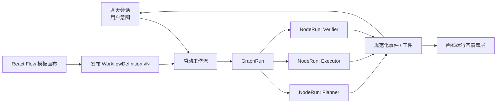
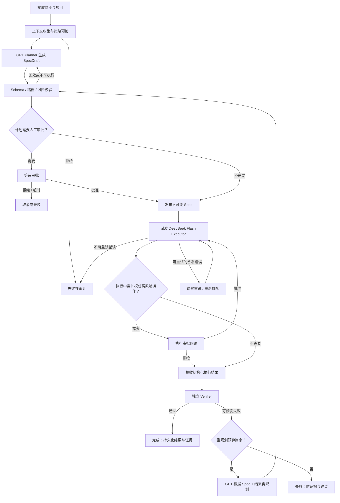

# 基于 Codex CLI 的多模型 Graph 工作流：GPT 规划生成外置 Spec，DeepSeek Flash 执行

> 状态：可行性与方案设计，尚不实施业务代码。
> 范围：在已有多模型 Codex CLI profile 能力之上，用 GPT 负责规划与再规划、用 DeepSeek Flash 负责执行；两者只通过版本化的外置 Spec 和结构化结果交换信息。

## 1. 结论与前提

**可行，且推荐采用“控制面 Graph + 数据面不可变 Spec”的方式。** 现有 AiAgent 已有两条可复用的运行路径：内置 GPT 模型通过 `codex app-server --stdio` 运行，第三方 profile 通过 `codex exec --profile <profile_name> --json` 运行；后者已经能够产出 JSONL、文件变更和会话 ID，并由服务端监管工作目录与进程。详见 [Codex 模型策略](codex-model-policy.md) 与 [Codex Agent 联动规格](codex-agent-integration-spec.md)。

本设计刻意不让 GPT 与 DeepSeek 共享长会话，也不把 GPT 的推理过程作为 DeepSeek 的上下文。它们在 Graph 中是两个可替换的 **Adapter**，唯一稳定协作物是可校验、可审计的 Spec。

关键前提：

1. 管理员已经配置并验证两个 profile：`gpt_planner`（GPT/Codex CLI）与 `deepseek_flash_executor`（DeepSeek Flash/Codex CLI）；profile 名必须受配置白名单控制，不能由请求传入。
2. 部署节点验证目标 Codex 版本能稳定运行 `codex exec --profile <name> --json`，并针对该版本保存 JSONL 解析契约测试；不能假定第三方 profile 与 `app-server` 协议相同。
3. 每个 Run 都能解析为一个已登记的代码项目和受限工作区；执行 profile 的 sandbox、审批和网络权限必须在服务端策略与 profile 中双重收紧。
4. 有持久化存储可保存 Spec、状态机、事件、审批决定、执行结果和工件哈希；对象存储或受控文件存储可保存较大的 diff、日志和测试报告。
5. DeepSeek Flash 适合范围明确、步骤可验证的执行，不应用于产生跨模块架构决策或替代验证。模型不可用、JSON 协议漂移或审批能力不足时，Graph 必须安全失败，不能降级为直接执行用户自然语言。

## 2. 设计原则与核心模块

### 2.1 深模块与 seam

将复杂性集中到 `GraphRunCoordinator` 这个**深 Module**：调用者只提交意图、项目和期望执行模式，并查询/订阅 Run；它在其 **Implementation** 内处理模型选择、Spec 校验与版本、调度、幂等、重试、审批、事件落库、验证和再规划。其 **Interface** 保持为：

```text
Start(intent, projectRef, executionMode) -> graphRunId
Get(graphRunId) -> GraphRunView
DecideApproval(graphRunId, approvalId, decision) -> GraphRunView
Cancel(graphRunId) -> GraphRunView
Subscribe(graphRunId, afterSequence) -> normalized events
```

这条 seam 使 UI、HTTP/WebSocket、定时恢复任务都无需知道某模型的 CLI 参数或 Spec 的内部步骤，带来较高的 **Leverage** 与 **Locality**。

| Module | Interface（调用方必须知道的约束） | seam 与 Adapter | 深度设计 |
| --- | --- | --- | --- |
| `GraphRunCoordinator` | 上述 5 个操作；状态单调推进；同一 idempotency key 只创建一个 Run | Graph 编排 seam；持久化/队列是内部依赖 | 隐藏状态迁移、锁、恢复、重试和事件排序。 |
| `SpecRegistry` | `Publish(draft) -> immutable SpecRef`、`Load(ref)`、`Validate(ref)` | Spec 存储 seam；`SqlSpecStore`、`ObjectSpecStore` 可作 Adapter | 隐藏 canonical JSON、schema 校验、内容哈希、签名与版本关系。 |
| `PlannerAdapter` | `Plan(PlanningInput) -> SpecDraft`、`Replan(ReplanInput) -> SpecDraft` | GPT/Codex CLI seam；`CodexExecPlannerAdapter` | 只返回 SpecDraft，不直接写工作区、不直接调度执行。 |
| `ExecutorAdapter` | `Execute(ExecutionInput, eventSink) -> ExecutionResult` | DeepSeek Flash/Codex CLI seam；`CodexExecDeepSeekAdapter` | 接收固定 Spec 快照和受控只读上下文；不接收用户原始意图或规划会话。 |
| `Verifier` | `Verify(VerificationInput) -> VerificationResult` | 验证器 seam；命令、静态检查、测试、diff 策略各为 Adapter | 把命令选择、日志截断、证据收集与判定统一封装。 |
| `PolicyGate` | `Evaluate(action, policyContext) -> allow | deny | approval` | 安全策略 seam；规则/审批队列是 Adapter | 把路径、命令、网络、风险级别、配额统一判定，禁止散落在节点中。 |

只有存在两种实际实现或明确近期替换需求时才保留 seam；例如 MVP 可先只使用 `SqlSpecStore`，不为了抽象而提前增加多个 Adapter。

### 2.2 运行状态

`GraphRun`：`created` → `planning` → `spec_validating` → `waiting_plan_approval?` → `dispatching` → `executing` → `verifying` → `completed | failed | cancelled`。
`SpecVersion`：`draft` → `validated` → `approved?` → `published`（不可变）→ `superseded`；已发布版本绝不原地修改。
`ExecutionAttempt`：`queued` → `running` → `waiting_approval?` → `succeeded | failed | timed_out | cancelled`。
`VerificationResult`：`passed | failed_repairable | failed_nonrepairable | inconclusive`。

状态和事件必须以服务端时间、递增 sequence 和稳定 ID 为准；模型文本只是证据，不能推进状态机。

### 2.3 可视化工作流、模型选择与聊天会话

推荐引入 **React Flow** 作为“工作流模板编辑器”，但 React Flow 只负责画布交互、节点参数编辑和运行态展示；它不是调度器，也不是执行权限的来源。画布保存的是版本化的 `WorkflowDefinition`，后端从其已发布版本创建 `GraphRun`，再由 `GraphRunCoordinator` 解释节点、边、策略和审批。



#### 节点不是聊天会话

**不要把节点定义为一个聊天会话。** 两者的生命周期、复用方式和隔离目标不同：

| 对象 | 是什么 | 生命周期 | 与其他对象的关系 |
| --- | --- | --- | --- |
| `WorkflowNode` | 模板中的定义，如“生成 Spec”“执行 Spec”“验证” | 随 `WorkflowDefinition` 版本存在，可被许多 Run 复用 | 指定 node type、输入/输出端口、模型角色、策略和 UI 配置。 |
| `NodeRun` | 某个节点在一次 `GraphRun` 中的实际尝试 | 任务级、可重试 | 绑定已解析的模型/profile、输入工件、输出工件、状态和事件。 |
| `ChatSession` | 用户与 AiAgent 的持续对话容器 | 用户会话级 | 可发起多个 `GraphRun`，并接收其事件摘要。 |
| `ModelSession` | 某个 CLI/profile 的短期或可续接上下文 | 仅在节点执行策略允许时存在 | 是 `NodeRun` 的可选资源，不是节点 ID；默认 Planner 与 Executor 不共享。 |

因此，一个聊天会话可以发起多个工作流 Run；一个 `GraphRun` 包含多个 `NodeRun`；一个节点运行**可以**关联一个 `ModelSession` 用于续接，但这是显式策略，而非一对一绑定。对于“GPT 规划 → DeepSeek 执行”，推荐每个节点运行使用隔离会话，特别是执行节点绝不继承 Planner 会话。只有纯对话、低风险的连续分析节点可选择 `session_mode=resume_same_node`，且 resume key 必须包含 `workflow_run_id + node_id + profile + workspace`。

#### 通用节点模型

第一版只做少量深节点类型，避免画布成为任意 prompt 的无约束编排器：

| 节点类型 | 模型是否可选 | 输入端口 | 输出端口 | 说明 |
| --- | --- | --- | --- | --- |
| `planner` | 是，限 `planner` 角色白名单 | `intent`、`context_manifest`、`prior_result?` | `spec_draft` | 只能产出结构化 Draft，无工作区写权限。 |
| `spec_gate` | 否，确定性实现 | `spec_draft` | `published_spec`、`approval_request?` | Schema/策略/路径校验并发布不可变 Spec。 |
| `executor` | 是，限 `executor` 角色白名单 | `published_spec`、`context_manifest` | `execution_result`、`events` | 如选 DeepSeek Flash，profile 由服务端 `ModelRolePolicy` 解析。 |
| `verifier` | 默认否；可选审查模型 | `published_spec`、`execution_result` | `verification_result` | 先跑确定性检查；审查模型只能补充解释，不能替代通过判据。 |
| `approval` | 否 | `approval_request` | `approval_decision` | 人工节点；暂停/恢复由后端状态机管理。 |
| `router` | 否，确定性条件 | 已声明的结果端口 | 指定的下游端口 | 只允许基于结构化状态、风险或验证结果分支，不能解析自由文本。 |

节点中的“模型下拉框”应保存 **模型角色和受控候选项**，例如 `role=executor, selected_profile=deepseek_flash_executor`，而不是保存 API Key、CLI 参数、绝对路径或任意模型名。发布模板时服务端写入可用 profile 的快照；运行时再次检查其启用状态、能力、预算和项目授权。模型/profile 变更不应静默改变已运行的 `NodeRun`。

#### 画布与聊天如何结合

- 聊天是**入口和叙事视图**：用户在消息中提出目标，选择一个已发布工作流模板（或让系统从默认模板创建 Draft），聊天消息保存 `graph_run_id`；随后把节点状态、审批、重要文本、测试结果和最终摘要按事件流显示为可折叠卡片。
- React Flow 是**编排和诊断视图**：点击聊天中的“打开工作流”跳到该 Run 的只读画布覆盖层，节点颜色/徽标展示 `queued/running/waiting_approval/completed/failed`，边展示实际选择的分支；从画布可打开对应 `NodeRun` 的事件、Spec、diff 和审批记录。
- 模板编辑与运行实例分开：用户编辑模板时只改 `WorkflowDefinitionDraft`；点击发布创建不可变 `WorkflowDefinitionVersion`。运行中的画布只读，不能拖线或改模型；要改变路径/模型必须取消后从新模板版本重新发起，或由再规划节点发布新的 Spec。
- 聊天中可直接回复审批或补充目标，但该回复先变成一个显式 `GraphInputArtifact`；只有连到接收该类型输入的节点、并经策略允许时才会被消费。这样不会把聊天中的所有后续消息不加区分地注入正在执行的 DeepSeek 会话。

#### 服务端存储建议

关系型数据库是工作流定义、运行状态、版本、聊天关联和审批的主存储；已有 SqlSugar/SQL Server 基础可直接承载。把 React Flow 的 JSON 当作**模板定义**保存，而不是只放在浏览器本地。

| 数据 | 推荐位置 | 原因 |
| --- | --- | --- |
| `WorkflowDefinitionDraft` / 已发布 `WorkflowDefinitionVersion` | SQL Server：节点、边、viewport、版本、发布者、schema version、内容 hash | 支持事务、乐观并发、发布审计与恢复；节点/边可整体存 `DefinitionJson`，常用字段另外列出索引。 |
| `GraphRun` / `NodeRun` / 重试 / 审批 / 事件序列 | SQL Server | 是状态机与聊天关联的事实来源，便于幂等、锁与事件补拉。 |
| Spec | SQL Server 中保存 canonical JSON、版本和 hash；大文本/附件仅存工件引用 | Spec 需要强一致和审计；同上避免以文件系统“最新文件”作为执行输入。 |
| diff、完整 JSONL、终端日志、测试报告、上下文快照 | 受控工件存储（MVP 可放服务端允许根目录；生产推荐 MinIO/S3/Blob） | 大小与保留期可控，数据库只持 `artifact_ref + sha256`。 |
| 聊天消息 | 继续使用现有聊天表；消息元数据仅保存 `graph_run_id`、节点摘要和安全的工件链接 | 不复制完整工作流状态，避免聊天表成为第二状态机。 |

建议表名：`AiWorkflowDefinition`、`AiWorkflowDefinitionVersion`、`AiGraphRun`、`AiGraphNodeRun`、`AiGraphRunEvent`、`AiGraphInputArtifact`、`AiGraphApproval`；现有 `AiChatSession` / `AiChatMessage` 增加可选关联即可。`WorkflowDefinitionVersion` 内的 React Flow JSON 应保留 `node.id`、`type`、`position`、`data`、`edge.source/target/sourceHandle/targetHandle`；运行时永远读取已发布版本，不信任浏览器重新提交的图。

## 3. 推荐 Graph：节点、边与人工回路



节点的职责如下：

| 节点 | 输入 | 输出 | 关键规则 |
| --- | --- | --- | --- |
| 上下文收集 | 用户意图、`projectRef` | 文件清单、受限摘要、仓库提交、策略快照 | 不收集密钥、未授权目录或整仓原文；生成 context manifest。 |
| Planner | `PlanningInput` | `SpecDraft` | GPT 只能规划，禁止文件/命令副作用；输出必须通过 JSON Schema。 |
| Spec 校验/发布 | Draft、策略、context manifest | `SpecRef` | 必须校验 schema、相对路径、操作白名单、依赖、有界步骤和测试命令；发布后内容寻址。 |
| Executor | `ExecutionInput` | `ExecutionResult` + 规范化事件 | DeepSeek Flash 只见 SpecRef 快照、允许上下文和上轮的结构化结果；不见原始用户消息或 GPT 私有推理。 |
| Verifier | Spec、diff、受控工作区 | `VerificationResult` | 独立于执行模型；以命令退出码、断言、diff 和策略为准。 |
| Replanner | 当前 Spec、失败证据、预算 | 新 `SpecDraft` | 不能修改已发布 Spec；必须创建 `revision_of` 指向上一个版本。 |

### 3.1 失败、重试与审批

- `cli_start_failed`、网络/容量错误、临时 JSONL 断流可按指数退避重试（例如 5s、30s、120s，最多 3 次）；每次生成新的 `attempt_id`，但复用同一个 `spec_sha256` 与幂等键。
- schema 不合法、profile 未验证、路径越界、策略拒绝、测试确定性失败、输出越限、执行模型返回不符合契约的结果均不可自动重试；转为失败或交给 GPT 再规划。
- 任何写入、网络访问、包安装、数据库迁移、发布、删除或不在 Spec 中的命令都经过 `PolicyGate`。`ask_before_write` 至少在 Spec 批准和高风险步骤各审批一次；审批内容展示相对路径、命令摘要、风险和预计影响，不展示秘密。
- 审批等待、总运行、单步骤、空闲无事件和最大重规划次数均设置上限；超限产生确定性终态。建议 MVP：单步骤 10 分钟、总 Run 30 分钟、重规划至多 1 次。

## 4. GPT → 外置 Spec → DeepSeek Flash 的输入输出契约

### 4.1 Planner 输入与输出

GPT/Codex CLI 的 `PlanningInput` 是 JSON 文件或等价的受控 prompt 附件，包含 `run_id`、用户意图、项目元数据、context manifest、约束、允许能力和当前 Spec/失败结果（仅再规划时）。Planner 的 stdout 只能输出一个 `SpecDraft` JSON；诊断文本进入受限日志，不能混入该 JSON。

```json
{
  "schema_version": "spec/v1",
  "run_id": "gr_01J...",
  "intent": "为订单查询增加状态筛选并补充测试",
  "project": { "id": "project_42", "revision": "a1b2c3d" },
  "context_manifest": {
    "items": [
      { "path": "backed/Services/Orders/OrderAppService.cs", "sha256": "...", "purpose": "target" }
    ]
  },
  "constraints": { "allowed_roots": ["backed", "front"], "max_steps": 8, "allow_network": false },
  "previous": null
}
```

`SpecDraft` 成功只表示“可进入校验”，不是可以执行。校验器补齐 `spec_id`、版本、内容哈希、策略快照和时间戳后才发布。

### 4.2 发布 Spec 格式

Spec 使用 canonical JSON（UTF-8、稳定字段顺序）并以 JSON Schema `spec/v1` 校验；展示层可从同一 JSON 派生 Markdown，不能以 Markdown 作为唯一机器输入。

```json
{
  "schema_version": "spec/v1",
  "spec_id": "spec_01J...",
  "version": 1,
  "revision_of": null,
  "run_id": "gr_01J...",
  "project": { "id": "project_42", "base_revision": "a1b2c3d" },
  "objective": "增加订单状态筛选并通过既有测试",
  "scope": {
    "allowed_roots": ["backed", "front"],
    "read_paths": ["backed/Services/Orders", "front/lib"],
    "write_paths": ["backed/Services/Orders", "front/components/orders"],
    "forbidden_paths": ["**/.env*", "**/appsettings.json"]
  },
  "steps": [
    {
      "id": "S1",
      "goal": "在服务层加入状态过滤",
      "read_refs": ["backed/Services/Orders/OrderAppService.cs"],
      "write_targets": ["backed/Services/Orders/OrderAppService.cs"],
      "acceptance": ["请求带状态时只返回该状态订单"],
      "allowed_commands": ["dotnet test backed/Tests/Orders.Tests.csproj --no-restore"],
      "risk": "medium",
      "depends_on": []
    }
  ],
  "verification": {
    "required_commands": ["dotnet test backed/Tests/Orders.Tests.csproj --no-restore"],
    "expected_files": ["backed/Services/Orders/OrderAppService.cs"],
    "forbid_unexpected_files": true
  },
  "budgets": { "max_executor_attempts": 3, "max_replans": 1, "max_changed_files": 8 },
  "policy_snapshot_id": "policy_20260804_01",
  "context_manifest_sha256": "...",
  "sha256": "..."
}
```

禁止用“实现需求”这类自然语言占位字段替代 `scope`、`steps`、`acceptance` 与 `verification`；这些字段是执行权限和验证标准的最小完整描述。

### 4.3 Spec 存储、版本与并发策略

- 主表保存 `spec_id`、`version`、`run_id`、`revision_of`、schema version、状态、canonical JSON、`sha256`、创建者模型/profile 快照和 policy snapshot。`(spec_id, version)` 唯一，`sha256` 用于去重和审计。
- 大型输入摘要、diff、完整日志和测试报告存入受控工件存储，表内只保存不可猜测的 `artifact_ref`、哈希、长度和保留期。不得把真实绝对路径、token 或完整环境变量写入 Spec 或事件。
- 发布用乐观并发：同一 `GraphRun` 只能有一个当前 `published` Spec；再规划通过 compare-and-swap 创建下一版本。Executor 总是绑定 `{spec_id, version, sha256}`，拒绝“latest”。
- Spec、结果和审批决定都追加写入；撤销执行通过创建状态转换/新版本记录，不能重写审计历史。默认保留期应与项目审计策略一致，敏感诊断日志采用更短保留期。

### 4.4 Executor 输入与输出

服务端以参数列表启动受控命令：`codex exec --profile deepseek_flash_executor --json ...`；确切附加参数按已验证 profile/CLI 版本固定，绝不能由 Spec、用户输入或模型输出拼接。stdin（或受控临时 JSON 文件）只传以下 `ExecutionInput`：

```json
{
  "contract_version": "execution/v1",
  "run_id": "gr_01J...",
  "attempt_id": "att_01J...",
  "spec": { "spec_id": "spec_01J...", "version": 1, "sha256": "..." },
  "workspace": { "opaque_ref": "ws_...", "base_revision": "a1b2c3d" },
  "context": { "manifest_ref": "artifact_...", "allowed_files": ["..."] },
  "instruction": "仅按已发布 Spec 执行；若 Spec 不足、冲突或需扩权，停止并返回 blocked，不得自行扩大范围。"
}
```

`ExecutionResult` 必须由 CLI JSONL 事件归一化后落库，终态包含：

```json
{
  "contract_version": "execution-result/v1",
  "run_id": "gr_01J...",
  "attempt_id": "att_01J...",
  "spec": { "spec_id": "spec_01J...", "version": 1, "sha256": "..." },
  "status": "succeeded | failed | blocked | cancelled | timed_out",
  "completed_steps": ["S1"],
  "blocked_reason": null,
  "file_changes": [{ "path": "backed/...cs", "status": "completed", "diff_ref": "artifact_..." }],
  "commands": [{ "step_id": "S1", "command_id": "cmd_...", "exit_code": 0, "output_ref": "artifact_..." }],
  "evidence": [{ "kind": "test", "ref": "artifact_...", "sha256": "..." }],
  "usage": { "model_profile": "deepseek_flash_executor", "input_tokens": null, "output_tokens": null },
  "error": null
}
```

## 5. 使执行模型只依 Spec 工作，并驱动验证/再规划

“只依据 Spec”是防御纵深，不能只靠 prompt。必须同时实施：

1. **输入隔离**：为每次执行启动独立 CLI 会话；不调用 `resume` 接续 GPT 或旧执行会话。DeepSeek 只收到发布的 Spec、白名单文件内容/摘要和必要的结构化失败证据。原始用户消息、Planner 对话、隐藏推理、其他 Run 事件均不传递。
2. **能力收缩**：`PolicyGate` 在进程外执行 Spec→允许路径/命令映射；工作目录、可写根、网络、审批和 sandbox 均由服务端固定。模型声称的动作必须与文件变更和命令事件交叉核对。
3. **完整性绑定**：Executor 输入带 `spec_sha256`；开始前重新读取并校验 Spec 与 base revision。工作树不是预期基线或 Spec 已被 superseded 时，返回 `blocked/stale_spec`，绝不继续写入。
4. **闭环结果**：Verifier 获取固定 Spec、实际 diff、命令退出码和测试证据，输出 `VerificationResult`。通过才完成；`failed_repairable` 以“旧 Spec + 结构化结果 + 验证失败证据 + 剩余预算”调用 GPT 再规划；新 Spec 再经完整校验和审批。执行模型不能自行把失败解释为新需求。
5. **漂移检测**：任何未声明文件、未允许命令、超出文件/时间预算、协议未知事件或结果 schema 失败，都记为 policy/contract failure，冻结工作区并进入人工处置或再规划，不自动继续。

## 6. 安全、隔离、并发、可观测性与成本

| 维度 | 设计要求 |
| --- | --- |
| 安全 | 浏览器只传意图、项目 ID 和模式；服务端解析 profile、工作区与能力。所有 CLI 用 `ProcessStartInfo.ArgumentList`，禁止 shell 拼接。路径采用相对路径并进行允许根/符号链接校验；密钥、配置文件、连接串和绝对路径脱敏。 |
| 上下文隔离 | Planner、Executor、Verifier 分别使用独立 run/session 与最小数据包；执行事件不回流为 Planner 原始上下文，只形成经脱敏、截断、哈希引用的 `ReplanInput`。每次调度固定 profile、CLI 版本、模型 ID、Spec hash 和 policy snapshot。 |
| 并发 | 同一工作区/分支的写 Run 互斥；只读分析可并行。锁键至少含项目、工作区、分支和写模式；每个 profile 设队列及并发上限。运行租约键要包含工作区、profile 与模型选择，避免 GPT/DeepSeek 复用 CLI 上下文。 |
| 可观测性 | 以 `graph_run_id` 贯穿 span/log/event；记录节点耗时、排队、重试、审批、Spec/version/hash、profile/CLI 版本、令牌/费用、文件数、测试结果与终态错误码。事件 sequence 可重放；stderr 与原始 stdout 仅入受限短期诊断日志。 |
| 成本 | GPT 用于高价值的首次规划、复杂失败和风险高的再规划；DeepSeek Flash 用于明确步骤的执行。先由 schema/策略验证挡掉无效 Draft，限制上下文 manifest、最大步骤、最大尝试和再规划次数。按 Run 汇总模型用量与费用，超预算转人工而不是静默换模型。 |
| 模型选择 | 选择由服务器 `ModelRolePolicy` 决定：`planner=gpt_planner`、`executor=deepseek_flash_executor`、`verifier=deterministic`（必要时 `gpt_reviewer`）。请求只能选择策略允许的质量档，不能指定任意 profile；模型容量不足时保留 Run、重试或转人工，不能把 Planner 静默降级为 Flash。 |

生产部署应优先采用运行节点本地 stdio 或内网受控 Bridge；不要向浏览器或公网暴露 Codex app-server。现有 `approvalPolicy=never`/宽松 sandbox 仅可作为开发基线，不能直接成为该工作流的生产执行权限。

## 7. 最小可行版本与分阶段路线

| 阶段 | 交付范围 | 明确不做 | 通过条件 |
| --- | --- | --- | --- |
| P0：取证 | 验证两个 profile 的 CLI 命令、JSONL 事件、取消、退出码、文件变更和 session 行为；生成契约测试夹具 | 不接入 UI、不执行真实写入 | 固定 CLI/profile 版本能在隔离仓库完整复现。 |
| P1：MVP | 单项目、单写 Run、GPT 生成 `spec/v1`、人工批准后 DeepSeek 执行、确定性测试验证、最多一次再规划；持久化 Spec/Run/事件 | 自动批准、并行 DAG、跨仓库、远程 Bridge | 能演示“计划→审批→执行→测试→完成/再规划”，且不允许越 Spec 写入。 |
| P2：可靠性 | 队列、恢复、幂等、退避、配额、审计视图、事件补拉、人工审批卡片 | 多执行器协作 | 进程被杀、浏览器断线、重复提交、CLI 暂态失败均不造成重复写入或丢失终态。 |
| P3：扩展 | 只读并行节点、受控分支/worktree、远程 Bridge、更多验证 Adapter、策略配置 UI | 任意模型自由编排 | 多个 profile/节点可替换而不用修改 `GraphRunCoordinator` 的 Interface。 |

MVP 最小数据模型：`AiGraphRun`、`AiGraphNodeAttempt`、`AiExternalSpec`、`AiSpecArtifact`、`AiExecutionApproval`、`AiVerificationResult`、`AiGraphEvent`。可复用现有外部 Agent Run 的事件、文件变更和取消语义，但不要把 Graph 状态硬塞进聊天消息元数据。

## 8. 验收清单

1. GPT 只能输出符合 `spec/v1` 的 Draft；无效 Draft 不会启动 DeepSeek。
2. 发布 Spec 的 hash、版本、策略与工作区基线可在任何执行事件中追溯。
3. DeepSeek 输入中不含原始意图、GPT 会话/推理或未授权文件，且越出 Spec 的写入/命令被阻止。
4. 执行结果只有在 schema、事件、diff 与命令证据一致后才能标为 `succeeded`。
5. 验证失败只携带最小结构化证据回到 GPT；产生新版本 Spec 并重新审批，旧 Spec 保持不可变。
6. 取消、超时、审批拒绝、容量不足、协议漂移和重复请求都产生稳定错误码、可重放事件和确定性终态。
7. 同一工作区的两个写入任务不能并发，两个模型/profile 也不能复用彼此的 CLI 会话或工作上下文。
