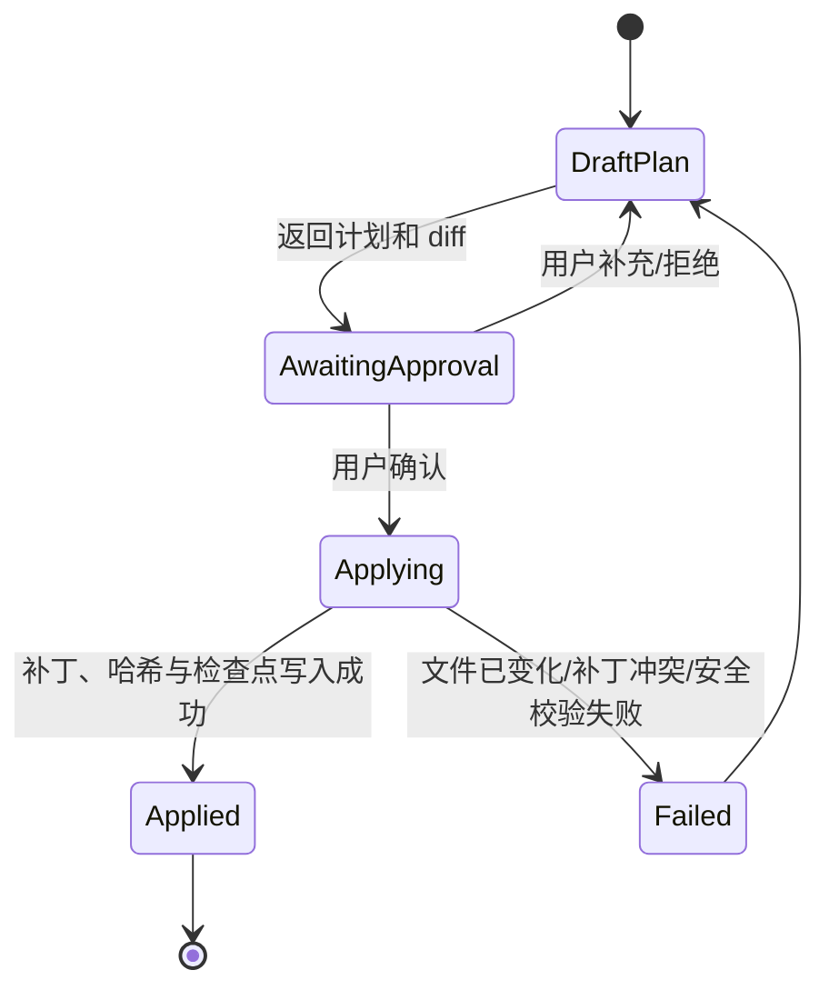

# 对话式 BI 项目交付工作台设计

## 1. 目标

在 AiAgent 中增加“项目交付工作台”：用户选择一个本地项目文件夹后，系统识别项目结构、绑定 Git、提供网页预览与对话式修改能力。用户通过聊天描述需求，例如“把销售趋势图改成按区域筛选”“新增客户留存页”，系统产出受控的文件改动；用户查看差异、确认应用、预览运行结果，并在完成后导出可交付项目资产。

最终交付物应可复制到客户电脑独立运行，至少包含源码、运行说明、环境样例、构建/启动脚本、Git 提交信息以及可选的部署包。

## 2. 产品边界

### 包含

- 从本地文件夹加载 Web/BI 项目并登记为“交付项目”。
- 读取项目清单、技术栈、页面、数据源配置与 Git 状态。
- 对话驱动的需求澄清、方案说明、文件修改和改动预览。
- Git 初始化/绑定、状态查看、提交、分支与回滚点管理。
- 受控地启动本地预览服务，并在浏览器中显示预览地址/状态。
- 导出源码交付包、运行包说明和项目资产清单。
- 将操作记录、聊天记录、变更集和导出记录按账号持久化。

### 暂不包含（第一阶段）

- 在线托管、多人同时编辑、云端构建集群。
- 自动发布到客户生产环境。
- 任意命令执行、任意目录读写或直接读取系统目录。
- 替代专业 BI 设计器的像素级拖拽编辑。

## 3. 核心用户流程


### 3.1 创建项目

1. 用户点击“新建交付项目”，选择受允许根目录下的本地文件夹。
2. 后端扫描有限深度的项目元数据：`package.json`、`*.sln`、`pom.xml`、`README`、Docker 文件、锁文件、入口文件和已有 Git 仓库。
3. 用户填写项目名称、客户名称、交付说明和运行方式；系统创建项目记录。
4. 若文件夹不是 Git 仓库，可由用户确认后初始化 Git，并创建首次快照提交。

### 3.2 对话修改

1. 用户从项目页面进入一个交付会话，聊天请求携带 `project_id`、当前分支、可选页面/文件上下文。
2. Agent 先返回“变更计划”：涉及哪些页面、数据字段、组件和风险；信息不足时先追问。
3. Agent 生成统一 diff，而不是直接覆盖文件。
4. 用户在“变更集”面板审阅 diff，可逐文件、逐块接受或拒绝。
5. 确认后后端以受控补丁写入工作区，保存变更集与文件版本，并刷新 Git 状态。
6. 每次应用成功后自动创建可回滚检查点；是否正式 `git commit` 由用户决定。

### 3.3 预览与交付

1. 用户点击“运行预览”，系统仅执行预先识别的白名单脚本，例如 `npm run dev`、`npm run start`、`dotnet run`。
2. 系统记录进程、端口、日志和启动时间；浏览器通过预览地址查看页面。
3. 验收后用户选择“导出交付包”。系统按导出配置打包源码、资产清单、部署说明和可选构建产物。
4. 导出过程生成不可变版本号，并写入 Git commit/tag、文件清单校验值和生成时间。

## 4. 信息架构

新增左侧一级导航“交付项目”，页面分为四个区域：

| 区域 | 内容 |
| --- | --- |
| 项目列表 | 项目名称、客户、技术栈、最近改动、Git 状态、预览状态 |
| 项目工作台 | 会话、需求、变更计划、文件树、Git 和导出入口 |
| 主编辑区 | 对话、文件 diff、页面预览三种可切换视图 |
| 右侧检查器 | 当前分支、变更集、任务日志、运行进程、交付版本 |

项目工作台建议路由：

```text
/delivery-projects
/delivery-projects/new
/delivery-projects/{projectId}
/delivery-projects/{projectId}/sessions/{sessionId}
/delivery-projects/{projectId}/preview
/delivery-projects/{projectId}/releases/{releaseId}
```

## 5. 后端设计

### 5.1 模块划分

```text
backed/
  Entities/Delivery/
    AiDeliveryProject.cs
    AiDeliverySession.cs
    AiDeliveryChangeSet.cs
    AiDeliveryChangeFile.cs
    AiDeliveryRun.cs
    AiDeliveryRelease.cs
  Dtos/Delivery/
    DeliveryProjectDtos.cs
    DeliverySessionDtos.cs
    DeliveryChangeDtos.cs
    DeliveryReleaseDtos.cs
  Services/Delivery/
    DeliveryProjectAppService.cs
    DeliveryProjectManager.cs
    DeliveryWorkspaceService.cs
    DeliveryGitService.cs
    DeliveryChangeSetService.cs
    DeliveryPreviewService.cs
    DeliveryExportService.cs
    DeliveryProjectInspector.cs
```

职责原则：`AppService` 仅处理 HTTP 与授权；工作区文件读写、Git、进程运行、补丁应用、导出分别放在独立 Service 中。所有服务均必须校验当前账号对 `project_id` 的访问权。

### 5.2 核心实体

| 实体 | 关键字段 | 说明 |
| --- | --- | --- |
| `AiDeliveryProject` | `Id, UserId, Name, RootPath, GitRemote, DefaultBranch, TechStackJson, Status` | 本地项目登记与所有权 |
| `AiDeliverySession` | `Id, ProjectId, UserId, Title, BaseCommit, CreatedAt` | 某项目下的交付对话 |
| `AiDeliveryChangeSet` | `Id, ProjectId, SessionId, Status, PlanJson, BaseCommit, AppliedCommit` | 一次对话产生的可审查修改 |
| `AiDeliveryChangeFile` | `ChangeSetId, RelativePath, Operation, UnifiedDiff, BeforeHash, AfterHash` | 文件级变更证据 |
| `AiDeliveryRun` | `ProjectId, CommandKey, Port, Status, LogPath, StartedAt` | 本地预览进程记录 |
| `AiDeliveryRelease` | `ProjectId, Version, CommitHash, ManifestJson, ExportPath, Status` | 导出交付版本 |

文件内容不直接完整存入数据库；数据库保存相对路径、diff、哈希与元数据。实际文件仅位于被登记的项目工作区。

### 5.3 API 草案

```text
POST   /api/v1/delivery-projects/inspect             # 检查目录、技术栈和 Git
POST   /api/v1/delivery-projects                     # 登记项目
GET    /api/v1/delivery-projects                     # 当前账号项目列表
GET    /api/v1/delivery-projects/{id}                # 项目详情
GET    /api/v1/delivery-projects/{id}/tree           # 受限文件树
GET    /api/v1/delivery-projects/{id}/git/status     # Git 状态
POST   /api/v1/delivery-projects/{id}/sessions       # 新建交付会话
POST   /api/v1/delivery-projects/{id}/changes/plan   # 对话生成变更计划/diff
POST   /api/v1/delivery-projects/{id}/changes/{cid}/apply
POST   /api/v1/delivery-projects/{id}/changes/{cid}/discard
POST   /api/v1/delivery-projects/{id}/git/commit
POST   /api/v1/delivery-projects/{id}/preview/start
POST   /api/v1/delivery-projects/{id}/preview/stop
GET    /api/v1/delivery-projects/{id}/preview/logs
POST   /api/v1/delivery-projects/{id}/releases
GET    /api/v1/delivery-projects/{id}/releases/{rid}/download
```

## 6. 对话与变更集协议

对话不能直接拥有“写文件”权限。Agent 必须按下面的状态机工作：



每个变更集必须包含：

- 目标、影响范围、验收条件和回滚方式。
- 每个文件的相对路径、操作类型（新增/修改/删除/重命名）、统一 diff、修改前后 SHA-256。
- 可执行命令仅可引用系统已识别的 `command_key`，不能直接由模型提供 shell 文本。
- 应用前再次比对 `BeforeHash`，不一致时拒绝覆盖并提示重新生成变更集。

## 7. Git 设计

### 原则

- 每个项目绑定一个本地 Git 工作区；只操作该项目根目录内部文件。
- 项目加载时只读扫描；初始化仓库、绑定远程仓库、提交、推送均必须由用户明确确认。
- 变更集应用后创建检查点（可用临时 commit 或 stash/内部快照）；用户验收后创建正式提交。
- 不自动 `push`，远程凭据不保存到项目文件或日志中。

### Git 状态展示

展示当前分支、HEAD commit、未提交文件数、冲突状态、最近三次交付版本。所有文件路径均使用相对路径，忽略 `.git`、依赖目录、构建目录和密钥文件。

## 8. 网页预览与运行设计

系统不接受自由文本命令。项目检查器根据技术栈生成受控运行配置：

```json
{
  "runtime": "node",
  "package_manager": "npm",
  "preview_commands": [
    { "key": "web-dev", "label": "前端开发预览", "command": "npm run dev", "default_port": 3000 }
  ],
  "build_commands": [
    { "key": "web-build", "label": "构建交付产物", "command": "npm run build" }
  ]
}
```

运行服务须在独立进程中启动，限制工作目录、端口范围、环境变量、运行时长和日志大小。前端只显示后端确认后的预览 URL 与日志摘要，不直接执行命令。

## 9. 导出项目资产

### 交付包内容

```text
{项目名}-{版本号}.zip
  src/                         # 源码（排除依赖、缓存、密钥）
  assets/                      # 项目静态资产
  README-交付说明.md
  .env.example
  scripts/
    start.ps1
    start.sh
  manifest.json                # 文件哈希、技术栈、版本、Git commit
  CHANGELOG.md                 # 本次交付说明
```

`manifest.json` 记录版本号、导出时间、源 Git commit、导出文件清单和 SHA-256；导出前校验不包含 `.git`、`node_modules`、密钥文件、历史日志和工作区临时文件。

## 10. 安全与可靠性

1. **目录边界**：仅允许在管理员配置的根目录中登记项目；所有路径规范化后验证仍处于项目根目录。
2. **账号隔离**：项目、会话、变更集、运行和导出记录按 `UserId` 查询与校验。
3. **写入保护**：只接受补丁应用；应用前做哈希比较；禁止 Agent 直接全量覆盖文件。
4. **敏感文件保护**：默认禁止读取/修改 `.env`、证书、SSH 密钥、`.git/config`、依赖缓存和系统文件。
5. **命令白名单**：预览/构建命令来源于项目检查器或管理员模板，禁止任意 shell 指令。
6. **审计**：记录谁在何时对哪个项目应用了哪个变更集、Git commit、运行命令键和导出版本。
7. **失败可恢复**：补丁冲突不覆盖；运行失败保留日志；导出失败清理临时包；每次应用可回滚。

## 11. 分阶段实施

### M1：项目与 Git 基础

- 交付项目登记、文件夹检查、技术栈识别、Git 状态读取。
- 项目列表与工作台骨架。
- 文件树、README/清单预览、项目级会话。

### M2：对话式变更集

- 在现有 Chat 上增加 `project_id` 上下文。
- 文件读取工具、变更计划、统一 diff、用户确认和补丁应用。
- 变更集历史、哈希校验与回滚检查点。

### M3：运行与预览

- 运行配置识别、受控进程管理、日志、端口探测与预览 URL。
- 前端预览面板、启动/停止和错误提示。

### M4：交付导出

- 交付版本、资产清单、压缩导出、运行脚本、交付说明。
- Git 提交/标签与版本回溯。

### M5：增强能力

- 客户模板、数据源脱敏、可视化验收截图、部署适配器和多人协作。

## 12. 首期验收标准

- 用户可从允许目录选择一个 Next.js/Vite 项目并看到技术栈与 Git 状态。
- 用户可在项目下创建会话，提出修改需求并看到可读的文件 diff。
- 未经确认，工作区文件不发生改动；确认后仅变更 diff 中列出的文件。
- 用户可启动并停止白名单预览命令，看到日志和预览地址。
- 用户可创建 Git 检查点/提交，并导出含 README、脚本和 manifest 的项目资产包。
- 普通账号不能读取、修改、运行或下载其他账号的项目。
