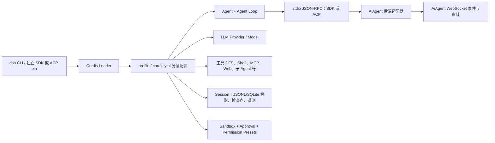

# DeepSeek Harness CLI 接入 AiAgent 可行性与方案

> 状态：调研与设计，未改动业务代码。
> 调研范围：`E:\项目\know-why\deepseek-harness` 的源码、示例和公开配置；AiAgent 当前 Codex app-server 接入代码。未读取真实密钥、`.env`、`appsettings.json`、会话数据或其他本地敏感配置。

## 1. 结论

**可以接入，但不能把 `dsh` 当作 `codex app-server --stdio` 的同协议替代品，也不应直接复用 `CodexChatService` 的 JSONL 解析器。**

DeepSeek Harness（下称 DSH）提供两个适合自动化宿主的 stdio JSON-RPC 面：

| 候选入口 | 适合程度 | 关键能力 | 主要限制 |
| --- | --- | --- | --- |
| `dsh --profile headless "<task>"` | 不适合主聊天 | 一次性任务、最终答案、进程退出 | 无多轮会话、无实时事件、无审批回传 |
| `dsh-jsonrpc-agent <cordis.yml>` + `dsh-sdk-jsonrpc-server` | 最适合首期原型 | JSON-RPC over stdio、会话复用、完整 `session.event`、运行状态、子 Agent 事件 | 当前无单会话取消、无逐请求完成归属、无审批请求/答复 wire 方法 |
| `dsh-acp-demo --config <cordis.yml>` + `dsh-acp` | 适合审批/取消优先的替代路径 | ACP 标准、`session/cancel`、一次性权限请求 | 只输出已提交 assistant 文本；不传工具实时事件、推理、计划、文件变更；限制附件/MCP/额外目录 |

建议以 **DSH SDK JSON-RPC 为主通道**，新增独立的 `DeepSeekHarnessRuntimeAdapter`；首期只开放只读分析。涉及写文件、命令执行或网络访问时，必须先扩展/固化 DSH 的审批 wire 协议，或采用 fail-closed 的只读配置。ACP 可作为验证 DSH 原生审批与取消语义的备选 PoC，不建议作为 AiAgent 代码聊天主通道。

## 2. DSH 架构概览

DSH 是基于 Cordis 的插件化 Agent Harness，不是只有一个 CLI 二进制：功能由插件树按配置组合，`dsh` 负责选择和启动 profile。



### 2.1 CLI、入口和配置装配

- `apps/cli/src/bin.ts` 解析顶层命令，分派 profile 启动、插件管理与配置导出。
- `dsh --profile <name>` 从 `$DSH_HOME/profiles/<name>` 装配运行时；`web` 是 web profile 别名；`plugin` 在 profile 目录中转发 `pnpm` 参数。
- 配置层顺序为：bundle patch → profile `cordis.patch.yml` → `$DSH_HOME/cordis.patch.yml` → 多个 `--patch`。因此配置是部署资产，不应由浏览器或聊天文本拼接。
- `--dump-default-config` 与 `--dump-config` 可在不启动运行时的前提下检查有效配置树，可用于部署诊断。
- `dsh --profile headless` 是新建持久会话后等待 agent 空闲、向 stdout 打印最后一条 assistant 文本并退出的一次性入口；不监听端口，也不提供交互式后续输入。

SDK/ACP 的可编程入口不依赖普通 `dsh` profile：示例分别使用 `dsh-jsonrpc-agent` 和 `dsh-acp-demo`，由明确的 `cordis.yml` 组装插件。这更适合 AiAgent 作为受控宿主：可固定 bin、配置模板、工作目录和版本，而不是让用户选择任意 profile。

### 2.2 会话、流式与持久化

DSH session 是模型可见输入和工具/审批事实的持久事件日志；Agent 与 session 一一关联。SDK 服务器对每个外部 `sessionId` 懒创建 Agent/session，并将所有记录的会话事件以 `session.event` 通知发送。它还发送 agent 级 `running`/`idle` 状态，以及进程内子 Agent 的 started/finished 事件。

这使 AiAgent 能获得比当前 Codex 解析更原始、可审计的事件，但需要自己将 DSH 事件分类并规范化为现有 `AgentStreamEvent`。尤其要注意：`session/prompt` 的回包只有已入队的 `messageId`，并不表示该提示词已完成；一个 session 可继续入队多个请求，且后续事件不带 prompt 专属关联键。

### 2.3 权限与沙箱模型

DSH 把文件沙箱和审批拆成独立、可持久化的会话策略：

| 层级 | 值/语义 | 持久化与默认值 |
| --- | --- | --- |
| Sandbox mode | `read-only`、`workspace-write`、`danger-full-access` | `sandbox/mode` 写入 session 日志；部署默认策略在 `dsh-sandbox-policy` |
| Approval policy | `ask`、`never` | `approval/policy` 写入 session 日志；`ask` 无 answerer 时 fail-closed，`never` 自动拒绝需要审批的操作 |
| Permission preset | 组合 sandbox + approval，例如 `workspace-write + ask`、`danger-full-access + never` | `permission/preset` 记录用户选择，并通过三个事件重建有效值 |

`dsh-sandbox-policy` 在每次受控能力调用时按“显式批准 > session 覆盖 > 部署默认”计算有效策略；`workspace-write` 的根目录取会话创建时固定的 `cwd`。这与 AiAgent 的“已登记代码仓库/工作区”模型可自然对齐。

但是，当前 DSH base bundle 的示例默认通过 `DSH_PERMISSION_MODE` 设为 `workspace-write`，审批为 `ask`；当设为 `danger-full-access` 时审批为 `never`。而且 SDK 协议尚未定义审批请求/答复。若仅启动 SDK server 而未提供同进程 answerer，`ask` 会因无人响应而安全拒绝；若错误设为 `never + danger-full-access`，则会绕过人工确认。因此这不是可直接暴露到生产的默认配置。

## 3. 与当前 AiAgent Codex 接入的对比

当前实现位于 `backed/Services/Chat/Codex/CodexChatService.cs`：后端以受控 `ProcessStartInfo.ArgumentList` 启动 `codex app-server --stdio`，为浏览器 runtime lease 维护一个已初始化进程；每个 turn 发送 `thread/start`、`turn/start`，并解析 `turn/*`、`item/*` 通知后转为 AiAgent 的 `content`、`tool`、`tool_result` 与完成事件。AiAgent WebSocket 层统一负责鉴权、工作区/附件解析、会话落库、用量与调试追踪。

| 维度 | Codex app-server（当前） | DSH SDK JSON-RPC（建议） | DSH ACP（备选） |
| --- | --- | --- | --- |
| 传输 | stdio JSONL / JSON-RPC 风格 | 每行 JSON-RPC 2.0 | stdio JSON-RPC（ACP） |
| 入口 | `codex app-server --stdio` | `dsh-jsonrpc-agent <受控 cordis.yml>` | `dsh-acp-demo --config <受控 cordis.yml>` |
| 初始化 | 后端驱动 `initialize`，每 turn `thread/start`/`turn/start` | `initialize(cwd, provider, model, maxTokens)` 一次；`session/prompt` 入队 | `initialize` 后 `session/new`，再 `session/prompt` |
| 多轮 | Codex thread | 调用方稳定 sessionId | ACP sessionId |
| 文本流 | `item/agentMessage/delta` | 解析 `session.event` 中的 assistant chunk/消息事件 | 只转发已提交 assistant 文本块 |
| 工具/文件流 | item 与 diff 通知 | 完整 session 事件，需适配器分类 | 协议明确省略 |
| 取消 | 当前通过取消 token 杀掉 CLI；无单 turn 协议取消 | 无单 session/prompt 取消，关闭进程才停止 | `session/cancel` |
| 审批 | 当前调用明确传入 `approvalPolicy=never`、`dangerFullAccess` | DSH 内部具备审批域，但 SDK wire 未透出 | `session/request_permission` 支持一次性允许/拒绝 |
| 配置 | AiAgent 的 Codex 命令/模型策略 + CLI profile | `cordis.yml` 插件组合 + 运行时受控参数 | 同左 |

结论是“可类比的进程托管与 stdio RPC 接入”，不是“可复用同一协议解析”。应该复用 AiAgent 的上层职责（鉴权、工作区验证、WebSocket、落库、用量、审计、进程回收），重写 DSH 专用 transport 和事件映射。

## 4. 可复用能力与适配层设计

### 4.1 可直接复用的 AiAgent 能力

- `ChatWebSocketHandler` 的用户鉴权、会话消息落库、用量记录、调试追踪、断开即取消。
- 已登记 `CodeProject` 到服务器工作区路径的解析与路径验证；DSH 的 `initialize.cwd` 只接收该受控绝对路径。
- `AgentProviderEnvironmentService` 的受控命令探测模式。新增 DSH 候选命令时只运行固定 `--version`/健康检查，不使用 shell，也不接受前端参数。
- Codex runtime lease/pool 的“用户 + 浏览器 runtime + 工作区 + 模型配置快照”隔离思路；DSH 进程同样只能被一个 stdout reader 持有。
- 现有 `AgentStreamEvent`、前端流式渲染和会话审计链路。

### 4.2 建议的中间层

在当前 `ChatOrchestrator` 与具体 CLI 服务之间抽出统一接口；Codex 迁移可后置，首期只让 DSH 实现该接口。

```text
IExternalAgentRuntime
  ProviderId / Capabilities
  ProbeAsync(profile)
  StartOrRentAsync(runtimeKey, launchSpec)
  InitializeAsync(cwd, provider, model, limits)
  SendPromptAsync(aiAgentSessionId, contentBlocks)
  ObserveAsync(eventSink)
  CancelAsync(turn/session)
  DisposeAsync()

DeepSeekHarnessRuntimeAdapter
  ProcessSupervisor       // stdio、stderr、超时、进程树、stdout 独占
  JsonRpcClient           // id 匹配、请求超时、通知分发
  DshEventMapper          // SessionEvent -> AgentStreamEvent / 审计事件
  SessionCorrelationStore // AiAgent session <-> DSH session、活动窗口
  PermissionBridge        // P2 后启用；默认 fail-closed
```

不要允许 `ChatCompleteRequest` 直接携带 CLI、`cordis.yml`、provider、model、路径或启动参数。后端应基于管理员管理的 `DshProviderProfile` 生成 `launchSpec`，并将实际使用的版本、profile 配置版本、能力快照写入消息元数据。

## 5. 调用、流式、会话、权限与错误处理

### 5.1 建议的 SDK 调用序列

1. 后端鉴权，确认用户有目标项目访问权；解析并规范化服务器登记的工作区根目录。
2. 按 `userId + browserRuntimeId + projectId + DSH profileVersion` 获取或创建受控进程租约。每租约一个 stdout 消费者；第一期建议一个进程只处理一个活跃 AiAgent session。
3. 启动 `dsh-jsonrpc-agent`，将唯一受控 `cordis.yml` 通过环境变量或位置参数指定。stdout 只允许 JSON-RPC；stderr 仅收集限长、脱敏诊断。
4. 发送 `initialize`：`cwd`、管理员允许的 `provider`/`model`、可选 `maxTokens`。这三个值不可来自未验证的浏览器输入。
5. 使用稳定、带命名空间的 DSH `sessionId`（例如由 AiAgent session ID 派生但不直接泄露用户数据）发送 `session/prompt`。保存入队 `messageId` 与本地活动窗口起点。
6. 消费 `session.status=running/idle` 与 `session.event`。只转发属于当前 DSH session、且位于活动窗口后的事件；`idle` 后对该窗口执行收敛与落库。
7. 关闭时先发送 `shutdown` 并等待回包；超时、EOF、协议损坏、取消时结束整个进程树并废弃租约。

### 5.2 事件映射

DSH SDK 的 `session.event` 是完整会话日志，不宜把未知事件直接展示给用户。适配器应采取“白名单呈现、原始审计、未知降级”的策略：

| DSH 事件类别 | AiAgent 事件 | 处理原则 |
| --- | --- | --- |
| assistant 文本增量/消息 | `content` | 保留顺序，按块转发；无增量时在完成后补最终文本 |
| tool 调用与结果 | `tool` / `tool_result` | 展示工具名和受限摘要；参数、输出按长度与敏感字段脱敏 |
| 文件读写/编辑 | `tool_result` + `file_changed` 元数据 | 仅接受工作区内规范化相对路径；P1 只读时写入一律视为失败 |
| `approval/asked`、`approval/decided` | `approval_required` / `approval_result` | P2 的专用协议桥；全部落审计 |
| `agent/status` | provider trace | `running` 开始、`idle` 收敛；不将 idle 简单归属为某个 prompt 成功 |
| 子 Agent 事件 | `tool` 或独立子任务事件 | 只展示已授权的摘要；子会话和主会话保持关联 |
| 未识别事件 | 不展示或 `debug_trace` | 保留类型、时间、关联 ID 的受限诊断，不能中断整轮 |

### 5.3 会话与并发

- DSH SDK 的同一 session 可连续入队，且协议没有“本 prompt 对应的 completed”通知。因此 MVP 应规定：**每个 AiAgent chat session 同时只允许一个 DSH prompt，等 `idle` 后才允许下一条**。
- 不能将 `messageId` 当作完成 ID；应记录发送前的本地事件序号/时间戳与当前 pending prompt，并在 session `idle` 时以活动窗口归集结果。
- 同一 DSH 进程的 server 会把运行时内所有 session 事件发到 stdout。为防止跨用户泄露，第一期每进程只承载一个 AiAgent 租约；后续即使复用进程，也必须在客户端按白名单 sessionId 硬过滤。
- DSH 存储（JSONL、SQLite 投影或其他 session backend）不得直接复用 AiAgent 聊天数据库。它应位于服务账号可写、按环境/租约隔离的受控目录；AiAgent 只保存外部 DSH session ID 和经过筛选的产品消息。

### 5.4 取消与审批

SDK 当前只能 `shutdown` 整个 server，不能取消单个 prompt/session。因此首期取消语义应为：标记 AiAgent turn 已取消 → 终止该租约下 DSH 进程树 → 丢弃租约 → 记录 `cancelled`。这要求一进程一活跃会话，避免误伤其他用户/会话。

写入能力不能依赖“`ask` 会自动弹窗”。SDK 协议没有 server→client 的 approval 请求，且没有可回复的 approval 方法。推荐的优先级是：

1. P1 只读：`read-only` + `ask`/无 answerer，所有升级或写操作 fail-closed。
2. P2：在 DSH 上游或自有受控 bridge 增加 JSON-RPC `approval.request` 通知及 `approval.respond` 请求，携带 opaque request ID、工具类别、工作区内相对路径/命令摘要、原因；AiAgent 仅对自身 session 的 pending ID 答复 `allowed-once` 或 `rejected`。
3. 若无法维护该 bridge，则不要开放 SDK 写入。可另行评估 ACP 通道的 `session/request_permission`，但其缺少工具/文件实时流，仍需要单独的产品事件补齐设计。

审批超时、断开、重复答复、未知 request ID、路径越界均应拒绝；绝不把“前端失联”解释为允许。

### 5.5 错误分级

| 分类 | 示例 | AiAgent 行为 |
| --- | --- | --- |
| `provider_unavailable` | CLI 缺失、版本不在白名单、模型/提供方未配置 | 设置页显示不可用；聊天不启动 |
| `launch_failed` | 可执行文件无权限、`cordis.yml` 无效、端口/依赖错误 | 记录脱敏 stderr 摘要与诊断 ID；提示管理员检查部署 |
| `protocol_error` | 非 JSON stdout、未知关键响应、请求 ID 不匹配 | 立即废弃进程，不能尝试把 stdout 当自然语言继续解析 |
| `turn_failed` | provider 返回失败、工具失败、策略拒绝 | 保留已确认的流与标准化错误；不伪造完成 |
| `cancelled` | 用户停止、浏览器断开、超时 | 终止该 DSH 进程树，落审计并关闭本轮 |
| `permission_denied` | 只读策略/审批拒绝/路径越界 | 明示拒绝原因类别，不泄露敏感路径或命令详情 |

## 6. 配置模型

将配置分为三层，均由部署/管理员控制，浏览器只能选择已启用项。

| 层 | 建议内容 | 存放与保护 |
| --- | --- | --- |
| AiAgent provider profile | CLI 固定路径、验证版本范围、受控 `cordis.yml` 标识、允许模型/提供方、超时、并发、能力开关 | 现有管理员配置/服务器配置；不存真实供应商密钥 |
| DSH `cordis.yml` 模板 | 插件清单、工具白名单、`sandbox-policy`、`user-approval`、会话持久化根、stdout 禁止 logger | 随部署发布、只允许管理员更新、版本化和校验 |
| 进程环境 | DSH home、provider 凭据引用、最小 PATH、持久化目录 | 服务账户的受控密钥/环境；前端与数据库不读取/回显密钥值 |

首期安全基线应为：

```yaml
# 概念配置；实际插件名称与部署目录应固定在受控模板中。
sandbox-policy:
  mode: read-only
user-approval:
  policy: ask # 没有 answerer 时会拒绝，不是放行
tools:
  allowWrite: false
  allowShell: false
  allowNetwork: false
```

这不是可直接复制的完整 DSH 配置，而是部署目标。真实 `cordis.yml` 还必须明确 LLM adapter、session persistence、SDK JSON-RPC server、文件系统/工具实现；并保证 stdout 不安装 logger。供应商凭据仅以 DSH 的本地凭据引用或服务环境注入，不出现在 AiAgent API、日志、审计 payload 或本文档中。

附件方面，SDK `contentBlocks` 的能力取决于已组装的 LLM/工具插件，不能假定与 Codex `localImage` 等价。P1 只发送已提取、限长且经过权限过滤的文本上下文；图片、二进制附件、MCP server 和 additional directories 需单独进行协议与最小权限验证后再开放。

## 7. 风险与决策

1. **预发布兼容性风险高。** DSH package 版本为 RC，SDK README 明确未承诺协议版本协商；必须固定版本、保存能力探测结果，并为 `initialize`/核心通知建立录制回放的兼容性测试。
2. **SDK 会话归属不足。** 无逐 prompt 完成和取消方法。首期需串行化并采用一租约一活跃 session；正式支持并发前应推动协议增加 `turnId`、`session/cancel`、`session/close`。
3. **审批 wire 缺口。** DSH 内部审批模型严谨，但 SDK 暴露不完整。未完成专用审批 bridge 前，不开放写文件、shell、Git 写操作、网络或外部目录。
4. **配置即能力面。** `cordis.yml` 可选择大量插件，且允许 `!!js` 于受限位置；必须把它当受信部署工件，不允许租户、前端或 prompt 提供 patch/config 路径。
5. **进程与 stdout 纪律。** JSON-RPC stdout 被任何 logger 污染都会失效；适配器应把非 JSON 当协议失败，stderr 仅限长、脱敏保存。
6. **多重持久化与数据边界。** DSH 的 session 日志可能包含工具记录、上下文和 provider 结果；需独立保留策略、清理周期、租户目录隔离与访问 ACL，不能让浏览器直接读取。
7. **当前 Codex 权限基线也需复核。** 现有 Codex adapter 在 `turn/start` 传入 `approvalPolicy = "never"` 和 `dangerFullAccess`。DSH 接入不应复制这一基线；应以只读和显式审批作为默认。

## 8. 分阶段实施建议

| 阶段 | 范围 | 验收标准 |
| --- | --- | --- |
| P0：取证与环境探测 | 固定一个 DSH RC 版本；验证 `dsh-jsonrpc-agent`、最小 `cordis.yml`、`initialize` 和 stdout 纯净；只用无敏感测试工作区 | 检测结果能区分未安装、版本不符、配置错误、Provider 不可用；不记录凭据 |
| P1：只读 SDK 聊天 | `DeepSeekHarnessRuntimeAdapter`、JSON-RPC 客户端、单会话串行、`session.event` 文本/工具摘要映射、进程清理、会话 ID 映射 | 多轮只读分析正常；取消能杀掉所属进程树；未知事件不崩溃；不能写项目文件或执行 shell |
| P1.5：协议回归 | 固定交互录制、版本白名单、启动/EOF/超时/异常 stdout/模型失败/重启恢复测试 | 升级必须通过 adapter 合约测试；Codex 聊天无回归 |
| P2：审批与安全写入 | DSH SDK approval bridge 或经过验证的 ACP 替代设计；审批 UI、审计、diff/文件变化确认 | 未批准的写入、命令、外部路径和网络操作均无法执行；一次批准不可跨会话复用 |
| P3：并发与运营 | 逐 turn/session 取消、进程池复用、provider/model 管理、用量与健康监测 | 跨用户/项目事件绝不混流；进程异常可自愈；版本回滚可执行 |

## 9. 推荐决策

将 DSH 标记为“**协议已验证、只读聊天可接入（待 P0/P1 实测）**”，而非直接标记为可完全接管的第三方代理。实现路径以 SDK JSON-RPC 为主，沿用 AiAgent 的后端托管、鉴权、WebSocket 和审计能力；以独立适配器处理 DSH 特有协议。只有当审批与取消的 wire 缺口得到可测试的补齐后，才逐步开放代码修改能力。

## 10. 调研依据（仓库内）

- DSH CLI：`deepseek-harness/apps/cli/src/args.ts`、`src/bin.ts`、`README.zh.md`。
- DSH SDK：`packages/sdk/protocol/src/types.ts`、`packages/sdk/server/src/server.ts`、`packages/examples/jsonrpc-demo/`。
- DSH ACP：`packages/acp/acp/README.zh.md`、`packages/acp/acp/src/`、`packages/examples/acp-demo/`。
- DSH 权限与沙箱：`packages/interaction/user-approval/`、`packages/interaction/permission-presets/`、`packages/sandbox/sandbox-policy/`、`packages/bundle/base/cordis.patch.yml`。
- AiAgent 当前实现：`backed/Services/Chat/Codex/CodexChatService.cs`、`backed/Services/Chat/ChatOrchestrator.cs`、`backed/Services/Chat/ChatWebSocketHandler.cs`、`backed/Services/Chat/AgentProviderEnvironmentService.cs`。

实施后的服务端配置与工作区写入说明见 [DeepSeek Harness 部署与工作区写入配置](deepseek-harness-deployment-and-write-access.md)。
