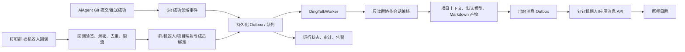
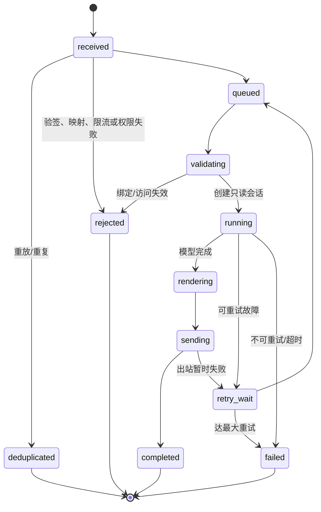

# 钉钉项目通知与群聊 AI 协作规格

> 状态：待实施（本文只定义设计，不改变业务代码）
> 范围：AiAgent 的项目 Git 成功通知、钉钉群内 @机器人任务协作、管理配置与审计。
> 安全基线：群聊入口默认只读、只产生分析/计划/Markdown 产物；**不得自动写代码、修改工作区、Git 提交或 Git 推送**。

## 1. 目标与非目标

### 1.1 目标

1. 代码库或项目批量 `commit-and-push` 实际成功后，向该项目已启用且有效的钉钉群发送任务与提交摘要。
2. 群成员 @机器人并描述“某项目，请修改某功能”时，安全接收钉钉回调，解析群—项目映射和成员身份，创建后台会话，使用 AiAgent 当前默认模型及该项目受控上下文完成分析。
3. 完成、拒绝、失败或需要澄清时，机器人将简洁结果回复到原群；详细 Markdown 保存在 AiAgent 的受控协作产物中，并提供受权限保护的跳转链接。
4. 让管理员能配置机器人、项目—群映射、成员授权、通知模板、开关、限流和审计保留期。

### 1.2 明确非目标与硬边界

- 不把群消息直接拼成 shell、文件路径、Git 参数或模型工具权限。
- 不因消息中出现“修改”“提交”“推送”而执行写入。默认仅返回分析、实施计划、风险、需要确认的操作以及 Markdown 任务产物。
- 群内任务不调用写文件、应用补丁、代码编辑器、Git `commit`、Git `push`、重置、拉取或运行外部进程的工具。
- 即使后续增加“执行修改”能力，也必须跳转 AiAgent 内由有项目权限且具备 `CanCommitCode` 的用户发起；每一次工作区写入、提交、推送分别沿用现有授权，并取得额外、针对目标和摘要的明确确认。钉钉消息、卡片点击、默认同意和机器人身份都不能替代确认。
- 首期不处理私聊、跨组织群、群文件下载、图片/OCR、自动拉群成员、自动创建项目映射，也不回传完整 diff、密钥、Token、工作区绝对路径或未脱敏 Git 输出。

## 2. 已有能力与复用边界

| 能力 | 当前入口/服务 | 本方案的复用方式 |
| --- | --- | --- |
| 项目访问 | `IProjectAccessService.CanAccess` | 钉钉成员必须绑定 AiAgent 用户；以该用户身份校验项目访问。管理员可额外配置机器人服务身份，但不得绕过成员访问校验。 |
| 代码提交/推送 | `ICodeRepositoryGitService.ProjectCommitAndPushAsync`、`CommitAndPushAsync` | 仅在其返回逐仓库实际成功结果后发布领域事件；不由钉钉任务反向调用。 |
| Git 提交权限 | `AuthenticatedUser.CanCommitCode` | 将来任何写入/提交/推送仍由现有权限与明确确认共同控制。 |
| 会话与消息 | `IChatSessionService`、`AiChatSession`/`AiChatMessage` | 新建 `channel=dingtalk` 的后台会话与受控群任务；会话不能被未绑定的群成员当作普通用户会话读取。 |
| 项目上下文 | `IProjectReferenceContextService`、Markdown 索引上下文、代码库索引 | 仅在已通过项目访问校验后加载已登记代码库、项目 Markdown、索引与 RAG 上下文。 |
| 默认模型 | `ICodexModelPolicyService.ResolveModel(null, null)` | 群聊任务固定取当前管理员配置的默认模型/推理强度，忽略群消息的模型覆盖指令。 |
| 审计与设置快照 | `AiSettingSnapshot`、现有 Admin/Settings 模式 | 配置修改保留版本与操作者；运行审计独立持久化。 |

## 3. 总体架构



所有 HTTP 回调只做认证、最小结构校验、幂等登记和快速应答；耗时的模型调用、上下文读取、消息发送均在后台 worker 中完成。出站消息也使用 outbox，避免数据库状态已完成而网络发送丢失。

## 4. 身份、映射与授权模型

### 4.1 机器人类型

支持两类经过管理员配置的出站通道，统一抽象为 `DingTalkBot`：

| 类型 | 用途 | 机密与限制 |
| --- | --- | --- |
| `custom_webhook` | 向固定项目群发送提交通知、任务结果 | Webhook access token 与加签 secret 加密保存；只能发到已配置 webhook 所属群，不能接收 @ 回调。 |
| `enterprise_app_bot` | 接收群消息/事件、向原群回复 | 保存 app key、app secret、事件回调 token、AES key 等最小必要配置并加密；仅接受配置的企业与机器人 ID。 |

“接收 @机器人并回复原群”需要使用企业应用机器人及钉钉支持的消息/事件能力；自定义 Webhook 仅可作为通知降级通道。实施前须在目标租户的钉钉开放平台按版本确认可用的群消息事件、回调协议与机器人回复 API。

### 4.2 映射规则

一条 `DingTalkProjectBinding` 绑定一个 `ProjectId + ConversationId + BotId`。`ConversationId` 是钉钉回调提供的不可伪造会话标识，不以群名称匹配。建议唯一约束：`(TenantId, ConversationId, BotId)`；一群默认只绑定一个项目。若业务需要多项目群，必须显式启用并要求消息带精确项目别名。

解析优先级：

1. 校验回调租户、机器人、会话 ID。
2. 取得启用的群绑定；没有绑定则仅回复“该群尚未绑定项目”，不透露项目列表。
3. 单项目绑定时，项目名可作为描述性文字但不改变目标项目；多项目绑定时只允许匹配管理员定义的唯一别名。
4. 成员 DingTalk `senderId` 必须映射到已启用 AiAgent 用户，且该用户通过 `IProjectAccessService.CanAccess(user, projectId)`。
5. 群成员是否被允许使用机器人还要通过绑定的 `AllowedMemberMode`：`linked_project_users`（默认）、`allowlist` 或 `admins_only`。

未知成员、用户未绑定、项目无权、群/机器人不匹配都以通用拒绝文案结束，审计记录原因但不向群泄露权限或项目详情。

### 4.3 用户绑定

新增 `DingTalkUserBinding`，由登录 AiAgent 的用户完成一次经钉钉 OAuth/免登校验的绑定；后台不得让管理员手工填写或信任任意 `senderId`。绑定以 `(TenantId, DingTalkUserId)` 唯一，冲突时拒绝并要求原账号解除或管理员走审计化的账户恢复流程。

群会话“发起人”必须是该绑定 AiAgent 用户。系统可设单独、最小权限的 `DingTalkServiceAccount` 作为技术执行身份，但它只能发送/存储受控通道数据，不能获得用户项目权限或 `CanCommitCode`。

## 5. 入站回调安全

### 5.1 端点与处理顺序

建议专用匿名入口：`POST /api/v1/integrations/dingtalk/callback`。该端点不接收浏览器 JWT，且不复用普通聊天接口的“当前 HTTP 用户”。处理顺序为：

1. 从原始请求读取钉钉规定的 timestamp、nonce、signature、encrypt/body 等字段，限制 body 最大 256 KB、Content-Type、字符集和请求方法。
2. 根据不可敏感的应用/机器人路由键找到候选配置；不存在时统一返回钉钉协议要求的失败响应。
3. 按钉钉当前官方协议验证签名/时间戳，并在适用时以 AES key 解密、校验明文签名、encrypt 字段及接收方/应用标识；使用官方 SDK 或经过互操作测试的等价实现，禁止自创加密协议。
4. 校验事件类型为已允许的群消息/@机器人事件，校验 tenant、bot、conversation、sender 等必需字段及长度；消息正文按不可信文本处理。
5. 使用平台 `eventId/messageId`（优先）或经规范化字段计算的不可逆摘要写入 `DingTalkInboundEvent` 的唯一键；冲突表示重投，直接返回成功 ack，不再次排队。
6. 对 `BotId + ConversationId + SenderId` 执行滑动窗口限流（建议 5 条/分钟、30 条/小时），超限也 ack 并通过受控消息提示稍后再试。
7. 保存最小化入站事件、创建 `dingtalk_inbound` outbox；在平台时限内返回 ack。绝不在回调线程运行 LLM 或 Git。

### 5.2 防重放、保密与日志

- timestamp 允许窗口默认 ±5 分钟；超过窗口拒绝。nonce 在有效窗口内记录并拒绝重复。若钉钉事件协议不含 nonce，使用 `eventId/messageId` 幂等键和时间窗组合。
- 配置密钥用 ASP.NET Data Protection 保护后保存；密钥轮换保留 `KeyVersion`，旧版本仅用于未完成的解密/重试窗口。日志、审计、HTTP 错误和健康检查绝不输出 secret、access token、完整 webhook URL、AES key、Authorization 或解密后的原文。
- 原始密文最多保存 24 小时用于故障排查；默认只保存经截断和脱敏的消息摘要、哈希和结构化字段。明文/模型输出按项目审计保留期控制，支持管理员授权的受控查看。
- 拒绝任意来源 IP 的“信任”作为唯一鉴权依据；可在反向代理/WAF 增加钉钉公开网段 allowlist，但仍必须验证签名与加密。

## 6. 两条业务流程

### 6.1 Git 成功后的项目群通知

`CodeRepositoryGitService` 完成一次单仓库或项目批量 `CommitAndPushAsync` 后，在同一应用服务层根据返回结果构造 `ProjectGitPushSucceeded` 领域事件。只有 `Outcome=result.Ok/succeeded` 的仓库进入通知；跳过、认证失败、远端领先、仅本地提交成功但 push 失败均不能通知“推送成功”。

事件载荷只含：项目 ID、仓库 ID/显示名、分支、提交 SHA（短 SHA）、提交摘要、触发 AiAgent 用户 ID、发生时间、关联操作 ID 和可选 `TaskSummary`。`TaskSummary` 取本次操作已显式关联的 AiAgent 任务标题/编号；未关联时明确标记“未关联任务”，不得从 Git 输出或模型推断。Git 子进程原始输出不进入消息正文。事务性 outbox 负责将成功事件与出站计划可靠落库；同一 `operationId + repositoryId + bindingId` 唯一，防止重试重复通知。

通知模板默认：

```text
【{project}】代码已推送
仓库：{repository} · 分支：{branch}
任务：{task_summary_or_unlinked}
提交：{short_sha} {commit_summary}
触发人：{operator_display_name}
下一步：请在群内 @机器人 描述需要分析的任务；机器人默认只生成计划和 Markdown，不会自动改代码或推送。
```

模板允许管理员选择是否展示提交人和短 SHA，字段白名单固定，输出经过长度限制和 Markdown/链接安全转义。单次批量操作可合并为一条项目摘要消息（默认最多 10 个仓库，超出时显示数量），避免群刷屏。

### 6.2 群内 @机器人任务协作

1. 成员在已绑定群 @机器人并输入需求；未 @ 不处理。机器人回复“已接收，正在生成分析与计划（不会改代码/提交/推送）”。
2. worker 完成映射、账户绑定、项目访问和限流检查，创建 `DingTalkGroupTask`，同时以绑定用户创建/关联 `AiChatSession`，并写入来源元数据（只保存 external ID 摘要）。
3. 将用户原话作为不可信输入，并注入固定通道系统约束：仅分析、澄清、计划、风险、测试建议和 Markdown；禁止任何写入/执行/Git 工具；不得泄露项目外信息或敏感配置。
4. 调用当前 `ICodexModelPolicyService.ResolveModel(null, null)` 的默认模型，复用项目引用与 Markdown 索引上下文；模型选择、推理强度和 agent 不接受群消息覆盖。
5. 模型完成后，生成受控 Markdown 产物（标题、需求复述、影响范围、实施步骤、风险、验证、需要人工确认的写入/Git 动作），将短摘要回复**同一个** `ConversationId`。输出过长时群内只发摘要和有权限的 AiAgent 链接。
6. 失败、超时、内容安全拦截、权限拒绝或映射缺失使用对应状态和不泄密文案。任何情况下均不继续尝试代码写入或 Git 操作。

提示注入、项目别名冲突、要求查看密钥、越权项目、让机器人“忽略规则”都视为不可信输入；固定系统策略和服务端工具白名单的优先级高于群消息。

## 7. 只读协作执行配置与确认升级

为避免仅靠 prompt 的软限制，定义 `DingTalkReadOnly` 通道执行策略，并在请求 DTO、编排器、工具注册和审计四层执行：

| 能力 | 群聊默认 | 说明 |
| --- | --- | --- |
| 项目/RAG/已登记代码索引读取 | 允许 | 每次都按绑定用户项目权限检查；不读取本地配置、密钥或任意绝对路径。 |
| 创建会话、任务记录与受控 Markdown 产物 | 允许 | 仅写入 AiAgent 通道专属记录，不写入项目工作区或 Git 仓库。 |
| 生成分析、计划、测试建议 | 允许 | 可在群内发送脱敏摘要。 |
| 写代码、补丁、文件创建/编辑、运行命令 | 禁止 | 后端不注册相应 tool，拒绝模型指令。 |
| Git add/commit/push/pull/reset/checkout | 禁止 | 后端不调用现有 Git 服务。 |

未来升级必须是 AiAgent 内显式“执行计划”工作流：群回复中的链接打开待确认的 Markdown；项目授权用户审阅目标仓库/文件、变更范围和风险，分别确认“允许写入”“允许提交”“允许推送”。服务端须为每项确认签发短时、单用途、绑定 `userId + projectId + taskId + action + targetDigest` 的确认令牌。确认不可由群消息、机器人回调或模型输出自动产生、复用或续期。

## 8. 数据模型

新实体遵循现有 SqlSugar 约定：所有新增字段显式 `[SugarColumn(IsNullable = true)]`；通过 CodeFirst/Schema initializer 增量建表，不修改既有聊天/Git 数据语义。

| 实体 | 关键字段 | 约束/用途 |
| --- | --- | --- |
| `AiDingTalkBot` | `Id`、`TenantId`、`BotType`、`BotIdentity`、`CredentialCiphertext`、`KeyVersion`、`Enabled`、`OutboundEnabled`、`InboundEnabled` | `(TenantId, BotIdentity)` 唯一；所有机密加密保存。 |
| `AiDingTalkProjectBinding` | `Id`、`ProjectId`、`BotId`、`ConversationId`、`ProjectAlias`、`AllowedMemberMode`、`AllowedMemberIdsJson`、`NotificationEnabled`、`GroupAgentEnabled` | `(BotId, ConversationId)` 唯一；项目删除/禁用后禁止路由。 |
| `AiDingTalkUserBinding` | `Id`、`AiUserId`、`TenantId`、`DingTalkUserId`、`VerifiedAt`、`RevokedAt` | `(TenantId, DingTalkUserId)` 唯一；保留绑定验证证据摘要。 |
| `AiDingTalkInboundEvent` | `Id`、`BotId`、`EventId`、`MessageId`、`NonceHash`、`OccurredAt`、`ReceivedAt`、`PayloadHash`、`Status` | `EventId`/`MessageId` 唯一；密文 TTL 与最小化摘要。 |
| `AiDingTalkGroupTask` | `Id`、`BindingId`、`InboundEventId`、`InitiatorUserId`、`ChatSessionId`、`RequestExcerpt`、`Status`、`AttemptCount`、`ResultArtifactId`、`ErrorCode` | `InboundEventId` 唯一；连接会话、产物和群消息。 |
| `AiDingTalkOutboundMessage` | `Id`、`BotId`、`ConversationId`、`Kind`、`DedupKey`、`PayloadJson`、`Status`、`AttemptCount`、`NextAttemptAt`、`ProviderMessageId` | `DedupKey` 唯一；出站 outbox。 |
| `AiDingTalkAuditLog` | `Id`、`CorrelationId`、`ActorType`、`ActorId`、`Action`、`ProjectId`、`TaskId`、`Outcome`、`MetadataJson`、`OccurredAt` | 追加写入；元数据脱敏，不保存机密。 |

建议单独的 `AiChannelMarkdownArtifact` 保存群任务 Markdown（`OwnerUserId`、`ProjectId`、`TaskId`、`Content`、`ContentHash`、`RetentionUntil`），而不是写入代码仓库。与普通 `AiChatSession` 的来源关系放在 `MetadataJson`/关联表中，避免前端把群会话误显示给非发起人。

## 9. API、后台设置与 UI

### 9.1 服务端 API

| 方法 | 路径 | 权限 | 作用 |
| --- | --- | --- | --- |
| `POST` | `/api/v1/integrations/dingtalk/callback` | 钉钉签名/加密验证 | 匿名回调入口，仅快速 ack 和入队。 |
| `GET/POST/PUT` | `/api/v1/admin/dingtalk/bots`、`/{id}` | 管理员 | 管理机器人配置；读响应永不返回 secret。 |
| `GET/POST/PUT/DELETE` | `/api/v1/admin/dingtalk/project-bindings`、`/{id}` | 管理员 + 项目存在校验 | 管理项目—群—机器人映射、通知与群协作开关。 |
| `POST` | `/api/v1/dingtalk/user-bindings/authorize` | 当前登录用户 | 发起/完成可验证的钉钉身份绑定。 |
| `DELETE` | `/api/v1/dingtalk/user-bindings/me` | 当前登录用户 | 撤销本人绑定；之后不再接受其群任务。 |
| `GET` | `/api/v1/dingtalk/tasks/{taskId}` | 发起人或管理员且有项目权限 | 查看任务状态、受控 Markdown 和安全摘要。 |
| `GET` | `/api/v1/admin/dingtalk/audit` | 管理员 | 按时间、机器人、群绑定、项目、任务和结果检索审计。 |
| `POST` | `/api/v1/admin/dingtalk/bots/{id}/test-outbound` | 管理员 + 二次确认 | 向已绑定测试群发送固定测试消息；不使用任意 webhook URL。 |

后台 Service 承担签名、解密、映射、出站、模板和限流逻辑；Dynamic API/Controller 只负责 HTTP 与授权适配。DTO 使用 `JsonPropertyName`，前端经 `front/lib/dingtalk-*-api.ts` 与 `front/lib/dingtalk-*-types.ts` 调用，组件不得直接 `fetch`。

### 9.2 管理 UI

在“管理员设置 → 钉钉协作”提供：

1. **机器人**：类型、租户、Bot 标识、启用状态、回调地址复制、secret 仅写入/轮换、连通性测试、最近错误（已脱敏）。
2. **项目群绑定**：选择已登记项目与机器人、展示从钉钉事件获得并确认的群会话 ID/群名、项目别名、成员策略、推送通知和群协作开关、消息模板预览。
3. **成员绑定**：显示用户、已验证钉钉账号掩码、状态和撤销；管理员不可见完整身份凭据。
4. **任务与审计**：状态、重试次数、关联项目/会话、脱敏摘要、时间线、失败原因和重发按钮；重发仅重发既有安全内容，不重新运行任务。
5. **安全策略**：速率限制、最大输入/输出长度、超时、重试次数、保留期和“只读群协作”固定为开启且不可关闭；未来写入升级的确认策略单列但初期禁用。

普通用户在自己的会话/任务列表中只能看到本人发起且当前仍有项目访问权的群任务与 Markdown；群内链接需要 AiAgent 登录并重新授权，不能因为拿到 URL 便读取。

## 10. 队列、状态机、失败重试与可观测性

### 10.1 队列与并发

- 初期采用数据库 outbox + `BackgroundService` 轮询；多实例部署时以数据库行锁/租约领取，不能依赖单机内存队列。生产规模可替换为消息队列，但保留 outbox 边界。
- 按 `ProjectId` 和 `ConversationId` 串行处理同一群同一项目的群任务，保证上下文与回复顺序；不同项目可并行，设置全局模型调用并发上限。
- 每条任务携带 `CorrelationId`，贯穿入站事件、后台会话、模型运行、出站消息和审计。取消、群绑定禁用、用户撤销绑定或失去项目访问权时，worker 在每个阶段重新检查并安全终止。

### 10.2 状态机



`DingTalkOutboundMessage` 独立使用 `pending → sending → sent | retry_wait | dead_letter`。任务在模型完成后即持久化产物；出站重试不会再次执行模型，除非管理员明确创建新的任务。

### 10.3 重试与告警

- 网络超时、429、5xx、临时 token 获取失败等可重试错误采用指数退避并随机抖动（建议 1 分钟、5 分钟、15 分钟、1 小时，最多 5 次）；尊重 `Retry-After`。
- 验签失败、解密失败、未知群/机器人、用户无权、输入违规、无效配置、模型策略拒绝、4xx 业务错误均不可重试。
- 模型超时默认 10 分钟；达到任务级超时后取消运行，输出“未完成”而非猜测成功。模型输出/消息超过限制时截断并附任务链接。
- 连续验签失败、dead-letter 堆积、机器人 token 连续失败、任务失败率超阈值应产生管理员告警。健康检查只输出计数、延迟与最近脱敏错误码。

## 11. 审计、隐私与内容安全

每个关键动作追加审计：机器人配置变更/轮换、群绑定变更、用户绑定/撤销、回调验签结果、去重、权限决策、任务状态迁移、模型/上下文版本、产物哈希、出站发送、重试、链接访问和未来任何确认。审计以 UTC 存储、UI 本地化展示；默认保留 180 天，可配置且不能低于企业合规下限。

群消息和模型输出先经过大小、控制字符、恶意链接及敏感信息检测；涉及凭据、个人敏感信息、项目外数据或不安全指令时，停止或转为安全提醒。对群内输出执行保守脱敏（token、密码、连接串、私钥格式）；不得把模型思考过程、工具内部日志、Git credential 或工作区路径发到钉钉。

## 12. 钉钉协议与配置前置

实现必须以目标租户和当前钉钉开放平台版本为准，并在集成测试环境完成互操作验证。重点参考钉钉官方文档中的[自定义机器人接入](https://open.dingtalk.com/document/orgapp/custom-robot-access)、[应用回调消息加解密](https://open.dingtalk.com/document/app/callback-event-message-body-encryption-and-decryption)与[事件订阅配置](https://open.dingtalk.com/document/development/event-subscription-enables-disables-application-events)。

上线前需要管理员完成：企业应用/机器人创建与发布范围配置、群内安装机器人、消息事件订阅、HTTPS 公网回调地址、回调 token/AES key 配置、出站权限授权、测试群绑定，以及钉钉侧的签名/加密/回复 API 联调。不得将真实密钥写入 `appsettings.json`、前端环境变量、代码仓库或本文档；生产密钥应来自受控密钥存储或既有安全配置机制。

## 13. 分期实施

| 阶段 | 交付 | 不做的事 |
| --- | --- | --- |
| P0：设计验证 | 钉钉应用能力矩阵、回调/回复 API 联调样例、威胁建模、数据保留确认 | 不接生产群，不接模型。 |
| P1：安全基础 | 实体/DTO、加密配置、机器人与群绑定后台、用户身份绑定、回调验签/解密/去重、审计和 outbox | 不执行群任务，不发 Git 通知。 |
| P2：推送通知 | Git 成功领域事件、模板化出站、幂等/重试、测试群与监控 | 不从群发起模型任务。 |
| P3：只读群协作 | @机器人任务、项目权限复核、后台会话、固定默认模型、只读工具策略、Markdown 产物、原群回复 | 不写项目文件、不运行命令、不做 Git 操作。 |
| P4：运营完善 | 管理仪表盘、dead-letter 处理、限流/内容安全调优、灾备演练 | 不放开只读限制。 |
| P5：可选受控执行 | 仅在独立评审后，AiAgent 内多次明确确认的写入/提交/推送工作流 | 永不允许群消息直接触发写入或 Git。 |

## 14. 验收标准

1. 单仓库和项目批量操作中，只有实际 `push` 成功的仓库会生成一次对应项目群通知；重试、刷新页面和 outbox 重放不重复发消息。
2. 自定义 Webhook 只能发送；企业应用机器人收到合法 @事件后可在原群回复。未 @ 的消息、未绑定群、未知机器人和错误租户均不创建任务。
3. 篡改 signature、过期 timestamp、错误 AES 解密、重复 event/message ID、重复 nonce 与超限请求均不能进入模型队列或造成重复回复。
4. 已绑定但没有项目访问权的成员、未绑定成员和被撤销成员无法触发项目任务；群中不会显示可用于枚举项目/权限的细节。
5. 合法任务会创建关联的后台会话和受控 Markdown 产物，并使用当前默认模型与项目上下文；群消息中的模型参数和“忽略规则”指令无效。
6. 在 P3，审计与运行记录证明任务没有调用文件写入、外部进程、Git add/commit/push/pull/reset/checkout；任何“请直接修改并推送”仅得到计划和明确确认说明。
7. 网络临时失败按策略重试，模型结果不会因出站失败被重复生成；不可重试故障进入可检索 dead-letter，且不泄露密钥或原文。
8. 管理员可安全配置、轮换、禁用机器人和群绑定；普通用户只能查看本人且仍有项目权限的任务。所有配置/任务/发送动作具有可关联、脱敏的审计记录。
9. 钉钉密钥、webhook 完整 URL、Git 凭据、连接串、工作区绝对路径和模型内部日志不出现在前端、群消息、审计搜索结果或错误响应中。
