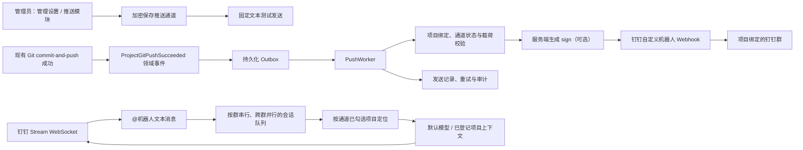

# 钉钉项目推送与 Stream 群机器人规格

> 状态：已实施初版（后续联调以钉钉开发者后台发布配置为准）
> 当前能力：管理员在“管理设置 → 推送模块”配置钉钉**自定义机器人 Webhook**及**企业应用 Stream 凭据**，并直接在通道编辑页多选项目。
> 本轮新增：钉钉 Stream 事件订阅、群内 `@机器人` 文本问答、自动项目定位、通道项目范围校验、原群回复，以及可读的流式进度摘要。

## 1. 目标与边界

### 1.1 目标

1. 管理员可新增、编辑、启用、停用和删除钉钉自定义机器人推送通道。
2. 管理员可安全保存 Webhook 中的 `access_token`，可选保存加签 `secret`，并在保存后发送固定、脱敏的测试消息验证连通性。
3. 管理员可从 AiAgent 已登记的所有项目中选择一个或多个项目，分别绑定一个或多个已启用的钉钉 Webhook 推送通道。
4. 当现有 Git 单仓库或项目批量 `commit-and-push` **实际推送成功**时，向该项目的有效绑定通道发送提交摘要；失败、跳过、仅本地提交成功均不通知“推送成功”。
5. 推送任务、测试结果、失败重试和配置变更可审计、可定位且不暴露凭据。

### 1.2 非目标与硬限制

- 不新增任何入站 HTTP 回调端点；Stream 使用服务端主动建立的 WebSocket，不需要公网回调地址、Callback Token 或 AES Key。
- 自定义机器人只能出站发送到其创建时所属群；AiAgent 不通过群名、群 ID 或任意 URL 路由消息。
- Stream 机器人仅接收群内 `@机器人` 的文本消息；处理范围仅限通道勾选的项目及其已登记仓库。模型可按当前产品授权修改仓库代码；不提供 Git 提交或推送 Agent 工具。
- 推送模块不绕过现有项目访问和 Git 授权；它只消费现有 Git 操作成功结果，不调用 `ICodeRepositoryGitService` 发起 Git 动作。
- 不在前端、日志、审计、错误响应、导出文件或 Markdown 中显示 access token、加签 secret 或完整 Webhook URL。

## 2. 钉钉自定义机器人约定

管理员在目标钉钉群中按“群设置 → 智能群助手 → 添加机器人”创建自定义机器人，取得类似下列地址的 Webhook：

```text
https://oapi.dingtalk.com/robot/send?access_token=xxxx
```

AiAgent 不持久化完整 URL，而是在管理 UI 中粘贴时仅提取并加密保存 `access_token`；发送时由服务端固定构造官方发送地址，POST JSON，例如：

```json
{
  "msgtype": "text",
  "text": { "content": "【AiAgent】钉钉推送通道测试成功。" }
}
```

如机器人启用“加签”安全设置，管理员还须在同一通道保存 `secret`。发送时服务端按钉钉当前协议生成 `timestamp` 和 `sign` 查询参数；不得由浏览器生成签名或接触 secret。机器人关键字/IP 白名单等安全设置由钉钉侧控制，AiAgent 只提示其当前部署出口 IP 可能需要加入白名单，不记录或猜测钉钉侧策略。

实现与联调须以钉钉官方[自定义机器人接入文档](https://open.dingtalk.com/document/orgapp/custom-robot-access)为准；协议字段、消息长度和签名算法变更时，先完成沙箱/测试群互操作验证再升级生产实现。

## 3. 架构与处理流程



Git 请求线程只产生成功事件并与 outbox 同步持久化，不直接调用外部 Webhook。后台 `PushWorker` 领取 outbox 后重新检查项目绑定和通道启用状态，再发送。多实例部署使用数据库行锁或租约领取消息，不能依赖单机内存队列。

## 4. 推送模块数据模型

所有新实体字段遵循现有 SqlSugar 约定显式标注 `[SugarColumn(IsNullable = true)]`；通过 Schema initializer/CodeFirst 增量建表，不能把 token 放进 `AiCodeProject`、前端环境变量或 `appsettings.json`。

| 实体 | 关键字段 | 约束与用途 |
| --- | --- | --- |
| `AiPushChannel` | `Id`、`Name`、`ProviderType`、`Enabled`、Webhook 密文、`DingTalkRobotCode`、`StreamClientId`、Stream Secret 密文、`StreamEnabled`、连接/最后帧/最后回调/重连状态 | `ProviderType` 固定 `dingtalk_custom_webhook`；名称唯一；同一 `robotCode + Client ID` 只能有一个启用的 Stream 通道；Webhook 与 Stream Secret 分别加密。 |
| `AiProjectPushBinding` | `Id`、`ProjectId`、`PushChannelId`、`TriggerType`、`Enabled`、`TemplateCode`、`CreatedBy` | `(ProjectId, PushChannelId, TriggerType)` 唯一；本期 `TriggerType` 固定 `git_push_succeeded`。 |
| `AiPushOutboxMessage` | `Id`、`CorrelationId`、`ProjectId`、`PushChannelId`、`EventType`、`DedupKey`、`PayloadJson`、`Status`、`AttemptCount`、`NextAttemptAt` | `DedupKey` 唯一；保存已脱敏、可重建的消息负载，不保存 token/secret。 |
| `AiPushAuditLog` | `Id`、`CorrelationId`、`ActorType`、`ActorId`、`Action`、`ProjectId`、`PushChannelId`、`Outcome`、`MetadataJson`、`OccurredAt` | 只追加；记录配置、测试、绑定、入队、发送、重试和停用原因。 |
| `AiDingTalkGroupAgentSession` | 源消息 ID、通道、群会话、发送者、sessionWebhook 密文、问题、项目、状态、处理开始时间、回答 | 源消息 ID 唯一；收到 Stream 消息先确认 ACK，再异步处理与回复；异常遗留的处理状态在 15 分钟后可恢复排队。 |

`CredentialCiphertext` 通过 ASP.NET Data Protection 加密，逻辑字段为 `access_token` 与可选 `sign_secret`；读 API 仅返回 `has_access_token`、`has_sign_secret` 和掩码尾部（若安全审查允许），绝不返回实际值。密钥轮换使用 `KeyVersion`；旧密文仅在必要的迁移窗口内解密后立即以新版本重加密。

## 5. 配置输入与校验

### 5.1 Webhook 输入

新增或更新通道时，管理员可以粘贴完整 Webhook，服务端验证后仅提取 token：

1. URL 必须为 `https`，host 必须精确为 `oapi.dingtalk.com`，路径必须精确为 `/robot/send`；拒绝 IP、其他 host、额外路径、片段、用户名密码和重复 query key。
2. query 必须恰好包含一个非空 `access_token`；token 长度限制为 1–512 字符，不允许控制字符或空白。校验通过后丢弃原 URL 字符串。
3. `sign_secret` 可空；若填写，长度限制为 1–512 字符，不允许控制字符、空白或换行。是否启用加签由“已配置 secret”推导，不提供单独的可误配开关。
4. `Name` 长度 2–80、去首尾空白、不可重复；`Enabled` 默认 `true`。
5. 编辑时 token/secret 是“仅写入”字段：空值代表保留已有密文，显式“清除 secret”才会移除加签配置；若无 token 则不可启用或测试。

校验错误只返回字段名和安全提示，不能回显粘贴原文。请求体、模型绑定、诊断日志和异常栈中均使用 `[REDACTED]` 替换敏感值。

### 5.2 发送前校验

每次发送（包括测试）均校验：通道存在且启用、密文可解密、token 合法、项目绑定仍启用、模板字段在白名单内、消息非空且不超过服务端配置上限。发送地址由服务端构造为：

```text
https://oapi.dingtalk.com/robot/send?access_token={url_encoded_token}
```

若存在 secret，再追加按官方规则生成的 `timestamp`/`sign`。`sign`、token、完整 URL 不写入 `PayloadJson`、日志或审计；HTTP 客户端禁用自动重定向，超时默认 10 秒，仅接受 HTTPS。

## 6. 管理设置 UI

入口固定在 **管理设置 → 推送模块**，其中提供两个页签或相邻子页。

### 6.1 推送通道

管理员可看到通道名称、类型（`钉钉自定义机器人 Webhook`）、启用状态、是否已保存 token/加签 secret、最近测试时间/结果与脱敏错误码。新建/编辑抽屉包含：

- 通道名称；
- 完整 Webhook 粘贴框（仅写入，保存后只显示“token 已保存”）；
- 可选加签 secret（仅写入，提供“清除已保存 secret”复选项）；
- 启用开关；
- “保存”与“发送测试消息”动作。
- 项目范围多选；这里勾选的项目同时控制 Git 通知和群机器人可访问范围。
- 可选 Stream 机器人配置：`robotCode`、Client ID（AppKey）、Client Secret（AppSecret）及 Stream 启用开关；Secret 仅写入。

测试发送只能使用已保存的当前通道，固定发送 `【AiAgent】钉钉推送通道测试成功。时间：{beijing_time} 北京时间（UTC+08:00）`；点击后出现二次确认，说明将向该机器人所在群发送一条真实消息。UI 显示发送中、成功时间或经过脱敏的失败码，不显示完整响应。每通道限制 10 分钟内最多 3 次测试，防止误刷屏。

### 6.2 通道内项目范围

管理员在通道编辑页从现有 `AiCodeProject` 列表多选项目，服务端同步 `git_push_succeeded` 绑定。一个通道可绑定多个项目，一个项目也可绑定多个通道。

绑定列表展示：项目、推送类型、通道名称、触发事件、启用状态、最近发送结果。停用通道或绑定后，尚未领取的 outbox 消息标记 `cancelled`，已在发送中的消息在发送前最后一次状态检查后才允许继续，避免重复或向已停用群持续推送。

普通用户不显示推送模块；项目成员也不能读取 token、编辑绑定或发送测试消息。

## 7. API 与服务边界

所有接口仅管理员可访问，并沿用现有 `IAuthService` 的管理员判定；Controller/Dynamic API 只承载 HTTP，敏感校验、加密、发送、outbox 和模板在 Service 中实现。DTO 用 `JsonPropertyName`，前端经 `front/lib/push-api.ts` 和 `front/lib/push-types.ts` 统一访问。

| 方法 | 路径 | 作用 |
| --- | --- | --- |
| `GET` | `/api/v1/admin/push/channels` | 获取脱敏后的推送通道列表。 |
| `POST` | `/api/v1/admin/push/channels` | 校验并创建钉钉 Webhook 通道。 |
| `PUT` | `/api/v1/admin/push/channels/{id}` | 修改名称、启用状态或仅写入的新 token/secret。 |
| `DELETE` | `/api/v1/admin/push/channels/{id}` | 二次确认后停用并逻辑删除；不删除历史审计。 |
| `POST` | `/api/v1/admin/push/channels/{id}/test` | 发送固定测试消息，应用管理员、通道状态和测试频率校验。 |
| `POST` | `/api/v1/admin/push/channels/{id}/stream-test` | 使用已加密保存的 Stream 凭据申请 ticket 并短暂建立 WebSocket；返回脱敏的网关、ticket 或连接阶段错误。 |
| `GET` | `/api/v1/admin/push/project-bindings` | 查询项目—推送通道绑定与最近结果。 |
| `POST` | `/api/v1/admin/push/project-bindings` | 创建项目与 `git_push_succeeded` 绑定。 |
| `PUT/DELETE` | `/api/v1/admin/push/project-bindings/{id}` | 启用/停用或删除绑定。 |
| `GET` | `/api/v1/admin/push/audit` | 查询脱敏的审计和发送状态。 |

Git 集成点位于现有 `CodeRepositoryGitService` 上层调用完成处：基于 `ProjectCommitAndPushAsync` 或单仓库 `CommitAndPushAsync` 的成功结果发布 `ProjectGitPushSucceeded`，包含项目、仓库显示名、分支、短 SHA、提交摘要、操作者、操作 ID 和可选的显式 `TaskSummary`。不得从 Git 子进程原始输出、提交正文或模型推断任务信息。

## 7.1 Stream 订阅与群机器人

管理员需在钉钉企业内部应用中启用机器人能力并选择 Stream 模式，发布后把该应用的 `robotCode`、Client ID 与 Client Secret 填入同一推送通道。后端向 `POST https://api.dingtalk.com/v1.0/gateway/connections/open` 申请短效 ticket，订阅 `CALLBACK /v1.0/im/bot/messages/get` 及钉钉后台已勾选的 `EVENT *`，再由服务器主动建立 WebSocket。实现依据钉钉 [Stream 协议](https://opensource.dingtalk.com/developerpedia/docs/learn/stream/protocol/)：ticket 不持久化、不写日志，收到消息立即 ACK，随后写入异步会话队列。

每个启用的 Stream 通道保持一条 WebSocket 长连接；管理员应在该通道中多选项目，而不是为同一 `robotCode + Client ID` 重复配置通道。连接成功时记录连接时间与最后活动时间；每个收到的 Stream 帧会更新最后帧时间，合格的 `@机器人` 文本消息会更新最后有效回调时间。关闭或连接失败后按 2、4、8…秒指数退避重试，最大间隔 5 分钟，并在管理页与审计中显示错误码、重试次数和下次重连时间。

通道列表提供“Stream 测试”。它不发送群消息，而是依次验证配置完整性、调用网关取得短效 ticket、建立一次 WSS 连接并主动关闭。结果会标出安全错误码：`gateway_http_*`（凭据/应用能力/发布状态）、`gateway_network_error`（网关网络）、`websocket_connect_failed`（WSS 网络策略）或 `stream_test_timeout`（超时）。通过后仍需在群中实际 `@机器人` 验证机器人发布和回调权限。

群聊只处理 `isInAtList=true` 的文本消息。系统从问题中匹配项目名称：匹配到且项目已在该通道勾选时，才将该项目的已登记仓库交给默认模型；未写项目名时列出通道允许项目，项目存在但未勾选时明确拒绝。机器人收到任务后立即在原群回复“开始分析”，并明确展示已定位的项目和本次使用的仓库名；随后将已有 Agent 流式事件转换为简短的过程摘要，例如“读取仓库概览”“搜索表名/字段”“定位实体定义”“整理最终回答”。不转发模型原始私密思考、工具原始输出、绝对服务器路径或凭据。若 20 秒内未出现新的阶段事件，才发送一次携带当前阶段的兜底进度，避免重复刷屏。最终回答通过钉钉消息内携带的短效 `sessionWebhook` 回到原群；该地址仅加密保存到会话完成，不能作为通用出站 URL 使用。

群会话按 `通道 + conversationId` 串行，保证同一群内请求顺序；不同群最多四路并行，避免一个项目或模型请求阻塞其他群。审计分别记录回调被接受/忽略及原因、会话出队、处理完成、原群回复失败、Stream 断开和重连排期。

群机器人使用服务器内部固定的可用管理员执行身份，而不读取浏览器 Cookie 或 `AiUserSession`，因此不会因为网页登录 token 过期失效。它只在通道已勾选的项目范围内执行；按当前产品授权，模型可以使用已登记仓库的文件写入工具修改代码。Git 提交和推送尚未作为 Agent 工具提供，因而不会由群消息自动触发。

## 8. 消息模板与发送语义

本期只提供服务端内置的 `git_push_succeeded` 文本模板，不开放自由 JSON、自由 URL 或任意请求头：

```text
【{project}】代码已推送
仓库：{repository} · 分支：{branch}
任务：{task_summary_or_unlinked}
提交：{short_sha} {commit_summary}
触发人：{operator_display_name}
```

模板变量采用固定白名单，逐字段长度限制并对控制字符、链接和敏感模式进行转义/脱敏。一次项目批量推送对同一 `operation_id + project_id + push_channel_id` 合并为一条消息，默认最多列出 10 个仓库；超出部分显示数量。唯一 `DedupKey` 防止任务重试、页面刷新或 Worker 重启重复发送。

## 9. 队列、状态机与失败处理

`AiPushOutboxMessage` 状态为 `pending → sending → sent | retry_wait | failed | cancelled`。`sent` 仅表示钉钉 HTTP API 已接受请求，不等同于群成员已阅读。接收 2xx 且平台业务结果成功才记为 `sent`；非 2xx 或业务错误记录安全错误码。

- 可重试：网络故障、超时、429、5xx。采用指数退避并抖动（1 分钟、5 分钟、15 分钟、1 小时，最多 5 次），尊重 `Retry-After`。
- 不可重试：密文无法解密、输入/模板校验失败、通道/绑定已停用、钉钉业务 4xx、token/secret 配置错误。
- 通道连续失败或 dead-letter 超阈值时告警管理员；健康检查只输出积压数、最早等待时间和脱敏错误码。
- 测试发送不进入项目 Git 事件队列，但会写入同一审计体系；测试的网络重试最多一次，避免在群里制造多条测试消息。

## 10. 审计与安全

记录管理员创建/编辑/删除通道、凭据轮换（不记录值）、测试请求与结果、项目绑定变更、Git 成功事件入队、发送、重试、取消与失败。审计以 UTC 保存、前端本地化显示，默认保留 180 天；元数据只保存 token/secret 是否存在及哈希指纹，不保存原值或完整 Webhook URL。

出站 HTTP 使用命名 `HttpClient`、固定基地址、10 秒超时、无自动重定向和最小必要请求头。日志过滤器应覆盖 URL query、JSON 字段 `access_token`/`secret`/`sign` 和 Authorization；故障诊断使用关联 ID、HTTP 状态和钉钉错误码，不记录响应正文中的敏感片段。

## 11. 分期实施

| 阶段 | 交付 | 明确不做 |
| --- | --- | --- |
| P1：推送通道基础 | 数据模型、密文保护、Webhook 解析校验、管理员推送模块、保存/编辑/停用、固定测试发送与审计 | 事件订阅、回调、群聊、AI。 |
| P2：项目绑定与 Git 通知 | 项目—通道绑定、Git 成功领域事件、outbox、模板、幂等、重试与告警 | 任何反向 Git 或群消息能力。 |
| P3：运营完善 | 审计筛选、死信处理、通道轮换演练、限流和监控 | 不开放自由 URL/请求体。 |
| P4：Stream 群机器人 | 服务器主动 WebSocket、机器人回调 ACK、异步会话、原群回复、项目/仓库定位回显、流式过程摘要、通道项目范围校验 | 不开放 HTTP 回调或 Git 提交/推送 Agent 工具。 |

## 12. 验收标准

1. 管理员只能在“管理设置 → 推送模块”新增钉钉自定义机器人通道；保存后 token/secret 从不回显，普通用户不能访问任何推送配置接口或页面。
2. 非 HTTPS、非官方 host/path、缺失/重复 token、控制字符 token/secret 和重复名称均被服务端拒绝；数据库、日志、审计和 API 响应没有完整 Webhook 或凭据。
3. 保存有效通道后，管理员确认测试可向对应群发送固定测试消息；测试状态、时间、关联 ID 和脱敏失败码可查，频率限制生效。
4. 管理员可选择任意已登记项目，并将其与一个或多个已启用 Webhook 通道绑定；通道可被多个项目复用，项目也可绑定多个通道。
5. 仅 `commit-and-push` 的实际推送成功结果产生出站消息；跳过、失败、远端领先或仅本地提交的仓库绝不显示“代码已推送”。
6. 同一 Git 操作、项目和通道即使在重试、服务重启或刷新后最多发送一次成功通知；批量推送按规则合并摘要。
7. 临时网络错误可按策略重试；凭据错误、通道/绑定停用和输入校验错误不重试，并在审计中留下脱敏原因。
8. 不暴露 `/callback` 等入站 HTTP 端点；Stream 连接无需公网回调。`@机器人` 仅创建受通道项目范围限制的异步会话；其过程消息必须显示已定位项目、已选仓库和可理解的检索/整理阶段，且不得泄露原始思考、凭据或绝对服务器路径；未勾选的项目必须被明确拒绝。Git 提交或推送不可由机器人自动触发。
9. 每个启用的 `robotCode + Client ID` 至多维护一个 Stream 连接；管理页必须显示最近 Stream 帧、最近有效回调和重连计划。单群请求顺序执行，不同群可并行处理；重连和会话/回复失败均需产生脱敏审计。
