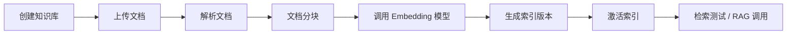
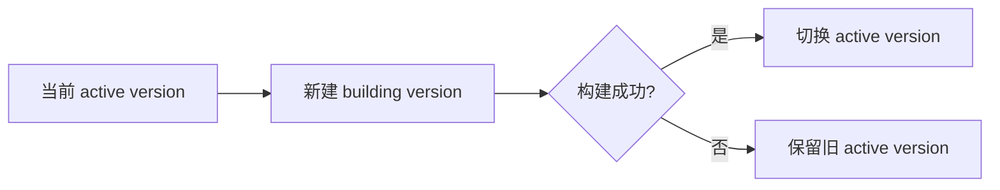

# AiAgent 前端中英文切换与知识库模块设计

日期：2026-07-01

## 目标

本阶段先记录设计，不直接进入代码实现。目标分两块：

1. 前端所有可见文案支持中文/英文切换，语言选择可以持久化。
2. 参考 DeepTutor 的 Knowledge Center，设计 AiAgent 的知识库模块、数据表、后端服务边界和前端页面层级。

## DeepTutor 参考结论

### 中英文切换

DeepTutor 的做法不是在组件里到处写条件判断，而是建立统一 i18n 层：

- `web/i18n/I18nProvider.tsx`：在前端入口同步当前语言，并同步 `<html lang>`。
- `web/i18n/init.ts`：初始化 i18next、标准化语言代码、按需加载语言资源。
- `web/locales/en/*.json`、`web/locales/zh/*.json`：按语言维护文案字典。
- 页面组件通过 `useTranslation()` 调用 `t("xxx")`，避免业务组件硬编码展示文本。
- 配套脚本检查中英文 key 是否一致，避免只加中文没加英文。

AiAgent 不一定要完整引入 i18next，但应该保留这个架构思想：文案集中、组件只拿翻译函数、语言设置从后端或本地持久化读取。

### 知识库模块

DeepTutor 的 Knowledge Center 不是单一页面，而是一个完整生命周期：

- 首页展示检索引擎：LlamaIndex、PageIndex、GraphRAG、LightRAG、LightRAG Server、Obsidian。
- 首页展示知识库列表，每个知识库绑定一个检索引擎。
- 创建知识库支持上传文档、绑定引擎、连接外部目录或外部索引。
- 文档进入 `raw/` 后，后台任务执行解析、分块、embedding、索引构建。
- 索引按 embedding 配置做版本化，例如 `version-1`、`version-2`，重建索引时保留旧版本。
- 当前 embedding 配置变化后，知识库可以标记为需要重新索引。
- 前端通过状态、进度、版本、文档数量来展示知识库是否可用。

这个设计里最值得 AiAgent 继承的是：知识库和检索引擎解耦、文档和索引版本解耦、索引构建异步化。

## AiAgent 当前状态

### 前端

- `front/app/layout.tsx` 目前固定 `<html lang="zh-CN">`。
- `front/components/layout/AppSidebar.tsx` 已有左侧菜单和 `Knowledge Center` 入口，但没有 `/knowledge` 页面。
- Settings、Models、Embedding 等页面已有较完整的配置界面，但可见文本大多是英文硬编码。
- 模型配置页已经具备 LLM、Embedding、Search、TTS、STT、Image、Video 等服务类型，知识库后续可以直接依赖 Embedding 配置。

### 后端

- 当前后端使用 .NET/Furion + SqlSugar + SQL Server。
- 模型配置已经有 CodeFirst 初始化和服务配置保存逻辑。
- `SettingsResponse.Ui.Language` 已经具备语言字段雏形，但需要真正持久化、更新和前端消费。

## 中英文切换设计

### 语言范围

第一阶段只支持：

- `zh-CN`：默认语言，中文界面。
- `en-US`：英文界面。

不建议现在做路由级语言前缀，例如 `/zh/settings`、`/en/settings`。AiAgent 当前更像工具型后台，使用“运行时语言设置”更简单。

### 前端目录建议

```text
front/
  i18n/
    dictionaries/
      zh-CN.ts
      en-US.ts
    I18nProvider.tsx
    useI18n.ts
    keys.ts
```

职责：

- `dictionaries/*.ts`：集中保存展示文案。
- `I18nProvider.tsx`：读取当前语言，提供 `t(key, params?)`。
- `useI18n.ts`：组件侧统一使用 `const { t, language, setLanguage } = useI18n()`。
- `keys.ts`：可选，用 TypeScript 限制翻译 key，减少拼写错误。

### 后端接口建议

新增或扩展 UI 设置接口：

```text
GET  /api/v1/settings/ui
PUT  /api/v1/settings/ui
```

返回示例：

```json
{
  "language": "zh-CN",
  "theme": "light"
}
```

落库方式建议复用设置模块风格，新增通用设置表会更灵活：

```text
ai_user_setting
  Id
  UserId
  SettingKey       -- ui, model_catalog, knowledge_preferences
  PayloadJson
  CreatedAt
  UpdatedAt
```

如果暂时没有用户体系，`UserId` 可以为空或固定为 `default`，后面再迁移到真实用户。

### 改造顺序

1. 建立 i18n Provider 和字典。
2. 先改左侧菜单、Settings 首页、Models 二级页、LLM/Embedding 三级页。
3. 在 Settings -> Appearance 增加语言切换。
4. 保存语言到后端，刷新后仍保持用户选择。
5. 新增脚本或简单检查，确保 `zh-CN` 和 `en-US` 字典 key 一致。

## 知识库模块设计

### 页面层级

参考 DeepTutor，AiAgent 建议做三层：

```text
/knowledge
  知识库中心首页
  - 检索引擎卡片
  - 知识库列表
  - 新建知识库按钮

/knowledge/[id]
  知识库详情
  - 概览
  - 文档
  - 索引版本
  - 检索测试
  - 设置

/knowledge/engines/[engine]
  检索引擎详情
  - 引擎说明
  - 可用状态
  - 需要的模型/密钥/依赖
  - 默认参数
```

### 第一阶段 UI

首页先做这些内容：

- 标题：知识中心 / Knowledge Center。
- 新建知识库按钮。
- 检索引擎卡片：
  - Local Vector：本地向量检索，第一阶段主引擎。
  - PageIndex：预留，云端/外部检索。
  - GraphRAG：预留，图谱检索。
  - LightRAG：预留。
  - Obsidian：预留，只做外部知识源指针。
- 知识库卡片：
  - 名称
  - 引擎
  - 文档数量
  - 状态
  - 是否默认

详情页先做这些内容：

- 文档上传。
- 文档列表。
- 当前索引状态。
- 重建索引按钮。
- 检索测试输入框。
- 索引版本列表。

### 后端服务边界

```text
Services/Knowledge/
  KnowledgeAppService.cs
  KnowledgeBaseService.cs
  KnowledgeDocumentService.cs
  KnowledgeIndexService.cs
  KnowledgeSearchService.cs
  KnowledgeEngineRegistry.cs
  Engines/
    IKnowledgeEngine.cs
    LocalVectorKnowledgeEngine.cs
  Parsing/
    IDocumentParser.cs
    MarkdownParser.cs
    TextParser.cs
    PdfParser.cs
  Storage/
    IKnowledgeFileStorage.cs
    LocalKnowledgeFileStorage.cs
```

核心接口：

```csharp
public interface IKnowledgeEngine
{
    string EngineType { get; }
    Task<EngineStatusDto> GetStatusAsync();
    Task<IndexBuildResultDto> BuildIndexAsync(Guid knowledgeBaseId, Guid versionId);
    Task<SearchResultDto> SearchAsync(Guid knowledgeBaseId, KnowledgeSearchRequest request);
}
```

这样后续接 PageIndex、GraphRAG、LightRAG 时，只扩展引擎实现，不推翻知识库 CRUD。

### 数据表设计

#### ai_knowledge_base

知识库主表。

```text
Id
Name
DisplayName
Description
EngineType          -- local_vector/pageindex/graphrag/lightrag/obsidian
Status              -- draft/indexing/ready/error/disabled/needs_reindex
IsDefault
DocumentCount
ActiveVersionId
MetadataJson
CreatedAt
UpdatedAt
DeletedAt
```

#### ai_knowledge_document

知识库文档表。

```text
Id
KnowledgeBaseId
FileName
OriginalFileName
ContentType
Extension
FileSize
FileHash
StoragePath
ParserType
Status              -- uploaded/parsing/parsed/indexing/indexed/error
ErrorMessage
CreatedAt
UpdatedAt
DeletedAt
```

#### ai_knowledge_index_version

索引版本表。

```text
Id
KnowledgeBaseId
VersionNo
Status              -- building/ready/active/failed/archived
EngineType
EmbeddingProfileId
EmbeddingModelId
EmbeddingModel
EmbeddingDimension
EmbeddingSignature
ChunkConfigJson
StoragePath
DocumentCount
ChunkCount
ErrorMessage
CreatedAt
ActivatedAt
ArchivedAt
```

#### ai_knowledge_chunk

分块表。

```text
Id
KnowledgeBaseId
DocumentId
IndexVersionId
ChunkNo
Title
Content
TokenCount
PageNo
MetadataJson
EmbeddingVectorJson
CreatedAt
```

第一阶段可以把向量保存成 JSON，适合小规模验证。后续如果知识库变大，再切换到专门向量库或 SQL Server 新版本向量能力。这里必须通过 `KnowledgeSearchService` 抽象，避免 UI 和业务层依赖具体向量存储。

#### ai_knowledge_job

后台任务表，用来记录上传、解析、索引、重建索引进度。

```text
Id
KnowledgeBaseId
DocumentId
IndexVersionId
JobType             -- upload/parse/index/reindex
Status              -- queued/running/completed/error/cancelled
Progress
Message
ErrorMessage
StartedAt
FinishedAt
CreatedAt
```

### 状态流转



重建索引时不要覆盖当前可用索引：



### 接口设计

```text
GET    /api/v1/knowledge/engines
GET    /api/v1/knowledge/bases
POST   /api/v1/knowledge/bases
GET    /api/v1/knowledge/bases/{id}
PUT    /api/v1/knowledge/bases/{id}
DELETE /api/v1/knowledge/bases/{id}

POST   /api/v1/knowledge/bases/{id}/documents
GET    /api/v1/knowledge/bases/{id}/documents
DELETE /api/v1/knowledge/bases/{id}/documents/{documentId}

POST   /api/v1/knowledge/bases/{id}/reindex
GET    /api/v1/knowledge/bases/{id}/versions
POST   /api/v1/knowledge/bases/{id}/versions/{versionId}/activate

POST   /api/v1/knowledge/bases/{id}/search
GET    /api/v1/knowledge/jobs/{jobId}
```

### 与模型配置的关系

知识库索引依赖 Embedding 模型配置：

- 创建索引版本时读取当前 active embedding profile/model。
- 保存 `EmbeddingSignature`，内容包括 provider、base_url、model、dimension。
- 当 active embedding 变更后，如果知识库没有匹配签名的索引版本，则标记 `needs_reindex`。
- 搜索时优先使用 active version，不因为配置变化直接破坏旧索引。

### 文档解析设计

第一阶段建议支持：

- `.txt`
- `.md`
- `.pdf`
- `.docx`

解析器接口统一：

```csharp
public interface IDocumentParser
{
    string ParserType { get; }
    bool CanParse(string extension, string contentType);
    Task<ParsedDocumentDto> ParseAsync(string filePath);
}
```

后续再参考 DeepTutor 接入 MinerU、Docling、MarkItDown、PyMuPDF4LLM 这类更强解析能力。

### 后台任务

第一阶段可以用 .NET `BackgroundService` + Channel 或简单队列表实现：

- API 只负责创建任务并快速返回。
- 后台任务执行解析和索引。
- 前端轮询 `GET /api/v1/knowledge/jobs/{jobId}`。
- 后续再切换 Hangfire/Quartz。

### CodeFirst

知识库相关表继续使用 SqlSugar CodeFirst 初始化，不额外写 SQL 脚本作为主路径。SQL 脚本最多作为人工排查或迁移参考。

建议新增：

```text
Entities/Knowledge/
  AiKnowledgeBase.cs
  AiKnowledgeDocument.cs
  AiKnowledgeIndexVersion.cs
  AiKnowledgeChunk.cs
  AiKnowledgeJob.cs
```

并在现有 schema initializer 中增加：

```csharp
db.CodeFirst.InitTables<AiKnowledgeBase>();
db.CodeFirst.InitTables<AiKnowledgeDocument>();
db.CodeFirst.InitTables<AiKnowledgeIndexVersion>();
db.CodeFirst.InitTables<AiKnowledgeChunk>();
db.CodeFirst.InitTables<AiKnowledgeJob>();
```

## 实施阶段建议

### 第 1 阶段：i18n 基础

- 建立前端 i18n Provider。
- 建立 `zh-CN`、`en-US` 字典。
- 改造左侧菜单、Settings、Models、LLM、Embedding 页面文案。
- Appearance 页面增加语言切换。
- 后端保存 UI language。

### 第 2 阶段：知识库静态页面

- 新增 `/knowledge` 首页。
- 新增知识库左侧菜单跳转可用页面。
- 实现引擎卡片和知识库空状态。
- 所有文案走 i18n。

### 第 3 阶段：知识库 CodeFirst + CRUD

- 新增知识库实体。
- 新增 CodeFirst 初始化。
- 新增知识库 CRUD 接口。
- 前端首页读取真实知识库列表。

### 第 4 阶段：上传与文档管理

- 支持上传文件到本地目录。
- 保存文档元数据。
- 展示文档状态。
- 做基础解析器。

### 第 5 阶段：Embedding 与索引版本

- 调用已有 Embedding 配置。
- 文档分块。
- 写入 chunk 和 embedding。
- 建立 index version。
- 支持重建索引和激活版本。

### 第 6 阶段：检索测试和 RAG 集成

- 知识库详情页增加检索测试。
- 后端实现 topK 检索。
- Chat/Agent 后续接入知识库上下文。

## 关键取舍

1. 第一阶段不要同时做所有 DeepTutor 引擎。先把 Local Vector 做通，再保留其他引擎卡片和状态。
2. 不要把向量存储写死在 SQL Server JSON 字段上。可以先这样做 MVP，但必须包在 `KnowledgeSearchService` 后面。
3. 索引版本一定要从第一版就设计，否则后面 embedding 模型切换会很痛。
4. 后台任务和进度记录要从第一版就有，哪怕先轮询，不要让上传接口同步跑完整索引。
5. i18n 要先做基础设施，再写 Knowledge Center 页面，否则后面又要返工所有文案。

## 下一步落地清单

建议下一步先做：

1. 前端 i18n 基础设施。
2. Settings -> Appearance 语言切换。
3. 改造左侧菜单和 Settings/Models 页面文案。
4. 新增 `/knowledge` 空壳页面，使用 i18n 文案展示 DeepTutor 风格的知识库中心。

完成这些后，再进入后端知识库 CodeFirst 和 CRUD。
