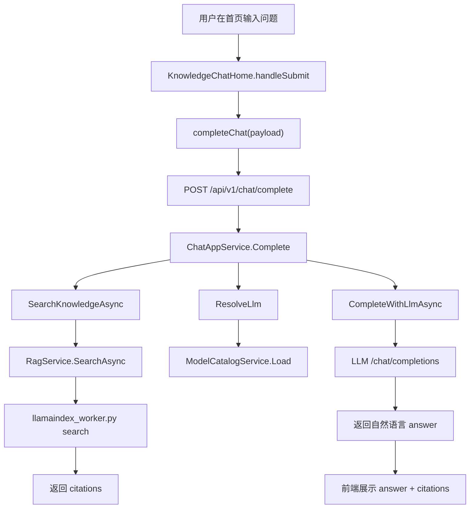

# 首页知识库聊天代码逻辑

本文记录首页聊天窗的当前实现。旧版本曾经由前端直接调用知识库 `search` 接口，返回的 `answer` 本质是检索 chunk 拼接。现在已经改为独立 Chat 服务：前端只提交聊天请求，后端负责检索知识库并调用 LLM 生成自然回答。

更完整的设计记录见：

```text
AiAgent/docs/chat-service-rag-llm-flow.md
```

## 当前目标

首页 `/` 作为聊天入口：

- 用户选择已经完成索引的知识库。
- 用户选择当前 LLM 模型。
- 用户输入问题后，前端调用 Chat 服务。
- Chat 服务检索知识库引用片段。
- Chat 服务把引用片段交给当前配置好的 LLM。
- 前端展示 LLM 回答，并展示引用 chunk 作为证据。
- 记忆、附件、语音和可视化模式先预留入口。

## 关键文件

```text
AiAgent/front/app/page.tsx
AiAgent/front/components/chat/KnowledgeChatHome.tsx
AiAgent/front/lib/chat-api.ts
AiAgent/front/lib/knowledge-api.ts
AiAgent/front/lib/api.ts
AiAgent/backed/Dtos/Chat/ChatDtos.cs
AiAgent/backed/Services/Chat/ChatAppService.cs
AiAgent/backed/Services/Knowledge/KnowledgeAppService.cs
AiAgent/backed/Rag/llamaindex_worker.py
```

## 前端入口

`AiAgent/front/app/page.tsx` 直接渲染聊天首页：

```tsx
import { KnowledgeChatHome } from "@/components/chat/KnowledgeChatHome";

export default function Page() {
  return <KnowledgeChatHome />;
}
```

`KnowledgeChatHome` 是客户端组件，负责：

- 加载知识库列表。
- 加载模型设置。
- 维护消息列表。
- 维护知识库和模型选择。
- 调用 `completeChat`。

## 页面状态

```ts
knowledgeBases    // 后端返回的知识库列表
catalog           // 模型设置 catalog
selectedKb        // 当前选中的知识库 name
selectedModelId   // 当前选中的 LLM 模型配置 Id
mode              // chat / visualize / write
messages          // 当前聊天消息
input             // 输入框内容
loading           // 是否正在加载初始化数据
sending           // 是否正在生成回答
error             // 当前错误提示
```

页面加载后并行调用：

```ts
getKnowledgeBases()
getSettings()
```

知识库只展示可用项：

```ts
kb.active_version_id && kb.status !== "error"
```

模型列表来自设置里的 LLM active profile。

## 发送问题

用户点击发送或按 Enter 后进入：

```ts
handleSubmit(event)
```

逻辑是：

1. 读取输入框问题。
2. 检查是否选择知识库。
3. 把用户消息加入 `messages`。
4. 调用 `completeChat(...)`。
5. 把 Chat 服务返回的 `answer`、`citations`、`model` 加入助手消息。

前端请求函数在：

```text
AiAgent/front/lib/chat-api.ts
```

核心请求：

```ts
POST /api/v1/chat/complete
{
  message,
  knowledge_base_name,
  model_id,
  top_k,
  mode
}
```

## 后端 Chat 服务

入口：

```text
AiAgent/backed/Services/Chat/ChatAppService.cs
```

核心方法：

```csharp
[HttpPost("complete")]
public async Task<ChatCompleteResponse> Complete(...)
```

它的流程：

1. 校验用户消息。
2. 如果传了知识库名称，调用 `SearchKnowledgeAsync` 检索引用片段。
3. 通过 `ResolveLlm` 读取当前 LLM profile/model。
4. 通过 `CompleteWithLlmAsync` 调用 OpenAI-compatible `/chat/completions`。
5. 返回 LLM 回答和引用片段。

## RAG 检索

`SearchKnowledgeAsync` 会：

1. 根据 `kbName` 查知识库。
2. 检查 `ActiveVersionId`。
3. 找到激活索引版本的 `StoragePath`。
4. 调用 `_ragService.SearchAsync(...)`。
5. 把非空 citations 返回给 LLM prompt。

真正读取 LlamaIndex 索引的是：

```text
AiAgent/backed/Rag/llamaindex_worker.py
```

## 当前调用链



## 预留能力

- 附件：输入框 `+` 按钮已预留。
- 语音输入：麦克风按钮已预留。
- 可视化：`mode=visualize` 已能传给后端，后续可接图表或思维导图工具。
- 记忆：后续可在 `ChatAppService.Complete` 前注入相关记忆，在回答后沉淀长期偏好。
- 流式输出：当前是普通 HTTP，后续可升级 SSE/WebSocket。
