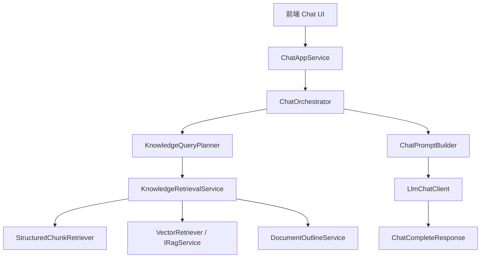
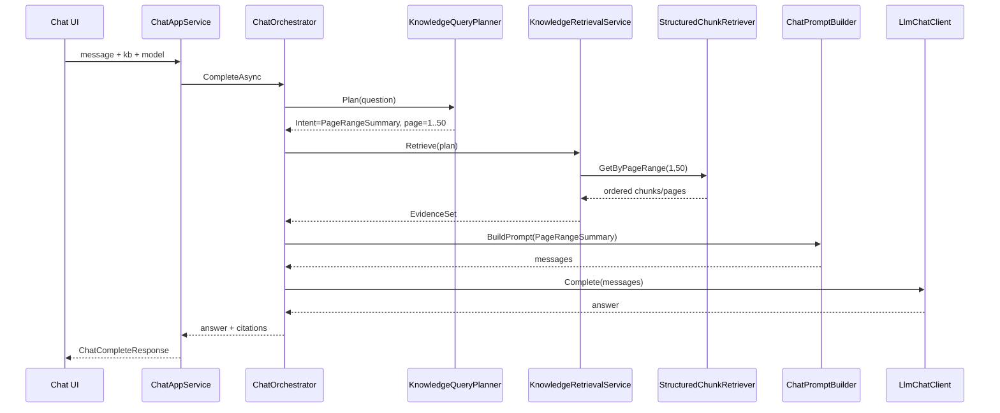

# AiAgent 知识库聊天 RAG 架构重设计

日期：2026-07-08

## 问题背景

用户问：

```text
这本书前50页讲了什么
```

DeepTutor 能回答出版权信息、序言、导论、第一章开头等结构化内容；AiAgent 当前回答“没有检索到前50页内容”。

根因不是 LLM 不够强，而是 AiAgent 当前链路太薄：

```text
用户问题 -> 向量检索 -> 把召回片段交给 LLM
```

这种链路适合“语义上相似的片段在哪里”，不适合“前50页 / 第三章 / 目录 / 书籍概览 / 某页范围”这种范围型、结构型问题。

## DeepTutor 可借鉴点

参考文件：

```text
DeepTutor/deeptutor/core/agentic/loop.py
DeepTutor/deeptutor/agents/chat/agent_loop.py
DeepTutor/deeptutor/agents/chat/agentic_pipeline.py
DeepTutor/deeptutor/agents/_shared/tool_composition.py
DeepTutor/deeptutor/tools/rag_tool.py
DeepTutor/deeptutor/knowledge/manager.py
DeepTutor/deeptutor/services/rag/pipelines/llamaindex/pipeline.py
DeepTutor/deeptutor/services/rag/pipelines/llamaindex/document_loader.py
```

DeepTutor 的关键不是“单次检索更准”，而是分层明确：

- `KnowledgeBaseManager` 管知识库生命周期、索引版本、embedding mismatch。
- `RAGService / LlamaIndexPipeline` 管索引和召回，不直接承担最终回答。
- `rag_tool` 是工具层，给 Chat/Agent 调用。
- `AgenticChatPipeline / AgentLoop` 让 LLM 可以先拿 seed，再按需调用工具继续检索。
- `tool_composition` 根据当前上下文自动挂载 `rag`、`read_source`、memory 等工具。

AiAgent 当前缺的核心能力：

- 没有 Query Planner。
- 没有页码范围检索。
- 没有结构化 chunk 表参与检索。
- 没有文档目录/页摘要/章节信息。
- Chat 服务只有固定一次检索，不支持多轮工具调用式检索。

## 新架构目标

第一阶段目标不是复制完整 DeepTutor，而是让 AiAgent 的知识库聊天具备“可解释、可扩展、可逐步增强”的骨架。

必须支持：

- 普通语义问答：比如“管理者为什么不能只自己干活？”
- 页码范围问答：比如“前50页讲了什么”“第10到30页总结一下”。
- 文档结构问答：比如“第一章讲了什么”“目录有哪些部分”。
- 书籍概览问答：比如“这本书主要讲了什么”。
- 引用可回溯：回答必须能显示文件名、页码、chunk。
- 后续接 agent loop、memory、附件、可视化时不推翻现有架构。

## 总体分层



核心原则：

- Chat 负责编排，不直接拼 RAG 细节。
- Planner 负责理解用户问题类型。
- Retrieval 负责选择检索策略。
- RAG provider 只负责向量/混合检索。
- 结构化页码/章节查询不应该依赖向量相似度。
- LLM 只负责综合回答，不负责猜数据从哪里来。

## 核心类设计

### ChatAppService

位置：

```text
AiAgent/backed/Services/Chat/ChatAppService.cs
```

职责：

- 暴露 `POST /api/v1/chat/complete`。
- 接收前端请求。
- 调用 `IChatOrchestrator`。
- 返回 `ChatCompleteResponse`。

不应该做：

- 不直接访问数据库查 chunk。
- 不直接拼 prompt。
- 不直接调用 RAG worker。

### IChatOrchestrator / ChatOrchestrator

建议位置：

```text
AiAgent/backed/Services/Chat/IChatOrchestrator.cs
AiAgent/backed/Services/Chat/ChatOrchestrator.cs
```

职责：

- 一次聊天 turn 的总调度器。
- 调用 Query Planner。
- 调用 Retrieval Service。
- 调用 Prompt Builder。
- 调用 LLM Client。
- 汇总 citations、diagnostics、model info。

核心方法：

```csharp
public interface IChatOrchestrator
{
    Task<ChatCompleteResponse> CompleteAsync(ChatCompleteRequest request, CancellationToken cancellationToken);
}
```

### KnowledgeQueryPlanner

建议位置：

```text
AiAgent/backed/Services/Chat/Planning/KnowledgeQueryPlanner.cs
```

职责：

- 分析用户问题，输出检索计划。
- 识别“前50页”“第10到30页”“第一章”“这本书主要讲什么”等意图。
- 可先用规则，后续升级为 LLM planner。

核心输出：

```csharp
public sealed class KnowledgeQueryPlan
{
    public KnowledgeQueryIntent Intent { get; set; }
    public string NormalizedQuestion { get; set; } = "";
    public string SearchQuery { get; set; } = "";
    public int? PageStart { get; set; }
    public int? PageEnd { get; set; }
    public string? ChapterTitle { get; set; }
    public bool NeedsDocumentOutline { get; set; }
    public bool NeedsPageRange { get; set; }
    public bool NeedsVectorSearch { get; set; }
}
```

意图枚举：

```csharp
public enum KnowledgeQueryIntent
{
    SemanticQuestion,
    PageRangeSummary,
    ChapterSummary,
    DocumentOverview,
    TocQuestion,
    CitationLookup
}
```

示例：

```text
问题：这本书前50页讲了什么

Plan:
Intent = PageRangeSummary
PageStart = 1
PageEnd = 50
NeedsPageRange = true
NeedsDocumentOutline = true
NeedsVectorSearch = false
```

### KnowledgeRetrievalService

建议位置：

```text
AiAgent/backed/Services/Knowledge/Retrieval/KnowledgeRetrievalService.cs
```

职责：

- 根据 QueryPlan 选择检索策略。
- 合并多路检索结果。
- 去重、排序、裁剪上下文。
- 返回结构化 evidence，而不是直接回答。

核心接口：

```csharp
public interface IKnowledgeRetrievalService
{
    Task<KnowledgeEvidenceSet> RetrieveAsync(
        AiKnowledgeBase kb,
        AiKnowledgeIndexVersion version,
        KnowledgeQueryPlan plan,
        CancellationToken cancellationToken);
}
```

### StructuredChunkRetriever

建议位置：

```text
AiAgent/backed/Services/Knowledge/Retrieval/StructuredChunkRetriever.cs
```

职责：

- 从 `ai_knowledge_chunk` 按页码、章节、文档、chunk_no 查询。
- 支持“前50页”这种确定范围检索。

核心方法：

```csharp
Task<List<KnowledgeEvidence>> GetByPageRangeAsync(
    long knowledgeBaseId,
    long indexVersionId,
    int pageStart,
    int pageEnd,
    int maxTokens,
    CancellationToken cancellationToken);
```

这是解决当前差距的关键类。

### VectorRetriever

建议位置：

```text
AiAgent/backed/Services/Knowledge/Retrieval/VectorRetriever.cs
```

职责：

- 包装现有 `IRagService.SearchAsync`。
- 只做语义召回。
- 返回 evidence。

### DocumentOutlineService

建议位置：

```text
AiAgent/backed/Services/Knowledge/Structure/DocumentOutlineService.cs
```

职责：

- 读取/生成文档目录、章节、页摘要。
- “这本书讲了什么”“第一章讲了什么”优先参考 outline 和 page summary。

后续可新增表：

```text
ai_knowledge_document_outline
  Id
  KnowledgeBaseId
  DocumentId
  IndexVersionId
  Level
  Title
  PageStart
  PageEnd
  Summary
  CreatedAt
```

### ChatPromptBuilder

建议位置：

```text
AiAgent/backed/Services/Chat/Prompting/ChatPromptBuilder.cs
```

职责：

- 把 evidence set 组装成 LLM prompt。
- 根据 intent 使用不同提示词。
- PageRangeSummary 要求模型按页码顺序总结。
- SemanticQuestion 要求模型基于引用回答。

示例：

```text
你正在回答一个页码范围总结问题。
用户要求总结第 1-50 页。
下面证据已经按页码顺序排列。
请输出：
1. 内容结构
2. 关键观点
3. 一句话总结
不要编造未出现的信息。
```

### LlmChatClient

建议位置：

```text
AiAgent/backed/Services/Chat/Llm/LlmChatClient.cs
```

职责：

- 复用模型 catalog。
- 调用 OpenAI-compatible `/chat/completions`。
- 处理 HTTP、超时、错误诊断。

`ChatAppService` 不应该直接写 HTTP 细节。

### KnowledgeEvidence / KnowledgeEvidenceSet

建议位置：

```text
AiAgent/backed/Services/Knowledge/Retrieval/KnowledgeEvidence.cs
```

职责：

- 统一表达来自结构化页码检索、向量检索、目录检索的证据。

```csharp
public sealed class KnowledgeEvidence
{
    public long? DocumentId { get; set; }
    public long? ChunkId { get; set; }
    public string FileName { get; set; } = "";
    public int? PageNo { get; set; }
    public string? Title { get; set; }
    public string Text { get; set; } = "";
    public double? Score { get; set; }
    public string SourceType { get; set; } = "chunk"; // chunk / outline / page_summary / vector
    public Dictionary<string, object?> Metadata { get; set; } = [];
}

public sealed class KnowledgeEvidenceSet
{
    public string Query { get; set; } = "";
    public KnowledgeQueryPlan Plan { get; set; } = new();
    public List<KnowledgeEvidence> Evidence { get; set; } = [];
    public List<KnowledgeCitationDto> Citations { get; set; } = [];
    public string Diagnostics { get; set; } = "";
}
```

## “前50页”应该如何执行

目标问题：

```text
这本书前50页讲了什么
```

新流程：



关键点：

- 这类问题不能只靠向量检索。
- 必须从 `ai_knowledge_chunk.PageNo` 查询。
- Evidence 必须按页码和 chunk_no 排序。
- Prompt 要告诉模型“这是页码范围总结”，不是普通 QA。

## 索引构建需要补什么

当前 `llamaindex_worker.py` 已经能按 PDF 页产生 metadata：

```python
metadata={
    "file_path": str(path),
    "file_name": path.name,
    "page_label": page_index + 1,
}
```

但这些 chunk 主要落在 LlamaIndex 的 docstore/vector store 中，C# 侧 `ai_knowledge_chunk` 没有被充分写入和使用。

需要新增索引回写流程：

```text
Python worker build index
-> 返回 chunks metadata
-> C# KnowledgeIndexMaterializer 写入 ai_knowledge_chunk
-> 激活版本
```

建议新增：

```text
AiAgent/backed/Services/Knowledge/KnowledgeIndexMaterializer.cs
AiAgent/backed/Services/Knowledge/Indexing/KnowledgeChunkWriter.cs
```

职责：

- 清理当前 building version 的旧 chunk。
- 写入 `AiKnowledgeChunk`。
- 保存 page_no、chunk_no、title、content、metadata。
- 可选保存 embedding vector 或 vector id。

RAG worker 返回结构建议增加：

```json
{
  "ok": true,
  "document_count": 1,
  "chunk_count": 483,
  "chunks": [
    {
      "document_path": "...",
      "file_name": "guanjian.pdf",
      "page_no": 1,
      "chunk_no": 1,
      "text": "...",
      "metadata": {}
    }
  ]
}
```

如果担心返回太大，可以 worker 直接写一个 `chunks.jsonl` 到版本目录，C# 再读取导入。

更推荐：

```text
version-N/
  vector_store...
  chunks.jsonl
  outline.json
  pages.jsonl
```

然后 C# `KnowledgeIndexMaterializer` 负责把 jsonl 入库。

## Query Planner 第一版规则

先不要上 LLM planner，规则足够覆盖常见问题。

规则示例：

```text
前50页 / 前 50 页 / 1-50页 / 第1到50页
=> PageRangeSummary(pageStart=1, pageEnd=50)

第3章 / 第三章 / 第一章讲什么
=> ChapterSummary(chapterTitle=...)

目录 / 大纲 / 章节
=> TocQuestion(needsDocumentOutline=true)

这本书讲了什么 / 主要内容 / 总结这本书
=> DocumentOverview(needsDocumentOutline=true, needsPageRange=true)

其他
=> SemanticQuestion(needsVectorSearch=true)
```

第二版再升级：

```text
RulePlanner -> LlmQueryPlanner -> PlanValidator
```

LLM planner 只输出 JSON plan，不能直接回答。

## Chat Agent Loop 演进

当前先做固定编排：

```text
plan -> retrieve -> answer
```

后续参考 DeepTutor 演进成工具循环：

```text
seed evidence -> LLM 判断是否够 -> 可调用 rag/read_page/read_outline -> final answer
```

建议核心类：

```text
AiAgent/backed/Services/Chat/AgentLoop/ChatAgentLoop.cs
AiAgent/backed/Services/Chat/AgentLoop/IChatTool.cs
AiAgent/backed/Services/Chat/AgentLoop/ChatToolRegistry.cs
AiAgent/backed/Services/Chat/Tools/RagSearchTool.cs
AiAgent/backed/Services/Chat/Tools/ReadPageRangeTool.cs
AiAgent/backed/Services/Chat/Tools/ReadOutlineTool.cs
```

第一阶段不必马上实现 tool calling，但类边界要为它预留。

## 新目录建议

```text
AiAgent/backed/Services/Chat/
  ChatAppService.cs
  IChatOrchestrator.cs
  ChatOrchestrator.cs
  Planning/
    KnowledgeQueryPlanner.cs
    KnowledgeQueryPlan.cs
  Prompting/
    ChatPromptBuilder.cs
  Llm/
    ILlmChatClient.cs
    LlmChatClient.cs
  AgentLoop/
    ChatAgentLoop.cs
    ChatToolRegistry.cs
    IChatTool.cs
  Tools/
    RagSearchTool.cs
    ReadPageRangeTool.cs
    ReadOutlineTool.cs

AiAgent/backed/Services/Knowledge/
  Retrieval/
    IKnowledgeRetrievalService.cs
    KnowledgeRetrievalService.cs
    StructuredChunkRetriever.cs
    VectorRetriever.cs
    KnowledgeEvidence.cs
  Structure/
    DocumentOutlineService.cs
  Indexing/
    KnowledgeIndexMaterializer.cs
    KnowledgeChunkWriter.cs
```

## 类之间的跳转关系

聊天请求主链路：

```text
ChatAppService.CompleteAsync
-> ChatOrchestrator.CompleteAsync
-> KnowledgeQueryPlanner.PlanAsync
-> KnowledgeRetrievalService.RetrieveAsync
   -> StructuredChunkRetriever.GetByPageRangeAsync
      或 VectorRetriever.SearchAsync
      或 DocumentOutlineService.GetOutlineAsync
-> ChatPromptBuilder.BuildMessages
-> LlmChatClient.CompleteAsync
-> ChatCompleteResponse
```

索引重建主链路：

```text
KnowledgeAppService.ReindexAsync
-> KnowledgeTaskRunner.EnqueueReindexAsync
-> KnowledgeTaskRunner.RunReindexAsync
-> IRagService.ReindexAsync
-> Python worker: llamaindex_worker.py
-> KnowledgeIndexMaterializer.ImportAsync
-> KnowledgeChunkWriter.UpsertChunksAsync
-> ai_knowledge_chunk / ai_knowledge_page_summary / ai_knowledge_document_outline
```

后续 Agent Loop 链路：

```text
ChatOrchestrator.CompleteAsync
-> ChatAgentLoop.RunAsync
-> ChatToolRegistry.GetTools
-> RagSearchTool / ReadPageRangeTool / ReadOutlineTool
-> KnowledgeRetrievalService
-> LlmChatClient
```

这三条链路要保持边界清晰：

- `ChatAppService` 不理解 RAG 细节。
- `KnowledgeRetrievalService` 不调用 LLM。
- `LlmChatClient` 不理解知识库结构。
- `KnowledgeIndexMaterializer` 只负责把 worker 产物落库，不负责回答问题。

## 对现有代码的调整方向

### ChatAppService

现状：

- 直接查知识库。
- 直接调用 RAG。
- 直接拼 prompt。
- 直接调用 LLM HTTP。

调整后：

- 只保留 API 入口。
- 注入 `IChatOrchestrator`。
- HTTP 细节移入 `LlmChatClient`。

### KnowledgeAppService

保持知识库 CRUD、上传、索引版本、文件预览、检索测试。

但 `/knowledge/{kbName}/search` 应明确定位为“检索测试接口”，不是聊天最终回答接口。

### KnowledgeTaskRunner

索引成功后增加：

```text
KnowledgeIndexMaterializer.ImportAsync(version)
```

把 worker 产出的 chunks/pages/outline 导入数据库。

### RagContracts

`RagSearchRequest` 增加可选过滤条件：

```csharp
public RagMetadataFilter? Filter { get; set; }
```

但页码范围不要完全依赖 RAG provider 支持，C# 结构化检索应优先。

## 数据模型补强

已有：

```text
ai_knowledge_chunk.PageNo
ai_knowledge_chunk.ChunkNo
ai_knowledge_chunk.Content
ai_knowledge_chunk.MetadataJson
```

需要确保每次索引都写入。

建议新增：

```text
ai_knowledge_page_summary
  Id
  KnowledgeBaseId
  DocumentId
  IndexVersionId
  PageNo
  Summary
  Keywords
  CreatedAt
```

用途：

- 快速回答“前50页概览”。
- 避免把 50 页全文都塞给 LLM。
- 后续可以按页懒生成 summary。

## 分阶段落地

### 阶段 1：结构化 chunk 入库

- worker 输出 `chunks.jsonl`。
- `KnowledgeIndexMaterializer` 导入 `ai_knowledge_chunk`。
- 确保 `PageNo`、`ChunkNo`、`FileName` 存在。

验收：

```text
SELECT * FROM ai_knowledge_chunk
WHERE KnowledgeBaseId = ...
  AND IndexVersionId = ...
  AND PageNo BETWEEN 1 AND 50
ORDER BY PageNo, ChunkNo
```

能查到前50页内容。

### 阶段 2：Query Planner + 页码范围检索

- 新增 `KnowledgeQueryPlanner`。
- 新增 `StructuredChunkRetriever`。
- Chat 服务根据 plan 走页码范围检索。

验收：

```text
这本书前50页讲了什么
```

能拿到 1-50 页 evidence，而不是语义召回到第185/285页。

### 阶段 3：Prompt Builder 按意图生成答案

- PageRangeSummary prompt。
- DocumentOverview prompt。
- SemanticQuestion prompt。

验收：

- 回答结构像 DeepTutor：概览、分段、关键观点、一句话总结。
- 引用显示页码。

### 阶段 4：页摘要与目录

- 生成 `page_summary`。
- 生成 `document_outline`。
- 书籍概览优先使用目录 + 前言 + 页摘要。

### 阶段 5：Agent Loop

- 引入 `ChatAgentLoop`。
- 给 LLM 暴露 `rag_search`、`read_page_range`、`read_outline` 工具。
- 模型可以自行决定是否继续检索。

## 当前问题的直接结论

DeepTutor 的回答好，是因为它在产品层面把“知识库”当作可被 agent 使用的上下文和工具，而不是一次向量检索。

AiAgent 要追上这个效果，第一刀不是调 prompt，而是补：

```text
Query Planner + Structured Page Retrieval + Chunk 入库
```

否则“前50页”“第几章”“目录”“整本书概览”都会继续不稳定。

## 2026-07-08 第一版代码落地

本次先落地 Agent 骨架，不做完整流式 function-calling。目标是让代码结构先对齐 DeepTutor 的 agentic 分层，并把“前50页”这类问题从纯向量检索中分离出来。

DeepTutor 概念与 AiAgent 类对应：

```text
context.py
-> AiAgent/backed/Services/Chat/Agentic/AgentContext.cs

tool_protocol.py
-> AiAgent/backed/Services/Chat/Agentic/ToolProtocol.cs

labeled_step.py
-> AiAgent/backed/Services/Chat/Agentic/LabeledStep.cs

tool_dispatch.py
-> AiAgent/backed/Services/Chat/Agentic/ToolDispatch.cs

loop.py
-> AiAgent/backed/Services/Chat/Agentic/AgentLoop.cs
```

当前聊天调用链：

```text
ChatAppService.Complete
-> ChatOrchestrator.CompleteAsync
-> AgentContext.FromRequest
-> AgentLoop.RunAsync
-> KnowledgeQueryPlanner.Plan
-> ToolDispatcher.DispatchAsync
   -> ReadPageRangeTool
      -> KnowledgeRetrievalService.ReadPageRangeAsync
   -> RagSearchTool
      -> KnowledgeRetrievalService.SearchAsync
-> ChatPromptBuilder.BuildMessages
-> LabeledStepRunner.RunAsync
-> LlmChatClient.CompleteAsync
-> ChatCompleteResponse
```

第一版工具：

- `read_page_range`：按 `ai_knowledge_chunk.PageNo` 读取指定页码范围，解决“前50页”“第10到30页”。
- `rag_search`：继续复用现有 `IRagService.SearchAsync`，适合普通语义问答。
- `llamaindex_worker.py`：索引持久化后额外导出 `chunks.jsonl`。
- `KnowledgeIndexMaterializer`：索引任务成功后导入 `chunks.jsonl` 到 `ai_knowledge_chunk`。

### 2026-07-08 流式 Agent Loop 补充

新增流式接口：

```text
POST /api/v1/chat/complete/stream
Content-Type: text/event-stream
```

后端事件类型：

```text
label        当前轮识别到的标签：THINK / TOOL / FINISH
loop         第几轮 Agent Loop
tool         后端开始执行工具
tool_result  工具执行结果
thinking     模型思考内容，不进入最终答案
content      最终答案增量，前端追加到 assistant 气泡
sources      引用片段
done         本轮完成
error        异常
```

当前 label 调度规则：

```text
TOOL
-> 工具请求/工具结果通道，不作为最终答案

THINK
-> thinking 通道，前端可折叠显示，不作为最终答案

FINISH
-> content 通道，前端实时追加到最终回答
```

当前 Loop 形态：

```text
AgentLoop.RunStreamingAsync
-> Planner 生成初始工具计划
-> ToolDispatcher 执行工具并推送 TOOL/tool_result
-> ChatPromptBuilder 要求模型第一行输出 label
-> LabeledStepRunner 流式调用 LLM 并解析 label
-> label == FINISH: 输出 content 并结束
-> label == THINK: 追加修复提示，继续下一轮
-> label == TOOL: 工具上下文已存在时追加修复提示，继续下一轮
-> 最多 3 轮
```

`LlmChatClient.CompleteAsync` 已改为内部聚合 `StreamAsync`，避免非流式和流式两套 HTTP 调用逻辑分叉。

第一版 Query Planner 规则：

- 命中“前 N 页”：走 `PageRangeSummary`，调用 `read_page_range(page_start=1, page_end=N)`。
- 命中“第 A 到 B 页”：走 `PageRangeSummary`，调用 `read_page_range(page_start=A, page_end=B)`。
- 命中“这本书讲了什么 / 主要内容 / 总结”：走 `DocumentOverview`，先读前 30 页，再做一次语义检索。
- 其他问题：走 `SemanticQuestion`，调用 `rag_search`。

仍需补齐：

- 已有索引版本需要重新执行一次重建，才能生成并导入新的 `chunks.jsonl`。
- 把 `LabeledStepRunner` 升级为真正的标签协议和工具调用解析。
- 把 `ToolDispatcher` 从串行执行升级成并行执行，并补工具 trace。
- 增加目录、页摘要、章节摘要表，提升“整本书概览”和“第几章”问题质量。
