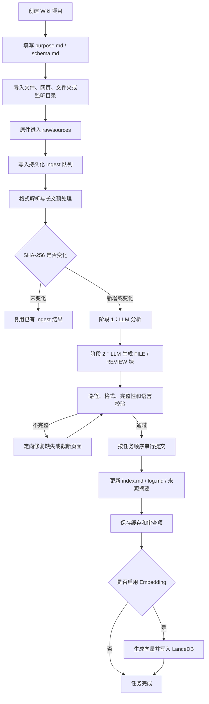
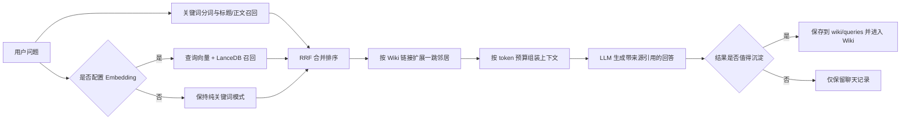

# `nashsu/llm_wiki` 业务流程分析

> 调研日期：2026-09-14  
> 调研版本：`e8082119649e6a8e1cf85eaf289adcabfdf39d4e`（v0.6.11）  
> 项目地址：<https://github.com/nashsu/llm_wiki>

## 1. 一句话结论

这个项目的核心不是“上传文档后，每次提问临时做一次 RAG”，而是把原始资料持续加工成一套**落盘、可编辑、可追踪、可互相链接的 Markdown Wiki**，再基于这套 Wiki 做搜索、问答、图谱和深度研究。

官方把它概括为三层：不可变的 Raw Sources、LLM 生成的 Wiki、约束 Wiki 结构的 Schema；主要操作是 Ingest、Query 和 Lint。[README：核心模型](https://github.com/nashsu/llm_wiki/blob/e8082119649e6a8e1cf85eaf289adcabfdf39d4e/README.md#L224-L232)

因此它的业务本质更接近：

```text
原始资料
  ↓
知识编译流水线（解析、分析、生成、校验、提交）
  ↓
持久化 Wiki（Markdown 页面 + 链接 + 来源 + 版本）
  ↓
检索 / 问答 / 图谱 / 人工治理 / 再研究
```

## 2. 核心业务对象

一个 Wiki 项目本身就是一个可迁移的文件夹，主要包含：

```text
project/
├─ purpose.md                 # 建库目标、关键问题、范围和当前假设
├─ schema.md                  # 页面类型、目录、命名、Frontmatter、引用规则
├─ raw/
│  ├─ sources/                # 原始资料，作为事实来源保留
│  └─ assets/                 # 原始资源
├─ wiki/
│  ├─ index.md                # 确定性生成的总索引
│  ├─ log.md                  # 追加式处理日志
│  ├─ overview.md             # Wiki 总览
│  ├─ entities/               # 实体
│  ├─ concepts/               # 概念
│  ├─ sources/                # 每份来源的摘要页
│  ├─ queries/                # 待研究问题和查询结论
│  ├─ comparisons/            # 对比页
│  └─ synthesis/              # 跨来源综合结论
└─ .llm-wiki/                 # 队列、缓存、审查、历史、配置等内部状态
```

这些目录和初始 `schema.md`、`purpose.md` 由项目创建命令直接生成，而不是第一次问答时临时拼出来。[project.rs：项目初始化](https://github.com/nashsu/llm_wiki/blob/e8082119649e6a8e1cf85eaf289adcabfdf39d4e/src-tauri/src/commands/project.rs#L12-L126)

其中两个文件很关键：

- `purpose.md` 回答“为什么建这个 Wiki、想解决什么问题”，会参与后续分析和生成。
- `schema.md` 回答“知识应该分成什么类型、写到哪里、采用什么元数据和链接规则”。

也就是说，LLM 不是无约束地总结文档，而是在项目目标和知识模式之下生成内容。

## 3. 主业务流程：资料如何变成 Wiki



### 3.1 导入与队列

用户可导入本地文件、网页、整个文件夹，也可监听 `raw/sources/` 的变化。任务不是一次性的 UI 状态，而是持久化到 `.llm-wiki/ingest-queue.json`，支持暂停、恢复、取消、失败重试，单任务最多自动重试 3 次。[ingest-queue.ts：持久化队列与重试](https://github.com/nashsu/llm_wiki/blob/e8082119649e6a8e1cf85eaf289adcabfdf39d4e/src/lib/ingest-queue.ts#L102-L144) [ingest-queue.ts：执行与重试上限](https://github.com/nashsu/llm_wiki/blob/e8082119649e6a8e1cf85eaf289adcabfdf39d4e/src/lib/ingest-queue.ts#L900-L1038)

它允许多个任务并行做解析和 LLM 准备，但最终文件提交按任务启动顺序串行执行，避免两个任务同时修改同一 Wiki 页面时互相覆盖。[ingest-commit-coordinator.ts](https://github.com/nashsu/llm_wiki/blob/e8082119649e6a8e1cf85eaf289adcabfdf39d4e/src/lib/ingest-commit-coordinator.ts#L1-L43)

### 3.2 文档解析

主程序是 Tauri + Rust，而不是 Python/LlamaIndex。它内置多格式解析：PDF、DOCX、PPTX、XLSX/XLS/ODS、EPUB/MOBI、网页、Markdown、文本和代码；PDF 可选接入 MinerU 获得更好的版面和图片处理。[README：多格式解析](https://github.com/nashsu/llm_wiki/blob/e8082119649e6a8e1cf85eaf289adcabfdf39d4e/README.md#L421-L434)

解析结果只是后续 LLM 的输入，原始文件仍保留在 `raw/sources/`，生成知识与原件分离。

### 3.3 增量判断

系统对解析后的来源内容计算 SHA-256，并把成功结果保存到 `.llm-wiki/ingest-cache.json`。内容没变化且之前生成的文件仍存在时，就跳过完整 LLM 处理；文件丢失或哈希变化才重新 Ingest。[ingest-cache.ts](https://github.com/nashsu/llm_wiki/blob/e8082119649e6a8e1cf85eaf289adcabfdf39d4e/src/lib/ingest-cache.ts#L1-L107)

### 3.4 两阶段 LLM 处理

一次 Ingest 至少分为两个明确阶段：

1. **Analysis**：同时读取来源内容、`purpose.md`、`schema.md`、当前 `wiki/index.md` 和 `wiki/overview.md`，让 LLM 提取实体、概念、论点、与现有 Wiki 的连接以及矛盾。
2. **Generation**：把第一阶段分析和来源上下文交给 LLM，要求只输出结构化的 `---FILE: ...---` 文件块，以及必要的 `REVIEW` 待审查项。

实际调用位置可见 [ingest.ts：读取项目上下文](https://github.com/nashsu/llm_wiki/blob/e8082119649e6a8e1cf85eaf289adcabfdf39d4e/src/lib/ingest.ts#L735-L780) 与 [ingest.ts：分析和生成阶段](https://github.com/nashsu/llm_wiki/blob/e8082119649e6a8e1cf85eaf289adcabfdf39d4e/src/lib/ingest.ts#L1024-L1157)。

这样拆分的目的，是先决定“这份资料给知识体系带来了什么”，再决定“哪些页面应该新增或更新”，而不是对每份文档机械生成一篇摘要。

### 3.5 应用层校验和提交

LLM 不直接拥有任意文件写权限。应用层会解析 FILE 块并执行：

- 只允许写入 `wiki/` 下的安全相对路径，拒绝 `../` 等路径穿越。
- 检查 FILE 块是否闭合、内容是否被截断、目标语言是否一致。
- 对不完整页面再发起一次定向修复。
- 只有完整性校验通过后才保存缓存和生成向量。
- `wiki/index.md` 与 `wiki/log.md` 由程序确定性维护，避免让模型每次重写整个聚合文件。
- 每份来源必须有可追溯的 `wiki/sources/*.md` 来源摘要；模型漏写时应用会补一个兜底页面。

对应实现见 [ingest.ts：安全路径限制](https://github.com/nashsu/llm_wiki/blob/e8082119649e6a8e1cf85eaf289adcabfdf39d4e/src/lib/ingest.ts#L365-L408) 和 [ingest.ts：写入、修复、索引、日志、缓存及向量化](https://github.com/nashsu/llm_wiki/blob/e8082119649e6a8e1cf85eaf289adcabfdf39d4e/src/lib/ingest.ts#L1158-L1460)。

## 4. 查询和问答流程



搜索不是强制向量化：

- 关键词检索始终可用，中文查询会展开为 CJK 双字词和单字，标题、短语和正文分别计分。
- 配置 Embedding 后，才调用兼容接口生成查询向量并搜索 LanceDB。
- 关键词与向量结果使用 RRF 合并，然后根据 `[[wikilink]]` 图谱补充相邻页面。
- Embedding 失败时会回退为关键词检索，不让整个查询失败。

真实实现见 [search.ts：前端统一搜索入口](https://github.com/nashsu/llm_wiki/blob/e8082119649e6a8e1cf85eaf289adcabfdf39d4e/src/lib/search.ts#L38-L81) 和 [search.rs：关键词、向量、RRF 与图谱混合](https://github.com/nashsu/llm_wiki/blob/e8082119649e6a8e1cf85eaf289adcabfdf39d4e/src-tauri/src/commands/search.rs#L294-L479)。完整问答阶段还会装配 `purpose.md`、Wiki 索引和命中文章，在上下文预算内请求 LLM 并输出引用。[README：Query Pipeline](https://github.com/nashsu/llm_wiki/blob/e8082119649e6a8e1cf85eaf289adcabfdf39d4e/README.md#L325-L365)

## 5. LLM 是怎么接入的

它没有把业务流程绑死在一个厂商 API 上。统一 `streamChat` 入口先识别两类本地 CLI：

- `claude-code`：通过子进程 stdin/stdout 调用 Claude Code CLI。
- `codex-cli`：通过子进程 stdin/stdout 调用 Codex CLI。
- 其他 Provider：走统一 HTTP Provider 适配层，可配置 OpenAI、Anthropic、Gemini、Azure、Ollama 或自定义兼容端点。

路由逻辑见 [llm-client.ts](https://github.com/nashsu/llm_wiki/blob/e8082119649e6a8e1cf85eaf289adcabfdf39d4e/src/lib/llm-client.ts#L164-L242)。项目还支持按任务选择不同模型配置，例如聊天与 Ingest 使用不同模型。[llm-task-routing.ts](https://github.com/nashsu/llm_wiki/blob/e8082119649e6a8e1cf85eaf289adcabfdf39d4e/src/lib/llm-task-routing.ts#L41-L70)

Codex CLI 在这里的边界尤其值得注意：它以 Wiki 项目目录为工作目录，使用 `codex exec --json --sandbox read-only --ephemeral`，把 Prompt 从 stdin 传入，并将 stdout 流式回传给应用；**Codex 只负责理解与生成文本，真正的 Wiki 文件写入仍由应用层校验后完成**。[codex_cli.rs：子进程与安全参数](https://github.com/nashsu/llm_wiki/blob/e8082119649e6a8e1cf85eaf289adcabfdf39d4e/src-tauri/src/commands/codex_cli.rs#L134-L351)

因此：

- 不配置外部 LLM API，也可以利用本机已登录的 Codex CLI 或 Claude CLI跑知识加工和聊天。
- Embedding 是独立配置；Codex CLI 不能替代批量向量接口。
- 想做服务器端、多用户、稳定后台任务时，HTTP LLM API 通常比依赖每台机器的 CLI 登录态更合适。

## 6. 知识治理闭环

这个项目在“生成 Wiki”之后还继续处理知识质量：

1. `REVIEW` 队列记录事实冲突、证据不足、待补充研究等问题。
2. Lint 检查缺少 Frontmatter、孤立页面、失效链接、缺少来源等结构问题。
3. Wiki 双向链接形成知识图谱，可查看实体关系、社区和知识缺口。
4. 针对缺口可发起 Deep Research，搜索外部来源、生成带引用的研究报告，再沉淀回 Wiki。
5. 删除来源时，会根据来源元数据级联处理只由该来源产生的页面、链接、缓存和向量。

参考 [README：Review 与 Deep Research](https://github.com/nashsu/llm_wiki/blob/e8082119649e6a8e1cf85eaf289adcabfdf39d4e/README.md#L390-L410) 和 [README：来源删除级联](https://github.com/nashsu/llm_wiki/blob/e8082119649e6a8e1cf85eaf289adcabfdf39d4e/README.md#L435-L442)。

## 7. 它与传统 RAG 的主要区别

| 对比项 | 传统文档 RAG | `llm_wiki` |
|---|---|---|
| 知识产物 | Chunk 和向量索引 | 可读、可编辑的 Markdown 页面 |
| LLM 工作时机 | 通常每次问答时归纳 | 导入时先完成知识分析和编译，问答时再使用 |
| 组织方式 | 文档/Chunk 平铺 | 实体、概念、来源、问题、对比、综合等类型化页面 |
| 知识关系 | 依赖向量相似度 | `[[wikilink]]` 显式关系 + 图谱扩展 |
| 可追溯性 | 引用命中 Chunk | 页面 Frontmatter、来源摘要、处理日志 |
| 增量处理 | 重建或增量更新向量 | 来源哈希 + 页面级合并 + 确定性索引 |
| 人工治理 | 常被放在系统之外 | Review、Lint、历史、来源级联是主流程的一部分 |
| 向量依赖 | 通常是核心依赖 | 可选增强；无向量仍可检索和使用 |

## 8. 对 AiAgent 最值得借鉴的部分

AiAgent 当前已有“知识库文档 → LlamaIndex/Chunk → 激活索引版本 → Agent RAG 检索”的链路。适合借鉴的不是照搬桌面文件夹实现，而是补上一层**可发布的知识语义层**：

```text
AiAgent 项目/知识空间
  ├─ Source 原件与来源版本
  ├─ ParseResult 解析结果
  ├─ WikiDraft 知识草稿
  ├─ Review 人工/规则审查
  ├─ WikiRevision 已发布知识版本
  └─ RetrievalIndex 关键词、向量、图谱索引
```

推荐的服务端流程是：

```text
上传来源
  → C# 原生解析
  → 内容哈希和来源快照
  → 持久化 Job
  → LLM 分析
  → 生成 WikiDraft 变更集
  → 路径/格式/来源/权限校验
  → 人工审批或策略自动发布
  → 原子切换 WikiRevision
  → 更新关键词、向量和关系索引
  → Agent 使用统一检索入口
```

需要保留的服务端差异：

- `llm_wiki` 是本地单用户桌面应用；AiAgent 是多用户、多项目平台，ProjectId、UserId、数据权限和审计必须进入每个阶段。
- 不建议让模型直接改正式知识；应输出“知识变更集”，经校验和审批后发布。
- 不能用文件路径代替授权。即使向量索引物理数据尚未清理，权限撤销后检索结果也必须立即不可见。
- Codex CLI 可作为开发机或个人版 Provider；正式服务器后台任务应以可观测、可限流的 LLM API 为主，CLI 为可选适配器。
- 关键词、结构化检索和 Wiki 页面应是基础能力，Embedding 是增强能力，而不是整个知识库能否工作的开关。

## 9. 最终业务流程摘要

这个项目能实现 LLM Wiki，靠的不是某一个模型或向量库，而是以下闭环：

```text
目标定义
  → 原件留存
  → 可恢复任务队列
  → 原生格式解析
  → 两阶段 LLM 知识编译
  → 应用层安全校验与确定性提交
  → Markdown Wiki 持久化
  → 关键词 + 可选向量 + 图谱检索
  → 引用式问答
  → Review / Lint / Deep Research 治理
  → 新知识再次进入 Wiki
```

最关键的设计判断是：**LLM 负责提出知识变更，应用负责验证、提交、版本化和授权。**

## 10. 调研边界与许可证提醒

- 本文基于仓库 v0.6.11 对应提交的 README 和实际源码静态阅读，没有运行第三方项目或调用其外部服务。
- 仓库采用 GPL-3.0 许可证。参考其架构思想没有问题；如果直接复制、修改并分发其代码，需要评估 GPL-3.0 对 AiAgent 的许可证影响。[LICENSE](https://github.com/nashsu/llm_wiki/blob/e8082119649e6a8e1cf85eaf289adcabfdf39d4e/LICENSE)

