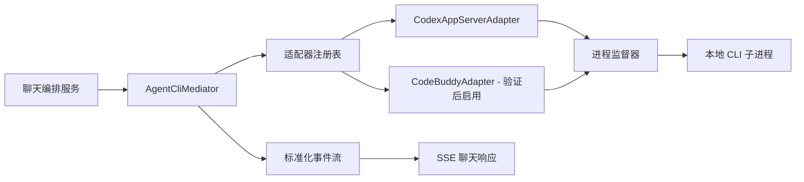

# 多代理 CLI 中间层规格

## 1. 背景与结论

聊天服务当前已经能通过 Codex 的 `app-server --stdio` JSONL 协议接管一次对话。后续若要接入多个本地编码代理，不能把不同厂商的 CLI 当作同一个命令或协议调用；应由后端中间层通过独立适配器统一它们的生命周期、流式事件、能力和取消行为。

CodeBuddy Code 的官方安装方式是 `npm install -g @tencent-ai/codebuddy-code`，官方页面说明它支持 Windows，依赖 Node.js 22+ 和 Git。NPM 包提供 `codebuddy`、`codebuddy-code`、`cbc` 等命令入口。公开资料目前没有说明它提供与 Codex `app-server --stdio` 等价的 JSONL 服务协议。因此：

- CodeBuddy 不能复用 `codex app-server --stdio` 适配器；
- 在验证出官方的非交互调用方式和结构化流式输出前，CodeBuddy 仅能被检测和展示，不能被标记为“可接管聊天”；
- 中间层先为已验证的 Codex 协议设计，CodeBuddy 的适配器以协议验证通过为前置条件。

参考：[CodeBuddy CLI 官方页](https://www.codebuddy.cn/cli/)；[NPM 包](https://www.npmjs.com/package/@tencent-ai/codebuddy-code)。

## 2. 目标与非目标

目标：

- 让聊天编排服务只面对统一的代理接口，不耦合某一 CLI 的参数、输出格式或进程行为。
- 支持代理环境探测、版本兼容性判定、默认代理、明确的能力开关和失败降级。
- 将文本增量、工具活动、文件变更、完成和错误规范化为统一事件，供当前 SSE 聊天接口消费。
- 任一聊天任务可主动取消，并可靠终止其子进程树，不占用用户本机调试端口。

非目标：

- 本规格不实现 CodeBuddy 调用、安装、登录或绕过其交互式终端。
- 不在服务端保存第三方 CLI 的登录令牌、Cookie 或用户私密配置。
- 不将“能执行 `--version`”视作“能安全接管聊天”。

## 3. 总体结构



`ChatOrchestrator` 只提交一个标准化请求给 `AgentCliMediator`。中间层根据已启用、已验证且具备所需能力的代理选择适配器；没有可用适配器时返回普通模型聊天或清晰的不可用原因，绝不伪装成其他代理执行。

## 4. 领域模型与接口

### 4.1 代理配置

`AgentProviderProfile` 至少包含：

| 字段 | 说明 |
| --- | --- |
| `id` | 稳定标识，如 `codex`、`codebuddy` |
| `enabled` | 管理员是否允许被选择 |
| `command` | 受控配置中的 CLI 可执行文件，不能来自聊天输入 |
| `versionRange` | 被验证的版本范围 |
| `transport` | `codex_app_server_jsonl`、`one_shot_json` 等 |
| `capabilities` | 聊天、流式、取消、工具调用、文件变更、会话续接等 |
| `defaultForChat` | 作为聊天默认代理的候选标记 |

`AgentProviderEnvironment` 是检测结果，不覆盖管理员配置，包含安装状态、解析后的版本、协议验证状态、不可用原因和最后检测时间。

### 4.2 适配器契约

```text
IAgentCliAdapter
  ProviderId
  ProbeAsync(profile, cancellationToken) -> ProviderProbeResult
  GetCapabilitiesAsync(profile, cancellationToken) -> AgentCapabilities
  StartTurnAsync(request, eventSink, cancellationToken) -> AgentTurnHandle
  CancelAsync(turnHandle, cancellationToken)
```

`StartTurnAsync` 接收的请求只包括已注册工作区、用户消息、受控上下文和请求的安全能力；不得接收原始 shell 字符串。实现必须通过进程参数列表启动 CLI，不能拼接并交给 shell 解释。

### 4.3 标准化事件

所有适配器向 `eventSink` 输出以下事件之一：

| 事件 | 必填内容 |
| --- | --- |
| `started` | `providerId`、任务 ID、版本 |
| `text_delta` | 面向用户的文本增量 |
| `reasoning_delta` | 可选；仅在产品允许展示时转发 |
| `tool_started` / `tool_completed` | 工具名称、受控摘要、结果状态 |
| `file_changed` | 已登记工作区内的相对路径和变更摘要 |
| `completed` | 结束原因和可选用量 |
| `failed` | 稳定错误码、用户可读信息、可诊断详情 ID |
| `cancelled` | 主动停止已完成 |

未知行、终端颜色控制符和非结构化日志只能进入受限诊断日志，不得直接混入聊天回复。

## 5. 适配器策略

### 5.1 Codex

`CodexAppServerAdapter` 固定使用已验证的 `app-server --stdio` JSONL 协议，并将其请求与事件映射到上述模型。它是第一阶段唯一可将 `chat_supported` 标记为真的适配器。

### 5.2 CodeBuddy Code

CodeBuddy 适配器的状态分为 `detected`、`protocol_unverified`、`compatible`、`blocked`。默认是 `protocol_unverified`，不可在聊天框选择。

启用前必须在隔离测试工作区完成以下证据链：

1. 使用已安装版本的 `codebuddy --help`、`codebuddy --version` 和官方文档确认非交互参数；
2. 确认可提供机器可读的最终结果和增量事件，或明确只能提供一次性结果；
3. 验证取消后不会遗留 CLI、Node 或 shell 子进程；
4. 验证不会因默认命令写入工作区、自动安装依赖或弹出交互登录；
5. 把通过验证的版本范围、参数模板、输出解析器和限制写入版本化 provider profile。

若它只支持交互式 TTY，服务端聊天不接入该模式。若未来确认支持一次性提示词和稳定的 JSON 输出，可实现独立 `CodeBuddyOneShotAdapter`；其能力应标为“非流式”或“模拟流式”，不得声称与 Codex 会话协议兼容。

## 6. 进程、安全与取消

- 每次代理对话拥有唯一任务 ID、`CancellationToken` 和进程树句柄；用户点击停止后先请求适配器取消，超时后强制结束该进程树。
- 进程工作目录必须是用户已登记的代码库根目录或其允许子目录；拒绝任意路径、盘符和符号链接越界。
- 设置启动超时、空闲超时、总时长、最大输出字节数、最大事件数和并发上限。
- 不自动执行 `npm install`、`npm i`、发布、删除或外部网络命令。代理若请求这些操作，必须通过产品已有的显式授权策略。
- CLI 探测仅运行固定候选命令的版本/帮助参数；聊天内容、文件内容和配置值均不能参与命令行拼接。
- 记录命令摘要、版本、耗时、退出码和诊断 ID；对令牌、连接串、环境变量和敏感输出脱敏。

## 7. 聊天与设置行为

- 设置页展示检测状态、协议状态、已验证版本范围、能力和不可用原因。
- “默认聊天代理”仅列出 `enabled && compatible && chat_supported` 的提供方；无符合项时使用普通模型聊天。
- 聊天框不需要暴露不具备聊天能力的 CLI。若产品保留手动选择，则选项必须与设置页的可用状态一致。
- 任务开始后将最终 provider、版本和能力快照写入消息元数据，便于回放和排障；后续配置变更不影响已运行任务。

## 8. 分阶段交付

| 阶段 | 内容 | 完成条件 |
| --- | --- | --- |
| 0 | 协议取证 | 获取 CodeBuddy 官方或实际 `--help` 的非交互协议证据，结论可复现 |
| 1 | 中间层骨架与 Codex 迁移 | Codex 保持现有功能，并经统一事件与取消路径运行 |
| 2 | CodeBuddy 适配器评审 | 仅在阶段 0 通过时实现，且按验证版本范围发布 |
| 3 | 扩展提供方 | 新 CLI 只需新增 adapter/profile，不修改聊天编排核心 |

## 9. 验收标准

- Codex 对话、工具事件和主动停止通过中间层后与现有行为一致。
- 取消一个任务只终止该任务的进程树，不影响 Visual Studio、其他项目运行或其他聊天任务。
- 未验证的 CodeBuddy 即使已安装，也显示为“已检测，协议待验证”，且无法被用于聊天接管。
- 无法启动、协议格式异常、超时和用户停止均能产生稳定错误码和清晰 UI 状态。
- 全部启动参数均由受控 profile 生成；安全测试证明聊天输入不能改变可执行文件、工作目录或 shell 语义。

## 10. Codex 图片附件实现（第一阶段）

Codex 适配器采用 app-server `turn/start.input` 的 `localImage` 项，而不是把图片路径拼入提示词或 shell 参数。浏览器上传图片后只获得不透明附件 ID；服务端校验 PNG、JPEG、WebP、GIF 的文件签名、大小、数量和当前登录用户，再把受控临时目录中的绝对路径写入本轮请求：

```json
[
  { "type": "text", "text": "根据截图修复布局" },
  { "type": "localImage", "path": "<server-owned-path>", "detail": "high" }
]
```

附件仅供 Codex 使用，默认最多 4 张、每张 10 MB。未发送的临时附件按配置过期清理；发送后会迁移到按用户哈希与会话 ID 隔离的历史目录，附件元数据与用户消息一起持久化，重新打开会话时通过受鉴权的图片接口回显。聊天输入区接收剪贴板中的图片文件，`Ctrl+V` 与选择文件使用同一校验和上传链路。CodeBuddy 没有经过图片输入协议验证，因此不接收这些附件。
