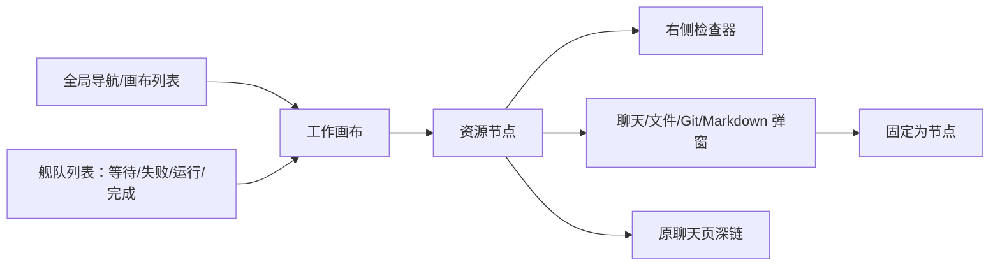
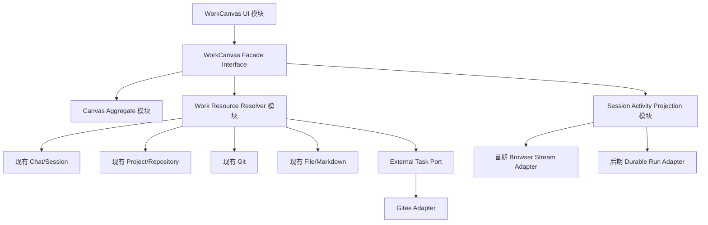

# AiAgent 工作画布架构与渐进迁移方案

> 状态：架构规划稿，未进入实现
> 日期：2026-08-18
> 依据：`design/agent-work-canvas/README.md`、`agent-work-canvas-design.md`、HTML 原型及当前前后端实现
> 约束：本文不改变代码、配置、密钥或数据库；接口、实体与目录名称均为实施建议，需在对应阶段评审后落地。

## 1. 目标、边界与关键结论

目标是在保留现有聊天页全部能力的前提下，增加一个“同页协作”的工作画布：既有聊天会话、项目、Git 提交/差异、已打开文件和 Markdown 文档都可以作为可定位节点存在；详细聊天、差异、文件预览/编辑通过检查器或弹窗打开，并可以一键固定为节点。后续再接入码云任务列表选择，建立“任务—会话—项目—提交”的可追溯关联。

关键结论：

1. **会话、项目、仓库和 Git 仍是各自事实来源。** 画布只保存布局、引用和语义关系，不复制聊天正文、文件正文或 Git diff。
2. **画布关系不能授予权限，也不等于自动共享上下文。** 每次打开、编辑、引用或运行时都由目标领域重新鉴权；只有用户显式选择“引用到聊天”时才进入服务端构造的受控上下文。
3. **第一阶段应复用当前浏览器内的 `ChatStreamProvider` 与完整聊天工作区，但不能把它当成长期运行事实来源。** 当前流状态刷新即丢失，后续必须增加可恢复的 Run/Event 账本，再让聊天页与画布共同消费。画布内聊天不是只读摘要：选中会话即在同页打开可发送、停止、重试的会话工作区，并复用项目运行、文件、Markdown、上传、终端和预览能力。
4. **“打开”与“固定到画布”要分开。** 文件、文档、diff 默认以临时检查器/弹窗打开；用户固定后才持久化为节点，避免画布迅速被一次性查看内容淹没。
5. **Git 提交与工作区差异不是同一种资源。** commit 由完整 SHA 唯一标识并可长期关联；working/push/pull diff 是可变查询，固定时只能保存比较基线和摘要，内容仍应按需重算并显示是否过期。
6. **码云接入使用真实外部 seam 和 Adapter。** 未配置账号、没有 Token 或 Token 缺少任务读取权限时，画布仍可完整使用；不得假定当前已有 Gitee API 凭据或所需 scope。
7. **默认只做个人画布。** 当前权限模型只有用户、管理员、用户—项目授权和提交权限，没有团队/组织/画布成员模型；共享画布需单独立项。

### 非目标

- 不在画布中直接启动 CLI、拼接 shell、接受浏览器绝对路径或绕过现有 Codex 运行时租约。
- 不在首期提供 DAG 自动调度、多 Agent 自动互传上下文、跨用户协同编辑或 CRDT。
- 不把任意源码都升级为可编辑；文件编辑能力仍由服务端的资源能力决定。
- 不因为“节点已关联任务”就自动提交、推送、关闭码云任务或改变远端状态。

## 2. 现状映射

### 2.1 当前能力与画布落点

| 当前事实/能力 | 当前实现 | 可直接复用 | 现有缺口与画布策略 |
| --- | --- | --- | --- |
| 会话身份与历史 | `AiChatSession`、`AiChatMessage`；`/api/v1/sessions` | 标题、项目、优先级、置顶、消息、附件元数据 | 会话仅当前用户可见；列表上限 100；没有 Run 历史。会话节点只存 `sessionId` 引用，详情懒加载。 |
| 多会话流 | 根布局 `ChatStreamProvider`；每个请求独立 WS/SSE | 同一 React 应用内按 `sessionId` 投影运行、完成、失败、未读 | 状态在浏览器内存；刷新/换设备不可恢复；前端和 Codex 后端均限制每用户最多 3 个并行会话。首期复用，后续引入持久化 Run/Event。 |
| 聊天发送与 Codex | `/api/v1/chat/ws`，失败回退 SSE；`CodexChatService` | `session_ready`、工具、内容、`completed`、`error`；停止为 Abort | 浏览器断开会停止对应运行；没有独立运行资源与补拉 cursor。画布不新增直接 Codex 通道。 |
| 项目与仓库 | `AiCodeProject`、`AiCodeRepository`、`AiUserCodeProject` | 项目列表、仓库归属、项目根、代码上下文 | 普通用户按显式项目授权，管理员可见全部；部分旧的单仓库读取接口只做全局登录校验，画布聚合接口不能直接透传，必须重新做项目级授权。 |
| Git 状态/操作 | `CodeRepositoryGitService`、`GitWorkspaceService`、`ChatRuntimeToolbar` | status、branch、working/push/pull diff、拉取、重置更新、提交推送；提交结果含短 SHA | 没有 commit 列表、完整 SHA 的 commit 详情/patch 接口，也没有提交与会话/任务的关联记录。新增只读历史接口和操作关联上下文。 |
| 文件预览 | `ChatInspectorPanel` 调用 tree/file；`MarkdownMessage` 解析并服务端解析文件引用 | 注册仓库内文件读取、行号定位、最多显示 2500 行 | 当前已打开文件只在组件状态中；普通代码文件只读。画布用 `repositoryId + relativePath` 引用，临时打开后可固定。 |
| 配置文件编辑 | `configuration_files` / `chat_editable_configuration_files`，SHA 并发保护 | 精确白名单内配置文件的读取、编辑、保存 | 不是任意文件编辑器；画布文件节点必须展示 `read/edit` 能力，保存继续要求 `expected_sha256`。 |
| Markdown 文档 | 项目 Markdown 列表、目录、读取、上传、下载、删除；聊天 `[[文档:...]]` 引用 | 安全预览、服务端重验引用、仓库文档与专用上传区 | 当前没有通用 Markdown 文本保存接口；仓库内上传/删除会形成 Git 变更。首期预览/引用，编辑需新增 SHA/编码/权限一致的保存接口。 |
| 项目运行/预览 | `CodeRuntimeManager` 与右侧终端/浏览器 | 项目运行概览、日志轮询、预览入口 | 与本画布主目标相邻但不是首期节点；保留成会话/项目检查器能力，后续可增加 runtime 节点。 |
| 身份与权限 | Cookie 会话、`AuthenticatedUser`、角色、`CanCommitCode`、项目授权 | 登录、管理员、项目可见性、提交权限 | 没有团队和资源级分享；没有统一工作台审计。新增对象级鉴权与画布审计，不复用“看得见节点即有权限”的错误模型。 |
| Git 账号 | `AiGitAccount`，用户级 Gitee/GitHub，Token 服务端保护且不回显 | 可作为未来码云 Adapter 的凭据引用 | 当前只验证账户身份并供 Git 认证，没有任务列表接口，也不能推断 Token 有任务读取权限。 |

### 2.2 当前聊天页必须保留的行为

- `/chat?session=...&project=...` 深链、项目/模型/Codex 权限选择、附件、项目引用与 Markdown 引用。
- WS/SSE 流式回答、停止、重试、后台会话继续运行、侧栏未读/失败状态。
- 项目运行工具栏、Git 状态与 diff 弹窗、配置文件编辑、右侧文件/Markdown/上传/终端/浏览器页签。
- 移动端抽屉、底部选择器和现有响应式聊天体验。

工作画布首期是新增路由，例如 `/work-canvas?canvas={id}&node={nodeId}`，不是对 `/chat` 的替换。任何画布节点都能“在原聊天页打开”，作为迁移安全阀。

### 2.3 现有实现需要先承认的技术债

1. 会话流运行态不可跨刷新恢复，`done` 与 `completed` 的最终一致性只在当前浏览器进程中协调。
2. `KnowledgeChatHome.tsx`、`ChatInspectorPanel.tsx` 和 `ChatRuntimeToolbar.tsx` 体量较大，领域状态与展示耦合。画布不应复制这些文件，而应按能力逐步提取可复用模块。
3. 部分代码库单仓库接口基于仓库名读取，缺少显式项目参数/项目授权校验。画布只能调用新的授权聚合模块或完成现有端点硬化后再接入。
4. Git diff 是弹窗内部解析文本，后端未提供 commit 历史与结构化 commit detail。
5. Markdown 文档可预览、上传和删除，但“编辑保存”契约未形成。

## 3. 用户流程

### 3.1 从既有会话进入画布

1. 用户在聊天侧栏或聊天标题处选择“在工作画布中打开”。
2. 若项目已有默认个人画布，则将会话引用加入并聚焦；否则创建个人画布。
3. 画布显示会话卡的派生状态、项目、模型/权限摘要、未读与最近活动。
4. 单击节点打开检查器；“展开聊天”打开同页会话弹窗；“在聊天页打开”继续跳到原 `/chat`。
5. 移除节点只删除画布引用，不归档或删除会话。

### 3.2 在画布中继续聊天

1. 用户单击会话节点，右侧立即打开完整会话工作区；历史仍从会话接口读取。双击或工具栏按钮可在原聊天页打开，但不再是使用完整能力的必经路径。
2. 右侧工作区直接复用聊天页的 Chat Composer、消息列表、运行工具栏与资源检查器；发送、停止、重试、附件、项目/Markdown 引用调用相同 interface，不另建“画布发送 API”。
3. 当前应用内的流事件同时更新聊天弹窗、会话节点和左侧舰队列表。
4. 并发已满时服务端返回规范化 `capacity_exceeded`；节点进入“待启动/受阻”提示，但首期不自动排队。
5. Phase 3 引入 Run/Event 后，刷新可补拉进行中状态；无法确认的运行显示 `unknown`，绝不猜测完成。

### 3.2.1 画布内完整工作区与可停靠面板（已确认产品要求）

- 会话节点的主操作是“在画布内工作”，不是仅显示摘要后跳转 `/chat`。右侧工作区必须与聊天页能力对齐：发送/停止/重试、模型与权限选择、附件、项目引用、Markdown 引用、项目运行、日志/终端、浏览器预览、文件与 Markdown 查看。
- 复用同一个聊天领域组件和 `ChatStreamProvider`；禁止复制发送状态机或维护第二套会话运行状态。画布只提供嵌入容器、面板状态和节点选择上下文。
- 左侧会话舰队栏和右侧会话工作区都支持水平拖拽调整宽度、收起/展开，并保存用户最近宽度。右侧支持“锁定停靠”和“浮动抽屉”两种模式，行为参考 VS Code：停靠时占据布局宽度，浮动时覆盖画布且不挤压画布。
- 右侧工作区切换节点时保持画布位置与布局不变；关闭只关闭工作区，不移除节点。移除节点必须使用独立动作并明确只删除画布引用。
- 资源检查器可在会话工作区内继续打开；在较窄宽度下使用覆盖层或全屏 sheet，不能把聊天输入区挤到不可用。桌面端右侧工作区建议宽度 720px、最小 420px；左侧建议 256px、最小 190px。
- 面板宽度、展开和锁定是用户本地视图偏好，不进入共享画布布局版本；节点坐标与 viewport 仍由画布 layout API 保存。

### 3.3 从会话固定文件或 Markdown

1. 用户点击回答中的结构化文件引用或 Markdown 引用，在检查器中打开。
2. 检查器先解析 `repositoryId + relativePath`，重新验证项目、仓库与文件能力。
3. 用户可直接查看，或选择“固定到画布”。固定后新增文件/Markdown 节点及 `references` 关系。
4. 普通代码文件节点只读；白名单配置文件显示编辑入口；Markdown 只有在新增安全保存契约后显示编辑。
5. 编辑使用 SHA 乐观锁；冲突显示比较/重新读取，绝不静默覆盖。

### 3.4 从 Git 差异关联会话与任务

1. 用户从项目或仓库节点打开 Git 面板，查看 working/push/pull 差异。
2. 可将当前比较固定为差异节点；节点保存比较类型、base/head、状态摘要和捕获时间，不保存完整 patch。
3. 提交前确认弹窗显示关联的会话、任务与画布；提交成功后服务端以完整 commit SHA 写入关联。
4. 若提交由外部工具产生，可通过新增的提交历史列表选择 commit，再手工关联。
5. 关联不自动推送、不自动更改任务状态；远端动作仍需显式确认与现有 `CanCommitCode` 权限。

### 3.5 从码云任务创建工作链

1. 用户点击“关联任务”，先选择任务源。没有可用 Gitee 连接时显示“尚未连接/权限不足”，可跳转账号设置或先创建本地占位任务。
2. 连接可用时，服务端 Adapter 分页读取用户有权访问的仓库/任务，前端只拿到最小任务摘要。
3. 选择任务后创建本地外部任务引用节点，可关联项目并新建/关联会话。
4. 会话执行、文件引用和 commit 逐步形成链路；默认只读同步任务状态。
5. 写回任务状态、评论或关闭任务必须在后续阶段单独授权，并逐次确认。

## 4. 页面与交互架构



桌面端采用“左侧可伸缩舰队栏 + 中央无限画布 + 右侧可伸缩完整工作区”。右侧工作区默认停靠，可切换为浮动抽屉并锁定；聊天、项目运行、文件、Markdown 和 diff 在该工作区内复用聊天页现有能力。同一时间只激活一个主会话工作区，节点卡片仍只呈现摘要，不在卡片内部嵌入完整滚动聊天。

节点操作统一为：

- 单击：选择并打开检查器。
- 双击/Enter：打开该资源的默认弹窗。
- `Shift + Enter`：在原领域页面打开。
- 临时资源弹窗中的“固定”：创建节点并建立来源关系。
- 拖线：只打开关系类型选择，不默认创建 `depends_on`。

视图密度继续采用原型的紧凑/标准/展开三级；状态必须同时用图标、文字和颜色表达。URL 保存 `canvas`、`node`、可选 `panel`，但不在 URL 中放文件绝对路径、Token、原始 prompt 或 diff 内容。

## 5. 节点、资源与关系模型

### 5.1 节点不是业务数据

画布节点由两部分组成：

1. `CanvasNode`：位置、尺寸、层级、显示覆盖和折叠状态。
2. `ResourceRef`：指向真实资源的类型化引用。

删除 `CanvasNode` 不删除真实资源，也默认不删除跨资源的 durable association。资源被归档、删除或失权后，节点显示 `unavailable`，只允许移除或重新授权。

建议的 `ResourceRef`：

```json
{
  "kind": "file",
  "project_id": 17,
  "repository_id": 42,
  "resource_id": "src/pages/index.tsx",
  "version": "sha256-or-null"
}
```

所有路径均为规范化仓库相对路径。服务端可以生成内部 `resource_key` 用于唯一索引，但不应把可伪造的 key 当作权限凭据。

### 5.2 节点类型

| 类型 | 身份与事实来源 | 默认打开方式 | 编辑/动作能力 |
| --- | --- | --- | --- |
| `session` | `AiChatSession.Id` | 聊天弹窗/原聊天页 | 发送、停止、标记已读、后续任务；服从会话所有权和运行限制 |
| `project` | `AiCodeProject.Id` | 项目检查器 | 查看仓库、Git 汇总、相关会话/任务；管理员设置仍在原设置页 |
| `repository` | `AiCodeRepository.Id` | Git/文件检查器 | 状态、分支、diff；写操作独立鉴权 |
| `task` | 本地任务或外部任务引用 ID | 任务详情弹窗 | 关联会话/项目/commit；外部写回默认关闭 |
| `git_commit` | repository ID + 完整 SHA | commit detail/diff | 只读；可关联任务/会话 |
| `git_compare` | repository ID + comparison + 捕获基线 | diff 弹窗 | 刷新、标记过期、从结果创建 commit 关联 |
| `file` | repository ID + 相对路径 | 文件查看器 | 默认只读；精确命中授权配置文件时可编辑 |
| `markdown` | project + source + repository name + 相对路径 | Markdown 预览 | 引用到聊天；安全保存接口落地后可编辑 |
| `note` | 画布本地 ID | 便签编辑 | 仅画布文本，限长，不参与模型上下文除非显式引用 |
| `group` | 画布本地 ID | 分组检查器 | 仅视觉分组，不隐式改变权限或调度 |

`runtime`、构建产物和会话摘要 artifact 可在后续增加，但不应阻塞核心链路。

### 5.3 资源状态与会话派生状态

会话节点的显示状态由 Run/Event 派生，不写回 `AiChatSession`：

`draft → starting → running → waiting_input/approval_required → completed | failed | stopped | unknown`

- 当前协议不能可靠识别 `waiting_input` 时，只允许人工标记或映射明确的结构化事件。
- `done` 不是成功终态；只有 `completed` 或持久化 Run 终态才是成功。
- `unknown` 用于刷新后无法确认、服务重启或事件缺口，不自动转为 failed/completed。

文件、Markdown 和 diff 另有 `fresh/stale/missing/forbidden/conflict` 状态。状态只影响展示和可用动作，不改变资源身份。

### 5.4 关系类型

| 关系 | 允许的主要方向 | 含义 | 自动传递上下文 |
| --- | --- | --- | --- |
| `belongs_to` | session/task/file/commit → project/repository | 客观归属或选定工作范围 | 否 |
| `depends_on` | task/session → task/session | 工作依赖 | 否 |
| `related_to` | 任意可见资源 ↔ 任意可见资源 | 弱关联 | 否 |
| `references` | session/task → file/markdown/commit | 用户确认的参考资料 | 否，需再次选择引用 |
| `produces` | session → file/markdown/git_compare | 本次工作产出 | 否 |
| `implements` | session/commit → task | 为该任务实施 | 否 |
| `committed_as` | session/git_compare → git_commit | 变更最终提交 | 否 |
| `follow_up_of` | session/task → session/task | 后续工作 | 可选择带入受控摘要 |

关系分两层：

- `CanvasEdge` 是当前画布的可视连线，可随节点移除。
- `WorkAssociation` 是“任务—会话—项目—提交”等需要跨画布保留的业务关联。CanvasEdge 可引用 association ID；删除连线时由用户选择“仅从画布隐藏”或“删除关联”。

## 6. 模块、Interface、Seam 与 Adapter

目标是形成少量深模块：调用方只学习一个小 Interface，授权、资源解析、兼容旧接口和错误规范化都留在模块内部。



### 6.1 前端模块

| 模块 | 对外 Interface | 隐藏的实现复杂度 |
| --- | --- | --- |
| `work-canvas-shell` | 加载画布、选择节点、打开资源、保存布局 | 路由同步、过滤、错误/空态、移动端降级 |
| `canvas-graph` | `render(snapshot)`、`applyLayoutPatch()` | React Flow、LOD、虚拟化、框选、小地图、防抖 |
| `resource-window-host` | `open(ResourceRef, mode)`、`pin()` | 聊天/文件/Markdown/Git 各类弹窗与复用组件 |
| `work-resource-client` | `resolve(ref)`、`getCapabilities(ref)` | 不同领域 HTTP、401/403/404 规范化、缓存与取消 |
| `session-activity-store` | `get(sessionId)`、`subscribe()` | 首期桥接 `ChatStreamProvider`，后期合并事件 cursor |
| `association-editor` | 创建/删除经过校验的语义关系 | 关系约束、循环提示、业务关联与视觉边的区别 |

实施时先从现有大组件提取稳定的 Interface，例如 `ChatConversation`、`FileViewer`、`MarkdownViewer`、`GitDiffViewer`；不要先把整个 `KnowledgeChatHome` 嵌进画布，也不要复制它的状态机。

### 6.2 后端模块

| 模块 | 对外 Interface | 主要职责 |
| --- | --- | --- |
| `WorkCanvasModule` | 画布 CRUD、snapshot、layout patch、节点/边 | 归属校验、版本控制、节点/边不变量、批量加载 |
| `WorkResourceResolver` | `ResolveAsync(user, ResourceRef)` | 统一项目/仓库/会话/文件/commit 鉴权和 capability 返回 |
| `WorkAssociationModule` | 建立、列出、删除 durable association | 允许的关系组合、两端鉴权、来源与审计 |
| `ChatRunLedger` | start/update/append/replay/finalize | 运行状态、单调 sequence、断线补拉、终态不变量 |
| `GitReadModel` | commits、commit detail、structured diff | 仅读取受限 repo；分页、长度限制、路径脱敏 |
| `ExternalTaskModule` | connections、projects、tasks、resolve | 缓存、速率限制、provider 错误规范化、最小数据投影 |
| `WorkAuditModule` | append/query | 关联 ID、动作、结果、脱敏元数据、保留策略 |

`WorkResourceResolver` 是最重要的 seam：画布永远不直接根据 `resource_kind` 自己查询数据库或拼路径。生产使用现有领域 Adapter，测试使用内存 Adapter；这是已有多个资源来源所形成的真实 seam。

## 7. HTTP API 与事件协议

以下均为建议契约。现有 `/chat`、`/sessions` 和 `/code-repositories` 保持兼容，画布逐步切换到新接口。

### 7.1 画布 API

| 方法 | 路径 | 用途 |
| --- | --- | --- |
| `GET` | `/api/v1/work-canvases?project_id=&cursor=` | 当前用户画布摘要 |
| `POST` | `/api/v1/work-canvases` | 创建个人画布 |
| `GET` | `/api/v1/work-canvases/{id}/snapshot` | 一次返回画布、轻量节点、边、关联与 capability 摘要 |
| `PATCH` | `/api/v1/work-canvases/{id}` | 名称、项目范围、归档状态 |
| `PATCH` | `/api/v1/work-canvases/{id}/layout` | 带 `expected_version` 的批量节点/viewport 更新 |
| `POST` | `/api/v1/work-canvases/{id}/nodes` | 解析并加入资源节点，或创建 note/group |
| `DELETE` | `/api/v1/work-canvases/{id}/nodes/{nodeId}` | 仅从画布移除 |
| `POST` | `/api/v1/work-canvases/{id}/edges` | 创建视觉边，可选创建 durable association |
| `DELETE` | `/api/v1/work-canvases/{id}/edges/{edgeId}` | 删除/隐藏视觉边 |
| `POST` | `/api/v1/work-canvases/{id}/resources:resolve` | 批量解析临时 ResourceRef，返回状态与能力 |

布局 patch 示例：

```json
{
  "expected_version": 12,
  "viewport": { "x": 80, "y": 24, "zoom": 0.85 },
  "nodes": [
    { "id": "node-1", "x": 240, "y": 160, "width": 280, "height": 160, "collapsed": false }
  ]
}
```

版本冲突返回 `409 layout_conflict` 和最新 version；客户端可以对“仅位置变更”重放一次，不能覆盖已删除节点或权限变化。

### 7.2 资源详情 API

| 方法 | 路径 | 用途 |
| --- | --- | --- |
| `POST` | `/api/v1/work-resources:batch-get` | 批量轻量摘要，避免 N+1 |
| `GET` | `/api/v1/code-repositories/{repoId}/commits?cursor=&limit=` | commit 历史，返回完整 SHA、短 SHA、作者、时间、标题 |
| `GET` | `/api/v1/code-repositories/{repoId}/commits/{sha}` | commit 详情与文件清单 |
| `GET` | `/api/v1/code-repositories/{repoId}/commits/{sha}/diff` | 限长 commit patch/结构化文件 |
| `GET` | `/api/v1/code-repositories/{repoId}/diff?comparison=` | 逐步替代仅按仓库名的 diff 读取 |
| `GET` | `/api/v1/projects/{projectId}/files/{repoId}/content?path=` | 项目级鉴权的文件读取 |
| `PUT` | `/api/v1/projects/{projectId}/files/{repoId}/content?path=` | 仅 capability=`edit`，必须带 SHA |
| `PUT` | `/api/v1/projects/{projectId}/markdown/{source}/{id}` | 后续 Markdown 保存，必须带 SHA/编码信息 |

所有资源响应包含：

```json
{
  "status": "available",
  "capabilities": ["read", "reference", "pin"],
  "resource_version": "...",
  "data": {}
}
```

前端不能根据文件扩展名、用户角色或节点关系自行推断 `edit/commit/delete`。

### 7.3 关联与 Git 操作上下文

| 方法 | 路径 | 用途 |
| --- | --- | --- |
| `GET` | `/api/v1/work-associations?resource_kind=&resource_id=` | 资源关系图的可见子集 |
| `POST` | `/api/v1/work-associations` | 建立任务—会话—项目—提交等关系 |
| `DELETE` | `/api/v1/work-associations/{id}` | 删除用户创建且有权管理的关系 |

现有 Git 写请求后续增加可选、服务端重验的操作上下文：

```json
{
  "message": "fix: 修复库存计算",
  "context": {
    "canvas_id": "...",
    "session_id": "...",
    "task_ref_id": "...",
    "operation_id": "client-generated-idempotency-key"
  }
}
```

Git 成功后，以服务端实际得到的完整 SHA 写入 association 和 audit；失败时不能提前产生“已提交”关系。没有上下文的旧调用继续工作。

### 7.4 实时事件

首期不新建服务端通道：`session-activity-store` 直接订阅当前 `ChatStreamProvider`。Phase 3 增加授权的用户级事件流，例如 `/api/v1/work-activity/ws`，事件至少包含：

```json
{
  "event_id": "...",
  "sequence": 1842,
  "occurred_at": "2026-08-18T08:00:00Z",
  "kind": "chat_run.updated",
  "resource": { "kind": "session", "resource_id": "..." },
  "data": { "run_id": "...", "status": "running", "last_activity": "tool" }
}
```

- sequence 在用户事件流内单调递增；关键终态必须持久化后再广播。
- 重连携带 `after_sequence`；先补拉再持续订阅。
- 文本 token delta 不进入全局画布流，避免放大流量；画布只需状态、活动摘要、未读、审批和终态。完整增量仍由打开的聊天窗口消费原聊天流。
- 事件流不能携带完整 prompt、附件物理路径、Token、原始命令输出或完整 diff。

## 8. 数据模型建议

所有新增可空字段按项目约定显式标注 `[SugarColumn(IsNullable = true)]`；数据库变更采用 CodeFirst + 对现存表的显式 additive migration，并补充索引。表名需考虑 SQL Server 标识长度。

### 8.1 核心表

| 实体 | 关键字段 | 约束/索引 |
| --- | --- | --- |
| `AiWorkCanvas` | `Id`, `OwnerUserId`, `Name`, `ScopeProjectId?`, `ViewportJson?`, `Version`, `IsArchived`, timestamps | `(OwnerUserId, IsArchived, UpdatedAt)`；Phase 1 仅 owner |
| `AiWorkCanvasNode` | `Id`, `CanvasId`, `NodeType`, `ResourceKind?`, `ResourceKey?`, `ResourceVersion?`, `PositionX/Y`, `Width/Height?`, `ZIndex?`, `TitleOverride?`, `ViewStateJson?` | `(CanvasId, ResourceKey)` 可选唯一；note/group 允许无 ResourceKey |
| `AiWorkCanvasEdge` | `Id`, `CanvasId`, `SourceNodeId`, `TargetNodeId`, `RelationType`, `AssociationId?`, `Label?`, `MetadataJson?` | 两端必须属于同一 canvas；索引 Source/Target |
| `AiWorkAssociation` | `Id`, `OwnerUserId`, `SourceKind/Key`, `TargetKind/Key`, `RelationType`, `CanvasId?`, `CreatedByUserId`, timestamps, soft delete | 去重索引；删除不级联真实资源 |
| `AiExternalTaskRef` | `Id`, `OwnerUserId`, `Provider`, `ConnectionId?`, `RemoteNamespace?`, `RemoteProjectId?`, `RemoteTaskId`, `RemoteUrl?`, `TitleSnapshot`, `StatusSnapshot?`, `LastSyncedAt?`, `SyncState` | `(OwnerUserId, Provider, RemoteProjectId, RemoteTaskId)` 唯一；不存 Token |
| `AiWorkAuditLog` | `Id`, `ActorUserId`, `Action`, `TargetKind/Key`, `CanvasId?`, `CorrelationId`, `Result`, `MetadataJson?`, `CreatedAt` | correlation/action/created 索引；metadata 脱敏 |

`ViewStateJson` 只保存非敏感视图状态，如活动 tab、滚动行、diff comparison、节点折叠；不保存文件正文、聊天正文、Markdown 正文或 patch。

### 8.2 可恢复运行账本

| 实体 | 关键字段 | 说明 |
| --- | --- | --- |
| `AiChatRun` | `Id`, `SessionId`, `UserId`, `ProjectId?`, `Agent`, `ModelId?`, `SandboxMode?`, `Status`, `StartedAt`, `CompletedAt?`, `LastSequence`, `ErrorCode?`, `SummaryJson?` | 一轮发送一个 Run；会话仍是对话事实来源 |
| `AiChatRunEvent` | `Id`, `RunId`, `Sequence`, `EventType`, `PayloadJson?`, `CreatedAt` | 只保留恢复所需的规范化事件；文本 delta 可合并/截断 |

引入账本时先旁路记录现有流，不立即改变聊天页；验证终态与历史一致后，画布改读账本，最后聊天页也使用同一投影。此顺序便于回滚。

### 8.3 不建议放入数据库的内容

- 完整 Git patch、文件正文、Markdown 正文和附件二进制。
- Gitee/GitHub Token、授权 header、Cookie 或外部 API 原始响应。
- 浏览器绝对路径、服务器 workspace 绝对路径和 Codex 原始 JSONL。
- 高频坐标拖动的每一帧；只保存拖动结束/防抖后的最终布局。

## 9. 权限与审计

### 9.1 权限判断顺序

每次资源操作都按以下顺序执行：

1. 认证当前用户 Cookie 会话。
2. 验证画布 owner（后续共享版再验证 membership role）。
3. 解析 ResourceRef，验证会话所有权或项目访问权。
4. 对仓库、文件、Markdown、commit 再验证其仍属于该项目且未删除。
5. 返回服务端计算的 capabilities。
6. 写操作再验证专项权限：会话运行、配置白名单、SHA、`CanCommitCode`、管理员操作等。
7. 写入 audit；失败也记录错误码，但不记录敏感值。

关系的两端都必须可见。创建 `session → commit` 关系不允许用户读取原本无权访问的 commit；失权后 association 仅对仍有管理权限的人显示最小占位，不能泄露标题、路径或 SHA 详情。

### 9.2 能力矩阵

| 动作 | 普通用户 | 管理员/专项权限 | 额外约束 |
| --- | --- | --- | --- |
| 创建个人画布、添加自己的会话 | 是 | 是 | owner 限额 |
| 添加项目/仓库/文件节点 | 已获项目授权 | 所有未删除项目 | 每次重新鉴权 |
| 读取普通文件/Markdown | 已获项目授权 | 是 | 注册仓库、相对路径、大小/编码限制 |
| 编辑配置文件 | 已获项目授权 | 是 | 精确白名单 + SHA + 格式/编码校验 |
| 编辑 Markdown | 后续按项目授权开放 | 是 | 新保存契约 + SHA；仓库文件会形成 Git 变更 |
| 查看 Git status/diff/commit | 已获项目授权 | 是 | 只读 Git 子进程、限长 |
| 提交推送 | `CanCommitCode` | 是 | 复用现有 preflight、确认与凭据脱敏 |
| 读取码云任务 | 自己的有效连接 | 同左 | 所需 scope、项目访问、速率限制 |
| 写回码云任务 | 默认否 | 后续显式授权 | 每次确认、幂等和审计 |

### 9.3 审计事件

至少记录：画布创建/归档、节点添加/移除、durable association 创建/删除、文件/Markdown 保存结果、Git 提交/推送结果及完整 SHA 的安全引用、外部任务连接诊断与同步结果、权限拒绝和敏感写操作确认。

审计 metadata 保存资源 ID、相对路径哈希/必要的相对路径、前后 SHA、文件数、错误码、correlation ID；不保存文件内容、diff、令牌、Authorization、连接串或原始外部响应。建议默认保留 180 天，具体由现网合规要求确认。

## 10. 码云任务 Adapter 预留

### 10.1 Interface

```text
IExternalTaskAdapter
  Diagnose(connection)
  ListProjects(connection, cursor, query)
  ListTasks(connection, project, filters, cursor)
  GetTask(connection, project, taskId)
```

Phase 1 只实现本地占位 Adapter；Gitee Adapter 在协议验证后加入。未来若接 GitHub Issues 或其他任务系统，同一 Interface 可有第二个生产 Adapter，这时 seam 具备真实价值。

### 10.2 凭据与连接状态

- 优先引用当前用户的 `AiGitAccount`，不复制 Token，不从浏览器回传 Token。
- “Git clone/push 可用”不等于“任务 API 可用”；新增任务能力诊断，返回 `connected / missing_credentials / insufficient_scope / remote_unavailable`。
- 未配置时任务选择器仍可打开，显示连接说明和本地占位任务入口；不得抛出页面级错误。
- 外部项目与本地 `AiCodeProject` 的映射必须由用户确认，可用 remote URL/仓库 identity 辅助候选，但不能仅凭同名自动绑定。
- 列表使用 cursor、短 TTL 缓存和手动刷新；没有连接时不发外部请求，不在后台枚举组织/仓库。

### 10.3 同步策略

首期只读拉取。`AiExternalTaskRef` 保存最小快照用于离线展示，打开时按需刷新；远端删除或失权时标记 `unavailable`。评论、标签、状态更新和关闭任务均作为后续独立写能力，需要 scope 检测、幂等键、逐次确认与审计。

## 11. 实时状态、并发与性能

### 11.1 一致性规则

- 会话历史由数据库消息决定，画布状态由活动投影决定；二者通过 `sessionId/runId` 对齐。
- 服务端先持久化终态，再发送 `completed`；重连后以持久化状态覆盖浏览器推测。
- layout 使用乐观版本；资源状态使用独立 `resource_version`，两种 version 不混用。
- Git/文件变化可能来自 IDE、CLI 或其他用户，前端缓存必须显示获取时间并提供刷新，不能宣称强一致。

### 11.2 性能预算

建议初始约束：单画布 300 个可见节点、1000 条边；超过阈值引导拆分画布。实现目标：

- snapshot 对 100 节点 P95 小于 1 秒（内网基线），首屏只返回摘要，不带消息历史、文件正文或 diff。
- 画布交互维持 50–60 FPS；缩放后使用 LOD，视口外节点降级，边标签按密度隐藏。
- 节点详情批量请求、按 kind 分组，避免一个节点一个 HTTP 请求。
- 坐标拖动本地即时更新，结束后 300–500ms 防抖批量保存。
- Git status/diff、Markdown 正文、文件内容和 commit detail 只在打开检查器时加载，并支持 AbortController。
- 运行状态事件按会话合并；token delta 不广播给未打开的节点。
- 外部任务列表分页，查询防抖；缓存按 user/connection/remote-project/filter 隔离。

### 11.3 失败与背压

- 事件 sequence 缺口：暂停显示“实时”，先补拉；补拉失败转 `unknown`。
- 节点资源 403/404：显示无权/已删除占位，不重试风暴。
- diff 超长：服务端截断并返回 `is_truncated`，前端按文件加载，不把巨型 patch放入画布状态。
- 并发槽位满：显示服务端上限和当前活动会话；首期不自动排队，不在浏览器偷偷重试。
- 外部 API 429/5xx：尊重 retry-after，短期熔断，保留最近快照并标记陈旧。

## 12. 移动端降级

窄屏和无精确指针设备默认进入“舰队列表”，不是缩小版无限画布：

- 以状态分组展示等待、失败、运行、完成和草稿；支持项目/任务筛选。
- 点击条目进入全屏资源页；聊天、文件、Markdown、Git diff 使用全屏 sheet/stack navigation。
- 关系通过“关联到…”表单创建，不支持拖线；布局编辑只支持移动到分组、排序、固定/取消固定。
- 小地图、自由缩放、多窗口和批量框选隐藏；可切换只读概览图。
- 普通文件和 diff 默认只读；配置/Markdown 编辑若开放，使用独立全屏编辑器，保留 SHA 冲突提示和离开确认。
- Git 提交/重置等危险操作沿用现有底部确认布局，不能因为移动端简化确认内容。

移动端对同一画布数据读写，不维护第二套模型。

## 13. 分阶段交付与验收

### Phase 0：契约与安全基线

交付：

- 冻结 ResourceRef、节点/关系枚举、capability 与错误码。
- 盘点并硬化画布将复用的代码库读取接口，确保每条路径经过项目授权。
- 为当前流状态、Git 提交结果、Markdown 编辑能力建立契约测试基线。
- 确认新增表的 CodeFirst/additive migration 和回滚方案。

验收：无权项目、仓库、会话、文件和 commit 不能通过批量解析获得存在性或元数据；本文列出的现有聊天能力均有回归清单。

### Phase 1：可操作画布与同页完整聊天工作区

交付：个人画布、session/project/note/group 节点、布局保存、语义边、筛选/小地图；画布内嵌完整聊天工作区并复用项目运行、文件、Markdown、上传、终端和预览能力；左右栏伸缩/收起、右栏停靠/浮动与原聊天页深链；运行态桥接 `ChatStreamProvider`。

验收：

- 当前用户会话能加入、拖动、刷新后恢复布局；移除节点不影响会话。
- 同一应用内 3 个并行流在 1 秒内反映；刷新后明确显示“状态需重新确认”，不伪造完成。
- 桌面可用画布，移动端自动进入舰队列表。
- 单击会话节点即可在右侧发送、停止和继续会话；项目运行、文件、Markdown 等入口与聊天页一致，无需跳出画布。
- 左右面板可拖拽伸缩并恢复最近宽度；右侧可在停靠与浮动抽屉间切换，关闭工作区不会移除节点。
- 功能开关关闭时 `/chat` 行为完全不变。

### Phase 2：资源弹窗与固定节点

交付：可复用 ChatConversation/FileViewer/MarkdownViewer/GitDiffViewer；file/markdown/repository/git_compare 节点；临时打开与固定；现有配置文件 SHA 编辑能力接入。

验收：

- 聊天引用可打开正确项目、仓库、相对路径和行号；固定后刷新仍可解析。
- 普通文件不能编辑；白名单配置文件可保存并正确处理 409。
- Markdown 预览与引用保持现有安全规则；未完成保存契约前不展示编辑入口。
- diff 不写入画布 JSON/数据库，资源变化后显示 stale。

### Phase 3：持久化 Run/Event 与内嵌聊天

交付：`AiChatRun/AiChatRunEvent` 旁路记录、事件补拉、画布全局状态流、同页聊天弹窗发送/停止；聊天页逐步共用同一 Activity Projection。

验收：

- 刷新/重连后可恢复运行、失败、停止和终态；sequence 去重且无假完成。
- 同一会话仍最多一个活动流；每用户服务端上限仍生效。
- 旁路账本异常不阻断聊天；功能开关可回退到旧 Provider 投影。

### Phase 4：提交历史与 durable association

交付：commit 列表/详情/diff、完整 SHA、`WorkAssociation`、Git 操作 context、任务—会话—项目—提交链路视图。

验收：

- 提交成功后关联的是服务端实际 commit SHA；失败不产生成功关联。
- 外部提交可通过分页历史手工关联。
- 删除画布节点不删除 durable association；无权资源不会因关系泄露。
- 所有 Git 写操作继续执行现有 preflight、确认、提交权限与凭据脱敏。

### Phase 5：码云只读任务选择

交付：External Task port、Gitee Adapter、连接诊断、项目/任务分页选择、最小快照、本地项目显式映射。

验收：

- 无凭据、Token scope 不足、远端限流/不可用时有独立可理解状态，画布其他能力不受影响。
- Token 从不回显、不进入日志/审计/节点 JSON。
- 选择任务可关联会话、项目和 commit；不自动修改远端任务。

### Phase 6：可选共享与外部写回

只有在补齐画布 membership、团队身份、并发编辑冲突、外部写 scope 和审计后再评审。不得把个人 owner 模型直接扩展为“知道链接即可访问”。

## 14. 验证策略

- **模块 Interface 测试**：Canvas aggregate、ResourceResolver、Association 和 RunLedger 的不变量，通过公开 Interface 验证，不依赖内部表结构。
- **授权矩阵测试**：owner/非 owner、普通用户/管理员、有/无项目授权、有/无提交权限、资源失权/删除。
- **契约测试**：WS/SSE 事件 → Activity Projection；Git CLI 输出 → commit/diff DTO；Gitee 响应 → provider-neutral DTO。
- **端到端回归**：原 `/chat` 发送、停止、重试、附件、引用、Git、文件与移动端；画布只增加入口，不改变旧流程。
- **故障演练**：浏览器刷新、WS 断线、后端重启、Git 仓库变化、文件 SHA 冲突、外部 API 429/401、Token 失效。
- **性能测试**：100/300 节点、1000 边、3 个并行会话、超长 diff、长 Markdown；记录 snapshot P50/P95、帧率和内存。

## 15. 主要风险与缓解

| 风险 | 影响 | 缓解 |
| --- | --- | --- |
| 复制聊天页逻辑形成第二套状态机 | 回归多、两个页面行为漂移 | 先提取 ChatConversation/Composer/Activity Interface；始终保留原页深链 |
| 把浏览器流状态当事实来源 | 刷新后假完成或任务消失 | Phase 1 明确局限；Phase 3 旁路 RunLedger 后再承诺恢复 |
| 画布批量加载绕过项目权限 | 文件、仓库、commit 信息泄露 | 所有资源经 `WorkResourceResolver`；硬化旧的按仓库名接口 |
| 节点/边承载过多正文 | snapshot 巨大、敏感数据复制 | 节点仅引用和摘要；正文/diff 懒加载且不持久化 |
| working diff 被误认为不可变交付物 | 关联失真 | 保存比较基线/状态哈希和 stale；commit 才是长期不可变锚点 |
| 文件“编辑”范围被前端扩大 | 任意源码或敏感配置被写入 | capability 由服务端返回；继续白名单、SHA、编码/格式校验 |
| Gitee 凭据或 scope 假设错误 | 集成阻塞、令牌泄露 | Adapter 诊断、只读首期、复用保护后的账号引用、无凭据可降级 |
| 大画布渲染和事件洪峰 | 卡顿、浏览器内存上涨 | LOD/虚拟化、摘要事件、批量详情、节点限额 |
| 关系语义被当自动调度 | 用户误以为上下文/任务自动传递 | UI 明示“仅关联”；自动调度另立项目并要求显式策略 |
| 共享画布提前引入 | 权限和冲突模型失控 | 首期 owner-only；membership/协同单独 Phase 6 |

## 16. 待确认问题

### 产品

1. 默认画布是“每人一个总画布”“每项目一个画布”，还是创建时选择？建议每用户一个默认总画布，并支持项目画布。
2. ~~同页聊天弹窗首期是否必须可发送？~~ 已确认：Phase 1 即提供可发送、停止和继续会话的完整右侧工作区，并复用项目运行、文件与 Markdown 能力；Phase 3 负责补齐跨刷新 Run/Event 恢复，不再延后基本发送能力。
3. Git diff 固定后期望表达“当时快照”还是“始终跟随当前工作区”？建议明确分成 snapshot 与 live compare 两种标签。
4. Markdown 编辑是否属于本项目必需范围？若是，需要确认专用上传区和仓库 Markdown 是否都可编辑，以及删除/保存的权限角色。
5. 本地占位任务是否需要状态、负责人、验收条件，还是只为等待 Gitee 连接？建议保留最小标题/说明/状态，避免外部集成阻塞核心链路。

### 权限与运营

6. 画布和关联的默认保留期、删除策略、审计保留期分别是多少？
7. 项目授权被撤销后，关联是否保留脱敏占位，还是对用户彻底隐藏？
8. 是否计划团队共享；若计划，身份来源、owner/editor/viewer 角色和邀请流程是什么？
9. Gitee Token 由每个用户配置，还是允许管理员提供组织级只读连接？两种模式的审计和项目可见性不同。
10. 未来是否允许画布写回 Gitee 评论/状态；若允许，是否逐次确认，哪些动作可批量？

### 技术

11. `AiChatRunEvent` 需要保留多久、是否保留合并后的文本片段，需结合故障恢复和数据库容量确定。
12. 现有 WS/SSE 是继续一请求一连接，还是在 RunLedger 稳定后升级为可恢复用户级运行通道？建议先旁路记录，再决定运输层。
13. 新的 repo-ID 资源接口是否同时替换现有按仓库名接口，还是仅供画布使用？建议逐步迁移并最终收口，避免两套授权语义。
14. commit 历史默认读取本地仓库即可，还是必须先 fetch；建议列表默认本地、用户显式刷新远端，避免打开画布触发大量网络操作。
15. React Flow（`@xyflow/react`）是否可新增依赖；若不允许，需要评估自研画布的交互、可访问性和性能成本。

## 17. 推荐的实施决策摘要

若以上问题尚未全部确认，仍可按以下默认值启动 Phase 0/1：个人画布、只读投影、原聊天页跳转、临时弹窗后固定、资源引用不复制正文、无自动调度、无 Gitee 依赖、无共享、无任意文件编辑。该路径对现有聊天侵入最小，也为 RunLedger、Git commit 关联和外部任务 Adapter 留出了稳定 seam。
