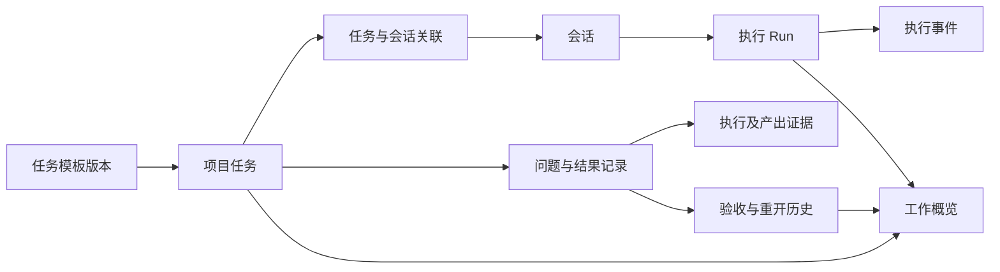

# AiAgent 平台概览与任务定制化方案

日期：2026-09-16  
状态：产品与技术建议，尚未实施  
依据：当前 `front/`、`backed/`、`client/` 源码；未读取生产数据，示例不代表真实统计。

## 1. 建议做成什么

可以做。建议在当前平台新增一个「工作概览」入口，把会话、任务、执行记录和交付结果连起来，让用户打开平台就能回答：

- 最近跑了多少会话、执行了多少次任务？
- 正在处理什么，哪些需要我补充信息或验收？
- 具体解决了哪些问题，有什么结果和证据？
- 哪些重复工作可以保存为模板，下次直接执行？

界面采用左侧导航、顶部筛选、中间卡片与列表、右侧详情的工作台布局。Web 平台先实现统一数据与业务入口，client 后续复用概览接口，并保留本地文件、终端等桌面能力。

当前上下文没有具体参考截图，因此这里给出的是适配现有平台的布局建议，不代表对某个界面的逐像素复刻。

## 2. 当前基础与缺口

| 能力 | 源码中已存在的基础 | 本次需要补充 |
| --- | --- | --- |
| 会话 | `AiChatSession` 有用户、项目、创建时间、归档等字段 | 统一概览聚合，区分空草稿和实际发生对话的会话 |
| 执行记录 | `AiAgentRun` / `AiAgentRunEvent` 有运行标识、状态、时间及部分用量字段 | 核实各执行入口的记录覆盖率，统一状态映射和异常恢复 |
| 用量 | `AiUsageRecord` 与 `UsageStatisticsService` 支持轮次、Token、模型和日期聚合 | 概览入口、项目筛选、时区一致性及采集范围说明 |
| 任务 | `AiProjectTask` 和任务 API 支持项目任务、状态修改、外部工作项关联、导入 | 任务与会话的持久关联、执行参数、验收记录 |
| 从任务发起会话 | `CreateChatSessions` 会创建草稿并返回 `task_id + session` | 此路径未见将任务 ID 写入会话实体；需要持久化关联，不能靠标题推断 |
| 工作画布 | `WorkCanvasPage` 已接入会话节点、连线、工作流执行接口 | 概览跳转、结果归集；继续使用现有画布承载复杂流程 |
| 提示词模板 | `AiPromptTemplate` 有正文、变量、阶段、项目与可见性 | 增加执行配置、输出要求、验收规则及版本快照 |
| 桌面 client | 已有登录、授权目录、文件片段分析、本地与 SSH 人工终端 | 接入平台概览；本地终端操作不会天然形成平台统计 |

这些基础支持增量建设，但实体中存在字段不等于所有执行链路都已完整采集。实施前需核对普通聊天、Codex、画布和桌面委托各自的运行与用量写入路径。

现有「看板应用」负责业务看板开发与预览。平台工作概览建议直接作为原生页面建设，使用平台鉴权和业务接口。

## 3. 首页布局

```text
┌────────────┬────────────────────────────────────────────────────┐
│ 工作概览   │ 我的工作概览     项目：全部   时间：近 7 天   + 新任务 │
│ 会话       ├────────────────────────────────────────────────────┤
│ 任务       │ 活跃会话     执行次数     已验收问题     待处理事项     │
│ 工作画布   ├──────────────────────────────────┬─────────────────┤
│ 任务模板   │ 需要我处理                       │ 快速开始        │
│ 知识库     │ 待补充信息 / 待验收 / 执行失败     │ 排查问题        │
│ 代码项目   ├──────────────────────────────────┤ 审查代码        │
│ 看板应用   │ 最近解决的问题                   │ 整理需求        │
│ 设置       │ 问题 → 处理摘要 → 证据 → 验收人   │ 生成文档        │
│            ├──────────────────────────────────┴─────────────────┤
│            │ 会话与执行趋势 / 最近活动 / Token 用量              │
└────────────┴────────────────────────────────────────────────────┘
```

默认显示「我的、近 7 天、全部可访问项目」，支持今天、近 30 天和自定义日期。团队视图在具备权限后再提供。

指标卡点击后进入带同一筛选条件的明细；问题记录打开详情抽屉，展示原始任务、关联会话、处理过程和验证证据，并提供继续处理或验收操作。

第一屏优先展示需要行动的内容和实际成果。趋势图放在下方，避免只看到数字却不知道下一步做什么。

### 交互状态

- 无数据：显示「创建任务」「从已有会话关联任务」，不能展示虚构业绩。
- 加载失败：显示失败提示与重试，不能用 0 冒充统计结果。
- 数据不完整：显示「仅统计已采集执行」及采集起始时间。
- 正在运行：服务端提供状态，页面断线后重新拉取；超时失联显示未知或中断，不能永久显示运行中。
- 窄屏：详情抽屉改为独立页，卡片换行，列表独立滚动。

## 4. 统计口径

会话、执行、任务、问题分别计数。一次会话可以执行多轮，一个任务可以关联多个会话，一个问题也可能经历多次尝试。

| 指标 | 建议定义 | 数据与限制 |
| --- | --- | --- |
| 新建会话 | 时间范围内创建的非删除会话数 | 来自会话表；可能含空草稿，不命名为「跑过的会话」 |
| 活跃会话 | 时间范围内存在实际用户消息的去重会话数 | 结合消息记录；改标题、置顶不算活跃 |
| 执行次数 | 时间范围内开始的去重 Run 数 | 来自运行记录；重试为新 Run，同时记录原执行关联 |
| 运行中 | 查询时刻仍有效的运行记录数 | 为当前快照，不伪装成所选历史期间的运行状态 |
| 已验收问题 | 时间范围内有验收事件的去重问题数 | 需要新增问题与验收记录；不由助手结语判断 |
| 待处理事项 | 当前需要用户补充、验收或处理失败的事项数 | 按待办对象去重，避免同一任务重复计数 |
| Token 用量 | 范围内用量账本的 Token 总和 | 保留估算标记；缺失不能按 0 处理 |

统一按用户选择的时区划分自然日，服务端转换为 UTC 半开区间 `[from, to)` 查询。现有用量聚合按 UTC 日边界计算，接入时需要调整或明确标注，防止概览与用量页对不上。

现有用量账本定位为成功完成聊天轮次的记录，不能据此推算全部执行次数、失败率或失败消耗。运行表中的 Token 不与账本重复相加。

首版不显示「节省多少小时」「节省多少钱」。后续如做成本，应使用有版本的计价配置并明确估算范围。

## 5. 如何记录“解决了哪些问题”

建议增加结果卡片，最少包含：

| 字段 | 示例（仅用于说明） |
| --- | --- |
| 问题 | 文件浏览无法返回上级目录 |
| 所属任务与项目 | client 体验优化 / AiAgent |
| 处理摘要 | 增加上级目录入口并检查授权目录边界 |
| 产出 | 代码变更集、说明文档 |
| 验证证据 | 测试报告、具体变更引用或人工复核记录 |
| 状态 | 待验收 / 已验收 / 已重开 |
| 来源 | 关联会话、Run、创建时间 |
| 验收信息 | 验收人、时间、备注 |

流程为：任务执行 → AI 生成结果草稿 → 用户核查证据 → 验收 → 纳入已解决问题列表。

AI 可以提取候选问题和处理摘要，但必须标为待验收。任务 `done`、Run 成功、测试通过分别代表不同事实，不能自动互相替代。交付相关操作继续走平台已有的变更集校验与审批流程。

同一问题的多次尝试挂在同一问题记录下；重新打开保留历史验收事件。期间指标按问题 ID 去重，并在明细标注当前是否重开，另可展示「当前已验收问题」存量，避免混淆累计成果和当前状态。

历史会话仅生成候选结果，允许用户补关联和验收；缺少证据的历史记录不自动回填为已解决。

## 6. 任务如何定制

先提供表单化任务模板。用户保存的不只是提示词，还包括执行所需的输入、上下文、输出和验收要求。

| 配置项 | 用户可配置内容 |
| --- | --- |
| 基本信息 | 名称、说明、分类、适用项目 |
| 输入参数 | 问题描述、仓库、分支、文档、时间范围；支持必填和默认值 |
| 上下文 | 明确选择的项目、知识库、已有会话或文件引用 |
| 执行配置 | 当前账号可用的 Agent、模型、允许的工具范围 |
| 处理步骤 | 分析、执行、验证、总结；复杂依赖继续进入工作画布 |
| 预期产出 | Markdown、分析结论、代码变更集、结构化结果 |
| 验收要求 | 证据清单、测试要求、人工确认项 |
| 触发方式 | 首版手动；后续增加定时和事件触发 |
| 共享范围 | 个人或有权限的项目成员 |

模板配置只能在当前用户权限内选取能力，不能提升工具权限。每次执行保存模板版本与参数快照，后续修改模板不改变历史任务的解释。

### 建议首批模板

| 模板 | 输入 | 产出 | 验收重点 |
| --- | --- | --- | --- |
| 问题排查 | 项目、现象、日志片段 | 原因分析、处理建议或修复变更集 | 复现与验证证据 |
| 代码审查 | 项目、分支或变更范围 | 按严重性排列的问题及代码位置 | 每条问题有依据 |
| 需求整理 | 原始说明或会议材料 | 需求文档、待确认项、任务草稿 | 保留未确认需求 |
| 文档生成 | 主题、输入资料、目标读者 | Markdown 文档 | 内容与来源一致 |
| 工作周报 | 时间范围、项目 | 会话、任务与成果摘要 | 引用实际记录，区分已验收与待验收 |

示例：「排查登录失败」模板要求填写现象与日志、选择项目；运行后形成关联会话和结果草稿。用户查看验证证据并验收后，这个问题才出现在概览的已解决列表中。

定时执行后续再做，需要运行队列、并发上限、重试策略、幂等键和执行历史。可参考既有代码库养护调度实现，但不应直接假设它已经支持通用任务调度。

## 7. 技术落点

### 数据关系



优先扩展现有模型：保留 `AiProjectTask`、`AiChatSession`、`AiAgentRun` 与用量账本；不再新建一套同义任务、会话和运行表。

建议新增任务会话关联、任务执行配置快照、结果记录和验收历史。任务模板优先复用提示词模板的正文、变量和可见性，以独立配置关联执行要求；是否拆独立实体在实现时根据生命周期确定。

任务会话关联需有唯一约束；重试保持同一任务与问题标识，产生新的 Run。关系指向的项目、会话、证据每次读取都应验证访问权限。

新增实体字段遵守仓库约定，显式允许空值并安排迁移与回填。历史缺失信息保持未知，不用默认成功填充。

### 建议接口与页面（均为待新增）

| 入口 | 职责 |
| --- | --- |
| `/overview` | 工作概览页面 |
| `GET /api/v1/work-overview/summary` | 指标与采集范围说明 |
| `GET /api/v1/work-overview/activity` | 趋势和最近活动 |
| `GET /api/v1/task-outcomes` | 分页查询问题、结果和验收状态 |
| `POST /api/v1/task-outcomes/{id}/reviews` | 记录验收或重开，含版本冲突检查 |

模板与任务执行接口沿用现有任务、提示词模板领域扩展；具体契约在实施前同步 DTO、前端 API 和类型。

后端聚合和权限控制放在 Service，前端使用 `front/lib/*-api.ts` 封装。概览使用服务端聚合，不把全部聊天正文拉到浏览器统计，也不在每次打开首页时调用模型生成摘要。

初期可以定期刷新概览；实时运行状态复用已存在的流能力。缓存必须包含用户权限范围、项目、时间范围和时区，不能把管理员聚合结果复用于普通用户。

client 后续调用同一套概览接口，需核实插件登录令牌的可访问范围。客户端未上传的本地会话和人工终端动作不会进入服务器统计；如需纳入，应单独设计最小运行元数据同步，保持显式授权文件片段的现有边界。

## 8. 建设顺序与验收

### 第一阶段：看得到工作

新增工作概览、会话与任务统计、最近活动和快捷入口；核实执行采集范围。未具备验收数据时，成果区域显示「尚未建立验收记录」。

验收：卡片与明细数量一致；空草稿不进入活跃会话；时间边界一致；无权限项目不出现在计数和列表中；采集失败不能显示成零。

### 第二阶段：说得清成果

补任务会话关联、结果草稿、证据引用、验收与重开，支持从已有会话补关联。

验收：一个任务多次执行不重复增加问题数；验收操作可追溯；并发重复验收不会重复计数；删除或失去访问权的证据有明确提示。

### 第三阶段：重复工作可复用

推出表单化任务模板和首批模板，保存参数及模板版本快照，与工作画布互通。

验收：必填参数检查有效；历史执行可还原当时配置；模板共享不扩大数据或工具权限；运行能追溯到任务和会话。

### 第四阶段：按使用反馈扩展

增加 client 概览、团队统计、定时触发和周报。通用调度上线前验证服务重启恢复、重复触发去重、取消与重试；团队统计验证权限隔离。

本次优先落地前两阶段：先把“做了多少”和“解决了什么”展示准确，再把高频工作沉淀为模板。开发排期应在完成执行采集覆盖核查后估算。

## 9. 源码依据

- [当前桌面端能力与边界](../client/README.md)
- [会话实体](../backed/Entities/Chat/AiChatSession.cs)
- [执行实体](../backed/Entities/Chat/AiAgentRun.cs) 与 [执行事件](../backed/Entities/Chat/AiAgentRunEvent.cs)
- [用量账本](../backed/Entities/Usage/AiUsageRecord.cs) 与 [统计服务](../backed/Services/Usage/UsageStatisticsService.cs)
- [任务实体](../backed/Entities/Task/AiProjectTask.cs)、[任务服务](../backed/Services/Task/ProjectTaskAppService.cs) 与 [前端任务 API](../front/lib/project-task-api.ts)
- [工作画布](../front/components/work-canvas/WorkCanvasPage.tsx)
- [提示词模板实体](../backed/Entities/PromptTemplate/AiPromptTemplate.cs)

本方案只交付设计文档，未修改页面、数据库、执行逻辑或线上配置。
