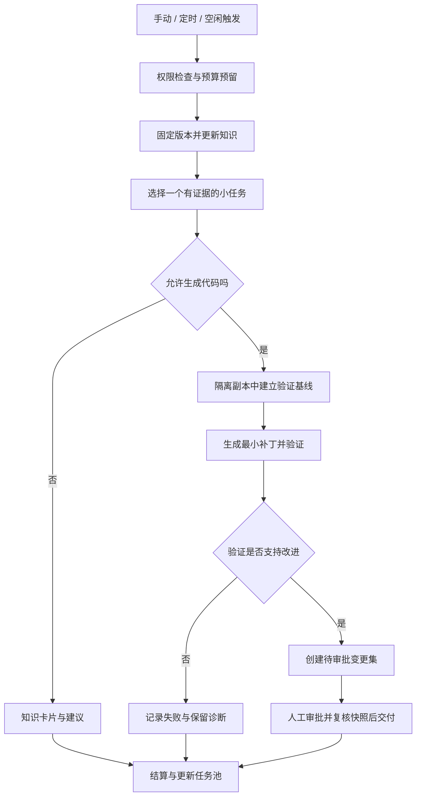

# 代码库持续养护：富余 Token 驱动的理解、建议与优化

> 日期：2026-09-09。状态：总体设计，部分能力已实现。实际接口与验收范围见 [养护实施说明](repository-maintenance-implementation.md)。本文中的 Token 预算、知识卡片、建议去重与空闲调度仍为规划，不代表已交付。

## 1. 推荐方向

在 AiAgent 中增加“代码库养护”功能，让用户给指定代码库分配一部分 AI 预算，通过手动点击、定时计划或空闲窗口，持续积累代码理解、发现有证据的问题，并对允许的任务生成经过验证的改进草稿。

核心目标是把富余 Token 转化成可复用的工程成果。预算是上限，不是必须消耗完的指标；没有值得执行的任务时，应该正常结束，并说明原因。

建议按三个层次交付：

| 层次 | 用户得到什么 | 默认行为 |
| --- | --- | --- |
| 理解代码库 | 模块地图、关键调用链、业务规则、变更影响、带来源的知识卡片 | 自动读取授权范围，保存知识成果 |
| 提出建议 | 有位置、有证据、有收益说明、有验证办法的建议清单 | 自动发现和去重，由用户选择采纳 |
| 生成优化 | 小范围补丁、测试结果、前后对比、待审批变更集 | 在隔离副本中执行，人工批准和交付 |

第一版优先实现前两层，随后增加可验证的小范围修复。跨模块架构重构、数据库迁移、公共接口破坏性修改先保持建议模式。

## 2. 可以参考的已有思想

以下“来源事实”来自公开资料，“本项目借鉴”属于本方案的设计判断；不意味着需要安装这些项目。

| 参考 | 来源事实 | 本项目借鉴 |
| --- | --- | --- |
| GitHub Agentic Workflows | 用 Markdown 定义仓库自动化，通过 GitHub Actions 运行；支持受约束的输出和人工审阅。目前官方文档标注为公开预览 | 用任务模板描述目标，以程序控制触发、权限和输出；支持日报、文档维护和测试改进。[官方说明](https://docs.github.com/en/copilot/concepts/agents/about-github-agentic-workflows) |
| GitHub 定时工作流 | 提供定时表达式、时间约束和分散执行时间的机制 | 夜间窗口、错峰、手动触发使用同一任务定义。[调度说明](https://github.github.com/gh-aw/reference/schedule-syntax/) |
| karpathy/autoresearch | 在受限训练任务中反复修改、运行固定时间实验、比较结果并保留或丢弃 | 将有可靠指标的性能优化组织成“假设—实验—验证—保留”循环；不能把训练指标直接当成业务代码质量。[仓库](https://github.com/karpathy/autoresearch) |
| SWE-agent | 以 GitHub issue 为输入尝试修复问题 | 自动优化先转化成目标明确、可验收的小任务，避免一句“优化整个仓库”无限展开。[仓库](https://github.com/SWE-agent/SWE-agent) |
| Renovate | 依赖更新可结合自动合并策略和检查要求 | 借鉴按风险配置处理策略、验证后推进的思想；本项目继续遵守人工交付约束。[官方文档](https://docs.renovatebot.com/key-concepts/automerge/) |

建议采用内网 AiAgent 原生编排，复用现有模型和仓库能力。GitHub 是设计参考及后续可选接入端，不要求将私有代码上传 GitHub，也不把 GitHub Actions 作为第一版基础设施。

## 3. 用户如何使用

### 3.1 手动：我现在预算富余，帮我做一轮

代码库详情页增加“立即养护”按钮，打开配置面板：

- 目标：理解代码库 / 发现问题 / 生成改进草稿。
- 范围：整个仓库、业务模块、最近变更、指定目录。
- 投入：Token 上限、最长时间、最多任务数；可选择已配置模型。
- 输出：知识卡片、建议报告；选择改进模式时附带补丁和验证报告。

首次默认“理解 + 建议”，一次运行只选择少量高价值任务。执行前显示目标版本、范围、预算和预计产物；执行中可查看当前任务、费用估算、成果并停止。

### 3.2 定时：每天凌晨帮我看一遍

用户显式启用计划，指定时区、执行窗口、频率、预算和任务类型。例如每天北京时间 02:00，最多执行 45 分钟，只检查最近变更及受影响模块。没有新变化时可从未覆盖模块中选取任务，全部完成则跳过。

次日展示站内摘要：“分析了哪些模块、发现哪些新问题、哪些结论仍缺证据、生成哪些草稿、消耗多少预算”。默认不自动发送钉钉、邮件或创建外部 issue；这些输出需要单独配置授权。

### 3.3 空闲：前台不用时自动做一点

在已启用的养护计划中允许“空闲补充运行”：连续一段时间没有交互式 Agent 请求、机器负载允许、预算足够时，从任务池取一个小任务。用户发起聊天时停止派发后台任务，在安全步骤边界保存进度或取消当前运行。

“空闲”至少同时检查交互队列、模型并发槽位和本机负载。第一版不尝试推测用户是否离开电脑。

## 4. 任务池：先理解，再选择值得做的事

| 任务模板 | 主要输入 | 合格产物 | 建议阶段 |
| --- | --- | --- | --- |
| 仓库入门地图 | 目录、入口、依赖声明、关键实现 | 模块职责、边界、入口与待确认问题 | MVP |
| 业务链路理解 | 指定业务及相关调用 | 前端入口 → API → Service → 数据访问的证据链 | MVP |
| 增量变更巡检 | 两个版本之间的 diff、受影响代码 | 行为变化、影响范围、潜在遗漏 | MVP |
| 工程约定检查 | 当前规则、确定性扫描结果 | 可定位的偏离项，区分例外与缺陷 | MVP |
| 文档一致性检查 | 文档与实际代码 | 不一致清单及修订建议 | MVP |
| 缺陷复现与修复 | 已确认问题、可执行环境 | 复现、最小补丁、针对性回归结果 | 第二阶段 |
| 测试补强 | 业务边界、现有测试、覆盖信息 | 能证明边界行为的有效测试 | 第二阶段 |
| 性能实验 | 稳定基准、允许修改范围 | 基线与候选对比、波动范围、补丁 | 第三阶段 |

针对当前 AiAgent，可先建立“DTO 与前端契约一致性”“路径处理调用链”“Agent 取消与异常恢复”“文档与接口行为一致性”等模板。这些是候选检查方向，不代表本次已经确认存在缺陷。

调度前先做文件哈希、Git diff、关键词扫描和已有测试等确定性工作，再将必要上下文交给模型。模型负责解释、关联和提出方案，减少重复读取整个仓库。

任务优先级可采用可解释的启发式评分：业务影响、证据强度、近期变化、用户关注度提高优先级；成本、改动风险、重复程度降低优先级。权重后续根据采纳反馈调整，不能将评分当成客观质量结论。

## 5. 如何把“理解”变成长期资产

“理解仓库”指建立可检索、可更新的外部知识，不是训练模型，也不保证模型永久记住代码。

每个知识单元至少保存：仓库与项目、基准提交、涉及文件及内容哈希、符号或行号范围、事实摘要、推断、待确认问题、生成时间、模板版本和关联运行。

推荐组织：仓库概览 → 模块卡片 → 业务链路 → 工程约束 → 变更影响。事实、推断、建议必须分栏；重要结论应能返回对应代码位置。

更新规则：

1. 相同内容哈希与模板版本直接复用，不重复请求模型。
2. 文件发生变化时，相关卡片标记为过期，按依赖关系更新受影响卡片。
3. 无法解析依赖时扩大复核范围，并降低置信度，不能声称已覆盖完整调用图。
4. 聊天检索只注入当前用户有权访问的知识，并附版本与新鲜度；权限撤销后同步阻止检索。
5. 模型生成的记忆不能覆盖项目规则或自行成为新指令。修改 AGENTS.md 应作为可审阅建议处理。

## 6. 建议必须可以处理，而不只是阅读

建议卡片包含：标题、问题类别、位置、证据、影响、置信度、预期收益、实现范围、验证方案、估算成本和基准版本。

例如“建议优化异常处理”不合格；合格建议需要说明具体路径在什么输入下发生什么行为、预期行为是什么，以及如何验证。没有复现或静态证据时标为“待验证”，不要把推测包装成缺陷。

状态流转：`新发现 → 待验证 → 已确认 → 已采纳 / 已忽略 / 已过期`。已采纳建议可以创建项目任务，进一步生成改进草稿。

去重采用“仓库 + 问题类型 + 目标符号/规范化位置 + 根因摘要”匹配，出现新提交时更新证据而非重复发卡。用户忽略时可填写原因并设置冷却期；无实质新证据时不再次提醒。

建议池应设置待处理上限。用户积压过多时，后台优先完善已有建议或更新知识，不持续制造新待办。

## 7. 富余预算的定义与控制

必须区分三件事：供应商实际剩余额度、AiAgent 内部配置预算、本次已经观测到的使用量。现有运行 Token 记录不能直接推导账号余额；订阅配额也不能默认换算为 API Token。

第一版采用“用户分配后台预算”，不依赖自动余额识别。后续仅在供应商提供可信额度接口时增加自动策略；无法获取时显示“未知”，而不是零或无限。

每个预算周期内：

```text
可派发额度 = max(0, 配置预算 - 已结算用量 - 在途预留 - 前台保留额度)
新任务只有在预计成本及安全余量均可容纳时才派发。
```

预算可配置组织、用户、项目、计划和单次运行多个上限，任一达到上限即停止继续派发。不同模型分别记录输入、输出和可得的缓存用量；费用估算使用有版本的价格配置，不把所有 Token 按同一单价计算。

| 示例配置 | 起始建议值 | 作用 |
| --- | --- | --- |
| 单次 Token 预算 | 100,000 | 累计多轮输入与输出的上限，不是上下文窗口 |
| 单次最长执行 | 45 分钟 | 防止任务无限延长 |
| 单次最多候选任务 | 3 个 | 限制范围与审阅负担 |
| 每项目同时运行 | 1 个 | 避免同仓库相互干扰 |
| 前台保留比例 | 30% | 优先保障交互使用 |
| 单任务修复尝试 | 最多 2 次 | 控制失败循环 |

上述数值是可调产品默认值，不是实际费用承诺。预算包含规划、执行、验证模型调用和失败重试，不能只统计最后一次回答。

预算预留必须原子执行，任务结束结算并释放剩余预留。缺失 usage 时保留保守估算并标记待核对，不能视为免费。每次模型调用前检查预算并限制可请求输出；如果执行引擎无法逐调用计量或取消，应标记为粗粒度控制，不能承诺严格 Token 封顶，必要时禁止其用于无人值守模式。

停止条件包括预算不足、时间到达、取消、权限变化、反复失败、无有效候选及收益不足。允许“本轮没有值得执行的工作”成为正常结果。

## 8. 自动优化的执行与验收



运行完成和交付完成是两套状态：形成待审批产物后，后台运行即可结算，不需要占用 Worker 等待人工审批。

关键要求：

- 使用固定提交的受控独立副本或隔离 worktree；不得在用户正在编辑的工作区直接循环改码。worktree 仅隔离文件，不是进程或网络安全沙箱。
- 允许的测试命令由受信任配置提供，进程限制时间、资源、网络和可访问路径；即使只是运行测试，也可能执行仓库内代码。
- 先跑原始基线，再跑候选版本；原始测试已失败时不能宣称候选导致失败，也不能把不可验证改动标为通过。
- 缺陷修复优先证明针对性测试“修改前失败、修改后通过”；性能实验固定环境与数据，多次测量并检查语义回归。
- 不允许通过删除测试、放宽断言或降低检查配置使结果“变绿”。验证规则与业务改动分开审阅。
- 每个草稿记录基础提交、补丁、测试命令、退出码、结果摘要、预算与产物哈希。验证器负责硬性判定，模型复核提供补充判断。
- 超范围修改停止并转成建议。失败实验只清理本任务拥有的隔离资源，不影响未知用户改动。
- 通过验证后复用人工变更集交付流程；审批后文件或目标基线变化，应重新验证和审批，不能由后台 Agent 自批自推。

## 9. 当前项目可以复用什么

以下是本次读取代码得到的事实，不等同于端到端验证通过。

| 已有入口 | 当前观察 | 衔接方案 |
| --- | --- | --- |
| `backed/Services/CodeRepository/CodeRepositoryIndexService.cs` | 提供目录浏览、读文件、搜索、索引和轻量符号检索；符号识别包含正则实现 | 作为取证入口；补充版本化知识与按变更失效，不能视为完整语义调用图 |
| `backed/Services/AgentRuntime/RunCoordinator.cs` | 统一执行、事件记录、取消；活动运行和取消源使用进程内字典 | 复用执行入口；在上层增加可恢复的持久任务队列与租约 |
| `backed/Services/AgentRuntime/AgentRunStore.cs` | 记录运行状态、事件及 Token 等摘要，当前查询与会话关联 | 关联养护 run 与现有运行；补充后台身份、预算账本及计划维度查询 |
| `backed/Services/Git/ProjectAutoGitUpdateService.cs` | 已有基于 BackgroundService 的间隔轮询，调用 `ProjectAutomaticDiscardChangesAndPullAsync` | 借鉴调度形式；养护必须新建非破坏性的快照准备路径，不能直接调用此丢弃修改更新流程 |
| `backed/Services/Task/ProjectTaskAppService.cs` | 有项目任务与聊天移交入口 | 已采纳建议可关联任务，避免建立平行任务系统 |
| `backed/Services/CodeDelivery/CodeDeliveryAppService.cs` | 有变更集、校验、人工批准和交付入口 | 提取可供后台调用的领域 Service，并适配隔离产物，不能直接假设当前项目工作区交付支持 worktree |
| `docs/ai-code-assistant-optimization/04-precision-retrieval-and-nightly-sync.md` | 已描述夜间同步与版本记录目标 | 统一同步完成后触发增量养护的事件与版本标识；文档中的目标不当作已实现能力 |

特别需要解决：当前自动 Git 更新与新养护任务不能争用同一可变工作目录；后台执行不应伪造 HTTP 用户上下文，应携带明确的发起人、项目范围和计划授权，执行时再次校验。

## 10. 建议技术拆分

第一版沿用 .NET 后台服务风格，采用“数据库任务表 + 到期扫描 + 有界 Worker”，无需立刻增加独立调度平台。定时唤醒本身不是可靠队列，恢复和去重由数据库状态保障。

建议新增 `backed/Services/RepositoryCare/`：

- `RepositoryCareAppService`：HTTP 接口、认证与 DTO 转换。
- `RepositoryCarePlanService`：计划、模板、授权范围及预算配置。
- `RepositoryCareScheduler`：到期扫描、入队、幂等键与租约。
- `RepositoryCareRunner`：步骤编排、检查点、取消与 Runtime 接入。
- `RepositoryCareBudgetService`：预留、结算、限额与使用量核对。
- `RepositoryKnowledgeService`：版本化知识、证据与失效。
- `RepositoryFindingService`：建议生命周期、去重与反馈。
- `RepositoryCareWorkspaceService`：受控快照、隔离工作区和产物生命周期。

建议数据对象：`CarePlan`、`CareRun`、`CareWorkItem`、`BudgetReservation`、`KnowledgeArtifact`、`Finding`。优先关联现有 AgentRun、项目任务与变更集，不复制现有事件日志体系。

新实体字段遵循仓库约束显式标注 `[SugarColumn(IsNullable = true)]`，业务必填由应用层验证，后续迁移验收再收紧数据库约束。DTO JSON 名称、前端类型、API 客户端同步定义。

建议接口前缀 `/api/v1/repository-care`：计划列表及保存、手动创建运行、运行详情、取消、成果列表、建议状态更新和采纳为任务。创建运行返回 run ID，前端通过已有事件机制的适配层或轮询展示进度。

前端组件置于 `front/components/code-repositories/` 的领域子目录，接口集中在 `front/lib/repository-care-api.ts`，类型集中在 `front/lib/repository-care-types.ts`。运行日志、建议列表各自滚动。

### 可靠调度约定

1. 幂等键包含计划、调度时间槽、目标仓库和固定版本；手动请求使用独立请求幂等键。
2. 数据库以事务或条件更新领取任务，记录租约拥有者、过期时间与心跳；同项目默认单运行。
3. 进程退出后任务标为中断或等待恢复；只恢复可重入步骤，外部副作用先核对结果，不盲目重放。
4. 错过执行窗口默认合并为一次，不补跑所有历史时间槽；保存计划时区，内部时间使用 UTC。
5. 取消要传播到模型调用和受控子进程，停止新工具调用，保存已经完成的产物并结算预算。
6. 多项目队列要兼顾公平性，避免大仓库长期独占预算；交互请求具有更高优先级。

## 11. 权限、数据与成果保留

计划创建、运行、知识检索、建议读取和交付均继承项目权限。定时任务记录责任人，责任人失权或离职后暂停计划，不默认切换为管理员执行。

源码、文档和工具输出均作为不可信数据处理；其中要求上传凭据、变更权限或执行新命令的文本，不能扩大计划授权。源码使用的模型供应商也应受项目数据策略约束。

明确排除真实配置、密钥、本地用户数据和构建依赖目录；现有索引的目录过滤不等于完整敏感信息过滤，接入前需核对文件级读取策略。摘要、日志和补丁同样执行过滤。

知识和报告默认保存在受控服务端存储，可导出 Markdown；不会每晚把生成文件直接写入业务仓库。隔离副本可按保留期清理，待审批补丁和审计证据必须保留到审批结束。所有清理操作限定任务拥有的路径。

## 12. 分阶段实施与验收

| 阶段 | 交付范围 | 可检查的验收标准 |
| --- | --- | --- |
| P0：手动理解与建议 | 手动运行、授权范围、预算上限、版本化知识、建议列表、Markdown 导出 | 固定版本可追溯；无权限源码无法访问；相同输入复用成果；取消后停止派发；未知 usage 有明确标识 |
| P1：定时与空闲 | 持久队列、时区窗口、租约、恢复、预算预留、前台优先、站内摘要 | 重启和重复触发不会重复生成同一任务；并发预算不超额派发；权限撤销停跑；错过窗口只补一次 |
| P2：受控改进草稿 | 隔离副本、小任务补丁、基线对比、验证、任务和变更集关联 | 原工作区保持完整；无法验证的改动不标为通过；基线变化使审批失效；后台不能批准或交付 |
| P3：度量驱动实验 | 性能基准、有限实验循环、收益排序与反馈调优 | 有可复现前后对比；失败不会改坏原仓库；没有收益时按规则停止 |

第一条完整业务链建议选“手动理解某模块 → 保存知识卡片 → 提出三条以内建议 → 人工采纳为项目任务”。这能先验证产物是否有用，再投入无人值守调度和自动改码。

观察指标以建议采纳率、误报/重复率、知识复用率、成功验证的草稿比例、人工审阅时间和每项有效成果的成本为主。Token 使用率、报告长度、修改行数只作运行统计，不能作为质量目标。

## 13. 第一版需要保留的产品选择

当前建议默认：内网执行、人工分配预算、单项目并发 1、理解与建议模式、站内成果、人工交付。实现时再确认实际使用的模型额度来源、运行机器可用时段、仓库规模和优先业务模块。

产品成功的判断是：用户下次提问时能更快拿到有依据的答案，打开建议列表时能找到值得处理的问题，审批改进时能看到可信的验证结果。
