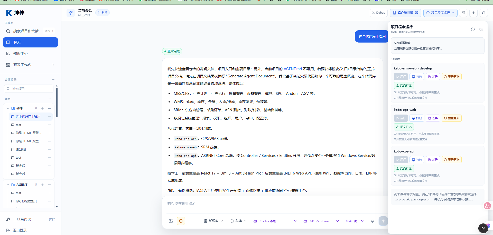

# 坤伴 Agent 协同研发平台

## 第 1 页｜让 AI 融入项目，让协作走向交付

坤伴面向企业研发团队，将 AI 会话、项目代码、知识资料与研发工具汇聚到同一工作台，帮助团队从理解需求、形成方案，推进到开发验证与审批交付。

### 主界面，一站协作

- **选项目**：按项目组织会话与代码，延续任务上下文。
- **说需求**：结合文字、资料与图片，开展分析和实施。
- **看结果**：查看代码差异，使用运行、打包与交付入口。

### 为团队带来的价值

- **沟通更聚焦**：围绕项目事实讨论，减少重复说明。
- **成果更直观**：通过原型、预览和代码差异核对结果。
- **经验可复用**：保留资料来源，让知识服务后续任务。

## 第 2 页｜从需求到交付，连贯推进

- **项目会话**：关联项目与代码上下文，辅助理解系统、分析问题和修改代码。
- **知识中心**：保留原文，按需提炼知识草稿，支持检索与来源核对。
- **工作画布**：编排多个 Agent 会话的职责和上下游关系，查看执行状态。
- **原型与看板**：将需求转成可预览的页面，支持评审、修改与效果确认。
- **验证与交付**：查看差异、运行与打包；通过变更集检查、人工审批后交付。
- **持续养护**：分析存量代码、形成改进建议，支持验证后生成待审批变更集。

### 一条清晰的协作路径

明确需求 → 协同实施 → 验证交付

### 从一个真实需求开始

选择一个项目、一项明确任务和一组验收条件，用可预览的成果与可核对的交付记录，评估协作效果。

支持企业内网部署；模型与外部连接按项目配置。具体能力以部署版本、权限和验收范围为准。

2026 年 9 月 · 两页精简版
