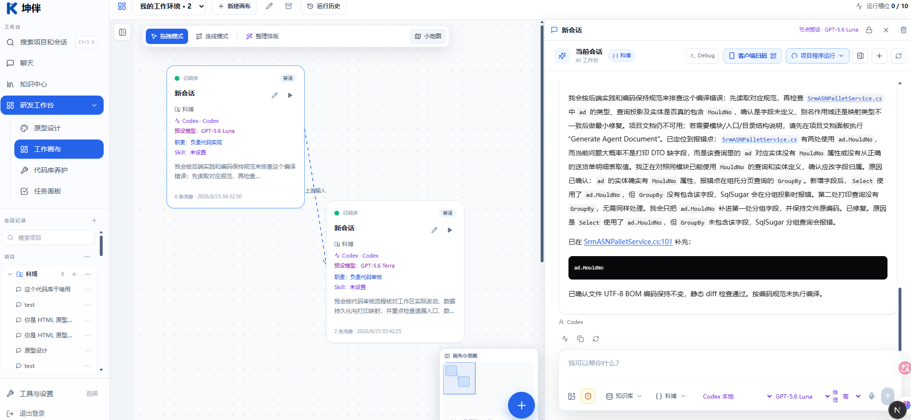
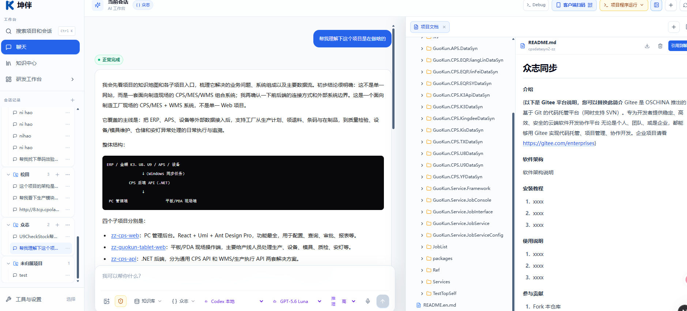
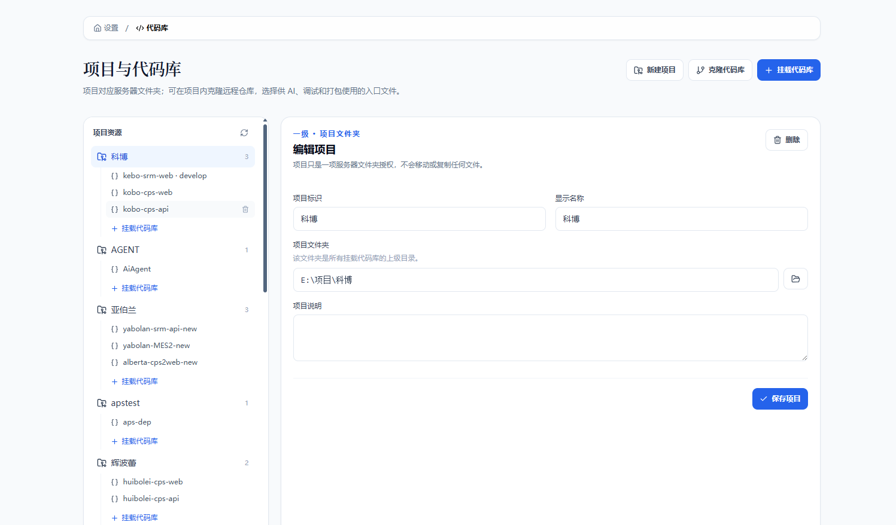
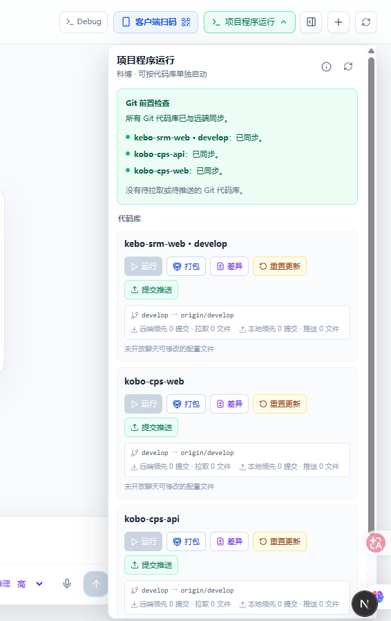
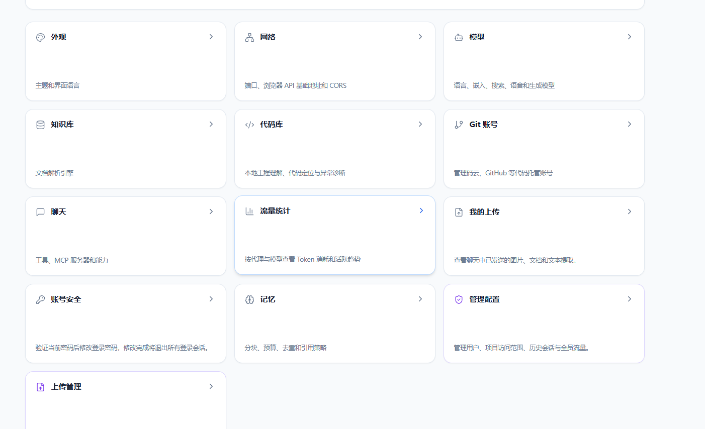

# 坤伴 Agent 协同研发平台

让需求推进更连贯，让交付依据更清晰

客户介绍手册 · 2026 年 9 月版

面向业务负责人、项目负责人、研发与信息化团队

版本日期：2026-09-18。本手册依据当前代码实现整理；具体开通范围、模型服务及实施安排以项目约定和部署验收为准。

## 01 平台概览｜把协作过程变成可检查的交付

坤伴是一套面向企业研发团队的 Agent 协同工作平台。它将项目任务、代码上下文、AI 会话、知识资料、工作画布与代码交付连接起来，帮助团队从需求理解持续推进到实施和复核。

客户得到的价值，是更早看到方案、更容易理解进度，也更清楚每次交付改了什么、由谁批准、对应哪个代码版本。AI 承担分析、整理与执行辅助，项目团队负责业务判断、结果复核和交付决策。

### 三个客户可感知的变化

| 客户关心的问题 | 平台提供的支撑 | 可在评审中核对的材料 |
| --- | --- | --- |
| 需求能否被准确理解？ | 任务、附件与已授权项目上下文进入会话 | 需求复述、影响范围、待确认问题 |
| 开发进度能否说清楚？ | 会话执行过程、画布节点状态与运行历史 | 当前阶段、阶段产出、失败记录 |
| 交付结果能否被核验？ | 变更集、检查结果、人工审批与提交记录 | 文件变化、审批意见、代码版本 |

### 一条贯穿项目的工作路径

需求与任务 → 项目事实 → Agent 分工 → 实施与验证 → 人工审批 → 版本交付

团队可以按项目规模逐步采用这条路径。方案分析、知识整理、看板改版或存量系统维护，都可以从一个明确的任务开始。

> 协同效率的来源：减少重复说明和手工转述，让阶段产出成为下一步工作的输入，同时保留关键人工确认点。

## 02 协同效率｜让信息、产出和责任接得上

研发中的等待，常发生在“信息找不到、结论传不全、结果说不清”的交接处。坤伴围绕这些环节组织工作，使参与者围绕相同的项目资料和阶段成果推进任务。

| 协作环节 | 平台如何支持 | 预期改善方向 |
| --- | --- | --- |
| 需求进入开发 | 工作项关联项目，可将任务正文和支持的图片附件带入会话 | 减少复制资料与重复描述 |
| 理解现有系统 | 围绕已授权项目、代码和项目文档分析问题 | 减少脱离现状的方案返工 |
| 分阶段处理 | 画布配置会话职责、模型和上下游关系 | 减少阶段间手工转述 |
| 复用工作方法 | 提示模板按需求、设计、开发、测试、交付等阶段组织 | 提高任务输入的完整度 |
| 评审代码变化 | 变更集集中展示文件、检查、审批与提交信息 | 缩短交付核对路径 |
| 复用业务资料 | 原文保留，按需提炼带证据的知识草稿 | 减少资料反复整理 |

### 团队如何协作

业务负责人确认目标和验收条件；项目负责人组织任务与阶段评审；研发人员使用 Agent 分析和实施；测试与审核人员检查结果；有权限的交付人员批准并执行代码交付。

这些角色可以在现有团队中承担。平台提供工作入口和过程记录，项目计划、人员分工与业务验收由团队共同约定。

### 如何验证效率改善

建议选择范围相近的试点任务，对比首次可评审产出的等待时间、需求澄清轮次、返工次数与验收周期。使用双方认可的任务记录和评审材料计算结果。

> 本手册介绍实现机制与应用方式，尚不提供经过客户试点验证的提效比例、成本节约或交付周期承诺。

## 03 工作画布｜用明确分工组织 Agent 会话

工作画布把多个会话放到同一视图中。用户可以为节点设置职责、执行模型与 Skill 名称，连接上下游关系，并查看执行状态和历史记录。

### 从一句需求到分阶段产出

| 示例节点 | 工作职责 | 建议产出 |
| --- | --- | --- |
| 需求分析 | 梳理目标、边界、异常与待确认事项 | 需求清单和验收条件 |
| 方案设计 | 结合项目现状明确影响范围和实现路径 | 实施方案及风险说明 |
| 开发实施 | 根据已确认方案完成修改 | 代码变化与实现说明 |
| 测试复核 | 对照验收条件检查行为和结果 | 检查结论与遗留问题 |

以上是可由团队配置的分工示例。配置连线后，上游会话的最近产出可以作为下游输入；满足全部上游完成条件后，流程可自动推进后续节点。运行历史保留链路、模型、起止时间和失败信息，便于回看问题发生在哪一步。

*图 2 工作画布用节点和连线表达会话分工与上下游关系。*

### 客户能看到什么

在项目演示或阶段评审中，团队可以展示任务如何拆解、节点之间如何交接、哪些结论已经形成，以及哪些事项需要补充确认。展示材料按客户授权和项目约定提供。

*图 1 会话侧组织任务上下文，右侧打开项目文档并查看实际内容。*

### 当前使用范围

画布当前用于个人有权访问的会话编排，不代表多人共同编辑同一画布。Skill 名称用于表达工作方法，实际执行取决于运行环境。自动推进依赖当前会话执行链路和并发配置，正式交付仍需经过约定的审核与验证。

> 画布的价值，是把“下一步做什么、依据什么做”表达清楚，并让交接过程留下可回看的记录。

## 04 项目事实与知识｜让分析有据可查

坤伴将代码项目与知识资料作为研发上下文的不同来源。代码问题结合已授权项目和仓库进行分析；业务说明、操作资料与历史文档可进入知识库，供团队整理和检索。

### 从原始资料到可复核知识

保留原文 → 按需提炼 → 生成知识草稿 → 核对来源 → 按需检索与引用

导入资料首先保留原始文件。用户按需发起知识提炼，系统先分析资料，再分段生成知识草稿，并检查引用证据是否来自原文。队列显示任务阶段和进度，支持取消与失败重试。

| 能力 | 对客户与项目团队的作用 |
| --- | --- |
| 原文与知识分开管理 | 可以回到来源，核对摘要是否遗漏条件 |
| DOCX、XLSX 内容预览 | 在工作区查看常用业务资料，减少来回切换 |
| 带原文证据的知识草稿 | 为业务规则讨论提供可核对的依据 |
| 知识页面检索与引用 | 更快找到已整理的相关资料 |
| 可选 RAG 检索 | 按资料规模和部署方案选择索引方式 |

### 适合沉淀的内容

业务术语、操作规则、接口说明、需求约束和问题处理记录，都可以作为项目资料逐步整理。交付团队可将复核后的成果文档纳入后续维护资料，具体整理与审核由项目流程安排。

知识检索可能引用尚未审核的草稿，关键结论需结合原文与当前代码复核。公司／项目分类目前是资料目录组织方式，不等同于独立租户隔离。旧版 DOC、XLS 的预览依赖服务器文档转换组件。

> 可追溯的资料能缩短理解路径；是否适用于本次需求，仍需结合业务条件和当前版本判断。

## 05 开发与可视化｜尽早让方案变得具体

坤伴提供项目代码工作区、原型与看板相关能力，帮助团队把讨论尽早转化为可以阅读、预览和检查的成果。

### 围绕现有代码开展工作

项目可关联多个仓库。研发人员可以查看代码与差异，围绕所选项目发起 Agent 分析，使用配置好的运行和打包入口验证修改。支持的代理可结合受控图片附件处理界面问题；具体图片能力随代理与配置而变化。

### 用原型和看板缩短反馈路径

| 工作场景 | 平台支撑 | 评审重点 |
| --- | --- | --- |
| 需求界面讨论 | 原型工作台组织 HTML 产物与预览 | 信息是否完整、流程是否符合预期 |
| 跨尺寸界面检查 | 支持桌面、平板、移动端 PSD 导出 | 布局与视觉交接是否清楚 |
| 经营或业务看板改版 | 模板工作区、文件编辑和运行预览 | 指标表达、交互和页面效果 |
| 已有项目修改 | 代码读取、差异查看、运行与打包入口 | 修改范围和实际行为是否一致 |

看板改码链路包含工作区检查、文件搜索与读取、文件版本校验和静态检查。它帮助 Agent 找到实际入口并针对现有文件修改，减少与项目结构不一致的产出。

*图 3 项目与代码库页面集中管理项目目录、仓库关联和项目说明。*

### 成果如何进入交付

原型用于确认体验，代码差异用于确认实现，运行与测试用于确认行为。三类材料结合起来，能让需求方和研发方更早发现理解偏差。

PSD 导出当前为分组像素图层，文字并非原生可编辑文字。页面预览与静态检查不替代功能、性能及上线验收；相关验证范围由项目约定。

> 更早看到具体成果，可以更早讨论具体问题，为后续实施减少不确定性。

## 06 交付治理｜让批准的内容与交付内容对应

在代码交付流程中，坤伴将项目工作区变化整理为变更集，并关联文件、检查结果、审批信息与提交记录，为每次交付提供可核对的依据。

### 标准代码交付路径

生成变更集 → Git 基础校验 → 有权限人员审批 → 再核对文件快照 → 提交与推送 → 记录结果

| 控制点 | 当前机制 | 客户可核对的内容 |
| --- | --- | --- |
| 变化范围 | 汇总仓库、分支与变更文件 | 本轮修改覆盖哪些模块 |
| 基础校验 | 检查仓库、远端状态及差异格式等 | 基础检查是否通过 |
| 人工决策 | 仅有代码提交权限的用户可审批、交付 | 谁批准，审批意见是什么 |
| 内容一致性 | 交付前复核已记录的文件快照指纹 | 审批后的内容是否变化 |
| 结果追踪 | 保存提交标识、交付状态和输出 | 实际交付到哪个版本 |

如果审批后工作区内容发生变化，交付接口会阻止按原快照直接交付，并要求重新创建和审批变更集。关联任务可在该流程全部交付成功后更新为完成。

### 平台记录与业务验收共同发挥作用

普通变更集的自动校验主要是 Git 层面的基础检查，不代表业务测试已通过。研发团队需要按约定执行编译、测试和验收，并提交相应结果。

上述审批控制适用于平台变更集交付流程。部署时应同步管理服务账户、代理执行权限和仓库权限；高权限代理的使用范围需由管理员按项目控制。代码提交与推送完成后，生产发布仍按客户的发布制度执行。

*图 4 项目程序运行面板显示仓库同步状态、运行入口和交付前检查。*

> 每次交付都应能回答：改了什么、如何验证、由谁批准，以及最终对应哪个版本。

## 07 持续养护｜把维护工作纳入有节奏的流程

存量系统需要持续分析和整理。坤伴提供代码库养护入口，可手动执行，也可按配置定时执行，让团队以固定节奏发现问题、形成建议并评审改进。

### 两种养护方式

| 模式 | 工作方式 | 适合的阶段 |
| --- | --- | --- |
| 分析建议 | 分析仓库并输出养护报告 | 先了解问题、评估优化价值 |
| 优化与验证 | 在独立副本中修改，完成支持范围内的编译验证，形成待审批变更集 | 对明确范围实施改进 |

### 从建议到可评审修改

养护过程使用独立副本，记录执行状态和日志。优化模式对支持的项目执行固定构建流程；编译前后核对源码与基线，符合条件后生成待审批变更集。

具备权限的人员逐次批准后，系统再次复核权限、快照与基线，并推送到本轮独立养护分支。定时执行负责形成建议或待审批成果，不直接替代人工交付决策。

### 当前构建支持范围

自动构建目前识别 .NET 项目，以及包含构建脚本和 npm 锁文件的前端项目。其他工程类型需要另行评估验证方案，不能视为已具备通用构建适配。

### 客户可参与的维护评审

建议按周期查看养护报告、候选修改、构建结果与待确认问题，结合业务优先级决定是否采用。依赖升级、性能优化或结构调整是否有效，应由对应的测试与评审确认。

> 有节奏的养护，让问题发现、改进建议和实施决策形成持续记录，便于项目长期维护。

## 08 部署与管理｜按项目明确使用范围

坤伴面向企业内网研发场景，支持由管理员统一配置账户、项目授权、模型服务与运行环境。交付团队可据此规划部署方案，并在试点阶段验证实际访问和执行范围。

| 管理维度 | 当前能力 | 实施时需要确认 |
| --- | --- | --- |
| 账户与角色 | 管理员创建账户，配置项目授权和代码提交权限 | 人员职责与账户生命周期 |
| 项目访问 | 项目选择和相关请求进行服务端授权校验 | 仓库范围、服务账户文件权限 |
| 代理执行 | 支持按代理配置选择执行模式 | 只读、工作区写入与高权限使用边界 |
| 过程复核 | 会话过程、画布历史、交付及养护记录 | 可查看人员、保留与归档方式 |
| 使用统计 | 按用户、代理、模型和日期聚合 Token 用量 | 估算口径和供应商账单差异 |
| 外部连接 | 已有 Git、工作项和消息渠道的接入代码 | 客户租户、网络、凭据与适配范围 |

### 内网部署与模型调用分别规划

应用可部署于内网，但数据是否发送到外部取决于所配置的模型和连接服务。接入前需明确资料分类、模型调用范围与网络策略，并在目标环境完成验证。

工作项接入目前包含特定企业配置，其他客户环境需要适配与验收。已有接入能力不意味着任意第三方系统可以直接开通。

### 让管理数据服务于项目判断

使用统计可辅助观察使用趋势和资源需求，其中部分 Token 为估算值；它不直接等同于供应商结算费用。客户效率评估需结合任务与验收数据，不以调用量代替业务成效。

> 部署方案应把人员、项目、模型和执行权限一并明确，形成可验证的使用范围。

### 界面导览与建议用法

平台的常用入口按“聊天协作、知识中心、研发工作台、设置管理”组织。首次试点时，建议先从左侧选择项目，再在会话中说明目标、范围和验收条件；需要查看代码时打开项目文档或代码库，需要拆解多阶段工作时进入工作画布，需要复用业务资料时进入知识中心。

*图 5 设置中心按外观、网络、模型、知识库、代码库、聊天和管理配置分组，便于管理员逐项开通。*

界面截图用于说明当前版本的入口和信息组织方式。不同部署版本可能因权限、启用模块和屏幕尺寸出现差异，正式使用前应以目标环境的验收结果为准。

## 09 客户合作示例｜从一个可验收的需求开始

以下为建议协作方式，以“为业务页面增加异常提示和筛选条件”为示例，不代表已经完成的客户案例，也不承诺固定工期。

| 阶段 | 团队使用平台开展的工作 | 建议与客户共同确认的产出 |
| --- | --- | --- |
| 明确目标 | 整理任务、界面资料和验收条件 | 需求清单、例外情况、范围边界 |
| 理解系统 | 结合项目代码和文档分析影响范围 | 方案说明、待确认问题 |
| 展示方案 | 根据需要形成原型或页面预览 | 字段、交互和操作流程 |
| 开发与复核 | 使用会话与画布组织实施、检查 | 代码差异、运行及测试结果 |
| 审批交付 | 形成变更集，由有权限人员批准交付 | 审批记录、代码版本、交付说明 |
| 验收与沉淀 | 对照清单验收，整理可复用资料 | 验收结论、使用说明、遗留事项 |

### 建议的阶段评审材料包

- 需求与范围：本轮目标、涉及模块、明确不在本轮处理的事项。
- 阶段产出：方案、原型或实际页面，以及需要客户判断的问题。
- 验证依据：执行了哪些检查、结果如何、仍有哪些已知问题。
- 交付记录：变更集、批准信息、提交版本和后续发布安排。

平台提供部分材料的生成与记录能力；材料汇总、客户可见范围和评审节奏由交付团队按项目约定执行。

### 每次评审聚焦三个问题

本阶段完成了什么？还需要确认什么？下一阶段用什么结果证明完成？持续用这三个问题组织沟通，能让客户更容易判断进度与风险。

> 建议以一个范围明确、资料充分、可以客观验收的真实任务启动试点。

## 10 试点与演进｜用实际成果建立长期信任

试点首先验证协作方式是否适合客户项目，再决定扩大应用范围。双方可在开始前明确资料、人员、验证条件和评价指标。

### 试点建议与评价口径

| 评价项 | 建议口径 | 取数方式 |
| --- | --- | --- |
| 首次产出速度 | 从需求确认到首次可评审产出的时间 | 任务记录与评审时间 |
| 沟通与返工 | 澄清轮次、验收前的返工次数 | 问题清单与评审记录 |
| 验证质量 | 约定用例的通过情况与遗留问题 | 测试记录与验收清单 |
| 交付可追溯性 | 是否能关联范围、审批与代码版本 | 变更集和提交记录 |
| 资料复用价值 | 后续任务使用哪些已有资料，是否适用 | 团队复核记录 |

这些是建议评价方法，部分需要团队记录与汇总，并非平台已内置的完整经营分析报表。对比任务应尽量保持复杂度、参与人员和验收口径可比。

### 当前能力与后续方向

当前代码已包含项目会话、多会话画布编排、知识提炼与检索、原型和看板工作区、变更集交付、代码库养护等模块。具体可用范围由所部署版本、权限与外部依赖共同决定。

后续建设方向包括统一知识资源寻址、跨系统 Agent 协作、更加完整的运行观测与知识复用治理。上述方向需经过逐项实现和验收，未纳入本手册的当前交付承诺。

### 开始合作需要的四项输入

- 一个真实且范围明确的业务任务。
- 经授权的代码、说明资料与可用验证环境。
- 明确的业务确认人、技术负责人和交付审批人。
- 双方认可的验收条件与试点评价方式。

> 坤伴希望帮助团队把每次讨论推进为具体成果，再用清晰的验证、审批和版本记录，让客户看得见进展、核得对结果。
