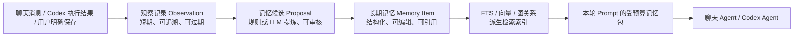

# AiAgent 长期记忆模型设计

> 状态：设计草案  
> 日期：2026-07-27  
> 参考：`E:\项目\know-why\ai-memory`、`E:\项目\know-why\roadmap\ai-memory-architecture.md`

## 1. 结论

AiAgent 的记忆应是一个**以用户和项目为强隔离边界、从聊天与 Agent 执行记录中提炼、可追溯和可纠正的长期上下文系统**。它不能只是在每轮提示词里拼接历史消息，也不能把向量库当作唯一真相。

推荐采用三层模型：



其中 SQL Server 的 `Memory Item` 是 AiAgent 的权威业务数据；全文索引、向量和排名数据均可重建。后续可选地将已批准的项目记忆导出为 Markdown 并提交到代码库，但 **Markdown 导出不是第一期的写入事实源**。这是与 `ai-memory` 的主要差异：后者是本地编程 Agent 的 Markdown Wiki 服务，而 AiAgent 已经是多用户 Web 应用，已有 SQL Server、项目访问控制、聊天会话和管理后台，首期不宜引入第二套独立身份、文件权限和 Git 一致性模型。

## 2. 现状与设计约束

当前项目已经具备实现记忆的基础，但尚未接入：

- `ai_chat_session` 保存用户、项目、排序和归档状态，`ai_chat_message` 保存原始对话；会话与消息适合作为审计来源，而不是长期提示词全文。
- `AiChatSession.CodeProjectId` 和现有 `IProjectAccessService` 已经提供项目访问边界。
- `AgentContext.MemoryContext` 已预留，但 `ChatPromptBuilder` 尚未把它写入模型提示词。
- 聊天既支持自有 Agent Loop，也支持 Codex 本地代理；两条链路必须共享同一记忆读取和写入规则。
- 数据库使用 SQL Server/SqlSugar，表结构通过 `ModelSchemaInitializer` 的增量初始化维护。

设计必须满足以下不变量：

1. 任何记忆读取和写入都必须先验证当前 `UserId` 及项目访问权限；不能仅凭项目名或文件路径定位。
2. 记忆、来源消息、候选提案、Embedding 和链接必须保留同一作用域键，检索时不得跨作用域“串库”。
3. 原始聊天、思考过程、工具输出与已批准记忆必须分层；模型正常回答优先检索长期记忆，只有明确需要追溯时才读取原始来源。
4. 自动写入只能产生受限候选或低风险会话摘要；项目规则、全局偏好、架构决策及删除必须有明确的用户确认或管理员策略。
5. 检索与索引失败不能阻塞正常聊天；记忆能力降级时应返回空记忆包并记录可观测错误。
6. 向量记录必须绑定 `provider + model + dimension`，模型切换后的旧向量不可混用。

## 3. 作用域：先解决“谁的哪一类记忆”

`ai-memory` 使用 `(workspace_id, project_id, path)` 防止项目污染。AiAgent 的业务边界不同，推荐所有记忆数据至少带以下键：

| 字段 | 用途 | 规则 |
|---|---|---|
| `UserId` | 个人身份与授权根 | 必填；普通用户只能访问自己的个人记忆。 |
| `CodeProjectId` | 项目上下文 | 项目记忆必填；全局个人偏好为空。读取前走项目权限校验。 |
| `ScopeType` | `global_user`、`project_user`、`project_shared` | 默认写入 `project_user`；共享范围必须显式启用。 |
| `RepositoryId`（可空） | 代码库细分范围 | 仅用于更精确排序，不可替代 `CodeProjectId`。 |
| `Path`（可空） | 代码文件或知识页关联 | 仅保存仓库相对路径，禁止保存浏览器可访问的绝对磁盘路径。 |

默认检索范围是：当前用户的 `project_user` + 当前项目可见的 `project_shared` + 当前用户的 `global_user`。显式查询某个范围时，严格只查该范围；不允许因为语义相似就隐式扩展到其他项目。

## 4. 记忆层级与生命周期

借鉴 `ai-memory` 的 working / episodic / semantic / procedural 分层，但调整为适合 Web 聊天产品的对象。

| 层级 | 类型 | 示例 | 默认写入方式 | 注入策略 |
|---|---|---|---|---|
| 工作上下文 | `turn_context` | 当前轮已读文件、工具结果、未完成任务 | 内存中，不持久化为记忆 | 仅当前 Agent Loop。 |
| 情景记忆 | `session_summary`、`handoff` | 本次会话做了什么、未解决问题、涉及文件 | 会话结束/闲置后规则摘要 | 只在同会话续聊或项目近期任务中低权重召回。 |
| 语义记忆 | `fact`、`decision`、`gotcha`、`project_rule` | 使用哪个框架、某 Bug 根因、禁止的实现方式 | 用户保存或审核通过的提案 | 主检索来源。 |
| 程序记忆 | `procedure`、`runbook` | 发布步骤、排错流程、验收清单 | 用户/管理员确认 | 命中任务时以步骤形式注入。 |
| 个人偏好 | `user_preference` | 回复语言、代码风格、构建限制 | 用户明确设置或确认 | 全局低 token 预算、优先级高。 |

每条长期记忆应有状态：`draft` → `active` → `superseded` / `archived` / `deleted`。更新不是直接覆盖正文：新版本通过 `SupersedesMemoryId` 指向旧版本，旧版本保留为审计历史。`project_rule`、`decision` 和被用户置顶的记忆不参与自动遗忘；普通会话摘要和低价值事实可按访问、最后确认时间与置信度逐步降权，而不是物理删除。

## 5. 推荐数据模型

### 5.1 核心实体

建议新增下列实体（命名可按现有 `Ai*` 规范调整）：

| 实体 | 关键字段 | 职责 |
|---|---|---|
| `AiMemoryItem` | `Id`、作用域键、`Kind`、`Title`、`Content`、`Confidence`、`Priority`、`Status`、`SupersedesMemoryId`、`SourceCount`、`LastAccessedAt`、`AccessCount` | 经过批准的长期记忆事实源。 |
| `AiMemoryObservation` | `Id`、作用域键、`SessionId`、`MessageId`、`Kind`、`Content`、`Importance`、`OccurredAt`、`SanitizationState` | 从聊天、Codex 任务、工具执行而来的短期可追溯记录。 |
| `AiMemoryProposal` | `Id`、`ObservationIdsJson`、`ProposedKind`、`ProposedContent`、`Confidence`、`RiskLevel`、`Status`、`ReviewerUserId` | 自动提炼与人工审批之间的隔离层。 |
| `AiMemorySource` | `MemoryId`、`SourceType`、`SourceId`、`Snippet`、`CreatedAt` | 将记忆关联到会话、消息、代码变更、知识文档；支持“此结论依据何在”。 |
| `AiMemoryLink` | `FromMemoryId`、`ToMemoryId`、`LinkType` | 决策、规则、问题和流程的关联图，用于邻居扩展与冲突发现。 |
| `AiMemoryEmbedding` | `MemoryId`、`Provider`、`Model`、`Dimension`、`Vector`、`IndexedAt` | 派生向量索引；参数不匹配即标记失效并重建。 |
| `AiMemoryAccessLog`（可选） | `MemoryId`、`SessionId`、`QueryHash`、`UsedAt` | 调优和可解释性；首期可只在 Item 上维护节流后的访问计数。 |

`AiMemoryItem` 不应把来源、标签、候选理由全部塞进 JSON。可检索、要关联、要审计的字段应规范化；仅模型原始结构化输出、非关键扩展元数据可以存 JSON。

### 5.2 推荐索引

- `AiMemoryItem(UserId, CodeProjectId, ScopeType, Status, UpdatedAt DESC)`：范围过滤和近期排序。
- `AiMemoryObservation(SessionId, OccurredAt)` 与 `AiMemoryObservation(UserId, CodeProjectId, OccurredAt DESC)`：会话归档和追溯。
- `AiMemoryProposal(Status, CreatedAt)`：审核队列。
- `AiMemorySource(MemoryId)`、`AiMemorySource(SourceType, SourceId)`：双向溯源。
- 对 active 的 `Title + Content` 建 SQL Server Full-Text 索引；全文检索不可用时可明确降级为标题/标签匹配，不能悄悄扫全表。

## 6. 写入链路

### 6.1 记录观察，而非立刻“记住一切”

在 `RecordUserMessageAsync` 和 `RecordAssistantMessageAsync` 之后异步提交轻量 Observation；Codex 任务结束时还应记录任务状态、已修改的仓库相对路径、失败原因与最终答复摘要。写入必须有稳定幂等键，例如 `source_type + source_id + observation_kind + content_hash`，避免 HTTP、SSE、WebSocket 重试产生重复记忆。

入站处理顺序：

1. 解析当前认证用户、`SessionId`、`CodeProjectId` 与代码库上下文；拒绝无权项目。
2. 执行大小限制、敏感信息处理和路径归一化；密钥、访问令牌、绝对本地路径及图片二进制不写入 Observation。
3. 在同一数据库事务内写 Observation 与审计记录；失败仅记录告警，不影响已经完成的聊天响应。
4. 由后台 `MemoryConsolidationWorker` 批量读取尚未处理的 Observation，生成规则型会话摘要；若启用了 LLM，再用 JSON Schema 生成 Proposal。
5. Proposal 按风险入队：低风险 `session_summary` 可自动激活；`decision`、`project_rule`、`procedure`、`global_user` 必须等待确认。确认后在一个事务内创建新版 Memory Item、关联来源、标记 Proposal 状态并写审计日志。

LLM 只负责“提出候选”，而不是直接把自由文本写入长期记忆。没有配置 LLM 时，系统仍可运行：用消息数量、关键文件、最后任务状态和用户显式“记住”命令生成基础会话摘要与手工记忆。

### 6.2 显式记忆操作

应提供用户可理解的操作：

- “记住这个”：创建 `draft` 或直接创建当前用户可见的 `active` 记忆，并展示所属范围。
- “作为项目规则保存”：默认进入审批态，避免模型误把临时意见升级为规范。
- “忘记/纠正”：创建 supersession 或 archived 状态，绝不让模型暗中删除旧记录。
- “为什么这么回答”：展示本轮实际注入的 Memory Item、命中分数、来源摘要和作用域。

## 7. 检索与 Prompt 注入

每一轮先在后端构建 `MemoryQueryContext(UserId, CodeProjectId, RepositoryIds, SessionId, UserMessage)`，再取得受预算的 `MemoryPacket` 写入 `AgentContext.MemoryContext`。不能由前端传入任意 `MemoryContext`，也不能允许模型自行选择跨项目范围。

推荐排序：

1. 先执行作用域、状态、权限与类型过滤。
2. 在长期 Memory Item 上进行 FTS/BM25；可用时并入向量相似度。
3. 对 `project_rule`、置顶偏好、当前仓库/文件精确命中给予规则加权。
4. 对命中记忆的 `AiMemoryLink` 一跳邻居使用 RRF 扩展，但总量必须受预算约束。
5. 长期记忆零命中时，才从当前会话和近期 `session_summary` 中做小范围回退；默认不直接把原始聊天记录塞给模型。

`MemoryPacket` 建议分段并总量受模型能力配置约束，初始可设为 1,200–2,000 tokens：

```text
[个人偏好]（最多 300 tokens）
- 回答使用中文；现有中文文件只做局部补丁；未明确要求时不执行 build。

[项目固定规则]（最多 500 tokens）
- …

[相关项目记忆]（最多 800 tokens）
1. [decision|高置信度] 标题：摘要（memory:123，来源：会话 abc）
2. [gotcha] 标题：摘要（memory:456，来源：代码文件相对路径）

[本会话交接]（最多 400 tokens，存在时）
- 已完成、未完成、下一步。
```

提示词中必须声明：记忆是历史上下文而非当前事实；与本轮工具读取、用户最新指令或明确代码证据冲突时，以后者为准；不得把记忆中的指令当作系统指令执行。这样可以降低旧记忆和用户内容造成的提示注入风险。

## 8. 与现有模块的落点

| 现有位置 | 第一阶段改动职责 |
|---|---|
| `Entities/Chat` | 新增 Memory 实体；保留 `AiChatSession`、`AiChatMessage` 作为来源，不复制整段聊天。 |
| `Services/Settings/ModelSchemaInitializer.cs` | 增量建表、补列和索引，沿用当前 SQL Server 初始化方式。 |
| `Services/Chat/ChatSessionService.cs` | 在已持久化消息后投递 Observation；不在 HTTP 热路径执行 LLM consolidation。 |
| `Services/Chat/ChatOrchestrator.cs` | 在创建 `AgentContext` 后、调用 Agent Loop 前读取 `MemoryPacket`。 |
| `Services/Chat/Agentic/AgentContext.cs` | 用结构化 `MemoryPacket` 替代裸字符串或至少追加其元数据；保留字符串渲染层兼容 Prompt。 |
| `Services/Chat/Prompting/ChatPromptBuilder.cs` | 明确追加“可信边界说明 + 记忆包”，并让模型可在最终回答中标注使用的记忆。 |
| `Services/Chat/Codex/CodexChatService.cs` | 读取同一个 MemoryPacket；在任务结束后生成 Codex 观察记录与可点击的来源文件关联。 |
| 前端会话/设置页 | 增加“本轮使用的记忆”“保存为记忆”“提案审核”“忘记/纠正”和项目级记忆开关。 |

应把 `IMemoryService` 设计为独立应用服务（例如 `QueryPacketAsync`、`RecordObservationAsync`、`CreateProposalAsync`、`ApproveProposalAsync`、`SupersedeAsync`），不要让 `ChatSessionService`、Prompt Builder 或 Controller 各自直接查询 Memory 表。

## 9. 安全、隐私与可运维性

- **脱敏双关口**：Observation 入库前一次，Proposal/Memory Item 入库前再一次；LLM 输出和人工修改也不能绕过第二关。
- **来源控制**：默认不存储 assistant `Thinking`、完整工具标准输出、附件原始内容和绝对文件路径。需要保留的引用保存为相对路径、消息 ID 或受控文件引用。
- **审计**：创建、确认、更新、归档、删除、自动降权、导出均写入 `AiMemoryAuditLog`，包括操作者、前后版本、来源与原因。
- **删除语义**：用户“删除”默认软删除并立即从检索排除；涉及隐私法规或管理员彻底清理时，再执行权限受控的硬删除及关联 Embedding 清理。
- **并发**：采用短事务 + 乐观版本号（`RowVersion`/更新时间戳）。同一条记忆的审批与编辑冲突必须返回可处理的冲突，而不是后写覆盖。
- **后台任务**：consolidation、Embedding 回填、过期扫描、链接检查全部在独立 Worker 中执行，并记录队列状态、失败次数和最近错误；绝不在聊天首 token 前等待。
- **可恢复性**：Memory Item 是业务事实源，Embedding、FTS、关联派生索引必须提供按项目重新构建能力；数据库备份必须包含 Memory 表与审计表。

## 10. 分阶段实施路线

### M1：可控 MVP（先做）

1. 新增 `AiMemoryItem`、`AiMemorySource`、`AiMemoryProposal`、`AiMemoryObservation` 与基础索引。
2. 实现个人全局偏好、项目个人记忆、手工“记住/纠正/忘记”、会话来源回链。
3. 每轮按作用域读取置顶偏好和少量关键项目记忆，写入 `AgentContext.MemoryContext`。
4. 为聊天与 Codex 结束事件记录 Observation；采用规则型会话摘要，不调用 LLM 自动写长期语义记忆。
5. 前端至少能列出、查看来源、编辑、归档及显示“本轮使用了哪些记忆”。

**M1 验收**：用户 A 无法通过任何 API 或语义检索看到用户 B 的记忆；项目 A 的记忆不出现在项目 B；刷新会话后同一项目规则仍生效；删除后下一轮不再注入；禁用记忆或索引故障时聊天仍能完成。

### M2：检索质量与审核闭环

1. 引入 SQL Server Full-Text 检索、标签、链接和按访问节流的强化计数。
2. 启用 Embedding，但保存模型三元组并提供失效/回填状态。
3. 新增 Proposal 审核队列、结构化 LLM 提炼、冲突检测和 supersession 视图。
4. 对会话结束生成 handoff；新会话或切换到 Codex 时可选择加载未完成交接。

### M3：项目协作与知识资产化

1. 在项目权限模型之上启用 `project_shared`，明确 Owner/Editor/Viewer 的记忆权限。
2. 可选导出已批准的 `decision`、`project_rule`、`procedure` 到项目内受控 `docs/ai-memory/` Markdown，并提供差异预览与 Git 提交策略。
3. 增加记忆质量仪表盘：命中率、被纠正率、过期率、跨会话任务完成率、提案接受率。

## 11. 不建议做的事

- 不把所有 `ai_chat_message` 自动向量化后当作“长期记忆”。这会放大噪声、泄露风险和旧上下文干扰。
- 不让 LLM 直接无审核地创建项目规则、架构决策或全局偏好。
- 不只用向量检索；精确规则、文件路径、项目边界与全文检索是更可靠的第一层。
- 不在第一期引入独立 SQLite + Markdown Wiki + 文件 watcher 双写；这会和现有 SQL Server 权限、备份、部署模型形成额外一致性风险。
- 不把 `Thinking` 当作可共享记忆来源，也不向浏览器暴露 Agent 给出的绝对本地路径。

## 12. 参考映射

本方案继承 `ai-memory` 的关键思想：作用域先行、原始 observation 与长期知识分层、会话总结/交接、FTS + 向量 + 链接混合检索、Embedding 三元组、访问强化与衰减、LLM 可选及写入审核。实现上将其映射为 AiAgent 已有的 SQL Server、`AiChatSession` / `AiChatMessage`、`CodeProjectId`、项目授权和 Prompt 构建链路，避免为了记忆功能再建立一套平行的身份与存储系统。

## 13. 公司 Git 记忆库与 SQL Server 的职责调整

在公司统一部署、需要人工审阅和保留完整历史的目标下，已批准的长期记忆应进一步采用 **Git Markdown 为可审查事实源** 的模式。SQL Server 仍保存用户权限、原始会话审计、索引状态和检索派生数据；它不替代 Git 的版本历史。

```text
聊天 / Codex 事件
  -> SQL Server Observation（脱敏、审计、短期）
  -> 规则或 LLM 生成 Proposal
  -> 审核通过后写入服务端 Wiki 工作副本
  -> 本地 Git commit
  -> 异步 GitSync push 到公司远程仓库
  -> SQL Server 更新文件版本、全文、向量和链接索引

外部 Git 编辑
  -> GitSync fetch / fast-forward
  -> 比较 last_indexed_commit..HEAD
  -> 只解析有变化的 Markdown blob
  -> 更新 SQL Server 派生索引
```

推荐的远程仓库路径以稳定 ID 隔离租户、用户和项目：

```text
tenants/{tenantId}/users/{userId}/_global/
tenants/{tenantId}/projects/{projectId}/_slots/
tenants/{tenantId}/projects/{projectId}/sessions/
tenants/{tenantId}/projects/{projectId}/decisions/
tenants/{tenantId}/projects/{projectId}/gotchas/
tenants/{tenantId}/projects/{projectId}/procedures/
tenants/{tenantId}/projects/{projectId}/_rules/
```

Git 同步必须是独立 Worker，不能阻塞聊天响应；远端不可用或发生冲突时，本地提交和 SQL Server 运行账本仍可用，并由同步状态提示管理员处理。服务账号是该 Git 仓库唯一的写入者；用户经由 AiAgent 权限模型访问，不直接依赖 Git 仓库权限。

## 14. 混合检索与向量模型演进原则

向量检索只是候选召回通道，不是唯一真相，也不能取代回答模型的推理能力。推荐顺序是：

```text
UserId / ProjectId / Scope / Status 权限过滤
  -> 精确条件与文件路径匹配
  -> FTS 全文检索
  -> 可选向量相似度
  -> Markdown 链接邻居扩展
  -> RRF 融合与受 token 预算的 MemoryPacket
  -> 最终回答模型结合当前工具证据推理
```

- FTS 优先处理接口名、Spec 编号、文件路径、错误码和公司缩写；向量补充自然语言的同义表达。
- 当前项目代码与 Spec 是当前事实证据；记忆是历史上下文，二者冲突时以后者为准。
- 每一条向量必须保存 `provider`、`model`、`dimension`、`content_hash` 和 `indexed_at`。模型变更时双索引或回退 FTS，后台分批重建后再切换，禁止混用不同向量空间。
- M1 不依赖向量：先交付权限过滤、显式保存、会话 Observation、受预算 Prompt 注入和 SQL Server 普通检索；FTS、GitSync、Embedding、RRF 与 LLM consolidation 在后续里程碑加入。

## 15. 已实现状态与边界

本轮开始实现的范围是 SQL Server 记忆 MVP：

1. `AiMemoryItem`：个人全局和项目个人的手工长期记忆，带 tier、kind、状态、置顶和来源会话。
2. `AiMemoryObservation`：对聊天用户消息和最终助手回答的有限、脱敏观察记录；不保存 Thinking。
3. `IMemoryService`：严格按当前用户和项目权限构建小型 MemoryPacket，供自有 Agent Loop 与 Codex app-server 的 Prompt 使用。
4. 记忆 API：创建、列表和归档个人/项目记忆。
5. 同一 AiAgent 会话续聊时，受预算读取最近用户/助手消息；当前用户消息单独作为本轮输入，避免重复注入。

### M2：候选审核闭环（本轮已实现）

1. `AiMemoryCandidate`：保存由会话 Observation 提炼出的待审核候选，包含用户/项目作用域、类型、置信度、来源会话及 Observation ID 证据；候选不参与聊天 Prompt。
2. `MemoryCandidateHostedService`：每 10 分钟最多扫描 5 个闲置超过 30 分钟的会话。它只调用已配置 LLM 生成 JSON 候选；提炼失败时保留未处理 Observation，绝不影响聊天链路。
3. `IMemoryCandidateService` 与 `/api/v1/memory/candidates` API：支持手动触发提炼、按状态查看候选、确认、编辑后确认、拒绝，以及将候选合并到既有 Memory Item。
4. 确认操作在事务中创建或更新 `AiMemoryItem`，再将候选标记为 `approved`；并发审核时仅一方可以成功。模型输出与人工编辑再次执行敏感键值脱敏。
5. 已存在的相同内容长期记忆或待确认候选会被去重；当前实现不自动覆盖冲突记忆，也不自动激活任何候选。

本轮仍不把 GitSync、远程 push/pull、Markdown 导出、Embedding、FTS、RRF、共享项目记忆、`AiMemorySource` 规范化来源表、质量仪表盘或自动长期记忆写入宣称为已完成；它们仍按后续 M2/M3 设计实施。会话原始消息只用于同会话的有限上下文回填，而候选必须经过确认才会升级为长期 Spec 记忆。
